- [市場急配センターの業務日報の疑問点](#市場急配センターの業務日報の疑問点)
  - [平成4年2月3日出発、福岡まで24トンのミールを運んだ運行](#平成4年2月3日出発福岡まで24トンのミールを運んだ運行)
    - [高速道路・有料道路・給油・フェリーの領収書](#高速道路有料道路給油フェリーの領収書)
      - [平成4年2月3日付　運行指示票](#平成4年2月3日付運行指示票)
      - [業務日報　平成4年2月3日〜5日](#業務日報平成4年2月3日5日)
      - [平成4年2月3日から5日の高速道路の領収書](#平成4年2月3日から5日の高速道路の領収書)
      - [平成4年2月3日と4日の有料道路の領収書](#平成4年2月3日と4日の有料道路の領収書)
      - [平成4年2月4日鳥栖給油領収書・フェリー神戸ー新門司領収書](#平成4年2月4日鳥栖給油領収書フェリー神戸ー新門司領収書)
      - [Excelで作成した運行表](#excelで作成した運行表)
    - [空車で九州から金沢西まで全線高速で帰ったことになっている金沢西インターの領収書](#空車で九州から金沢西まで全線高速で帰ったことになっている金沢西インターの領収書)
  - [平成3年10月17日、神戸からバナナを群馬県高崎市まで運んだという運行の検証](#平成3年10月17日神戸からバナナを群馬県高崎市まで運んだという運行の検証)
    - [Excelで縦書きで領収書を書き込んだ時系列の表を作成](#excelで縦書きで領収書を書き込んだ時系列の表を作成)
    - [業務日報に同じく神戸からバナナと積んだ11月15日の運行](#業務日報に同じく神戸からバナナと積んだ11月15日の運行)
    - [高崎の青果市場に行った記憶と午前6時15分となっている間々田給油所での領収書](#高崎の青果市場に行った記憶と午前6時15分となっている間々田給油所での領収書)
    - [夜に高崎の青果市場で荷下ろしをしたとは考えにくいバナナという荷物の特性](#夜に高崎の青果市場で荷下ろしをしたとは考えにくいバナナという荷物の特性)
    - [高岡を高崎、11月を10月とご記載したと思われる神戸港島のエルヨン](#高岡を高崎11月を10月とご記載したと思われる神戸港島のエルヨン)
    - [平成5年11月28日付の手書きの書面の5のキングジムファイル](#平成5年11月28日付の手書きの書面の5のキングジムファイル)
    - [≪運行名≫9月23日大阪から東京有明への運行・写真資料編](#運行名9月23日大阪から東京有明への運行写真資料編)
  - [平成3年12月3日0時44分という、R8-カナザワSSであり得ない時間になっている給油の領収書](#平成3年12月3日0時44分というr8-カナザワssであり得ない時間になっている給油の領収書)
- [市場急配センターの業務日報の確認点](#市場急配センターの業務日報の確認点)
  - [平成3年10月17日、神戸からバナナを群馬県高崎市まで運んだという運行](#平成3年10月17日神戸からバナナを群馬県高崎市まで運んだという運行)
    - [Excelで作成した平成3年10月の運行表](#excelで作成した平成3年10月の運行表)
    - [Googleでマイマップの作成](#googleでマイマップの作成)
    - [発見となったh3-mysql-regexp-html.pyの神戸と高崎の組み合わせ検索](#発見となったh3-mysql-regexp-htmlpyの神戸と高崎の組み合わせ検索)
    - [まだ検証できていない、この運行の疑問点](#まだ検証できていないこの運行の疑問点)
- [再審請求と刑事告発の日々](#再審請求と刑事告発の日々)
  - [2023年06月13日](#2023年06月13日)
    - [昨日6月12日に久しぶりに立ち上げたUbuntu23．04](#昨日6月12日に久しぶりに立ち上げたubuntu2304)
    - [UbuntuのVSCodeでのMarkdownからPDFファイルの作成](#ubuntuのvscodeでのmarkdownからpdfファイルの作成)
    - [MacbookやWindows11とは違ったVSCodeの「Paste Image」プラグインの設定](#macbookやwindows11とは違ったvscodeのpaste-imageプラグインの設定)

# 市場急配センターの業務日報の疑問点
## 平成4年2月3日出発、福岡まで24トンのミールを運んだ運行
### 高速道路・有料道路・給油・フェリーの領収書
#### 平成4年2月3日付　運行指示票

〉〉〉 MacBook-Air VSCode： 2023-06-11 11:50:22 〉〉〉

 

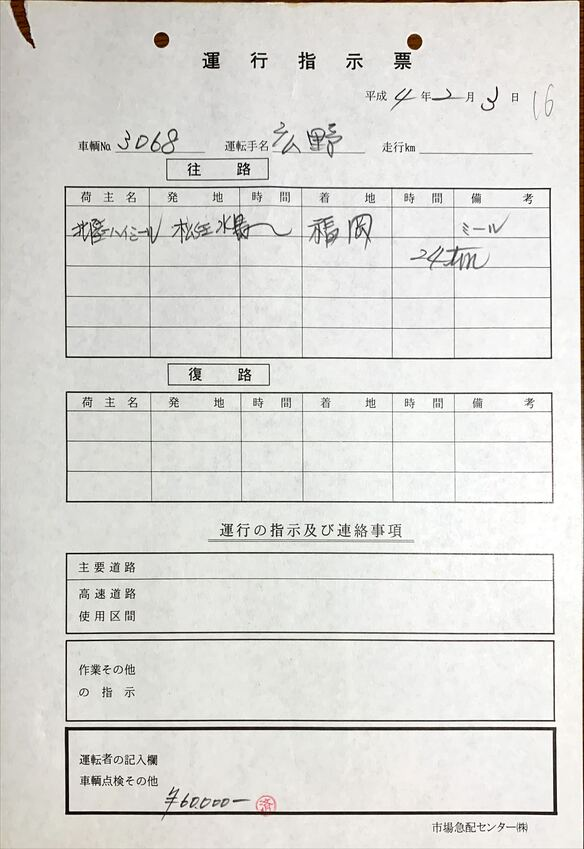

images/01/01_平成4年2月3日付　運行指示票.jpg

#### 業務日報　平成4年2月3日〜5日

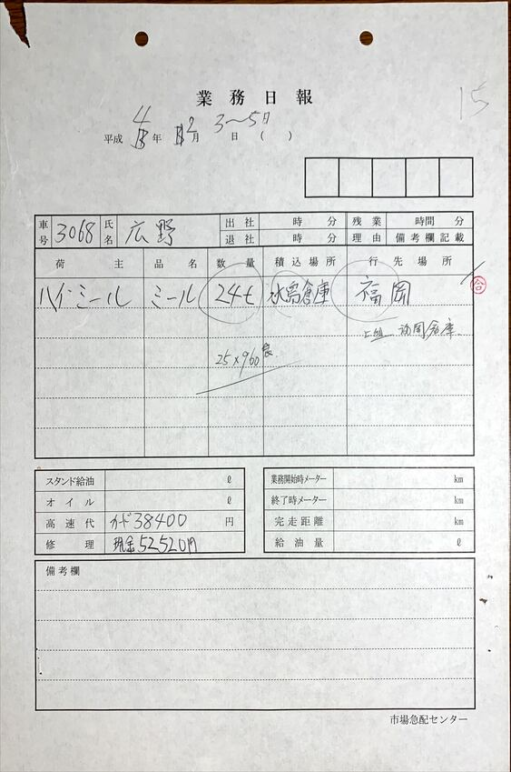

images/01/02_業務日報　平成4年2月3日〜5日.jpg

#### 平成4年2月3日から5日の高速道路の領収書

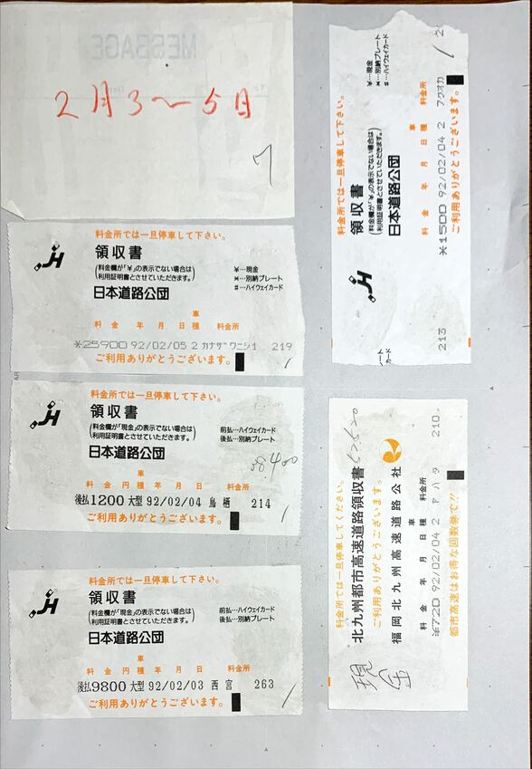

images/01/03_平成4年2月3日から5日の高速道路の領収書.jpg

#### 平成4年2月3日と4日の有料道路の領収書

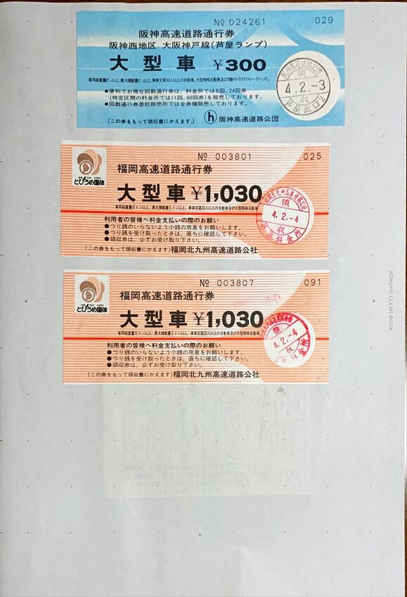

images/01/04_平成4年2月3日と4日の有料道路の領収書.jpg

#### 平成4年2月4日鳥栖給油領収書・フェリー神戸ー新門司領収書

images/01/05_平成4年2月4日鳥栖給油領収書・フェリー神戸ー新門司領収書.JPG

〈〈〈  MacBook-Air VSCode： 2023-06-11 13:25:51〈〈〈

#### Excelで作成した運行表

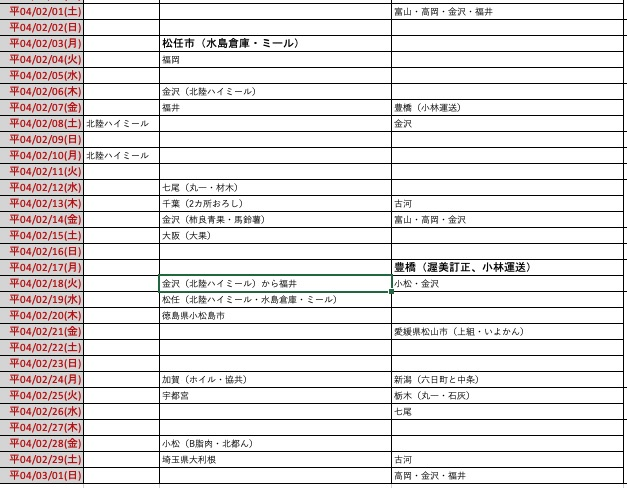

images/01/07_Excelで作成した平成4年2月の運行表.jpg

### 空車で九州から金沢西まで全線高速で帰ったことになっている金沢西インターの領収書

〉〉〉 MacBook-Air VSCode： 2023-06-11 13:26:07 〉〉〉

 

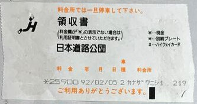

images/01/06_1992-02-05　金沢西インター　25900円.jpg

　当時の日本道路公団の高速道路の領収書は、降りたインターとその年月日しか記載がなく、0時0分から23時59分まで24時間の幅があります。同じ日に乗った別のインターや、翌日の最初の料金所である程度の判断が出来ることもあるのですが、この福岡の運行の場合は、前日の2月2月4日に鳥栖インターで降りた領収書があります。

　「全日本道路」にある料金表で、鳥栖インターで1200円は福岡インターが乗り口と確認しました。福岡で荷下ろしをした2月4日当日に帰り荷の荷物を探す話はなかったような記憶ですが、福岡インターから高速道路を使ったとすれば、いちおう帰り荷の待機の指示が出ている状態だったのかもしれません。

　納品書となっていますが、トスインターSSの領収書は、同じ2月4日で時刻が16時02分となっています。早朝に新門司港でフェリーを降り、そのまま福岡市内に向かって荷下ろしをしたという記憶なので、午前中か午後の早い時間には荷下ろしを終えていたと考えるのですが、鳥栖インターで降りて、すぐに給油に向かったとすると、間に時間がありすぎる気はします。

　鳥栖のトラックステーションでの待機でしたが、帰り荷が出てから給油をすると言うことは考えにくく、最初に給油を済ませていたはずと思います。この鳥栖のトラックステーションでの待機というのは、中西運輸商でも金沢市場輸送でも毎度のことのように経験していました。

　トラックステーションは会社からの電話連絡を伝えてくれるのですが、これは給油カードを持つガソリンスタンドでも同じでした。

　やはりおかしいと思うのは、鳥栖のトラックステーションで一泊したはずの2月5日の日付が変わらないうちに金沢に戻り、金沢西インターを降りていることです。

　私の記憶では帰り荷を待つのに2月5日も鳥栖で一泊し、2月6日に帰ることに決めたのですが、被告発人松平日出男社長や協共運輸の配車係からはもう一日帰り荷が出るのを待ってくれと、繰り返し熱心に頼まれていたことです。

　金沢市場輸送では他の運転手の都合で、鮮魚の定期便を積むのに金沢から空車で福岡の魚市場に行ったことがありましたが、大阪や東京とは違い、九州から空車で帰るというのはあり得ないことでした。2日ぐらい帰り荷が出るのも待たされたということも何度か経験しています。

　上り下りの急な坂道が多いのが山口県から大阪までの中国自動車道の特徴で、福岡から鮮魚を積んで金沢に向かうと30キロまでスピードの落ちる坂が2つありました。50キロや60キロまで落ちる坂はけっこうな数あったと思います。

　余り細かいことは思い出せないですが、午前11時から午後2時の間に福岡の魚市場を出発して、早い時間に出たときは下関での立ち寄りもよくありましたが、午後7時から8時半には金沢に着いていて、ウロコ運送に午後9時までと決まっていたのですが、これは新潟中継の荷物があったからです。

　空車だったので上り坂で速度が落ちることも少なく、平均的な速度で中国自動車道を走ることが出来たと思います。

　午前中に福岡を出て、その日のうちに金沢に着くことは、途中に仮眠でもしないかぎり当たり前と言えるのですが、私の記憶では兵庫県の福崎インターで中国自動車道を降りて、播但有料道路を通って、舞鶴経由の国道27号線で、福井県の敦賀インターから北陸自動車道に乗っているはずなのです。

　これと似た運行が同じ平成4年2月にあって、そのときは四国の愛媛県松山市からイヨカンの荷物を積んで金沢に向かったのですが、荷物の行先は新潟県の2箇所おろしでした。この運行は播但有料道路の領収書があります。

　ただ、この播但有料道路の領収書がある四国の運行もあり得ない不可解な点があって、播但有料道路と同じ2月21日の金沢西インターの領収書ですが、その料金が11100円となっているのです。

　金沢西インターから8950円なので、11100円というのは、それより遠い距離の料金になります。吹田インターの近くには豊中インターがあって、そのあたりが阪神高速と中国自動車道の分岐点になっていましたが、細かく正確なことは憶えていません。

　同じ北陸自動車道で確認出来るのは、1月5日の日付ですが、金沢西インターで5200円という料金で、これは「全日本道路」の料金表で確認出来ましたが、木之本インターからの料金でした。

　木之本インターは滋賀県で、敦賀インターは福井県という違いもありますが、金沢に向かうと敦賀インターの1つ手前が木之本インターで、金沢西インターとの間は一区間短くなります。

　「全日本道路」の料金表で確認すると、敦賀インターから金沢西インターの区間料金は4550円でした。

<html xmlns:o="urn:schemas-microsoft-com:office:office"
xmlns:x="urn:schemas-microsoft-com:office:excel"
xmlns="http://www.w3.org/TR/REC-html40">

<head>
<meta http-equiv=Content-Type content="text/html; charset=utf-8">
<meta name=ProgId content=Excel.Sheet>
<meta name=Generator content="Microsoft Excel 15">
<link rel=File-List href="2023−05−29＿作成・業務日報.fld/filelist.xml">

</head>

<body link="#0563C1" vlink="#954F72">
<!--[if !excel]>　　<![endif]-->
<!--次の情報は、Excel の Web ページとして発行ウィザードで生成されました。-->
<!--同じアイテムが Excel から再発行されるとき、DIV タグ間のすべての情報が置き換えられます。-->
<!----------------------------->
<!--Excel の Web ページとして発行 ウィザードのアウトプットの始まり-->
<!----------------------------->

<!--次の情報は、Excel の Web ページとして発行ウィザードで生成されました。--><!--同じアイテムが Excel から再発行されるとき、DIV タグ間のすべての情報が置き換えられます。--><!-----------------------------><!--Excel の Web ページとして発行 ウィザードのアウトプットの始まり--><!----------------------------->

<table border=0 cellpadding=0 cellspacing=0 width=584 style='border-collapse:
 collapse;table-layout:fixed;width:438pt'>
 <col width=80 style='mso-width-source:userset;mso-width-alt:3072;width:60pt'>
 <col width=81 style='mso-width-source:userset;mso-width-alt:3123;width:61pt'>
 <col width=175 span=2 style='mso-width-source:userset;mso-width-alt:6707;
 width:131pt'>
 <col width=73 style='width:55pt'>
 <tr height=21 style='height:16.0pt'>
  <td height=21 class=xl66 width=80 style='height:16.0pt;width:60pt'>平04/02/01(土)</td>
  <td class=xl67 width=81 style='width:61pt'>　</td>
  <td class=xl67 width=175 style='width:131pt'>　</td>
  <td class=xl67 width=175 style='width:131pt'><ruby>富山<rt class=font5>トヤマ</rt></ruby> <ruby>・<rt class=font5>・</rt></ruby><ruby>高<rt
  class=font5>タカオカ</rt></ruby> 岡・金沢・<ruby>福井<rt
  class=font5>フクイ</rt></ruby> </td>
  <td class=xl65 width=73 style='width:55pt'></td>
 </tr>
 <tr height=21 style='height:16.0pt'>
  <td height=21 class=xl68 style='height:16.0pt'>平04/02/02(日)</td>
  <td class=xl69>　</td>
  <td class=xl69>　</td>
  <td class=xl69>　</td>
  <td class=xl65></td>
 </tr>
 <tr height=21 style='height:16.0pt'>
  <td height=21 class=xl68 style='height:16.0pt'>平04/02/03(月)</td>
  <td class=xl69>　</td>
  <td class=xl70>松任市（<ruby>水島倉庫<rt class=font5>ミズシマソウコ</rt></ruby>
  ・ミール）</td>
  <td class=xl69>　</td>
  <td class=xl65></td>
 </tr>
 <tr height=21 style='height:16.0pt'>
  <td height=21 class=xl68 style='height:16.0pt'>平04/02/04(火)</td>
  <td class=xl69>　</td>
  <td class=xl69><ruby>福岡<rt class=font5>フクオカ</rt></ruby>
  </td>
  <td class=xl69>　</td>
  <td class=xl65></td>
 </tr>
 <tr height=21 style='height:16.0pt'>
  <td height=21 class=xl68 style='height:16.0pt'>平04/02/05(水)</td>
  <td class=xl69>　</td>
  <td class=xl69>　</td>
  <td class=xl69>　</td>
  <td class=xl65></td>
 </tr>
 <tr height=21 style='height:16.0pt'>
  <td height=21 class=xl68 style='height:16.0pt'>平04/02/06(木)</td>
  <td class=xl69>　</td>
  <td class=xl69><ruby>金沢<rt class=font5>カナザワ</rt></ruby>
  （<ruby>北陸<rt class=font5>ハイ</rt></ruby>
  ハイミール）</td>
  <td class=xl69>　</td>
  <td class=xl65></td>
 </tr>
 <tr height=21 style='height:16.0pt'>
  <td height=21 class=xl68 style='height:16.0pt'>平04/02/07(金)</td>
  <td class=xl69>　</td>
  <td class=xl69><ruby>福井<rt class=font5>フクイ</rt></ruby>
  </td>
  <td class=xl69><ruby>豊橋<rt class=font5>トヨハシ</rt></ruby>
  （<ruby>小林運送<rt class=font5>コバヤシウンソウ</rt></ruby>
  ）</td>
  <td class=xl65></td>
 </tr>
 <tr height=21 style='height:16.0pt'>
  <td height=21 class=xl68 style='height:16.0pt'>平04/02/08(土)</td>
  <td class=xl69><ruby>北陸<rt class=font5>ハイブリッドカー</rt></ruby>ハイミール</td>
  <td class=xl69>　</td>
  <td class=xl69><ruby>金沢<rt class=font5>カナザワ</rt></ruby>
  </td>
  <td class=xl65></td>
 </tr>
 <tr height=21 style='height:16.0pt'>
  <td height=21 class=xl68 style='height:16.0pt'>平04/02/09(日)</td>
  <td class=xl69>　</td>
  <td class=xl69>　</td>
  <td class=xl69>　</td>
  <td class=xl65></td>
 </tr>
 <tr height=21 style='height:16.0pt'>
  <td height=21 class=xl68 style='height:16.0pt'>平04/02/10(月)</td>
  <td class=xl69><ruby>北陸<rt class=font5>ハイ</rt></ruby>
  ハイミール</td>
  <td class=xl69>　</td>
  <td class=xl69>　</td>
  <td class=xl65></td>
 </tr>
 <tr height=21 style='height:16.0pt'>
  <td height=21 class=xl68 style='height:16.0pt'>平04/02/11(火)</td>
  <td class=xl69>　</td>
  <td class=xl69>　</td>
  <td class=xl69>　</td>
  <td class=xl65></td>
 </tr>
 <tr height=21 style='height:16.0pt'>
  <td height=21 class=xl68 style='height:16.0pt'>平04/02/12(水)</td>
  <td class=xl69>　</td>
  <td class=xl69><ruby>七尾<rt class=font5>ナナオ</rt></ruby>
  （丸一・材木）</td>
  <td class=xl69>　</td>
  <td class=xl65></td>
 </tr>
 <tr height=21 style='height:16.0pt'>
  <td height=21 class=xl68 style='height:16.0pt'>平04/02/13(木)</td>
  <td class=xl69>　</td>
  <td class=xl69><ruby>千葉<rt class=font5>チバ</rt></ruby>
  （2カ所おろし）</td>
  <td class=xl69><ruby>古河<rt class=font5>コガ</rt></ruby>
  </td>
  <td class=xl65></td>
 </tr>
 <tr height=21 style='height:16.0pt'>
  <td height=21 class=xl68 style='height:16.0pt'>平04/02/14(金)</td>
  <td class=xl69>　</td>
  <td class=xl69><ruby>金沢<rt class=font5>カナザワ</rt></ruby>
  （<ruby>柿良青果<rt class=font5>カキヨ</rt></ruby>・馬鈴薯）</td>
  <td class=xl69><ruby>富山<rt class=font5>トヤマ</rt></ruby>
  ・<ruby>高岡<rt class=font5>タカオカ</rt></ruby> ・<ruby>金沢<rt class=font5>カナザワ</rt></ruby> </td>
  <td class=xl65></td>
 </tr>
 <tr height=21 style='height:16.0pt'>
  <td height=21 class=xl68 style='height:16.0pt'>平04/02/15(土)</td>
  <td class=xl69>　</td>
  <td class=xl69><ruby>大阪<rt class=font5>オオサカ</rt></ruby>
  （<ruby>大果<rt class=font5>ダイカ</rt></ruby>）</td>
  <td class=xl69>　</td>
  <td class=xl65></td>
 </tr>
 <tr height=21 style='height:16.0pt'>
  <td height=21 class=xl68 style='height:16.0pt'>平04/02/16(日)</td>
  <td class=xl69>　</td>
  <td class=xl69>　</td>
  <td class=xl69>　</td>
  <td class=xl65></td>
 </tr>
 <tr height=21 style='height:16.0pt'>
  <td height=21 class=xl68 style='height:16.0pt'>平04/02/17(月)</td>
  <td class=xl69>　</td>
  <td class=xl69>　</td>
  <td class=xl70><ruby>豊橋<rt class=font5>トヨハシ</rt></ruby>
  （<ruby>渥美<rt class=font5>アツミ</rt></ruby> <ruby>訂正<rt class=font5>テイセイ</rt></ruby> 、<ruby>小林運送<rt class=font5>コバヤシウンソウ</rt></ruby> ）</td>
  <td class=xl65></td>
 </tr>
 <tr height=21 style='height:16.0pt'>
  <td height=21 class=xl68 style='height:16.0pt'>平04/02/18(火)</td>
  <td class=xl69>　</td>
  <td class=xl69><ruby>金沢<rt class=font5>カナザワ</rt></ruby>
  （<ruby>北陸<rt class=font5>ハイ</rt></ruby>ハイミール）から<ruby>福井<rt class=font5>フクイ</rt></ruby> </td>
  <td class=xl69><ruby>小松<rt class=font5>コマツ</rt></ruby>
  ・<ruby>金沢<rt class=font5>カナザワ</rt></ruby> </td>
  <td class=xl65></td>
 </tr>
 <tr height=21 style='height:16.0pt'>
  <td height=21 class=xl68 style='height:16.0pt'>平04/02/19(水)</td>
  <td class=xl69>　</td>
  <td class=xl69><ruby>松任<rt class=font5>マットウ</rt></ruby>
  （<ruby>北陸<rt class=font5>ハイ</rt></ruby>
  ハイミール・<ruby>水島倉庫<rt class=font5>ミズシマ</rt></ruby>・ミール）</td>
  <td class=xl69>　</td>
  <td class=xl65></td>
 </tr>
 <tr height=21 style='height:16.0pt'>
  <td height=21 class=xl68 style='height:16.0pt'>平04/02/20(木)</td>
  <td class=xl69>　</td>
  <td class=xl69><ruby>徳島県<rt class=font5>トクシマケン</rt></ruby>
  <ruby>小松島市<rt class=font5>コマツジマシ</rt></ruby>
  </td>
  <td class=xl69>　</td>
  <td class=xl65></td>
 </tr>
 <tr height=21 style='height:16.0pt'>
  <td height=21 class=xl68 style='height:16.0pt'>平04/02/21(金)</td>
  <td class=xl69>　</td>
  <td class=xl69>　</td>
  <td class=xl69><ruby>愛媛県<rt class=font5>エヒメ</rt></ruby><ruby>松山市<rt class=font5>マツヤマシ</rt></ruby> （<ruby>上組<rt class=font5>ウエグミ</rt></ruby> ・いよかん）</td>
  <td class=xl65></td>
 </tr>
 <tr height=21 style='height:16.0pt'>
  <td height=21 class=xl68 style='height:16.0pt'>平04/02/22(土)</td>
  <td class=xl69>　</td>
  <td class=xl69>　</td>
  <td class=xl69>　</td>
  <td class=xl65></td>
 </tr>
 <tr height=21 style='height:16.0pt'>
  <td height=21 class=xl68 style='height:16.0pt'>平04/02/23(日)</td>
  <td class=xl69>　</td>
  <td class=xl69>　</td>
  <td class=xl69>　</td>
  <td class=xl65></td>
 </tr>
 <tr height=21 style='height:16.0pt'>
  <td height=21 class=xl68 style='height:16.0pt'>平04/02/24(月)</td>
  <td class=xl69>　</td>
  <td class=xl69>加賀（ホイル・<ruby>協共<rt class=font5>キョウトモ</rt></ruby>
  ）</td>
  <td class=xl69><ruby>新潟<rt class=font5>ニイガタ</rt></ruby>
  （<ruby>六日町<rt class=font5>ムイカマチ</rt></ruby>
  と<ruby>中条<rt class=font5>ナカジョウ</rt></ruby>
  ）</td>
  <td class=xl65></td>
 </tr>
 <tr height=21 style='height:16.0pt'>
  <td height=21 class=xl68 style='height:16.0pt'>平04/02/25(火)</td>
  <td class=xl69>　</td>
  <td class=xl69><ruby>宇都宮<rt class=font5>ウツノミヤ</rt></ruby>
  </td>
  <td class=xl69><ruby>栃木<rt class=font5>トチギ</rt></ruby>
  （<ruby>丸一<rt class=font5>マルイチ</rt></ruby> ・<ruby>石灰<rt class=font5>イシバイ</rt></ruby> ）</td>
  <td class=xl65></td>
 </tr>
 <tr height=21 style='height:16.0pt'>
  <td height=21 class=xl68 style='height:16.0pt'>平04/02/26(水)</td>
  <td class=xl69>　</td>
  <td class=xl69>　</td>
  <td class=xl69><ruby>七尾<rt class=font5>ナナオ</rt></ruby>
  </td>
  <td class=xl65></td>
 </tr>
 <tr height=21 style='height:16.0pt'>
  <td height=21 class=xl68 style='height:16.0pt'>平04/02/27(木)</td>
  <td class=xl69>　</td>
  <td class=xl69>　</td>
  <td class=xl69>　</td>
  <td class=xl65></td>
 </tr>
 <tr height=21 style='height:16.0pt'>
  <td height=21 class=xl68 style='height:16.0pt'>平04/02/28(金)</td>
  <td class=xl69>　</td>
  <td class=xl69><ruby>小松<rt class=font5>コマツ</rt></ruby>
  （B<ruby>脂肉<rt class=font5>アブラニク</rt></ruby>
  ・<ruby>北都<rt class=font5>ホクト</rt></ruby> ん）</td>
  <td class=xl69>　</td>
  <td class=xl65></td>
 </tr>
 <tr height=21 style='height:16.0pt'>
  <td height=21 class=xl68 style='height:16.0pt'>平04/02/29(土)</td>
  <td class=xl69>　</td>
  <td class=xl69><ruby>埼玉県<rt class=font5>サイタマケン</rt></ruby>
  <ruby>大利根<rt class=font5>オオトネ</rt></ruby> </td>
  <td class=xl69><ruby>古河<rt class=font5>コガ</rt></ruby>
  </td>
  <td class=xl65></td>
 </tr>
 <tr height=21 style='height:16.0pt'>
  <td height=21 class=xl68 style='height:16.0pt'>平04/03/01(日)</td>
  <td class=xl69>　</td>
  <td class=xl69>　</td>
  <td class=xl69><ruby>高岡<rt class=font5>タカオカ</rt></ruby>
  ・<ruby>金沢<rt class=font5>カナザワ</rt></ruby> ・<ruby>福井<rt class=font5>フクイ</rt></ruby> <!-----------------------------><!--Excel の Web ページとして発行 ウィザードのアウトプットの終わり--><!-----------------------------></td>
  <td class=xl65></td>
 </tr>
 <tr height=21 style='height:16.0pt'>
  <td height=21 class=xl65 style='height:16.0pt'></td>
  <td class=xl65></td>
  <td class=xl65></td>
  <td class=xl65></td>
  <td class=xl65></td>
 </tr>
 <![if supportMisalignedColumns]>
 <tr height=0 style='display:none'>
  <td width=80 style='width:60pt'></td>
  <td width=81 style='width:61pt'></td>
  <td width=175 style='width:131pt'></td>
  <td width=175 style='width:131pt'></td>
  <td width=73 style='width:55pt'></td>
 </tr>
 <![endif]>
</table>

<!----------------------------->
<!--Excel の Web ページとして発行 ウィザードのアウトプットの終わり-->
<!----------------------------->
</body>

</html>

　最初、ExcelからMarkdownで表を作ったのですが、枠線が入らず、HTMLで出来そうだと思い調べるとやり方が書いてありました。フォントサイズなどの修正は行っています。

- HTMLとExcelを変換する方法 - WEBCAMP MEDIA https://web-camp.io/magazine/archives/106338

〈〈〈  MacBook-Air VSCode： 2023-06-11 15:43:17〈〈〈

		

## 平成3年10月17日、神戸からバナナを群馬県高崎市まで運んだという運行の検証

### Excelで縦書きで領収書を書き込んだ時系列の表を作成

 

〉〉〉 MacBook-Air VSCode： 2023-06-12 12:45:43 〉〉〉

 

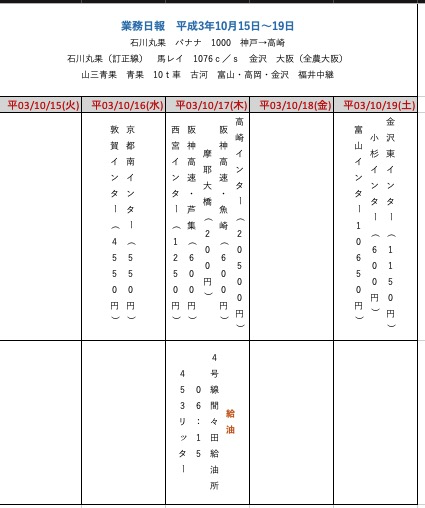

　10月17日は高崎でバナナをおろした後、関東で泊まりになっているように見ていたのですが、神戸でバナナを摘んだとされる当日、日付が変わる前に高崎インターを降りていたことになりそうです。

　高崎の青果市場というのは確かに夜中に荷下ろしをしたことがあり、割と強く印象に残っている市場だったのですが、バナナとなると記憶がはっきりせず、それも神戸から運んだことになっていて、L4ともなっていました。

　やはり業務日報に11月15日とある運行との取り違え、あるいは記憶の混同とも思えてきたのですが、その11月15日の運行の方もExcelで縦書きの表を作って、全体像がつかみやすくさせておきたいと思います。

 

〈〈〈  MacBook-Air VSCode： 2023-06-12 13:07:01〈〈〈

 

### 業務日報に同じく神戸からバナナと積んだ11月15日の運行

 

〉〉〉 MacBook-Air VSCode： 2023-06-12 13:50:04 〉〉〉

 

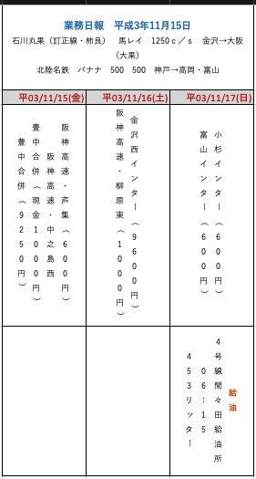
 

　今日になって、「全日本道路」の料金表で西宮インターが阪神高速になるらしいと知ったのですが、阪神高速上に料金所があったような気がするものの思い出せなくなっています。

　11月16日の金沢西インターの料金が9600円となっているので、神戸から阪神高速に乗り、それから全線高速で金沢に戻ったようです。

　神戸で荷物を積んでいたときの状況は少し記憶にあるのですが、現在はそこで記憶が途切れ、ずっと強く記憶に残っているのは、休日と思われる日のたぶん午前中で高岡の市場でした。休日の明るい時間に高岡の市場にいるというのも珍しいことでしたが、領収書のある富山の市場は行った記憶がありません。

　高速道路が使えるなら休日なので富山の市場の荷物をおろしてから高岡の市場に向かいそうな気がしますが、どうも高岡の市場で荷下ろしを終えた後に小杉インターから富山インターまで高速に乗って富山の市場で荷下ろしをして、それからまた富山インターから小杉インターまで一区間高速に乗って金沢に戻ったようです。

　小杉インターはよく利用していましたが、ここで降りて下道で金沢に戻ったという記憶はほとんどありません。高岡の市場の近くを通って小矢部市で国道8号線に出る裏道のような道路があって、昭和59年頃などはよく通っていたのですが、大型車で通行したことはなかったかもしれず、小杉インターの近くの太閤山から富山の市場の近くに出る道路は、大型車の通行禁止の看板が出ていた記憶もあり、小矢部方面も同じ可能性があると考えていたように思います。

### 高崎の青果市場に行った記憶と午前6時15分となっている間々田給油所での領収書

 

〉〉〉 MacBook-Air VSCode： 2023-06-14 09:29:30 〉〉〉

 

　群馬県高崎市の青果市場というのは確かに一度、荷物を運んだ記憶があるのですが、たぶん金沢市場輸送で筍、それも平成2年になるかと思います。

　同じ頃に宇都宮市の青果市場にも筍を運んだような記憶があるのですが、なぜか広い駐車場の記憶しかなく、また、同じ頃、鮮魚でも宇都宮の同じ市場に行ったかもしれないような記憶がおぼろげに残っています。

　高崎の青果市場は、町外れで周囲の状況が、新潟県の燕市辺りの市場と似ていると感じました。建物の方も他の市場に似た特徴を感じたのですが、ガレージの倉庫を大きくしたような建物で、これもたぶん同じ頃に行った東京の新宿の青果市場になります。

　あと、高崎の青果市場では夜の比較的早い時間に着いて、荷下ろしをしたという記憶となっています。売り場に直接荷物をおろしたか、トラックに積んであるローラーを使うような荷下ろしだったような記憶です。

　大型ウィング車の方は、大型保冷車ほどローラーを使うことがなくはっきり思い出せないのですが、保冷車の場合は、後ろの観音開きのドアの下に、台があり、その台を上に上げるとローラーの収納場所となっていました。ローラーは3つあったと思います。

　市場によっては、売り場にパレットを並べて、そのパレットの上に荷物を積むこともありました。

　本当にやった覚えのない、この神戸から高崎という運行ですが、荷物がバナナとなっています。金沢中央卸売市場の場合は、石川丸果の売り場でバナナをおろすことはなかったように思います。

　いずれにせよ、たぶん一度しか行ったことがない高崎の青果市場に行ったのは夜になります。周辺に建物がないだけに、夜の暗さが印象的でした。

- 平成3年3月17日06時15分となっている国道4号間々田給油所の領収書｜市場急配センターの金沢弁護士会事件＼金沢地方検察庁御中 https://note.com/hirono2020kk/n/n88727f9c410e

　noteで証拠資料を掲載した記事を作成しました。VSCodeでは画像や写真が表示されたプレビューは、編集中のテキストの本文と連動してしまうため、それが便利なこともあるのですが、参照しづらいとうことがあります。

　Macbookですが、ウルトラワイドの外部モニターで画面を表示し、ウィンドウを左右に2分割しています。右手にVSCode、左手にGoogle Chromeで写真のあるnoteの記事を表示させています。

- Macbookで、ウルトラワイドの外部モニターにVSCodeとnoteの記事を並べて表示｜市場急配センターの金沢弁護士会事件＼金沢地方検察庁御中 https://note.com/hirono2020kk/n/n2310b3ec4277

　言葉だけのご説明ではわかりづらい点があるかもしれないので、これも画像付きの記事を作成しました。

　453リッターという給油量が多く感じられますが、金沢から神戸に行って、高崎から間々田でもこれだけの給油量になるのか疑問です。

　高崎からだと国道50号線を水戸方面に走り、栃木県小山市で国道4号線を右折し東京方面に向かったことになるかと思います。東北自動車道の佐野藤岡インターに降りたときと同じルートです。

　5分ぐらいで10分までは掛からなかったように思いますが、国道4号線を東京方面に向かうと左手に間々田給油所がありました。割とよく利用した給油所で、足利市の国道50号線沿いの給油所より利用することが多かったように思えるぐらいです。

　中西運輸商のころは、軽油グループと吉田石油の給油カード、金沢市場輸送では昭和59年から昭和63年の間は、一光のカードを使っていました。

　全国各地のガソリンスタンドで給油をしていたわけですが、間々田給油所は、他にないような特徴が印象的な給油所でした。それというのは、4号線という大きな国道沿いにありながら、一見して観光地にあるような普通のガソリンスタンドにしか見えなかったことです。

　この辺りの風景というのは、現在の石川県かほく市になる国道沿いに似ていました。

- かほく市 - Google マップ https://www.google.com/maps/place/%E7%9F%B3%E5%B7%9D%E7%9C%8C%E3%81%8B%E3%81%BB%E3%81%8F%E5%B8%82/@36.6748565,136.6904472,12.93z/data=!4m6!3m5!1s0x5ff9d62670575bc9:0xf028ef9a9cfc62ef!8m2!3d36.7198422!4d136.7067338!16zL20vMDJtY3Fn?entry=ttu

　Googleマップで確認したところ津幡町から国道249号線になっていますが、以前は羽咋市の手前辺りから七尾市まで国道157号線になっていたという記憶です。

　大型トラックを国道から給油機に横付けにしていたと考えると、場所の狭さも余り問題にはならないと思うのですが、古河の青果市場から向かうと、来た道に戻る必要があり、切り返しをする必要があったと考えられます。特に不自由をした覚えはないので、実際はそれほど狭いガソリンスタンドではなかったのかもしれません。

　小さく見えるガソリンスタンドだったので、午前6時から間々田給油所が開いていたのかも多少疑問に思うのですが、金沢市場輸送でやっていたトナミ運輸の栃木の定期便では、荷下ろしを終えた後、早いときだと午前6時台に間々田給油所の辺りにいた可能性がありそうです。

- さらば弁護士鉄道059／改竄の痕跡が多数ある市場急配センターの業務日報（02） https://www.google.com/maps/d/edit?hl=ja&mid=1zePrYZ3sm5Jb6QlerrN80dxJ1uAGJxM&ll=36.28063216442015%2C139.72893978686943&z=13

　2，3日前に作成していたマイプレイスの地図ですが、「さらば弁護士鉄道059／改竄の痕跡が多数ある市場急配センターの業務日報（02）」の書面と対応させるように名前を変更しました。

　このマイプレイスで、現時点で上から5つ目になるかと思いますが、「古河青果地方卸売市場 へのルート」というレイヤーを作成しました。

　A地点がトナミ運輸の栃木支店の場所ですが、だいたい記憶通りの場所ではあるものの少し違っています。国道から右に入って、すぎ左手に支店があったという記憶です。

　住所の方も現在は下野市となっていますが、数年前に調べたときは郡になっていたと思います。

　B地点は、間々田で国道4号線沿いのガソリンスタンドが見つからず、それらしい近くの場所として「ゲオ間々田」を選びました。

https://www.google.com/maps/d/edit?mid=1zePrYZ3sm5Jb6QlerrN80dxJ1uAGJxM&usp=sharing

　公開設定をしていませんでした。共有設定後のURLになります。

　マップを航空写真に切り替えると、国道4号線沿いが住宅地のようになっていました。平成4年当時は、それほど住宅が多くはなかったと思いますが、24時間の大型トラックのガソリンスタンドがある場所とは思えずにいました。断定はできないでずが、少なくとも夜に給油をすることはなかったと思います。

 

〈〈〈  MacBook-Air VSCode： 2023-06-14 11:15:42〈〈〈

 

### 夜に高崎の青果市場で荷下ろしをしたとは考えにくいバナナという荷物の特性

 

〉〉〉 MacBook-Air VSCode： 2023-06-14 11:17:29 〉〉〉

 

　このバナナは、昭和59年に金沢市場輸送の4トン保冷車に乗務していた頃、帰り荷として積むことが多かった荷物になります。先輩の運転手にいろいろとバナナについて話を聞くこともあったのですが、倉庫に入れてから2，3週間と聞いていたのか期間は正確に記憶にないですが、温度管理で完熟させてから店に出すという話でした。

　金沢市場輸送で仕事を始めたのが1月で、早くからバナナを摘むことがあったのですが、バナナの箱の上から毛布を掛けていたことをよく憶えています。寒くなる過ぎると、バナナが風邪を引くという話でしたが、変色をして売り物にならなくなるという話でした。

　昭和60年代になってからと思いますが、グルメという言葉も出てきて食文化に社会的な変化があり、それに呼応したように保冷車では冷凍機付きが当たり前のようになりました。

　ちょうどその頃には、温度調整の機械がないとバナナの積込みは出来ないようになったと聞いた憶えがあります。

　平成２年の３月から乗務したと思われる金沢市場輸送の冷凍機付き大型保冷車では、高原野菜では冷凍機の温度をプラス５度にして運んでいました。

　バナナの場合は、冷凍機とは違う機械が必要と聞くことがあり、それをつけた大型車を市場急配センターで導入すると聞いたのが、平成４年３月に浜上さんが乗務した新車になります。

　この新車のことは記憶が曖昧なのですが、３月に一度、浜上さんと2台で、高岡の中越パルプ工業から巻き取りの荷物を積んで、割と早い時間に関東に向けて出発したことがありました。

　そのときに浜上さんが乗務していたのが、その新車になると思うのですが、記憶が曖昧です。話では保冷のウィング車と聞いていたように思うのですが、実際に見た記憶はなく、また、日産ディーゼル工業のトラックとも聞いていて、同じ日産ディーゼル工業の大型車には、被告発人浜口卓也が乗務すると一月の初め頃には聞いていました。

　まだ金沢市場輸送にいる頃に聞いた話だったかもしれないですが、冷凍機付きの保冷の大型ウィング車は2千万円ほどになるという話でした。市場急配センターの大型車の新車の値段を聞くことはなかったように思います。

　一年中バナナが積めるという話は、浜上さんが乗務したあるいは乗務すると話に聞いた大型車と記憶が結びついています。浜上さんが乗務した新車は、3月に入って見たような記憶があるのですが、被告発人浜口卓也が乗務すると聞いていた大型車は、見たという記憶が残っていません。

　被告発人浜口卓也が市場急配センターで、どの大型ウィング車に乗務していたのかも思い出せないのですが、一緒に運行に出たのは、茨城県北相馬郡の日清食品のときしか記憶にありません。

　私は日清食品で荷下ろしをした後、古河の山三青果に向かった記憶ですが、被告発人浜口卓也は常磐自動車道の谷和原インターから東京方面に向かったような記憶となっています。

　被告発人安田敏とは一度も古河の青果市場で一緒になることがなく、それが気になっていましたが、被告発人浜口卓也とも一緒になることはなく、そもそも山三青果の仕事はほとんどやっていないと聞いたことがあったかと思います。

　最初の方は、浜上さんの大型ウィング車に同乗して古河の青果市場に行ったという話を聞きました。金沢市場輸送で平成3年の4月頃に納車された2台の新車の一台だったと思います。

　この2台の大型ウィング車は、それまでの金沢市場輸送のトラックとはカラーが違って、赤と青のラインが目立っていました。被告発人東渡好信と浜上さんが乗務したのですが、たぶん市場急配センターでもそのまま同じトラックに乗務していたように思います。

　11月の15日から20日の間という記憶ですが、2トン車の持ち込みでの市内配達の仕事から被告発人浜口卓也が市場急配センターで長距離の大型車に乗務するようになり、その最初に、七尾の市場まで同乗したことがありました。

　和歌山県のかつらぎ農協から積んできていたミカンの荷物でしたが、いきさつや成り行きは余り記憶にないものの、金沢から七尾まで3人で行ったことをよく憶えています。

　七尾の市場で荷下ろしをした帰りは、能登有料道路を使わず、当時の河北郡高松町の辺りの国道を走っていた場面が記憶にあり、雨が降っていたかもしれません。

　金沢に戻ってから乗用車に乗り換えたのか記憶にないですが、3人で金石街道にあるラーメン店に行きました。前から多少気になっていたラーメン店で、「北海」が店名に含まれていたと思います。

　金石街道でも国道8号線から向かって、松村から畝田に入るあたりで、右手に店がありました。

　まだ自分で和歌山県のかつらぎ農協に行く前だったような気がするのですが、かつらぎ農協に行くようになったのも11月15日を過ぎてからになると思います。

　金沢の場合、バナナは金沢中央卸売市場とは別の場所におろしていました。金沢中央卸売市場の裏門で、道路の向かい側にある倉庫のような建物で、バナナセンターと呼ばれていたように思います。

　平成3年の9月になるとおろし場所が変わっていました。金沢中央卸売市場の裏門の前の道路というのは同じでしたが、少し離れた場所になっていました。これは今でもそのまま建物がありそうです。

- 丸果バナナ加工センター - Google マップ https://www.google.co.jp/maps/place/%E3%80%92920-0025+%E7%9F%B3%E5%B7%9D%E7%9C%8C%E9%87%91%E6%B2%A2%E5%B8%82%E9%A7%85%E8%A5%BF%E6%9C%AC%E7%94%BA%EF%BC%95%E4%B8%81%E7%9B%AE%EF%BC%91%EF%BC%91%E2%88%92%EF%BC%93%EF%BC%90+%E4%B8%B8%E6%9E%9C%E3%83%90%E3%83%8A%E3%83%8A%E5%8A%A0%E5%B7%A5%E3%82%BB%E3%83%B3%E3%82%BF%E3%83%BC/@36.5861719,136.6301066,20.05z/data=!4m6!3m5!1s0x5ff8334c59bce2c3:0x6558543c4e7fbb9a!8m2!3d36.5856257!4d136.6303256!16s%2Fg%2F12hknh0nc?entry=ttu

　業務日報では、高岡と富山でもバナナを荷下ろししたことになっていますが、バナナを荷下ろししたような記憶はありません。高岡の市場の場合は、売り場でフォークリフトとパレットを使って荷下ろしをしたような場面の記憶が残りますが、オレンジかレモンだったように思います。

　小さい市場だと売り場の中にバナナを加工する低温倉庫があったとも考えられますが、他の荷扱いもある夜中におろす必要性はなかったものと思います。

 

〈〈〈  MacBook-Air VSCode： 2023-06-14 12:56:55〈〈〈

 

### 高岡を高崎、11月を10月とご記載したと思われる神戸港島のエルヨン

 

〉〉〉 MacBook-Air VSCode： 2023-06-14 15:44:19 〉〉〉

 

　2，3日前、高崎の検索で出てきたツイートに10月とあったので、10月にも神戸のエルヨンに行っていたのかと考えたのですが、これは二重の間違いがあったように思えてきました。

- （2／4／669647：検索：神戸.*高崎）ツイート：@kk_hirono（）2021-10-07 14:48:54
> １０    １０月中頃
> 主要事項
> １０月の中頃の様子は、次のようなものであったと思います。
> ★神戸Ｌ４より高崎に向けて走行中、北陸道徳光ＰＡより午後五時頃会社に電話を入れたところ、彼女が対応に出た。
ツイートのURL： https://twitter.com/kk_hirono/status/1445989492834246657

　手元にある平成5年11月28日付の手書きの書面の5で確認したところ、やはり高岡を高崎、11月を10月と勘違いか、あるいは誤記していたことを確認したのですが、少し先を読み進めると、また違った不可解な問題が出てきました。

　平成3年や平成4年に近い時期ほど記憶が鮮明で憶えている事柄も多かったというのは確かですが、数が多いだけに整理がつかず、時期を大きく勘違いしていたと後になって気がつくことも実際にあったと記憶にあります。

　平成5年11月28日付の手書きの書面の5の該当箇所を作ほどスマホで写真撮影しましたが、これもnoteの記事として掲載し、横のウィンドウで眺めながら参照しやすくしておきたいと思います。

 

〈〈〈  MacBook-Air VSCode： 2023-06-14 16:29:10〈〈〈

 

### 平成5年11月28日付の手書きの書面の5のキングジムファイル

 

〉〉〉 MacBook-Air VSCode： 2023-06-14 16:29:51 〉〉〉

 

- 平成5年11月28日付の手書きの書面の5＜平成3年の神戸やバナナに関する記載＞写真資料編｜市場急配センターの金沢弁護士会事件＼金沢地方検察庁御中 https://note.com/hirono2020kk/n/n30fa580409de

　上記のnoteの記事に5つの写真ファイルを掲載しましたが、こちらのMarkdownのファイルにも画像サイズを縮小して掲載しておきます。

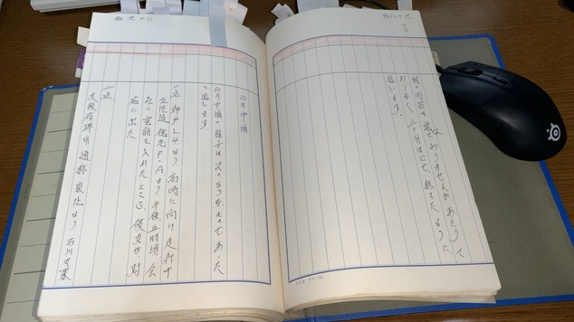

images/02/2023-06-14_155556＿平成5年11月28日付の手書きの書面の5　190ページ（表面）.JPG

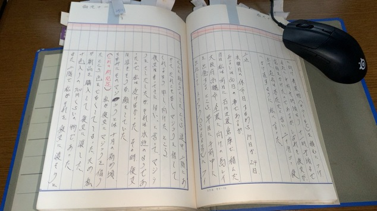

images/02/2023-06-14_155611＿平成5年11月28日付の手書きの書面の5　190ページ裏面と191ページ表面.JPG

images/02/2023-06-14_155630＿平成5年11月28日付の手書きの書面の5　191ページ裏面と192ページ表面.JPG

images/02/2023-06-14_160117＿平成5年11月28日付の手書きの書面の5　193ページ裏面と194ページ表面.JPG

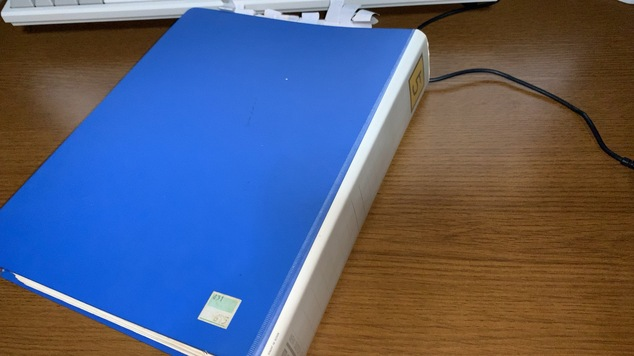

images/02/2023-06-14_160159＿平成5年11月28日付の手書きの書面の5のファイル.JPG

　Kindleの電子辞書では画像の拡大が出来なかったと思います。noteの記事は画像の拡大表示が出来、左右の矢印ボタンで画像の移動も出来ると確認しています。

　Googleフォトアルバムでもアルバムを作成し、本書の写真や画像と関連付けを行っておきます。

- さらば弁護士鉄道059／改竄の痕跡が多数ある市場急配センターの業務日報（02） - Google フォト https://photos.google.com/share/AF1QipNOe-A5mGn79AwMPc0CE69m4Sm1zWZHyjUBEyCgjRBNF7wf1iluz2s10WwEGh_cgw?key=QjZmNnVRd0wxbDRXdExhRlNVRklleE5qNF9kbHNR

　平成5年11月28日付の手書きの書面の5はB4用紙の袋とじとなっていて、漢数字で左右に同じ番号を割り振ってあります。それで表面と裏面にわけました。

　まず、190ページの表面ですが、「10月中頃」という項目名があります。一点、二点などとこれも漢数字になっていますが、使うときは1点などと普通の数字を使います。

　高岡を高崎と手書きで誤記するというのは、ちょっとあり得ないことと思え、最初はそのまま高崎だと思い、それが業務日報にも符合すると考えていました。

　この時期に、北陸自動車道徳光パーキングに午後5時頃にいたというのも実際にあったことと思えました。

　２点の方は泉北の運行ですが、泉佐野市のような泉のつく地名だと思っていたので、堺市が泉北というのは少し意外に感じました。比較的新しい大きなビルのような倉庫でしたが、荷物がキウィでバナナやオレンジと同じ外果の荷物でした。

　泉北からの電話は被害者安藤文さんとの間で印象的なやりとりがあったのですが、ここでは書いていないようです。

　３点目が水曜日の休市日とありますが、このときは10月中と思い込んでいたらしく17日か24日あるいは30日のこととあります。

　前妻との関連付けで11月中という認識は早くからあったと思うのですが、これはあとに出てきます。190ページの裏面が、この３点になります。

　大阪府高槻市全農とあります。そういえば業務日報に1つ大阪の全農というのがあって、北部と本場以外にどこなのかと思っていたのですが、高槻とは気がつかずにいたと思います。

　金沢市場輸送では、運転手の休憩室の黒板に行先と荷主の名前があってわかりやすかったのですが、市場急配センターの場合は送り状をみるしか判断が出来なかったと思います。

　市場という文字が見当たらないですが、高槻市の全農とだけあるようです。知らない人がみれば市場だとは気がつかないかもしれません。

　192ページ表面に最近になって見かけた記載ですが、午後2時頃に被害者安藤文さんが退社したというのは意外で、ずっと午後4時は過ぎていたものと思っていました。

　まず最初に被害者安藤文さんが車に乗って帰るのを見たと記憶にあるのですが、被告発人松平日出男を含めけっこうな人数での市場急配センターの会社前の解散でした。

　解散前は8人ぐらいいたと思うのですが、最後に立ち去るのを見かけたのが被告発人東渡好信と被告発人池田宏美で、どちらの車だったのかよく憶えていなかったのですが、ここには被告発人東渡好信が被告発人池田宏美の車に同乗して走り去ったとあります。

　あえて私の目を意識した演技にも思えたのですが、なにか普通ではない雰囲気がそのときの被告発人東渡好信と被告発人池田宏美から伝わっていました。

　また、1月の10日頃までの部分は、平成5年9月7日に控訴審判決が出る前に名古屋高裁金沢支部に提出をしていた上申書で記載していた事実関係のおさらいになります。

　「その翌日に私は神戸L4より高崎行きを積んだように思います。」とあります。ここでもはっきり手書きで高崎とありますが、続けて（）の間に、「高槻から神戸に向かったことははっきりしている。」とあります。

　金沢市場輸送の大型保冷車でも神戸から外果の荷物を積んだことは記憶にあるのですが、後述の神戸の市場の先にあるバナナセンターより、だいぶん奥にある場所だったと思います。それらしい場所は前にGoogleマップで調べて見ています。

　次に193ページ裏面ですが、「第二点（26日か11月2日の土曜日）」という項目で始まっています。

　市場急配センターの大型車で神戸というのは、夜中のうちに移動したと思われるL4しか記憶になかったのですが、「神戸市の中央市場の近くのバナナセンター」が出てきました。

　正確には、大阪の方から来て神戸の市場の先にある、ということになるのですが、ちょうど市場の前が二股に分かれるような道路になっていて、左手に神戸の市場の中の様子がよく見えていました。

　神戸の市場というのは一度も中に入ることがなかったと思うのですが、何度か同じようにその前を通っていました。

　あれも金沢市場輸送の大型保冷車で7599号だったと思いますが、夜の遅い時間に神戸の市場の先に屋台を見つけ、そこで食事をしたのですが、色の濃い関東炊きというおでんが珍しく、関東では見たことがなく関西なのになぜ関東炊きというのか不思議に思っていましたが、その前から聞いたことはあったように思います。

❯ h3-mysql-regexp-html.py -s "関東炊き"
Darwin
/Users/a66/mac-bin/h3-mysql-regexp-html.py -s "関東炊き"

SELECT * FROM tw_hirono WHERE tweet REGEXP '関東炊き' ORDER BY date ASC;

2023-06-14_172751の実行記録

- （1／2／669647：検索：関東炊き）ツイート：@hirono_hideki（）2014-04-17 21:09:09
> おでんにジャガイモを入れるというのは比較的最近になって知ったような気もするけど、丸ごと沢山入っているのに驚いた。兵庫県高砂市の民家らしい。おでんは昔、夜中に神戸の市場の近くの屋台で食べた関東炊きが記憶に残っている。ずいぶんと色が濃かった。美味かったとも思う。 
ツイートのURL： https://twitter.com/hirono_hideki/status/456766455468789760

- （2／2／669647：検索：関東炊き）ツイート：@kk_hirono（刑事告発・非常上告＿金沢地方検察庁御中）2022-04-26 23:26:28
> どうでもよいような話ですが、神戸市の市場の近くに屋台があって、関東炊きということで食べたとても色の濃いおでんのことも記憶の中で強く印象に残っています。なお、神戸市の市場では荷降ろしをした記憶がなく、前を通過したことが何度かありました。
ツイートのURL： https://twitter.com/kk_hirono/status/1518959702163734529

~/git/kk2023_06/Kindle/059 main* 6s
❯ 

- 2023年06月14日17時29分の登録： H3DB_search_”バナナセンター”_（該当件数：18/データベース登録数：669,647) _2023-06-14_172943の記録 https://kk2020-09.blogspot.com/2023/06/h3dbsearch18669647-2023-06-14172943.html
- 2023年06月14日17時29分の登録： H3DB_search_”関東炊き”_（該当件数：2/データベース登録数：669,647) _2023-06-14_172921の記録 https://kk2020-09.blogspot.com/2023/06/h3dbsearch2669647-2023-06-14172921.html
- 2023年06月14日17時30分の登録： H3DB_search_”神戸”_（該当件数：1,044/データベース登録数：669,647) _2023-06-14_173004の記録 https://kk2020-09.blogspot.com/2023/06/h3dbsearch1044669647-2023-06-14173004.html

- （4／18／669647）：ツイート （@kk_hirono） 2015-08-20 15:52:52
> 神戸ではL4の他にも市場の近くらしいあたりに、外果の倉庫があって、バナナセンターと呼ばれていたような気もします。神戸の市場というのはその近くを通ったことがある程度か、荷降ろしも一度はしたような気もするのですが、市場にはほとんど行くことがなかったと思います。
ツイートのURL： https://twitter.com/kk_hirono/status/634256619761627136

- （5／18／669647）：ツイート （@kk_hirono） 2015-08-20 15:54:54
> その神戸のバナナセンターには中西運輸商の仕事でも行った憶えがあるのですが、金沢市場輸送で大型車に乗務してからも行くことがありました。2回ぐらい行ったような気がしますが、はっきり憶えているのは、そこに神戸で生活をしていた被告訴人OKNと落ち合ったことです。
ツイートのURL： https://twitter.com/kk_hirono/status/634257282906222592

- （6／18／669647）：ツイート （@kk_hirono） 2015-08-20 15:57:57
> 「2013年6月から2014年12月に作成した告訴状の下書き」には書いたように思いますが、宮崎県の都城市で積んだ特殊車両用の大きなタイヤを、神戸の魚崎埠頭辺りに降ろし、その帰り荷でバナナセンターに行ったようにも思うのです。
ツイートのURL： https://twitter.com/kk_hirono/status/634258042285002752

 

- （8／18／669647）：ツイート （@kk_hirono） 2018-06-01 23:59:59
> 書き忘れていましたが、神戸市では車のブローカーの仕事をしているような話でした。シトロエンというフランス車で帰省していたこともあったと思います。同じ車で、神戸の市場の近くのバナナセンターで積荷の待機をしていた私に会いに来たこともありました。
ツイートのURL： https://twitter.com/kk_hirono/status/1002565246664335362

　他のツイートにありますが、中西運輸商でも行ったことがあるような場所で、けっこう古い感じの倉庫でしたが、食堂になっていたような休憩室のような場所を含め、バスの会社のバスターミナルのような建物で、実際に見ていた場所や建物に似ていました。

- 株式会社上組 - Google マップ https://www.google.com/maps/place/%E6%A0%AA%E5%BC%8F%E4%BC%9A%E7%A4%BE%E4%B8%8A%E7%B5%84/@34.6643235,135.1810913,87a,35y,72.52h,45.03t/data=!3m1!1e3!4m15!1m8!3m7!1s0x60008fba994c990b:0x15520456a733a7b4!2z44CSNjUyLTA4NDQg5YW15bqr55yM56We5oi45biC5YW15bqr5Yy65Lit5LmL5bO277yR5LiB55uu77yR4oiS77yRIOelnuaIuOW4guS4reWkruWNuOWjsuW4guWgtA!3b1!8m2!3d34.6659046!4d135.1778191!16s%2Fg%2F12338grx!3m5!1s0x60008fb6bda59f51:0xbd2116eb34b1900a!8m2!3d34.6640793!4d135.1814647!16s%2Fg%2F11f657jr13?entry=ttu

　住所が、〒652-0845 兵庫県神戸市兵庫区築地町６となっていますが、ここがバナナセンターと呼ばれた場所だった可能性はありそうです。

　前に、他に神戸で外果を積んだことがありそうな場所として目にしたのが、和田岬という地名になりそうとも思います。

　神戸の市場との位置関係は記憶と多少違って感じられるのですが、建物が敷地内で建て替えになったという可能性もあるのかもしれないです。

大阪市中央卸売市場 本場 から 神戸市中央卸売市場 - Google マップ https://www.google.com/maps/dir/%E5%A4%A7%E9%98%AA%E5%BA%9C%E5%A4%A7%E9%98%AA%E5%B8%82%E7%A6%8F%E5%B3%B6%E5%8C%BA%E9%87%8E%E7%94%B0%EF%BC%91%E4%B8%81%E7%9B%AE%EF%BC%91+%E5%A4%A7%E9%98%AA%E5%B8%82%E4%B8%AD%E5%A4%AE%E5%8D%B8%E5%A3%B2%E5%B8%82%E5%A0%B4+%E5%A4%A7%E9%98%AA%E5%B8%82%E4%B8%AD%E5%A4%AE%E5%8D%B8%E5%A3%B2%E5%B8%82%E5%A0%B4+%E6%9C%AC%E5%A0%B4/%E3%80%92652-0844+%E5%85%B5%E5%BA%AB%E7%9C%8C%E7%A5%9E%E6%88%B8%E5%B8%82%E5%85%B5%E5%BA%AB%E5%8C%BA%E4%B8%AD%E4%B9%8B%E5%B3%B6%EF%BC%91%E4%B8%81%E7%9B%AE%EF%BC%91%E2%88%92%EF%BC%91+%E7%A5%9E%E6%88%B8%E5%B8%82%E4%B8%AD%E5%A4%AE%E5%8D%B8%E5%A3%B2%E5%B8%82%E5%A0%B4/@34.6987458,135.2414622,27903m/data=!3m2!1e3!4b1!4m14!4m13!1m5!1m1!1s0x6000e65a58a2e2bf:0x55779b1148b24496!2m2!1d135.4777172!2d34.6842859!1m5!1m1!1s0x60008fba994c990b:0x15520456a733a7b4!2m2!1d135.1778191!2d34.6659046!3e0?entry=ttu 

　大阪方面からのルート検索をしましたが、やはり柳原というインターが阪神高速神戸線の最寄りになりそうです。

　Kindleアプリでさらば弁護士鉄道057の検索をすると、11月16日に阪神高速の領収書で柳原東が出てきました。

　摩耶大橋の領収書が10月17日です。摩耶大橋は地図でみても港島に近いので港島のエルヨンに行ったときだと考えていました。

　平成5年11月28日付の手書きの書面の5の193ページ裏面には、神戸の市場の近くのバナナセンターから高岡、富山のバナナを運んだ様子が具体的に記載されています。

　当日の夜に高岡の市場に着き、夜中に富山の市場に移動して、朝より富山で荷下ろし、高岡で荷下ろしして昼頃には金沢に戻ったとあります。

　トラックステーションで大型車を駐車させ、被告発人大網健二の車に乗り、大場町東の被告発人大網健二の自宅に遊びに行ったというのは、よく憶えていて記憶通りです。

　なぜ先に着いた高岡の市場で荷下ろしが出来なかったのか不明ですが、土曜日の夜は荷受けをしておらず、日曜日の朝からということだったようです。

　どの時点で被告発人大網健二の家に遊びに行くことが決まったのか記載がないですが、高岡から金沢に帰る途中に電話を入れたという可能性と、前日には予定を決めていた可能性がありそうです。

　また、荷物がバナナで低温倉庫に入れる必要があったので、夜中に売り場での荷下ろしが出来なかったという可能性もありそうです。高岡では売り場で荷下ろしをした場面の記憶がありますが、売り場の奥に低温倉庫があったのかもしれません。

　前妻が湊川公園の近くに住み、神戸の市場で青果物の仕事をしているような話は、神戸から戻った2，3日後の電話で聞いたように思います。

　これはやはり高槻の市場、港島のエルヨンという流れが記憶として定着してきたのですが、より身近な話に聞こえたのは神戸の市場の前を通っていたからかもしれません。

　これまでの検索で見ていないですが、中西運輸商の4トン車では、夜に九州方面からの運行で港島に入ったことがありました。阪神高速の降り口を出た後だったのか記憶にないですが、国道43号線の大きな交差点を右折して港島に渡ったという場面が一枚の写真のようにずっと記憶に残ってきました。

　昨日や今日の朝も港島のエルヨンで積んだのはオレンジやレモンで、バナナではないのではと言う思いがあり、バナナセンターのことも思い出していました。

　平成5年11月28日付の手書きの書面の5は、B4用紙の160枚目から始まっています。これより前の部分は、最初から手元には入っていなかったように思います。

　被告発人木梨松嗣弁護士が母親経由で、平成6年11月に福井刑務所で服役中の私に渡るようにした書面ですが、出所後の連絡を計算し、期待して全部は寄越さなかったものと考えられます。

　11月16日は、金沢西インターで9600円という領収書があります。神戸から全線高速で戻ったものと思われますが、平成5年11月28日付の手書きの書面の5によると、私は神戸のバナナセンターを出発した当日の夜に高岡の市場に着いたことになっています。

　富山インターで降りた領収書は、翌日の17日となっているので、日付が変わった時間に高岡の市場から富山の市場に移動したことになります。

　控訴審の間、名古屋高裁金沢支部に提出した上申書では、事実関係を細かく書きすぎて、予想よりずいぶんと時間がかなりながら妥協することはせず、判決が出た時点では1月10日辺りまでしか書き記すことが出来ずにいたのですが、それだけ強く必要性を感じて事実関係を書面に記載していたことになります。

　どこから高速道路に乗ってどこで降りたということは、無駄な事実関係と考えることもあったと記憶にありますが、今考えれば、その必要性を痛感するところで、やり過ぎと思えるぐらいに細かく書くこともあったような記憶がありますが、それもむらがあったのかもしれません。今は確認の術もなく、金沢地方検察庁が廃棄処分をしていれば、万事休すで、私の努力は無残に踏みにじられていたことになります。

　10月17日は同じ日付で、西宮インター、摩耶大橋、高崎インターの領収書があります。業務日報荷ある通り神戸から群馬県高崎市までバナナを運んでいれば、もっと印象の強い記憶となっていたはずですが、そのような記載は、今のところ平成5年11月28日付の手書きの書面の5で確認していません。

　変わった長距離の仕事として記憶に残ったのが、これも確定はできないですが、大阪で馬鈴薯の荷物をおろし、東京に向かったという運行です。

　夜のまだ比較的早い時間に、東京の有明の広い埋め立て地のような場所の広い道路沿いにトラックを駐車していたという記憶があり、平地のずっと先には都心のきらびやかな灯りが見えていました。それも珍しい光景だったと記憶にあります。たぶんですが、その前にコンビニで買い物をして、食事をしたあとにそこで朝まで寝ていたと思います。

　私の場合、九州からの鮮魚が多かったですが、東名高速で東京に向かうときは、ほとんどノンストップで走行することが習慣づいていました。

 

〈〈〈  MacBook-Air VSCode： 2023-06-14 19:21:44〈〈〈

 

### ≪運行名≫9月23日大阪から東京有明への運行・写真資料編

 

〉〉〉 MacBook-Air VSCode： 2023-06-14 19:21:55 〉〉〉

 

- ≪運行名≫9月23日大阪から東京有明への運行・写真資料編｜市場急配センターの金沢弁護士会事件＼金沢地方検察庁御中 https://note.com/hirono2020kk/n/n8ae0c55b1a91

　大阪の市場で馬鈴薯を荷下ろしして、そのまま東京に向かったという運行はあったように記憶にあるのですが、東京都内でも湾岸の有明に向かうのに、中央自動車道で八王子バリアの領収書があるのは解せないところで、途中、岐阜県内と思われる中津川インターで降りて給油をしたことにもなっています。

　時間帯による違いもあったかと思いますが、関東の目的地によっては、東名高速ではなく中央自動車道で八王子に向かうことは他にもあったとは思います。

　ただ目的地が有明だとすると、何度も運行していた九州からの築地市場と同じく東名高速以外は考えになかったと思います。東名高速の場合は汐留、関越自動車道からは銀座で降りて築地市場に入った記憶となっています。汐留の方が銀座より大きく広い出口でした。

　名神高速の豊中の領収書は9月23日ですが、中津川インターの領収書は翌日の24日で、八王子バリアも首都高速の永福、北上野という領収書も同じ24日で、金沢東インターでの14650円という領収書も同じ24日になっています。

　24日は日付が変わる前に東京から全線高速で金沢に戻っていたことになります。さきほど書いたような自分の記憶では、大阪から移動してきた24日の夜に東京の有明にいて、翌日に外果の荷物の積み込みをしたことになります。

　一連の9月24日の領収書をみると、夜に大阪で馬鈴薯の荷下ろしをした後、中央自動車道で東京に向かい、明け方前には有明に到着していたことになりそうですが、同じ日の日付が変わる前に金沢に戻っていたことになります。

　ずいぶん慌ただしい運行ですが、有明に夜にいた時間は、時間を持て余すほどゆとりがあったという記憶です。市場急配センターでは特に9月から10月の間、金沢市場輸送ではあり得なかったような時間に余裕のある仕事が多くありました。

　空車で大阪から東京に全線高速で向かうというのも金沢市場輸送ではあり得なかったと思います。それだけに印象が記憶に残っていて、この業務日報にある運行は、実際にあったものだと考えてきたのですが、すでに書いたとおり、中央自動車道軽油というのは違和感がありました。

　中央自動車道で東京都の入り口になる八王子は、国道16号線があって、そこから別の目的地に向かうということがあって、この場合は首都高速で都心を通過する必要がなく、それも利点に思えていたのですが、目的地が有明であれば、必然的に都心の首都高速を通過することになります。

　これまでの金沢地方検察庁の対応では、この業務日報を仔細に検証するという気持ちのゆとりを持つことが出来ず、ここまで記憶の劣化を招いてしまったことは、とても残念ですが、今は出来ることに前向きに取り組む他はないと考え、金沢地方検察庁の権力に無関心だった金沢弁護士会やジャーナリストの江川紹子氏が代表するジャーナリストにも残念すぎる思いがあります。まったく長い時間を無駄にさせられてきました。

　たぶん記憶が混同していたのだと思いますが、平成5年秋の平成5年11月28日付の手書きの書面では、事実関係の認識として不正確な部分があるようにも思えてきました。

　本格的に事実関係の書面の記載を始めたのも平成4年4月1日の事件から一年以上が経過してからのことで、その時点で失われた記憶というのも多くあったように思われます。被告発人木梨松嗣弁護士に奪われた時間と言っても過言はないと思います。これは弁護士の仕事の性質上普通にあり得ることという側面が大きいとも私は考えています。

　被告発人木梨松嗣弁護士は矛先を変えるために、私に名古屋高裁金沢支部への上申書の提出を勧めたのかもしれないですが、時機が遅れたものの、これが結果的によい方向性として記録を残すことが出来たという側面はあります。弁護士に事実の検証を期待すること自体が、そもそもの大間違いだという考えが現在の自分にはあり、その点は割り切っているつもりです。

 

〈〈〈  MacBook-Air VSCode： 2023-06-14 20:06:22〈〈〈

 

## 平成3年12月3日0時44分という、R8-カナザワSSであり得ない時間になっている給油の領収書

 

〉〉〉 MacBook-Air VSCode： 2023-06-14 20:45:02 〉〉〉

 

　他にも不可解な点のある運行です。そもそもこの12月3日に群馬県吉井町の中国化薬に荷下ろしに行ったのか疑問なのですが、業務日報も平成3年12月2日から6日という不可解な期間が書き込まれ、12月5日には、松原本線が2枚、八尾本線が2枚、金沢東インターで9150円という領収書があります。

　能登有料の領収書は260円と210円の2枚で、いずれも12月6日ですが、これは七尾市の市場で荷下ろしを終えた帰りで、日付が変わった時間になりそうです。

　この能登有料道路の領収書も不可解なのですが、和歌山県のかつらぎ農協のミカンの仕事で、七尾市の市場で荷下ろしを終えた後は、能登有料道路を使わずに帰ったことはあったと思いますが、日付が変わった、七尾で荷下ろしを終えた帰りと思われる領収書だけが残されています。

　210円というのは内灘料金所の領収書で、260円というのは今浜の料金所での領収書になると思われます。羽咋市に住んでいた平成14年11月以降では、夜の23時だったか、それ以降の深夜の時間帯は今浜の料金所が閉鎖になっていて、料金の支払いも必要なかったのですが、平成3年当時の記憶はありません。

　ただ、他にも気になっていて、十分な検証はしていないのですが、金沢東インターで降りて七尾市の市場に向かった場合は、内灘の料金所を通過することはなかったと思います。

　業務日報に12月2日から6日となっている、この運行で最初にあるのは、12月2日の前橋インターの領収書で12050円となっています。今のところ北陸自動車道から関越自動車道にまたがる区間料金は確認が出来ていないので、どこのインターから北陸自動車道に乗ったのかは不明となっています。

　確認すると松任市の石川製作所の荷物になるので、金沢東インターから北陸自動車道に乗ったものと考えられます。そして荷物を積んで出発をした12月2日の日付が変わる前に前橋インターで降りたことになっています。

　同じ群馬県吉井町で、いずれも石川製作所から中国化薬への運行になるはずですが、市場急配センターの業務日報では、9月18日、9月26日、そして12月3日に荷下ろしをしたことになっています。

　このうち9月17日は、上越インター、碓井バイパスの領収書があります。9月26日は前橋インターと名立谷浜インターの領収書があって、いずれも7950円となっているので、同じ区間料金になります。

　市場急配センターで名立谷浜インターを乗り降りした記憶はなく、往復で二重の疑問点となっています。この名立谷浜インターは、上越インターから延伸されたインターとして半年ほど金沢市場輸送の東北便で乗り降りをしていたわりかし印象の強いインターになりますが、その後は必要がなく乗り降りすることはなかったと思います。

　あるとすれば通行止めでの迂回ですが、これも記憶にはなく、それも同じ運行での往復となっていて、その先のインターから高速道路に乗り直した形跡が領収書にありません。

　そもそも名立谷浜インターは、金沢市場輸送の前に中西運輸商の9200の4トン車で、冬場に降りた記憶があります。いつ開通したのか調べて再確認をしておきたいと思います。

1987年（昭和62年）7月21日：名立谷浜IC - 上越IC開通（暫定2車線）［35］、同時に上越IC - 新潟黒埼IC（当時）のIC番号・キロポスト変更。
1988年（昭和63年）7月20日：朝日IC - 名立谷浜IC開通（暫定2車線）［23］［35］［44］［45］［46］［47］。これにより1回目の全線開通し同時に米原IC - 朝日ICのIC番号・キロポスト変更。流杉PA開設。

- 北陸自動車道 - Wikipedia https://ja.wikipedia.org/wiki/%E5%8C%97%E9%99%B8%E8%87%AA%E5%8B%95%E8%BB%8A%E9%81%93

　これまでの記憶とは違ったように感じて残念ですが、名立谷浜インターと上越インターの間の開通は昭和62年7月21日とあります。冬の積雪の多い時期に新潟から金沢に向かって中西運輸商の9200の4トン車で名立谷浜インターの近くの国道8号線を走っていたことは、けっこう印象的な記憶として残っています。

　名立谷浜インターから朝日インターの開通が昭和63年7月20日となっているので、ほぼ1年間の間は、東北便で、名立谷浜インターから国道8号線を走っていたことになります。途中には難所とされる親不知もありました。半年ぐらいの間と思っていました。

　東北便は、ほぼ必ずという記憶ですが、国道8号線沿いにある糸魚川市の魚市場に立ち寄り、荷物を降ろしていました。名立谷浜インターから朝日インターの間が開通したことで、糸魚川インターで乗り降りすることになりました。

開通	1985年（昭和60年）10月2日（下り）
1991年（平成3年）10月22日（上り）

- 関越トンネル - Wikipedia https://ja.wikipedia.org/wiki/%E9%96%A2%E8%B6%8A%E3%83%88%E3%83%B3%E3%83%8D%E3%83%AB

　ついでに関越トンネルの開通時期も調べて再確認をしました。前に調べたときの内容は記憶に残っていなかったのですが、下りが10月2日、上りが10月22日という20日間の違いがあったというのは、今回の新発見に思えました。

　昭和60年の1月から3月という時期になると思いますが、関越自動車道の新潟県側の最終インターであった湯沢インターで降りて、国道の三国峠を通って、群馬県に出たということがありました。これが強く記憶に残っています。

- 2023年06月14日21時34分の登録： H3DB_search_”三国峠”_（該当件数：8/データベース登録数：669,647) _2023-06-14_213402の記録 https://kk2020-09.blogspot.com/2023/06/h3dbsearch8669647-2023-06-14213402.html

　最初にブログへの投稿を行いましたが、その検索結果の8件というのは意外に少ない数でした。そのまま引用転載した方がよさそうです。

❯ h3-mysql-regexp-html.py -s "三国峠"               
Darwin
/Users/a66/mac-bin/h3-mysql-regexp-html.py -s "三国峠"

SELECT * FROM tw_hirono WHERE tweet REGEXP '三国峠' ORDER BY date ASC;

2023-06-14_213546の実行記録

- （1／8／669647：検索：三国峠）ツイート：@kk_hirono（）2014-10-06 11:59:59
> その昭和60年か昭和61年の冬に、中西運輸商の4トン車で一度、湯沢インターから三国峠の国道18号線を走ったことがありました。トラックにはすれ違いも困難な狭いトンネルがありました。カーブも多くてずいぶんと時間がかかったように思います。 
ツイートのURL： https://twitter.com/kk_hirono/status/518958623053983744

- （2／8／669647：検索：三国峠）ツイート：@kk_hirono（）2014-10-06 12:02:02
> 馬鹿のように時間も掛かったので、二度と通りたくはないと思うような三国峠でした。その昭和60年以来ということになるのかはわかりませんが、数年ぶりに通ったのが平成4年の2月の終わりか3月の初めのことで、大雪で関越道が通行止めになったために、しかたなく三国峠を走ることになったのです。 
ツイートのURL： https://twitter.com/kk_hirono/status/518959352644784128

- （3／8／669647：検索：三国峠）ツイート：@kk_hirono（）2014-10-06 12:05:05
> 七尾市降ろしの石灰を栃木県葛生町から積んでいた時だったと思います。三国峠など国道18号線の方も渋滞がひどくて、湯沢インターのあたりに出たのは翌日の昼頃にもなっていたと思いますが、午後の明るい時間のうちには七尾市で荷物を降ろすことが出来たようにも記憶にあります。 
ツイートのURL： https://twitter.com/kk_hirono/status/518960212749742080

- （4／8／669647：検索：三国峠）ツイート：@kk_hirono（）2016-08-11 20:36:36
> 3回ぐらい通行止めで関越自動車道が通れず、国道の三国峠を走ったことがありますが、いずれも大雪のことで、大渋滞で大変な思いをし、また、大型トラックでは三国峠のトンネルの狭さにも閉口しました。平成4年の3月の初めころにもありましたが、それだけ懐かしく思い出深い場所でもあります。 
ツイートのURL： https://twitter.com/kk_hirono/status/763700580942385152

- （5／8／669647：検索：三国峠）ツイート：@kk_hirono（）2018-03-16 15:24:24
> 昭和61年の1月頃ではなかったかと思うのですが、冬の時期に、関越トンネルが開通する前、湯沢インターに降りて三国峠を走って群馬県に入ったことがありました。狭いトンネルが多く、3.8メートル（車検の上限）の屋根が擦れそうで、神経がすり減りました。随分時間がかかったとも思います。 
ツイートのURL： https://twitter.com/kk_hirono/status/974531811282862080

- （6／8／669647：検索：三国峠）ツイート：@kk_hirono（）2020-06-03 14:51:51
> 文章の書き方でつながりが分かりづらいと感じるところもあるのですが，荷物を積んで出発した後に栃木県佐野市の食堂で食事をし，その４，５日後にも１時間ほど時間を変えて食事をし，仮眠して出発したところ，関越道が通行止めになり，三国峠を走行したとありました。 
ツイートのURL： https://twitter.com/kk_hirono/status/1268057756868546565

- （7／8／669647：検索：三国峠）ツイート：@kk_hirono（）2020-07-29 19:18:18
> 中西運輸商でも，一度，湯沢インターが終点で，国道17号線の三国峠を走ったことがありました。雪が多い時期で，湯沢インター付近の灯りが印象に残っています。中西運輸商では高速道路の利用に制限がなかったので，わからないまま通行した三国峠でした。 
ツイートのURL： https://twitter.com/kk_hirono/status/1288418539393544192

- （8／8／669647：検索：三国峠）ツイート：@hirono_hideki（刑事告発・非常上告＼金沢地方検察庁御中）2023-01-18 21:15:58
> » 三国峠 (群馬県・新潟県) - Wikipedia https://t.co/NH30yuPyof 
> 三国峠（みくにとうげ）は、日本の新潟県南魚沼郡湯沢町と群馬県利根郡みなかみ町の境を越える標高1,244m[1]の峠。
ツイートのURL： https://twitter.com/hirono_hideki/status/1615684422229188610

~/git/kk2023_06/Kindle/059 main*
❯ 

　「（6／8／669647：検索：三国峠）ツイート：@kk_hirono（）2020-06-03 14:51:51」は比較的最近のツイートですが、栃木からの石灰の荷物で、関越トンネルの通行止めに遭遇したのは2回目の運行とあります。今から3年ほど前に、そこまで具体的な記憶が残っていたのか正直疑問もあるのですが、同じ佐野市の食堂で食事をし、4，5日後に通行止めに遭遇したとあります。

　市場急配センターの業務日報では、最初の栃木の石灰の運行で関越トンネルの通行止めに遭遇したような記録となっていたのですが、これは違うと思っていました。

　佐野市の食堂は、ラーメン店として割と強い印象が残っていたのですが、佐野市のラーメンが全国的に有名となるずいぶんと前のころです。国道沿いでもないのに大型トラックの駐車がしやすかったというのがその食堂に入った一番の動機でしたが、同じ食堂に2回入ったという記憶はなく、ツイートの文章が多少わかりづらいですが、2回とも1時間ほど時間の違いがありながら同じように食事後に仮眠をしたように書いてあります。

　12月2日も前橋インターで12050円という領収書となっています。

　Kindleアプリで、さらば弁護士鉄道057の検索をしても12050円では、前橋インターの2件の領収書だけの該当でした。前橋インターから金沢東インターに降りたという領収書はありそうに思いましたが、金額が一致する領収書はなさそうです。

　「金沢東インター」の検索では27件の該当がありましたが、関越自動車道のインターと対応する同一の料金は確認出来ませんでした。

　市場急配センターで、被告発人東渡好信が高速道路の使用の節約を言い出したのは、平成4年に入ってからだったように思います。それまでは、ほぼ無制限に高速道路の使用が認められたとも思うのですが、距離が長く遠回りになってしまうということでも、高崎市の少し先の群馬県吉井町の中国化薬に向かうのに、前橋インターで関越自動車道を降りていたというのは疑問がありました。

　関越自動車道の前橋インターは、前橋市内の中心部に近いと思われる国道50号線沿いで、金沢に向かって乗るのと、水戸市や宇都宮市の方面に向かって降りたことは記憶にあるのですが、前橋インターから高崎市に向かったという記憶は残っていません。

　鹿児島市の市場から積んだ白菜を長野市の市場で荷下ろしをして、古河の青果市場に向かったときは前橋市内の国道50号線を、途中で仮眠をして朝に通過したという記憶はあります。KKさんに出会ったときのことです。

- 国道17号 - Wikipedia https://ja.wikipedia.org/wiki/%E5%9B%BD%E9%81%9317%E5%8F%B7

　前橋インターから高崎市で、上越市や長野市から来た国道18号線に交わる間は、国道17号線でした。日付が変わる前に前橋インターを降りていたとして、国道17号線沿いで仮眠をとり、時間調整をしたという記憶はありません。前に書いていますが、夜が明けて明るくなる前に、群馬県吉井町の中国化薬に着いていたという記憶もないことになります。

　全体的な記憶が薄れているので断定することは困難もあるのですが、関東便の感覚として、時間を持て余すような運行となります。

　前に指摘したのはnoteの記事になるかと思いますが、12月2日の日付が変わる前の時間に前橋インターを降りていて、日付が変わったばかりの12月3日0時44分の金沢での給油の領収書は、どう考えてもあり得ないと思います。

　R8-カナザワSSと領収書ありますが、河北郡津幡町のガソリンスタンドという認識でいました。津幡町としては金沢から向かって入り口でしたが、それでも金沢東インターから10分程度の時間は掛かったように思います。

　他に平成3年12月2日から6日となっている業務日報は、帰り荷の山三青果が、富山と高岡が中継で、金沢福井となっています。金沢市場輸送の鮮魚の仕事では高岡中継があり、守田水産輸送の都商事に中継を出していましたが、そもそも青果の荷物での高岡中継というのは記憶になく、北陸自動車道の富山インターから近い富山の市場への中継というのは、金沢に着く前の立ち寄り先を飛ばしたとしてとして考えられないものがあります。

　いつの間にかほとんど思い出せなくなっているのですが、行先場所が富山、高岡、金沢、福井のうち3カ所の場合は、もう一台別のトラックが山三青果で荷物を積んでいたと考えられます。

　2台いて1台が4カ所積みというのは、まずなかったと思います。

　領収書をよくみると、金沢東インターで9150円が12月5日、福井北インターで2700円が12月4日となっています。通常の運行では日付が逆になりそうですが、Kindleアプリでさらば弁護士鉄道057の検索をすると、2月22日で六日町インターの領収書がありました。

　同じ関越磁土だと全日本道路の料金表で調べることが出来るのですが、始点の練馬インターから六日町インターで7000円となっています。北陸自動車道の反対側の新潟西インターでは4100円ですが、これを見ると北陸自動車道の金沢方面からの料金が9150円となることがわかります。

　2月22日と日付のある六日町インターで9150円という領収書だけではすぐに気がつかなかったのですが、これは愛媛県からのイヨカンの荷物を積んだときで、金沢東インターからの料金になるとわかりました。

　新潟県内は2箇所おろしでしたが、最初に六日町の市場でイヨカンの荷下ろしをしました。市場急配センターでの領収書の痕跡は2つしか確認していなかったと思いますが、上越市から国道を通って乗ることは多かった六日町インターになります。どんなに少なくても日本酒の一升瓶を店で買った2月に一度は、六日町インターから関東に向けて関越自動車道に乗っているはずですが、その痕跡も市場急配センターの業務日報では確認出来なくなっています。

　確認出来ているのは12月12日で、六日町インターで降りている3800円という料金ですが、これは渋川伊香保インターからの区間料金と確認しています。

　4200円では、9月13日となっている前橋インターの領収書と、9月29日となっている前橋インターでの領収書だけですが、この2回だけが六日町インターから前橋インターの区間料金として確認出来るものとなっています。

　同じ9月ですが、この夏にも近い時期に上越市から3桁の国道を通って六日町インターから関越自動車道に乗ったという記憶はなく、一年ほど前の金沢市場輸送のときも同じでしたが、ほとんどは冬場の時期に上越市から3桁の国道を通って六日町インターから関越自動車道に乗っていました。

　なぜこの痕跡が市場急配センターの業務日報ですっかりと消されているのか不思議に思えるのですが、北陸ハイミールの2段積みで24トンの倉庫移動の痕跡がないのに、続くほどの明らかで大きな疑問点となっています。改竄の痕跡がそれだけ顕著とも言えるのですが、その必要性も理解できず、ただただ疑問に思っています。

　市場急配センターの会社の力で、ごまかし通すことが出来るという自信の現れとも思えるのですが、策士策におぼれる、という言葉に近い慢心と、思い通りに出来るという挑戦心を感じます。おそらくはそれまでの成功体験の積み重ねが大きいものと私は現在、分析をしています。

 

〈〈〈  MacBook-Air VSCode： 2023-06-14 22:55:14〈〈〈

 

# 市場急配センターの業務日報の確認点
## 平成3年10月17日、神戸からバナナを群馬県高崎市まで運んだという運行
### Excelで作成した平成3年10月の運行表

<html xmlns:o="urn:schemas-microsoft-com:office:office"
xmlns:x="urn:schemas-microsoft-com:office:excel"
xmlns="http://www.w3.org/TR/REC-html40">

<head>
<meta http-equiv=Content-Type content="text/html; charset=utf-8">
<meta name=ProgId content=Excel.Sheet>
<meta name=Generator content="Microsoft Excel 15">
<link rel=File-List href="2023−05−29＿作成・業務日報_H03-10.fld/filelist.xml">

</head>

<body link="#0563C1" vlink="#954F72">
<!--[if !excel]>　　<![endif]-->
<!--次の情報は、Excel の Web ページとして発行ウィザードで生成されました。-->
<!--同じアイテムが Excel から再発行されるとき、DIV タグ間のすべての情報が置き換えられます。-->
<!----------------------------->
<!--Excel の Web ページとして発行 ウィザードのアウトプットの始まり-->
<!----------------------------->

<!--次の情報は、Excel の Web ページとして発行ウィザードで生成されました。--><!--同じアイテムが Excel から再発行されるとき、DIV タグ間のすべての情報が置き換えられます。--><!-----------------------------><!--Excel の Web ページとして発行 ウィザードのアウトプットの始まり--><!-----------------------------><!-----------------------------><!--Excel の Web ページとして発行 ウィザードのアウトプットの終わり--><!----------------------------->

<table border=0 cellpadding=0 cellspacing=0 width=511 style='border-collapse:
 collapse;table-layout:fixed;width:383pt'>
 <col width=80 style='mso-width-source:userset;mso-width-alt:3072;width:60pt'>
 <col width=81 style='mso-width-source:userset;mso-width-alt:3123;width:61pt'>
 <col width=175 span=2 style='mso-width-source:userset;mso-width-alt:6707;
 width:131pt'>
 <tr height=21 style='height:16.0pt'>
  <td colspan=4 height=21 class=xl65 width=511 style='height:16.0pt;width:383pt'><ruby>平成<rt>ヘイセイ3ネン10ガツ </rt></ruby>3年10月</td>
 </tr>
 <tr height=21 style='height:16.0pt'>
  <td height=21 class=xl66 align=right style='height:16.0pt;border-top:none'>平03/10/01(火)</td>
  <td class=xl67 style='border-top:none;border-left:none'>　</td>
  <td class=xl67 style='border-top:none;border-left:none'><ruby>金<rt>カナザワ </rt></ruby>沢（馬鈴薯）</td>
  <td class=xl67 style='border-top:none;border-left:none'><ruby>高岡<rt>タカオカ </rt></ruby>・<ruby>福井<rt>フクイ </rt></ruby></td>
 </tr>
 <tr height=21 style='height:16.0pt'>
  <td height=21 class=xl66 align=right style='height:16.0pt;border-top:none'>平03/10/02(水)</td>
  <td class=xl67 style='border-top:none;border-left:none'>　</td>
  <td class=xl68 style='border-top:none;border-left:none'><ruby>大<rt>オオサカ </rt></ruby>阪　　　　　　　　　　　　　<ruby>金沢<rt>カナザワ </rt></ruby></td>
  <td class=xl67 style='border-top:none;border-left:none'>　</td>
 </tr>
 <tr height=21 style='height:16.0pt'>
  <td height=21 class=xl66 align=right style='height:16.0pt;border-top:none'>平03/10/03(木)</td>
  <td class=xl67 style='border-top:none;border-left:none'>　</td>
  <td class=xl68 style='border-top:none;border-left:none'>　<ruby>浜松<rt>ハママツ </rt></ruby>（マイドルセブン・フィルター）</td>
  <td class=xl67 style='border-top:none;border-left:none'><ruby>浜松<rt>ハママツ </rt></ruby>（マイルドセブン・<ruby>外箱<rt>ソトバコ </rt></ruby>）</td>
 </tr>
 <tr height=21 style='height:16.0pt'>
  <td height=21 class=xl66 align=right style='height:16.0pt;border-top:none'>平03/10/04(金)</td>
  <td class=xl67 style='border-top:none;border-left:none'>　</td>
  <td class=xl68 style='border-top:none;border-left:none'><ruby>金沢<rt>カナザワ </rt></ruby>（<ruby>馬鈴薯<rt>バレイショ </rt></ruby>・<ruby>玉<rt>タマネギ </rt></ruby>ねぎ）</td>
  <td class=xl67 style='border-top:none;border-left:none'><ruby>金<rt>カナザワ </rt></ruby>沢</td>
 </tr>
 <tr height=21 style='height:16.0pt'>
  <td height=21 class=xl66 align=right style='height:16.0pt;border-top:none'>平03/10/05(土)</td>
  <td class=xl67 style='border-top:none;border-left:none'>　</td>
  <td class=xl67 style='border-top:none;border-left:none'><ruby>岐阜<rt>ギフ </rt></ruby></td>
  <td class=xl67 style='border-top:none;border-left:none'>　</td>
 </tr>
 <tr height=21 style='height:16.0pt'>
  <td height=21 class=xl66 align=right style='height:16.0pt;border-top:none'>平03/10/06(日)</td>
  <td class=xl67 style='border-top:none;border-left:none'>　</td>
  <td class=xl67 style='border-top:none;border-left:none'>　</td>
  <td class=xl67 style='border-top:none;border-left:none'>　</td>
 </tr>
 <tr height=21 style='height:16.0pt'>
  <td height=21 class=xl66 align=right style='height:16.0pt;border-top:none'>平03/10/07(月)</td>
  <td class=xl67 style='border-top:none;border-left:none'>　</td>
  <td class=xl67 style='border-top:none;border-left:none'><ruby>金沢<rt>カナザワ </rt></ruby>（<ruby>馬鈴薯<rt>バレイショ </rt></ruby>）</td>
  <td class=xl67 style='border-top:none;border-left:none'>　</td>
 </tr>
 <tr height=21 style='height:16.0pt'>
  <td height=21 class=xl66 align=right style='height:16.0pt;border-top:none'>平03/10/08(火)</td>
  <td class=xl67 style='border-top:none;border-left:none'>　</td>
  <td class=xl67 style='border-top:none;border-left:none'><ruby>大阪<rt>オオサカ </rt></ruby></td>
  <td class=xl68 style='border-top:none;border-left:none'><ruby>泉北<rt>センボク </rt></ruby>（キウィ）</td>
 </tr>
 <tr height=21 style='height:16.0pt'>
  <td height=21 class=xl66 align=right style='height:16.0pt;border-top:none'>平03/10/09(水)</td>
  <td class=xl67 style='border-top:none;border-left:none'>　</td>
  <td class=xl67 style='border-top:none;border-left:none'>　</td>
  <td class=xl67 style='border-top:none;border-left:none'><ruby>金沢<rt>カナザワ </rt></ruby></td>
 </tr>
 <tr height=21 style='height:16.0pt'>
  <td height=21 class=xl66 align=right style='height:16.0pt;border-top:none'>平03/10/10(木)</td>
  <td class=xl67 style='border-top:none;border-left:none'>　</td>
  <td class=xl67 style='border-top:none;border-left:none'><ruby>金<rt>カナザワ </rt></ruby>沢<ruby>（<rt>（</rt></ruby><ruby>馬<rt>バレ</rt></ruby>鈴薯）</td>
  <td class=xl67 style='border-top:none;border-left:none'>　</td>
 </tr>
 <tr height=21 style='height:16.0pt'>
  <td height=21 class=xl66 align=right style='height:16.0pt;border-top:none'>平03/10/11(金)</td>
  <td class=xl67 style='border-top:none;border-left:none'>　</td>
  <td class=xl67 style='border-top:none;border-left:none'><ruby>大<rt>オオサカ </rt></ruby>阪</td>
  <td class=xl67 style='border-top:none;border-left:none'>　</td>
 </tr>
 <tr height=21 style='height:16.0pt'>
  <td height=21 class=xl66 align=right style='height:16.0pt;border-top:none'>平03/10/12(土)</td>
  <td class=xl67 style='border-top:none;border-left:none'>　</td>
  <td class=xl67 style='border-top:none;border-left:none'><ruby>金沢<rt>カナザワ </rt></ruby>（馬鈴薯）（<ruby>積<rt>ツミオキ </rt></ruby>みおき）</td>
  <td class=xl67 style='border-top:none;border-left:none'>　</td>
 </tr>
 <tr height=21 style='height:16.0pt'>
  <td height=21 class=xl66 align=right style='height:16.0pt;border-top:none'>平03/10/13(日)</td>
  <td class=xl67 style='border-top:none;border-left:none'>　</td>
  <td class=xl67 style='border-top:none;border-left:none'>　</td>
  <td class=xl67 style='border-top:none;border-left:none'>　</td>
 </tr>
 <tr height=21 style='height:16.0pt'>
  <td height=21 class=xl66 align=right style='height:16.0pt;border-top:none'>平03/10/14(月)</td>
  <td class=xl67 style='border-top:none;border-left:none'>　</td>
  <td class=xl67 style='border-top:none;border-left:none'><ruby>東京<rt>トウキョウ </rt></ruby>（<ruby>馬鈴薯<rt>バレ</rt></ruby>）</td>
  <td class=xl67 style='border-top:none;border-left:none'><ruby>東京<rt>トウキョウ </rt></ruby>（バナナ）</td>
 </tr>
 <tr height=21 style='height:16.0pt'>
  <td height=21 class=xl66 align=right style='height:16.0pt;border-top:none'>平03/10/15(火)</td>
  <td class=xl67 style='border-top:none;border-left:none'>　</td>
  <td class=xl67 style='border-top:none;border-left:none'><ruby>金沢<rt>カナザワ </rt></ruby>（<ruby>馬鈴薯<rt>バレイショ </rt></ruby>）</td>
  <td class=xl67 style='border-top:none;border-left:none'><ruby>金沢<rt>カナザワ </rt></ruby></td>
 </tr>
 <tr height=21 style='height:16.0pt'>
  <td height=21 class=xl66 align=right style='height:16.0pt;border-top:none'>平03/10/16(水)</td>
  <td class=xl67 style='border-top:none;border-left:none'>　</td>
  <td class=xl68 style='border-top:none;border-left:none'><ruby>大阪<rt>オオサカ </rt></ruby></td>
  <td class=xl67 style='border-top:none;border-left:none'>　</td>
 </tr>
 <tr height=21 style='height:16.0pt'>
  <td height=21 class=xl66 align=right style='height:16.0pt;border-top:none'>平03/10/17(木)</td>
  <td class=xl67 style='border-top:none;border-left:none'>　</td>
  <td class=xl68 style='border-top:none;border-left:none'><ruby>神<rt>コウベ </rt></ruby>戸（バナナ）（？）</td>
  <td class=xl67 style='border-top:none;border-left:none'>　</td>
 </tr>
 <tr height=21 style='height:16.0pt'>
  <td height=21 class=xl66 align=right style='height:16.0pt;border-top:none'>平03/10/18(金)</td>
  <td class=xl67 style='border-top:none;border-left:none'>　</td>
  <td class=xl68 style='border-top:none;border-left:none'><ruby>群馬県<rt>グンマケン </rt></ruby><ruby>高崎市<rt>タカサキシ </rt></ruby></td>
  <td class=xl67 style='border-top:none;border-left:none'><ruby>古河<rt>コガ </rt></ruby></td>
 </tr>
 <tr height=21 style='height:16.0pt'>
  <td height=21 class=xl66 align=right style='height:16.0pt;border-top:none'>平03/10/19(土)</td>
  <td class=xl67 style='border-top:none;border-left:none'>　</td>
  <td class=xl67 style='border-top:none;border-left:none'>　</td>
  <td class=xl67 style='border-top:none;border-left:none'><ruby>富山<rt>トヤマ </rt></ruby>・<ruby>高岡<rt>タカオカ </rt></ruby>・<ruby>金沢<rt>カナザワ </rt></ruby>・<ruby>福井<rt>フクイ </rt></ruby>（<ruby>中継<rt>チュウケイ </rt></ruby>）</td>
 </tr>
 <tr height=21 style='height:16.0pt'>
  <td height=21 class=xl66 align=right style='height:16.0pt;border-top:none'>平03/10/20(日)</td>
  <td class=xl67 style='border-top:none;border-left:none'>　</td>
  <td class=xl67 style='border-top:none;border-left:none'>　</td>
  <td class=xl67 style='border-top:none;border-left:none'>　</td>
 </tr>
 <tr height=21 style='height:16.0pt'>
  <td height=21 class=xl66 align=right style='height:16.0pt;border-top:none'>平03/10/21(月)</td>
  <td class=xl67 style='border-top:none;border-left:none'>　</td>
  <td class=xl67 style='border-top:none;border-left:none'><ruby>金沢<rt>カナザワ </rt></ruby>（<ruby>馬鈴薯<rt>バレ</rt></ruby>）</td>
  <td class=xl67 style='border-top:none;border-left:none'>　</td>
 </tr>
 <tr height=21 style='height:16.0pt'>
  <td height=21 class=xl66 align=right style='height:16.0pt;border-top:none'>平03/10/22(火)</td>
  <td class=xl67 style='border-top:none;border-left:none'>　</td>
  <td class=xl67 style='border-top:none;border-left:none'><ruby>東京<rt>トウキョウ </rt></ruby></td>
  <td class=xl67 style='border-top:none;border-left:none'><ruby>東京<rt>トウキョウ </rt></ruby>（バナナ）</td>
 </tr>
 <tr height=21 style='height:16.0pt'>
  <td height=21 class=xl66 align=right style='height:16.0pt;border-top:none'>平03/10/23(水)</td>
  <td class=xl67 style='border-top:none;border-left:none'>　</td>
  <td class=xl67 style='border-top:none;border-left:none'>　</td>
  <td class=xl67 style='border-top:none;border-left:none'><ruby>金沢<rt>カナザワ </rt></ruby></td>
 </tr>
 <tr height=21 style='height:16.0pt'>
  <td height=21 class=xl66 align=right style='height:16.0pt;border-top:none'>平03/10/24(木)</td>
  <td class=xl67 style='border-top:none;border-left:none'>　</td>
  <td class=xl67 style='border-top:none;border-left:none'><ruby>金<rt>カナザワ </rt></ruby>沢<ruby>（<rt>（</rt></ruby><ruby>馬<rt>バ</rt></ruby>鈴薯）</td>
  <td class=xl67 style='border-top:none;border-left:none'>　</td>
 </tr>
 <tr height=21 style='height:16.0pt'>
  <td height=21 class=xl66 align=right style='height:16.0pt;border-top:none'>平03/10/25(金)</td>
  <td class=xl67 style='border-top:none;border-left:none'>　</td>
  <td class=xl67 style='border-top:none;border-left:none'><ruby>東<rt>トウキョウ </rt></ruby>京</td>
  <td class=xl67 style='border-top:none;border-left:none'><ruby>東京<rt>トウキョウ </rt></ruby>（バナナ）</td>
 </tr>
 <tr height=21 style='height:16.0pt'>
  <td height=21 class=xl66 align=right style='height:16.0pt;border-top:none'>平03/10/26(土)</td>
  <td class=xl67 style='border-top:none;border-left:none'>　</td>
  <td class=xl67 style='border-top:none;border-left:none'>　</td>
  <td class=xl67 style='border-top:none;border-left:none'><ruby>金<rt>カナザワ </rt></ruby>沢</td>
 </tr>
 <tr height=21 style='height:16.0pt'>
  <td height=21 class=xl66 align=right style='height:16.0pt;border-top:none'>平03/10/27(日)</td>
  <td class=xl67 style='border-top:none;border-left:none'>　</td>
  <td class=xl67 style='border-top:none;border-left:none'>　</td>
  <td class=xl67 style='border-top:none;border-left:none'>　</td>
 </tr>
 <tr height=21 style='height:16.0pt'>
  <td height=21 class=xl66 align=right style='height:16.0pt;border-top:none'>平03/10/28(月)</td>
  <td class=xl67 style='border-top:none;border-left:none'>　</td>
  <td class=xl67 style='border-top:none;border-left:none'><ruby>七尾<rt>ナナオ </rt></ruby>（<ruby>丸一<rt>マルイチ </rt></ruby>・<ruby>木材<rt>モクザイ </rt></ruby>）</td>
  <td class=xl67 style='border-top:none;border-left:none'>　</td>
 </tr>
 <tr height=21 style='height:16.0pt'>
  <td height=21 class=xl66 align=right style='height:16.0pt;border-top:none'>平03/10/29(火)</td>
  <td class=xl67 style='border-top:none;border-left:none'>　</td>
  <td class=xl67 style='border-top:none;border-left:none'><ruby>東京<rt>トウキョウ </rt></ruby></td>
  <td class=xl67 style='border-top:none;border-left:none'><ruby>東京<rt>トウキョウ </rt></ruby>（バナナ・オレンジ）</td>
 </tr>
 <tr height=21 style='height:16.0pt'>
  <td height=21 class=xl66 align=right style='height:16.0pt;border-top:none'>平03/10/30(水)</td>
  <td class=xl67 style='border-top:none;border-left:none'>　</td>
  <td class=xl67 style='border-top:none;border-left:none'><ruby>七<rt>ナナオ </rt></ruby>尾<ruby>（<rt>（</rt></ruby><ruby>丸<rt>マルイチ </rt></ruby>一<ruby>・<rt>・</rt></ruby>ベニヤ）</td>
  <td class=xl67 style='border-top:none;border-left:none'><ruby>高岡<rt>タカオカ </rt></ruby>・<ruby>金沢<rt>カナザワ </rt></ruby></td>
 </tr>
 <tr height=21 style='height:16.0pt'>
  <td height=21 class=xl66 align=right style='height:16.0pt;border-top:none'>平03/10/31(木)</td>
  <td class=xl67 style='border-top:none;border-left:none'>　</td>
  <td class=xl67 style='border-top:none;border-left:none'><ruby>埼玉<rt>サイタマ </rt></ruby></td>
  <td class=xl67 style='border-top:none;border-left:none'><ruby>古河<rt>コガ </rt></ruby></td>
 </tr>
 <![if supportMisalignedColumns]>
 <tr height=0 style='display:none'>
  <td width=80 style='width:60pt'></td>
  <td width=81 style='width:61pt'></td>
  <td width=175 style='width:131pt'></td>
  <td width=175 style='width:131pt'></td>
 </tr>
 <![endif]>
</table>

<!----------------------------->
<!--Excel の Web ページとして発行 ウィザードのアウトプットの終わり-->
<!----------------------------->
</body>

</html>
 

〈〈〈  MacBook-Air VSCode： 2023-06-11 16:25:57〈〈〈

		

### Googleでマイマップの作成

〉〉〉 MacBook-Air VSCode： 2023-06-12 05:15:53 〉〉〉

 

<iframe src="https://www.google.com/maps/d/embed?mid=1CoLT0nxwIPCOpCkDEXs4MqOh7CupAU0&ehbc=2E312F" width="640" height="480"></iframe>

　できが悪いですが、いちおう作成しました。そのうち修正するかもしれません。

〈〈〈  MacBook-Air VSCode： 2023-06-12 05:36:02〈〈〈

		
### 発見となったh3-mysql-regexp-html.pyの神戸と高崎の組み合わせ検索

〉〉〉 MacBook-Air VSCode： 2023-06-12 05:36:58 〉〉〉

 

❯ h3-mysql-regexp-html.py -s "神戸.*高崎"
Darwin
/Users/a66/mac-bin/h3-mysql-regexp-html.py -s "神戸.*高崎"

SELECT * FROM tw_hirono WHERE tweet REGEXP '神戸.*高崎' ORDER BY date ASC;

2023-06-12_053528の実行記録

- （1／4／669647：検索：神戸.*高崎）ツイート：@hirono_hideki（）2021-08-29 08:27:03
> 業務日報＿平成03年10月15日〜19日　神戸〜高崎（石川丸果？、バナナ）・金沢〜大阪（石川丸果？、馬鈴薯）・古河〜富山、高岡、金沢、福井（中継）　謎の運行.pdf - Google ドライブ https://t.co/4K8rHRy5Vu
ツイートのURL： https://twitter.com/hirono_hideki/status/1431760268384563200

- （2／4／669647：検索：神戸.*高崎）ツイート：@kk_hirono（）2021-10-07 14:48:54
> １０    １０月中頃
> 主要事項
> １０月の中頃の様子は、次のようなものであったと思います。
> ★神戸Ｌ４より高崎に向けて走行中、北陸道徳光ＰＡより午後五時頃会社に電話を入れたところ、彼女が対応に出た。
ツイートのURL： https://twitter.com/kk_hirono/status/1445989492834246657

- （3／4／669647：検索：神戸.*高崎）ツイート：@kk_hirono（）2021-10-07 14:49:59
> そして、午後二時頃になって彼女は退社していきました。そのあと私が大阪に向け出発するところ、東度が池田の乗用車に同乗していずこかに走り去るのを私は目撃したものであります。その翌日、私は神戸Ｌ４より高崎行きを積んだように思います。（高槻から神戸に向かったことははっきりしている。）
ツイートのURL： https://twitter.com/kk_hirono/status/1445989762242789376

- （4／4／669647：検索：神戸.*高崎）ツイート：@kk_hirono（）2021-10-07 14:50:23
> 神戸L4から高崎に向けてとありますが、これは富山県高岡市の間違いだと思います。高崎で思い当たる地名は群馬県高崎市だけになりますが、その頃、神戸から外果を高岡市の市場に運んだことは、しっかり記憶に残っていて、午前中に高岡の市場で荷降ろしをしました。
ツイートのURL： https://twitter.com/kk_hirono/status/1445989864214700032

~/git/kk2023_06/Kindle/059/images/01 main*
❯ 

　昨日の夕方の早い時間のこの検索で見つけたのですが、2件目のツイートの内容を読んだところ具体的で事実に思えました。

　ところが先ほど4件目のツイートを読んだところ、高崎を高岡の間違いではないかと指摘してあります。2021年10月07日のツイートですが、この時点では、高崎の運行のことを軽く考えていたようです。

　よく見ると肯定的な2件目も同じ2021年10月07日のツイートでした。これは「平成5年11月28日付の手書きの書面」からの引用掲載とおもわれます。北陸自動車道徳光パーキングというのは、金沢西インターの手前になります。午後5時頃にそこにいるというのも珍しい運行で、はっきり「神戸のL4から高崎に向けて走行中」とあります。

- 刑事告発・非常上告＿金沢地方検察庁御中(@kk_hirono)/2021年10月07日 - Twilog https://twilog.togetter.com/kk_hirono/date-211007/asc

　やはり平成5年11月28日付の手書きの書面の引用掲載を刑事告発・非常上告＿金沢地方検察庁御中（@kk_hirono）のツイートで連投していたようです。数日前に気になっていた金沢信用金庫の部分も文字起こしされていました。8月のことと長く勘違いしていたようですが、いずれ取り上げる予定です。

 

〈〈〈  MacBook-Air VSCode： 2023-06-12 05:51:40〈〈〈

 

### まだ検証できていない、この運行の疑問点

 

〉〉〉 MacBook-Air VSCode： 2023-06-12 07:35:11 〉〉〉

 

- 2023年06月12日12時05分の登録： H3DB_search_”高崎インター”_（該当件数：8/データベース登録数：669,647) _2023-06-12_120539の記録 https://kk2020-09.blogspot.com/2023/06/h3dbsearch8669647-2023-06-12120539.html
- 2023年06月12日12時06分の登録： H3DB_search_”高崎”_（該当件数：159/データベース登録数：669,647) _2023-06-12_120558の記録 https://kk2020-09.blogspot.com/2023/06/h3dbsearch159669647-2023-06-12120558.html

　159件のまとめ記事にざっと目を通しましたが、徳光パーキングのツイートの他に神戸からのバナナの運行を確認出来るツイートはありませんでした。

　Excelで縦書きの運行表を作成したのですが、期待以上に全体像が把握しやすいものとなりました。やはりこの神戸から高崎のバナナの運行は不可解な点があるので、確認点とは断定できず、疑問点をして取り上げ、出来る範囲の検証を行っておきます。

 

〈〈〈  MacBook-Air VSCode： 2023-06-12 12:28:21〈〈〈

 

# 再審請求と刑事告発の日々
## 2023年06月13日
### 昨日6月12日に久しぶりに立ち上げたUbuntu23．04

 

〉〉〉 Lunux Ubuntu23.04 VSCode： 2023-06-13 09:39:25 〉〉〉

 

[XTe 23-06-13 9:51:13] ~
% last -x shutdown                                                                                                             9:51:13 
shutdown system down  6.2.0-20-generic Wed May 31 21:39 - 21:40  (00:01)
shutdown system down  6.2.0-20-generic Fri May 26 19:06 - 20:53 (5+01:47)
shutdown system down  6.2.0-20-generic Sat May 20 20:20 - 19:06 (5+22:46)
shutdown system down  6.2.0-20-generic Thu May 18 09:01 - 14:57  (05:56)
shutdown system down  6.2.0-20-generic Wed May 17 21:22 - 22:23  (01:00)
shutdown system down  6.2.0-20-generic Wed May 17 16:09 - 20:04  (03:55)
shutdown system down  6.2.0-20-generic Fri May 12 09:29 - 15:11 (5+05:41)
shutdown system down  6.2.0-20-generic Thu May 11 14:44 - 18:59  (04:15)
shutdown system down  6.2.0-20-generic Thu May 11 12:31 - 14:38  (02:06)
shutdown system down  6.2.0-20-generic Thu May 11 09:44 - 11:14  (01:29)
shutdown system down  6.2.0-20-generic Sun May  7 19:59 - 11:00  (-8:59)
shutdown system down  6.2.0-20-generic Sun May  7 19:49 - 10:50  (-8:58)
shutdown system down  6.2.0-20-generic Mon May  1 13:19 - 04:20  (-8:59)
shutdown system down  6.2.0-20-generic Mon May  1 11:58 - 03:30  (-8:28)
shutdown system down  6.2.0-20-generic Mon May  1 11:41 - 11:52  (00:11)
shutdown system down  6.2.0-20-generic Mon May  1 11:36 - 11:37  (00:00)
shutdown system down  6.2.0-20-generic Mon May  1 11:12 - 11:14  (00:02)
shutdown system down  6.2.0-20-generic Mon May  1 10:38 - 11:11  (00:32)
shutdown system down  6.2.0-20-generic Mon May  1 10:24 - 10:26  (00:02)
shutdown system down  6.2.0-20-generic Mon May  1 10:09 - 10:24  (00:14)
shutdown system down  6.2.0-20-generic Mon May  1 10:04 - 10:05  (00:00)
shutdown system down  6.2.0-20-generic Mon May  1 09:58 - 09:58  (00:00)
shutdown system down  6.2.0-20-generic Sun Apr 30 15:45 - 15:46  (00:00)

wtmp begins Sun Apr 30 09:47:21 2023

[XTe 23-06-13 9:53:27] ~
% last -x reboot                                                                                                               9:53:27 
reboot   system boot  6.2.0-20-generic Tue Jun 13 09:25   still running
reboot   system boot  6.2.0-20-generic Mon Jun 12 20:23   still running
reboot   system boot  6.2.0-20-generic Wed May 31 21:40   still running
reboot   system boot  6.2.0-20-generic Wed May 31 20:53 - 21:39  (00:45)
reboot   system boot  6.2.0-20-generic Fri May 26 19:06 - 19:06  (00:00)
reboot   system boot  6.2.0-20-generic Sat May 20 20:10 - 20:20  (00:09)
reboot   system boot  6.2.0-20-generic Sat May 20 13:28 - 20:20  (06:51)
reboot   system boot  6.2.0-20-generic Fri May 19 18:42 - 20:20 (1+01:37)
reboot   system boot  6.2.0-20-generic Thu May 18 19:53 - 20:20 (2+00:26)
reboot   system boot  6.2.0-20-generic Thu May 18 14:57 - 20:20 (2+05:22)
reboot   system boot  6.2.0-20-generic Wed May 17 22:23 - 09:01  (10:37)
reboot   system boot  6.2.0-20-generic Wed May 17 20:04 - 21:22  (01:18)
reboot   system boot  6.2.0-20-generic Wed May 17 15:11 - 16:09  (00:57)
reboot   system boot  6.2.0-20-generic Thu May 11 18:59 - 09:29  (14:30)
reboot   system boot  6.2.0-20-generic Thu May 11 14:38 - 14:44  (00:06)
reboot   system boot  6.2.0-20-generic Thu May 11 11:14 - 12:31  (01:17)
reboot   system boot  6.2.0-20-generic Wed May 10 10:53 - 09:44  (22:51)
reboot   system boot  6.2.0-20-generic Tue May  9 11:36 - 09:44 (1+22:08)
reboot   system boot  6.2.0-20-generic Sun May  7 11:00 - 09:44 (3+22:44)
reboot   system boot  6.2.0-20-generic Sun May  7 10:50 - 19:59  (09:08)
reboot   system boot  6.2.0-20-generic Wed May  3 07:48 - 19:49 (4+12:00)
reboot   system boot  6.2.0-20-generic Mon May  1 04:20 - 19:49 (6+15:29)
reboot   system boot  6.2.0-20-generic Mon May  1 03:30 - 13:19  (09:49)
reboot   system boot  6.2.0-20-generic Mon May  1 11:52 - 11:58  (00:06)
reboot   system boot  6.2.0-20-generic Mon May  1 11:37 - 11:41  (00:03)
reboot   system boot  6.2.0-20-generic Mon May  1 11:14 - 11:36  (00:22)
reboot   system boot  6.2.0-20-generic Mon May  1 11:11 - 11:12  (00:00)
reboot   system boot  6.2.0-20-generic Mon May  1 10:26 - 10:38  (00:11)
reboot   system boot  6.2.0-20-generic Mon May  1 10:24 - 10:24  (00:00)
reboot   system boot  6.2.0-20-generic Mon May  1 10:05 - 10:09  (00:04)
reboot   system boot  6.2.0-20-generic Mon May  1 09:58 - 10:04  (00:05)
reboot   system boot  6.2.0-20-generic Mon May  1 18:52 - 09:58  (-8:54)
reboot   system boot  6.2.0-20-generic Sun Apr 30 15:46 - 09:58  (18:11)
reboot   system boot  6.2.0-20-generic Sun Apr 30 14:48 - 15:45  (00:57)
reboot   system boot  6.2.0-20-generic Sun Apr 30 09:47 - 15:45  (05:58)

wtmp begins Sun Apr 30 09:47:21 2023

[XTe 23-06-13 9:54:06] ~
%                                                                 

　インストールしたときから調子の悪いUbuntu23．04ですが、先程もスリーブから復帰させると画面が黒いままで、パソコン本体の電源ボタンの長押しで終了させました。

　それから起動し直したのですが、これだと再起動としてシステムは記録しているようです。実際のシャットダウンとは動きも違っているのかもしれません。

　いずれにせよ、前回の再起動が5月31日の21時40分と記録されているので、昨日は今月に入った初めての起動だったようです。

　次のサイトを参考に調べました。めったに調べなかったのですが、方法を忘れてしまいその都度調べています。

- Linuxでシャットダウンや再起動の履歴をコマンドで確認する方法 | 4thsight.xyz https://4thsight.xyz/44737  

　次が問題のエラーです。

[XTe 23-06-13 10:08:21] ~
% sudo dmesg|grep SGX                                                                                                         10:08:21 
[    0.121580] x86/cpu: SGX disabled by BIOS.

[XTe 23-06-13 10:08:40] ~
%   

 BIOSのアップデートまでやったのですが、SGXの有効化ができませんでした。

  

〈〈〈  Lunux Ubuntu23.04 VSCode： 2023-06-13 11:54:19〈〈〈

 

### UbuntuのVSCodeでのMarkdownからPDFファイルの作成

 

〉〉〉 Lunux Ubuntu23.04 VSCode： 2023-06-13 12:05:58 〉〉〉

 

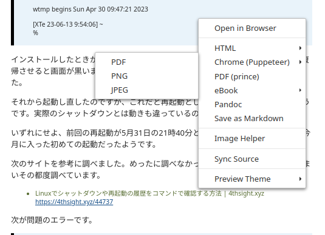

　Macbookでは「PDF（prince）」というのを使っていたのですが、Ubuntuではaptにパッケージが見当たらずインストールができませんでした。

　LaTeXの環境はインストールしてあると思いますが、だいぶん日にちが経過しているので設定のことは忘れています。それでも「Chrome(Puppeteer)」とメニューにあるのを実行してみるとPDFファイルの作成ができました。

　ただ、Macbookの「PDF（prince）」と同じくフッタにページ番号はありませんでした。

 

〈〈〈  Lunux Ubuntu23.04 VSCode： 2023-06-13 12:12:57〈〈〈

 

### MacbookやWindows11とは違ったVSCodeの「Paste Image」プラグインの設定

 

〉〉〉 Lunux Ubuntu23.04 VSCode： 2023-06-13 12:15:12 〉〉〉

 

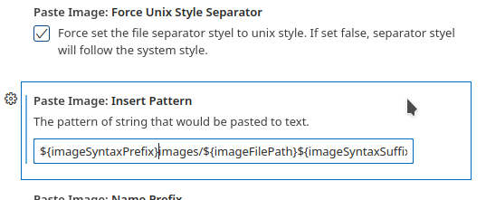

　これまで設定の画面で編集をしていたのですが、直接、settings.jsonのテキストファイルを編集することでうまく行ったようです。今、settings.jsonを見ると、設定画面の設定で編集した項目が書き込まれたようです。

"pasteImage.path": "${currentFileDir}/./images",   
"pasteImage.basePath": "${currentFileDir}/images",   
"pasteImage.insertPattern": "${imageSyntaxPrefix}images/${imageFilePath}${imageSyntaxSuffix}"   

　最初にある「"pasteImage.path": "${currentFileDir}/./images",」をテキストの設定ファイルに書き込んでいました。このパス指定も謎なのですが、この組み合わせで、ようやくimagesフォルダに画像ファイルが保存され、コードのパスも画像表示が有効になりました。

　昨日のはWindows11でも同じ設定をやったのですが、方法というか設定内容が違っていました。Linuxでは次のページにある情報が見つかり、できたことです。

- 【VS Code】マークダウンに画像をコピペで貼り付けする方法 | Inno-Tech-Life https://inno-tech-life.com/dev/it/md_paste/  

 

〈〈〈  Lunux Ubuntu23.04 VSCode： 2023-06-13 12:27:51〈〈〈

 

