- [告発の事実](#告発の事実)
  - [金沢南郵便局の再発見](#金沢南郵便局の再発見)
    - [Bloggerのまとめ記事](#bloggerのまとめ記事)
    - [Twilogから2016年6月27日のツイートを引用転載](#twilogから2016年6月27日のツイートを引用転載)
    - [銀行で繋がった被害者安藤文さんが30万円と3万円を別々に振り込んだという話](#銀行で繋がった被害者安藤文さんが30万円と3万円を別々に振り込んだという話)
    - [公開用Googleフォトアルバムの作成](#公開用googleフォトアルバムの作成)
    - [平成5年11月28日付の手書きの書面　165裏面・166表面の記載](#平成5年11月28日付の手書きの書面165裏面166表面の記載)
    - [被害者安藤文さんのフィルム貼りの手伝いを挟んだ8月と9月の違いの大きさ](#被害者安藤文さんのフィルム貼りの手伝いを挟んだ8月と9月の違いの大きさ)

# 告発の事実
## 金沢南郵便局の再発見
### Bloggerのまとめ記事

 

〉〉〉 MacBook-Air VSCode： 2023-06-16 09:30:03 〉〉〉

- 奉納＼危険生物・弁護士脳汚染除去装置＼金沢地方検察庁御中_2020： H3DB_search_”金沢南郵便局”_（該当件数：28/データベース登録数：669,647) _2023-06-16_091311の記録 https://kk2020-09.blogspot.com/2023/06/h3dbsearch28669647-2023-06-16091311.html

- （1／28／669647）：ツイート （@kk_hirono） 2015-08-21 16:21:21
> その保険のことだったように思いますが、自宅のアパートに金沢南郵便局まで郵便物を取りに来いという葉書が来ていました。自分の住む東力が南郵便局の管轄というのも意外だったのですが、経験のないことだったので、会社に被告訴人池田宏美に尋ねてみました。
ツイートのURL： https://twitter.com/kk_hirono/status/634626458896351237

- （2／28／669647）：ツイート （@kk_hirono） 2015-08-21 16:27:27
> これも8月中のことであったように記憶しています。他にも細かいことはあったのですが、8月中から私は被害者AAさんのことを意識するようになっていて、まさかという思いや、気を遣っているだけかと考えながら、その金沢南郵便局の話の時は、なにかありそうだという予感がありました。
ツイートのURL： https://twitter.com/kk_hirono/status/634627822984663040

- （3／28／669647）：ツイート （@kk_hirono） 2016-06-27 20:06:06
> 銀行のことで思い出したのは、何か忘れましたが、不在通知で金沢南郵便局に取りに来るようにというハガキがアパートに入っていました。銀行の場所もわからなかったので、池田宏美に尋ねたところ、横にいた被害者AAさんが、「それ私の家の近く、私行ってきて上げる。」弾む声をあげてくれました。
ツイートのURL： https://twitter.com/kk_hirono/status/747385566153449472

- （4／28／669647）：ツイート （@kk_hirono） 2020-03-16 19:47:47
> 金沢南郵便局
ツイートのURL： https://twitter.com/kk_hirono/status/1239503448711647232

- （5／28／669647）：ツイート （@kk_hirono） 2020-03-16 20:14:14
> その何日後になるのかは記憶にないですが，同じ８月中であったとは思います。東力二丁目のアパートに不在の通知が入っていて，それが社会保険証の関係だったと思うのですが，金沢南郵便局の郵便物となっていました。
ツイートのURL： https://twitter.com/kk_hirono/status/1239510354884841472

- （6／28／669647）：ツイート （@hirono_hideki） 2020-03-17 10:27:27
> 230：2020-03-17_10:27:13 平成４年傷害・準強姦被告事件の事実／平成３年８月／金沢南郵便局 https://hirono-hideki.hatenadiary.jp/entry/2020/03/17/102711
ツイートのURL： https://twitter.com/hirono_hideki/status/1239724971653353473

- （7／28／669647）：ツイート （@kk_hirono） 2021-10-07 14:14:39
> （2021年10月07日補足：）泉野郵便局となっているが、はがきに金沢南郵便局だった記憶。9月ではなく8月の後半とも思っていた。
ツイートのURL： https://twitter.com/kk_hirono/status/1445980873677959168

- （8／28／669647）：ツイート 刑事告発・非常上告＿金沢地方検察庁御中（@kk_hirono） 2022-07-19 18:22:19
> 平成4年4月1日から8ヶ月間を遡ると、平成3年8月になります。金沢南郵便局のことが最初になりそうです。実際に金沢南郵便局に行ったという記憶はないのですが、被害者安藤文さんに行ってもらうことはなかったはずです
ツイートのURL： https://twitter.com/kk_hirono/status/1549323741699899392

- （9／28／669647）：ツイート 刑事告発・非常上告＿金沢地方検察庁御中（@kk_hirono） 2022-07-19 18:22:27
> 平成4年4月1日から8ヶ月間を遡ると、平成3年8月になります。金沢南郵便局のことが最初になりそうです。実際に金沢南郵便局に行ったという記憶はないのですが、被害者安藤文さんに行ってもらうことはなかったはずです。
ツイートのURL： https://twitter.com/kk_hirono/status/1549323773190770688

- （10／28／669647）：ツイート 非常上告-最高検察庁御中_ツイッター（@s_hirono） 2022-07-19 18:23:39
> 2022-07-19_18:23 奉納＼#危険生物・弁護士脳汚染除去装置＼#金沢地方検察庁御中_2020: H3DB_search_”金沢南郵便局”_（該当件数：7/データベース登録数：577,710) _2022-07-19_1… https://t.co/ggtK7yurEf
ツイートのURL： https://twitter.com/s_hirono/status/1549324077248430080

- （11／28／669647）：ツイート 刑事告発・非常上告＿金沢地方検察庁御中（@kk_hirono） 2022-07-19 18:24:41
> - 2022年07月19日18時23分の登録： H3DB_search_”金沢南郵便局”_（該当件数：7/データベース登録数：577,710) _2022-07-19_182316の記録 https://t.co/sLC2MkW0rh
ツイートのURL： https://twitter.com/kk_hirono/status/1549324336011833344

- （12／28／669647）：ツイート 刑事告発・非常上告＿金沢地方検察庁御中（@kk_hirono） 2022-07-19 18:26:07
> けっこう久しぶりに思い出した金沢南郵便局ですが、7件の該当ということで予想よりは多い数です。
ツイートのURL： https://twitter.com/kk_hirono/status/1549324697137221641

- （13／28／669647）：ツイート 刑事告発・非常上告＿金沢地方検察庁御中（@kk_hirono） 2023-01-02 22:21:47
> なぜに江村正之検察官は、私が被害者安藤文さんに好意を抱くようになった時期を平成3年8月頃にしているのか疑問に思ったのですが、金沢南郵便局の話も一連の供述調書にはなかったように思います。
ツイートのURL： https://twitter.com/kk_hirono/status/1609902780134850560

- （14／28／669647）：ツイート 刑事告発・非常上告＿金沢地方検察庁御中（@kk_hirono） 2023-01-02 22:25:32
> やはり金沢南郵便局のことが被害者安藤文さんを意識するようになるきっかけとして大きかったのですが、これまでにも何度か記述していると思います。いくらか記憶の劣化があるぐらいで、事実というものは変わりません。
ツイートのURL： https://twitter.com/kk_hirono/status/1609903721965817857

- （15／28／669647）：ツイート 刑事告発・非常上告＿金沢地方検察庁御中（@kk_hirono） 2023-01-02 22:28:15
> まとめ記事の作成を行いましたが、「金沢南郵便局」は該当が12件という意外に少ない数でしたが、無関係のものが含まれる可能性は少ないと思います。
ツイートのURL： https://twitter.com/kk_hirono/status/1609904407398977538

- （16／28／669647）：ツイート 刑事告発・非常上告＿金沢地方検察庁御中（@kk_hirono） 2023-01-02 22:29:43
> 奉納＼危険生物・弁護士脳汚染除去装置＼金沢地方検察庁御中_2020: H3DB_search_”金沢南郵便局”_（該当件数：12/データベース登録数：645,510) _2023-01-02_222618の記録 https://t.co/AYHsTe5ESh
ツイートのURL： https://twitter.com/kk_hirono/status/1609904776183164933

- （17／28／669647）：リツイート 刑事告発・非常上告＿金沢地方検察庁御中（@kk_hirono） ／ 刑事告発・非常上告＿金沢地方検察庁御中（@kk_hirono） 2023-01-02 22:30:04 ／ 2015-08-21 16:21:53
> RT @kk_hirono: その保険のことだったように思いますが、自宅のアパートに金沢南郵便局まで郵便物を取りに来いという葉書が来ていました。自分の住む東力が南郵便局の管轄というのも意外だったのですが、経験のないことだったので、会社に被告訴人池田宏美に尋ねてみました。
ツイートのURL： https://twitter.com/kk_hirono/status/1609904864712347655 ／ https://twitter.com/kk_hirono/status/634626458896351237

- （18／28／669647）：リツイート 刑事告発・非常上告＿金沢地方検察庁御中（@kk_hirono） ／ 刑事告発・非常上告＿金沢地方検察庁御中（@kk_hirono） 2023-01-02 22:30:25 ／ 2015-08-21 16:27:18
> RT @kk_hirono: これも8月中のことであったように記憶しています。他にも細かいことはあったのですが、8月中から私は被害者AAさんのことを意識するようになっていて、まさかという思いや、気を遣っているだけかと考えながら、その金沢南郵便局の話の時は、なにかありそうだという…
ツイートのURL： https://twitter.com/kk_hirono/status/1609904951022718977 ／ https://twitter.com/kk_hirono/status/634627822984663040

- （19／28／669647）：リツイート 刑事告発・非常上告＿金沢地方検察庁御中（@kk_hirono） ／ 刑事告発・非常上告＿金沢地方検察庁御中（@kk_hirono） 2023-01-02 22:30:50 ／ 2016-06-27 20:06:19
> RT @kk_hirono: 銀行のことで思い出したのは、何か忘れましたが、不在通知で金沢南郵便局に取りに来るようにというハガキがアパートに入っていました。銀行の場所もわからなかったので、池田宏美に尋ねたところ、横にいた被害者AAさんが、「それ私の家の近く、私行ってきて上げる。…
ツイートのURL： https://twitter.com/kk_hirono/status/1609905054689161216 ／ https://twitter.com/kk_hirono/status/747385566153449472

- （20／28／669647）：リツイート 刑事告発・非常上告＿金沢地方検察庁御中（@kk_hirono） ／ 刑事告発・非常上告＼金沢地方検察庁御中（@hirono_hideki） 2023-01-02 22:31:21 ／ 2020-03-17 10:27:20
> RT @hirono_hideki: 230：2020-03-17_10:27:13 平成４年傷害・準強姦被告事件の事実／平成３年８月／金沢南郵便局 https://t.co/iRgkeDYZrB
ツイートのURL： https://twitter.com/kk_hirono/status/1609905184301539328 ／ https://twitter.com/hirono_hideki/status/1239724971653353473

- （21／28／669647）：ツイート 刑事告発・非常上告＿金沢地方検察庁御中（@kk_hirono） 2023-01-02 22:33:04
> その何日後になるのかは記憶にないですが，同じ８月中であったとは思います。東力二丁目のアパートに不在の通知が入っていて，それが社会保険証の関係だったと思うのですが，金沢南郵便局の郵便物となっていました。
ツイートのURL： https://twitter.com/kk_hirono/status/1609905616264523777

- （22／28／669647）：ツイート 刑事告発・非常上告＿金沢地方検察庁御中（@kk_hirono） 2023-01-02 22:33:11
> - 平成４年傷害・準強姦被告事件の事実／平成３年８月／金沢南郵便局 - 告発＼金沢地方検察庁＼最高検察庁＼法務省＼石川県警察御中2020 https://t.co/Iw2e7Odga8
ツイートのURL： https://twitter.com/kk_hirono/status/1609905647377866753

- （23／28／669647）：リツイート 刑事告発・非常上告＿金沢地方検察庁御中（@kk_hirono） ／ 刑事告発・非常上告＿金沢地方検察庁御中（@kk_hirono） 2023-01-02 22:34:53 ／ 2021-10-07 14:14:39
> RT @kk_hirono: （2021年10月07日補足：）泉野郵便局となっているが、はがきに金沢南郵便局だった記憶。9月ではなく8月の後半とも思っていた。
ツイートのURL： https://twitter.com/kk_hirono/status/1609906074160869376 ／ https://twitter.com/kk_hirono/status/1445980873677959168

- （24／28／669647）：リツイート 刑事告発・非常上告＿金沢地方検察庁御中（@kk_hirono） ／ 刑事告発・非常上告＿金沢地方検察庁御中（@kk_hirono） 2023-01-02 22:35:13 ／ 2022-07-19 18:22:19
> RT @kk_hirono: 平成4年4月1日から8ヶ月間を遡ると、平成3年8月になります。金沢南郵便局のことが最初になりそうです。実際に金沢南郵便局に行ったという記憶はないのですが、被害者安藤文さんに行ってもらうことはなかったはずです
ツイートのURL： https://twitter.com/kk_hirono/status/1609906159716306944 ／ https://twitter.com/kk_hirono/status/1549323741699899392

- （25／28／669647）：リツイート 刑事告発・非常上告＿金沢地方検察庁御中（@kk_hirono） ／ 刑事告発・非常上告＿金沢地方検察庁御中（@kk_hirono） 2023-01-02 22:35:50 ／ 2022-07-19 18:26:07
> RT @kk_hirono: けっこう久しぶりに思い出した金沢南郵便局ですが、7件の該当ということで予想よりは多い数です。
ツイートのURL： https://twitter.com/kk_hirono/status/1609906314721001473 ／ https://twitter.com/kk_hirono/status/1549324697137221641

- （26／28／669647）：ツイート 刑事告発・非常上告＿金沢地方検察庁御中（@kk_hirono） 2023-01-02 23:18:20
> 65件中1件目の2010年5月2日のツイートがおかしく思えたのですが、私の家の近くで行ってきてあげると被害者安藤文さんが声をあげたのは8月中と思われる金沢南郵便局のことで、後ろの方にもフィルム貼りたいと彼女が話しかけたのは、9月の… https://t.co/3iP6u89XCT
ツイートのURL： https://twitter.com/kk_hirono/status/1609917010636595205

- （27／28／669647）：ツイート 刑事告発・非常上告＼金沢地方検察庁御中（@hirono_hideki） 2023-01-03 00:12:12
> 2023-01-02_22:26 奉納＼#危険生物・弁護士脳汚染除去装置＼#金沢地方検察庁御中_2020: H3DB_search_”金沢南郵便局”_（該当件数：12/データベース登録数：645,510) _2023-01-02_… https://t.co/QRokk7FQnD
ツイートのURL： https://twitter.com/hirono_hideki/status/1609930567382085634

- （28／28／669647）：ツイート 刑事告発・非常上告＿金沢地方検察庁御中（@kk_hirono） 2023-01-04 01:36:36
> - 2023年01月02日22時26分の登録： H3DB_search_”金沢南郵便局”_（該当件数：12/データベース登録数：645,510) _2023-01-02_222618の記録 https://t.co/AYHsTe5ESh
ツイートのURL： https://twitter.com/kk_hirono/status/1610314192992743425

　部分的な引用掲載とするつもりだったのですが、全体の流れを重視して、全部を引用掲載することにしました。

　2016年06月27日のツイートに「銀行のことで思い出したのは、何か忘れましたが、不在通知で金沢南郵便局に取りに来るようにというハガキがアパートに入っていました。銀行の場所もわからなかったので、池田宏美に尋ねたところ、」とあります。

　このツイートだけだと前後の文脈が不明ですが、銀行の場所がわからず被告発人池田宏美に尋ねたというのは、記憶になく意外な記述です。

　このあと確認をしていきますが、その銀行というのは金沢信用金庫で、店舗は金石街道沿いのジャスコ若宮店の並びで、そのすぐ近く、市場急配センターの会社からだと手前側にあったという記憶です。

　小さい店舗で、店舗内に入った記憶もないのですが、けっこう目立つ銀行の店舗でした。金沢中央卸売市場からはけっこう離れているのですが、なぜ自分が金沢信用金庫で口座を作ることになったのか思い出せずにいます。自宅アパートとも逆方向で交通量も多く、割と不便を感じる場所でした。

 

〈〈〈  MacBook-Air VSCode： 2023-06-16 10:17:31〈〈〈

### Twilogから2016年6月27日のツイートを引用転載

Twilog ホーム
@kk_hirono2016年06月27日
 
刑事告発・非常上告＿金沢地方検察庁御中@kk_hirono
455フォロー 575フォロワー 9リスト
石川県鳳珠郡能登町宇出津 http：//hirono-hideki.hatenablog.com/
当面の間、本アカウントでは作成中の告訴状の下書きの内容を抜粋する紹介という形でツイートしたいと思います。下書きはその都度ブログの記事として投稿しますが、連携アカウント @s_hirono に記事のリンクをツイートします。告訴状の内容は金沢弁護士会所属の弁護士が不正に関与した殺人未遂事件です。
Stats
Twitter歴
4,523日（2011/01/28より）	ツイート数
222,371（49.1件/日）

ツイートの並び順 ：
通常
朝→夜
古→新
表示するツイート ：
全て
Replyを除く
Mentionを除く
RTのみ
RTを除く
翌日 @kk_hirono 前日
2016年06月27日(月)44 tweetssource
6月27日
刑事告発・非常上告＿金沢地方検察庁御中@kk_hirono

18日の土曜日の夕方には被告訴人多田敏明と二人で、金沢電装の側の焼肉屋で食事をしました。翌日の午後に会社で待ち合わせをして一緒に出発するという約束もしていました。

posted at 00：02：09　削除

   

6月27日
刑事告発・非常上告＿金沢地方検察庁御中@kk_hirono

その約束通りに、19日の午後、被告訴人多田敏明は会社に来たのですが、足を引きずるような状態で、友達らしい細身でやや背の高い、南米人のような体型の若者を伴い、怪我をしたので一緒に運行には出れないと話していました。

posted at 00：04：53　削除

   

6月27日
刑事告発・非常上告＿金沢地方検察庁御中@kk_hirono

その理由として、昨夜、友達と福井県の県境に近い辺りに遊びにゆき、他の車に乗っていたヤクザ風の連中とトラブルになってケンカになり、怪我をさせられたという話でした。この時も顔にはかすり傷もなく、とても本当の話だとは思えませんでした。

posted at 00：07：14　削除

   

6月27日
刑事告発・非常上告＿金沢地方検察庁御中@kk_hirono

当時、そのような言葉は知っていなかったかもしれませんが、被告訴人多田敏明の普段の言動を見ていると、虚言癖や妄想気質があるように思えていました。現役の暴走族らしいことは事実かと思いましたが、話す内容が大きすぎて、とても真に受けることはできませんでした。

posted at 00：12：00　削除

   

6月27日
刑事告発・非常上告＿金沢地方検察庁御中@kk_hirono

ただ、二つ年上で体格も大きな被告訴人安田繁克の方が、被告訴人多田敏明には気遣いをしているような態度を見せることもあり、なにかの力関係で上位であることは、周囲の態度から感じることもありました。祖父に軽四を買ってもらったようなことも聞いたことはありました。

posted at 00：14：50　削除

   

6月27日
刑事告発・非常上告＿金沢地方検察庁御中@kk_hirono

被告訴人安田繁克は、平成4年2月1日の夜の会話で、自分が以前暴走族のリーダーをしていて、後輩にリーダーの座を譲ったが、それが思わしくないような話をし、確認はしませんでしたが、被告訴人多田敏明のことを指しているようにも感じられました。

posted at 00：17：22　削除

   

6月27日
刑事告発・非常上告＿金沢地方検察庁御中@kk_hirono

被告訴人安田繁克はその時、暴力団の組事務所にも出入りしていたと言い、暴走族のグループ名を「狂走恋命」だと言っていましたが、そのようなグループ名を聞いたことはなく、私が少年時代の昭和50年代の中頃に、落書きの一つとしてよく見かけていたものでした。

posted at 00：19：48　削除

   

6月27日
刑事告発・非常上告＿金沢地方検察庁御中@kk_hirono

平成3年9月頃の被害者AAさんのことに話を戻します。細かくは記憶にないですが、9月20日頃に市場急配センターの1階休憩室が出来上がっていました。半分近くが4畳半ほどの畳の間でしたが、畳の間の利用は少なく、小型のテレビもありましたが、つけているのを見ることも少なかったと思います。

posted at 00：24：08　削除

   

6月27日
刑事告発・非常上告＿金沢地方検察庁御中@kk_hirono

他の出入り口のコンクリートの床のスペースは複数の椅子の他、机が一つだけ置いてありました。その引き出しにはあとになって、洗車機の鍵と金沢市場輸送での経由の給油の鍵が置いてありましたが、初めの一月ほどは、どちらも2階の事務所の被害者AAさんが管理をしていました。

posted at 00：27：13　削除

   

6月27日
刑事告発・非常上告＿金沢地方検察庁御中@kk_hirono

基本的に運行指示書と運行費をもらいに行く他は、2階の事務所にあがる用事はなくなり、被害者AAさんに声をかける機会は、鍵を借りに行く時と返しに行く時だけでした。その辺りもよくよく計算されていたかと思います。

posted at 00：29：31　削除

   

6月27日
刑事告発・非常上告＿金沢地方検察庁御中@kk_hirono

その頃は、特に用事がないときは、1階の休憩室にいるように言われていました。12月頃になるとそういう指示も出なくなったのか、わりと自由に1階の休憩室と2階の事務所の間を行き来するようになっていたかと思います。

posted at 00：33：00　削除

   

6月27日
刑事告発・非常上告＿金沢地方検察庁御中@kk_hirono

被害者AAさんにフィルム貼りを手伝ってもらったあと、彼女から「後ろの方もフィルム貼りたくないけ？　後ろから丸見えっていややぞいね。」などと声を掛けられたこともあったのですが、まさかという思いも抜け切れず、離婚したことも他の運転手には内緒にしていたので、対応に戸惑いました。

posted at 00：36：41　削除

   

6月27日
刑事告発・非常上告＿金沢地方検察庁御中@kk_hirono

被害者AAさんに声を掛けられても満足な対応が出来ず、彼女が悲しそうに涙を流すような姿を見ることもありました。まさかという思いはありましたが、フィルム貼りのことも彼女が思い切った行動で機会を作ってくれたと思い、それに応えるためにも自分の方から交際を申し込むと決めたのです。

posted at 00：39：27　削除

   

6月27日
刑事告発・非常上告＿金沢地方検察庁御中@kk_hirono

決行したのは10月5日の土曜日でした。その日は昼食会を兼ねた長距離運転手のミーティングがレストラン十字であり、被害者AAさんが事務所で留守番になっていました。これを絶好の機会だと思った私は、抜けだして会社に電話を掛け、彼女に今夜、自宅のアパートに電話を頼んだのです。

posted at 00：42：54　削除

   

6月27日
刑事告発・非常上告＿金沢地方検察庁御中@kk_hirono

被害者AAさんも事前に予想していたような対応で、事務的に「はい」「はい」と繰り返し、電話番号を聞こうともしなかったのですが、私の方から電話番号を伝えました。

posted at 00：44：39　削除

   

6月27日
刑事告発・非常上告＿金沢地方検察庁御中@kk_hirono

20時に電話を頼んでいたと思いますが、少し遅れて電話があったように思います。彼女は今から友達と片町に飲みに行くと言い、給料日だが土曜日で月曜日の支払いになったので1万円の前借りをしたと話しました。じっくりと話をするつもりだったので、いきなり出鼻をくじかれた気持ちになりました。

posted at 00：47：31　削除

   

6月27日
刑事告発・非常上告＿金沢地方検察庁御中@kk_hirono

今から出かけると言っているので、長話も出来ず、性急かと思いましたが、彼女に付き合っている人はいるのかと尋ねました。彼女はやや間をおいて、なんとなく残念そうに「いないんです。」と答えました。

posted at 00：50：44　削除

   

6月27日
刑事告発・非常上告＿金沢地方検察庁御中@kk_hirono

そこですかさず、「できたら、俺と付き合ってもらけんけ？」と口から言葉が出ました。すると彼女は予め用意していたように「ごめんなさい。私、好きな人おるし。」と言いました。私はその言葉をストレートに真に受け、とても大きな衝撃を受けました。

posted at 00：53：20　削除

   

6月27日
刑事告発・非常上告＿金沢地方検察庁御中@kk_hirono

それからおよそ半年後の、平成4年3月23日の夜の電話で、被害者AAさんは私に次のように言いました。

posted at 00：54：01　削除

   

6月27日
刑事告発・非常上告＿金沢地方検察庁御中@kk_hirono

時刻は6月27日19時22分です。平成4年3月23日のことについて記述をするところで中断し、どうしたものかと考えていました。時の流れに従い、平成3年11月25日頃のことから先に進めたいと思います。

posted at 19：24：41　削除

   

6月27日
刑事告発・非常上告＿金沢地方検察庁御中@kk_hirono

2016-06-27　月曜日　19：24　＜＜ ［［　←これまでの記述範囲の終了時刻］］＜＜

posted at 19：24：57　削除

   

6月27日
刑事告発・非常上告＿金沢地方検察庁御中@kk_hirono

**** 平成3年11月25日の夜の電話から被害者AAさんの裏駐車場への駐車と自宅での電話対応の拒絶

posted at 19：28：10　削除

   

6月27日
刑事告発・非常上告＿金沢地方検察庁御中@kk_hirono

2016-06-27　月曜日　19：28　＞＞ ［［　←これからの記述範囲の開始時刻］］＞＞

posted at 19：28：28　削除

   

6月27日
刑事告発・非常上告＿金沢地方検察庁御中@kk_hirono

平成3年10月頃の状況については昨夜、記述をしたかと思います。余り細かいことまで書いてはいませんが、記憶が薄れていて現在の記憶だけで書くには困難もあります。とにかく沢山のことがありました。

posted at 19：30：26　削除

   

6月27日
刑事告発・非常上告＿金沢地方検察庁御中@kk_hirono

昨夜書いたように、平成3年10月5日の土曜日の20時過ぎに被害者AAさんに電話をかけてもらって交際を申込み、断られたものの10月12日の土曜日には、私の方から被害者AAさんの自宅に初めて電話をしました。

posted at 19：33：30　削除

   

6月27日
刑事告発・非常上告＿金沢地方検察庁御中@kk_hirono

そのあと、11月25日の夜までの間に、2,3回、彼女の自宅に電話を掛けました。そのたびに私は、最後に「諦めるので気にするな。」と彼女に言っていました。彼女の真意を測りかねたのも理由ですが、何より10月5日の電話で断りを受けたことの衝撃が大きく根深い不信感を持つようになりました。

posted at 19：36：21　削除

   

6月27日
刑事告発・非常上告＿金沢地方検察庁御中@kk_hirono

こんなふうに書いていると、それだけでも深澤諭史弁護士がストーカーだと飛びつきそうです。

posted at 19：37：39　削除

   

6月27日
刑事告発・非常上告＿金沢地方検察庁御中@kk_hirono

会社における被害者AAさんは毎日のように意思表示の連続でした。どのように考えても、彼女の言う好きな人は、自分のことと考えるようになりました。しかし、彼女がなぜに、交際を申し込むと「ごめんなさい。」と断るのか、理由はわかりませんでした。難しい年頃というのも一つの理解でした。

posted at 19：41：35　削除

   

6月27日
刑事告発・非常上告＿金沢地方検察庁御中@kk_hirono

ある日の午後、市場急配センターの2階の事務所に被告訴人池田宏美と二人でいると、そこに外から被害者AAさんが戻ってきました。そこで池田宏美が「このケーキ、広野さんがAちゃんのために買ってきてくれてんよ。」というと、被害者AAさんは嬉しそうに恥ずかしそうに笑っていました。

posted at 19：43：44　削除

   

6月27日
刑事告発・非常上告＿金沢地方検察庁御中@kk_hirono

私がジャスコ若宮店でチーズケーキなどを買ってきたのは事実です。銀行に行ってくれたことのお礼のつもりでした。打算がなかったわけでもありません。

posted at 19：45：35　削除

   

6月27日
刑事告発・非常上告＿金沢地方検察庁御中@kk_hirono

細かいことは忘れていて思い出せないのですが、被告訴人池田宏美に銀行の通帳を作ってきてくれることを頼みました。北國銀行中央市場支店の通帳だったと思います。給料の銀行振込のため必要だと言われ、新たに作ることにした通帳だったと思います。

posted at 19：48：00　削除

   

6月27日
刑事告発・非常上告＿金沢地方検察庁御中@kk_hirono

とにかく数日後だったと思いますが、昼前後に被告訴人池田宏美から「あの子（被害者AAさん）に頼んだら、30万円と3万円と別々に入金してきた、っていいとったわ。あの子、何考えとるんやろ。」などと言われました。

posted at 19：50：28　削除

   

6月27日
刑事告発・非常上告＿金沢地方検察庁御中@kk_hirono

そのあと、午後だったと思いますが、市場急配センターの1階休憩室を出たところで、被害者AAさんと鉢合わせになり、通帳を手渡してもらったと記憶にありますが、私はすごく不機嫌な顔をしていたと思います。

posted at 19：51：42　削除

   

6月27日
刑事告発・非常上告＿金沢地方検察庁御中@kk_hirono

なぜかというと、「参考資料扱いにした過去の告訴状の下書き」には書いたと思いますが、山下つよし、が私に、私の子供の話を始め、横にいた被告訴人東渡好信が、「いまさら必要ないもんな秀樹。」などと言い出したことです。

posted at 19：53：26　削除

   

6月27日
刑事告発・非常上告＿金沢地方検察庁御中@kk_hirono

「参考資料扱いにした過去の告訴状の下書き」には書いたと思いますが、平成9年の夏ころになって、30万円と3万円の別々の入金を、北國銀行中央市場支店に行って、確認したのですが、通帳に記憶にあるはずの別々の入金は確認できず、愕然としたことがありました。

posted at 19：56：23　削除

   

6月27日
刑事告発・非常上告＿金沢地方検察庁御中@kk_hirono

女性の行員が私の反応に、不安そうな顔をしていたことも印象的でした。

posted at 19：58：06　削除

   

6月27日
刑事告発・非常上告＿金沢地方検察庁御中@kk_hirono

市場急配センターに入社した平成3年の夏頃、私は北陸銀行か金沢信用金庫のキャッシュカードを持っていて、それでジャスコ若宮店の手前の機械だけの平屋の建物で、カードで引き落としをしていた記憶があるのですが、どういうわけかどちらの銀行も支店には入った記憶がありませんでした。

posted at 20：00：57　削除

   

6月27日
刑事告発・非常上告＿金沢地方検察庁御中@kk_hirono

前妻が使っていて、そのまま置いていったカードだった可能性はあるかと思います。私自身としては、昭和60年ころ、加州銀行の松村支店で通帳を作っていたことと、その時に初めてカードを作ったことはよく憶えています。カードで機械から引き落としが出来るようになったのはその頃のはずです。

posted at 20：03：53　削除

   

6月27日
刑事告発・非常上告＿金沢地方検察庁御中@kk_hirono

銀行のことで思い出したのは、何か忘れましたが、不在通知で金沢南郵便局に取りに来るようにというハガキがアパートに入っていました。銀行の場所もわからなかったので、池田宏美に尋ねたところ、横にいた被害者AAさんが、「それ私の家の近く、私行ってきて上げる。」弾む声をあげてくれました。

posted at 20：06：19　削除

   

6月27日
刑事告発・非常上告＿金沢地方検察庁御中@kk_hirono

被告訴人池田宏美は、「それ本人でないといけんよ。」とたしなめるように言いましたが、それも平成3年の8月中のことであったと思います。保険のこともあるので、8月12日頃に正式離婚したことは、事務所で池田宏美には伝えてあり、その場には一緒に仕事をする被害者AAさんもいました。

posted at 20：08：11　削除

   

6月27日
刑事告発・非常上告＿金沢地方検察庁御中@kk_hirono

そもそもが被害者AAさんに私との交際を仕向けたのは、被告訴人池田宏美ら主導していたはずです。直接、会話を聞いていたわけでもないですが、それらしい言動はいくつもあって、供述調書にも記載はあるように思います。控訴審での上申書には間違いなく書いていたはずですが、相手にされていません。

posted at 20：11：09　削除

   

6月27日
刑事告発・非常上告＿金沢地方検察庁御中@kk_hirono

市場急配センターの事務所において、被害者AAさんから話しかけられ、満足な返事をしないでいると、彼女が涙ぐむ姿もあり、無理解だと怒るような反応もありました。すべては過去の思い出ともなっていますが、木梨松嗣弁護士ら弁護士他関与した法律家の悉くは、その事実を無視しました。

posted at 20：14：45　削除

- 刑事告発・非常上告＿金沢地方検察庁御中(@kk_hirono)/2016年06月27日 - Twilog https://twilog.togetter.com/kk_hirono/date-160627/asc

 

〈〈〈  MacBook-Air VSCode： 2023-06-16 10:18:34〈〈〈

### 銀行で繋がった被害者安藤文さんが30万円と3万円を別々に振り込んだという話

 

〉〉〉 MacBook-Air VSCode： 2023-06-16 10:22:09 〉〉〉

 

- 刑事告発・非常上告＿金沢地方検察庁御中さんはTwitterを使っています： 「「参考資料扱いにした過去の告訴状の下書き」には書いたと思いますが、平成9年の夏ころになって、30万円と3万円の別々の入金を、北國銀行中央市場支店に行って、確認したのですが、通帳に記憶にあるはずの別々の入金は確認できず、愕然としたことがありました。」 / Twitter https://twitter.com/kk_hirono/status/747383066696396800

　2016年6月27日20時06分06秒のツイートに「銀行のことで思い出したのは、」とあります。この文脈のつながりをツイートで調べたところ上記のツイートが出てきたのですが、その直前に思い出し、金額を確認しておきたいと考えた矢先の発見でした。

　記憶通り30万円と3万円だったようです。平成9年の何月頃か思い出せないですが、北國銀行中央市場支店で、通帳のことを調べてもらったことがありました。

　金沢市場輸送ではずっと現金で給料袋をもらっていて、給料の銀行振り込みというのは、それまで経験がなかったのですが　平成3年に市場急配センターで仕事を始めて、11月か12月分辺りの給料から銀行振り込みになったような記憶です。

　さきほどその銀行振り込みのために作ったのが金沢信用金庫の通帳ではないかと考えたのですが、別に思い出したのは2月14日に、被告発人安田敏の前借りを一括返済するためまとまったお金をATMで引き出したことです。

　これが北國銀行中央市場支店でした。他に記憶はないのですが、その2月14日は、店舗の裏側になる金沢中央卸売市場の広い駐車場の方からATMを使ったような記憶となっています。

　銀行のATMを最初に使ったと記憶にあるのが、昭和60年のことで、よく憶えているのは金沢の松村にあった加州銀行でカードを作り、それを福岡市内のATMで使おうとしたところ、暗証番号を繰り返し間違えてATMが使えなくなってしまったということがありました。

　金沢市場輸送の長距離の仕事では、意識的にATMのカードを持たないようにしていたことを覚えています。カードは持っていたと思いますが、お金のことは妻にまかせていたので、平成3年の8月に離婚が成立するまで、自分でATMでお金をおろすことは余りなかったように思います。

　8月の20日頃から月末の間に、金沢南郵便局の通知があったものと思い込んでいたのも、8月のお盆休みの時に、加賀市の妻の実家に行き、父親に離婚届を渡していたことで、社会保険の変更手続というつながりになっていました。

　銀行からの郵便物で不在通知があったというのは、ATMのカードの郵送ぐらいしか思い浮かばないのですが、金沢信用金庫のカードを使ったという記憶は乏しいです。記憶にあるのはジャスコ若宮店の近くの店舗だけですが、そこには何度か立ち寄った記憶があり、店舗内に入った記憶はないので、カードを使っていた可能性はあるかと思います。

　この金沢信用金庫のことは、かなり早い段階に忘れて、思い出せなくなっていたように思います。必要性があって通帳を作ったはずです。

 

〈〈〈  MacBook-Air VSCode： 2023-06-16 10:48:28〈〈〈

### 公開用Googleフォトアルバムの作成

 

〉〉〉 MacBook-Air VSCode： 2023-06-16 11:32:02 〉〉〉

 

- 060／長く誤認していた、金沢南郵便局と被害者安藤文さんの件 - Google フォト https://photos.google.com/share/AF1QipOMiOwibiRAgl8VQw5Z8xvW4UAKX1SmLy3VtETq-B-GN95zrtOPVpZ15ApkyK3mBw?key=SU9JMHdSYVZyMEt5clBzSGZNR3dNTjJPU2FmT09R
 
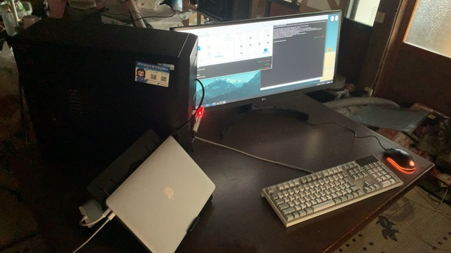

images/2023-06-15_164259＿2階から持ってきた机に、パソコンを置いた部屋の模様替え.JPG

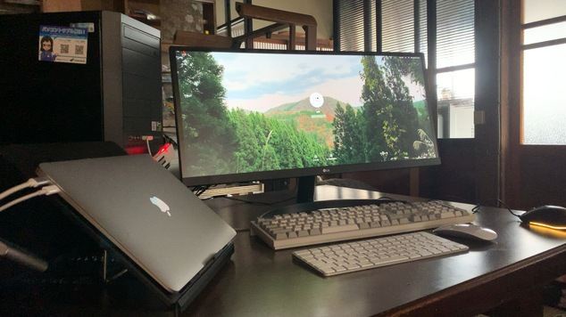

images/2023-06-15_164451＿2階から持ってきた机に、パソコンを置いた部屋の模様替え.JPG

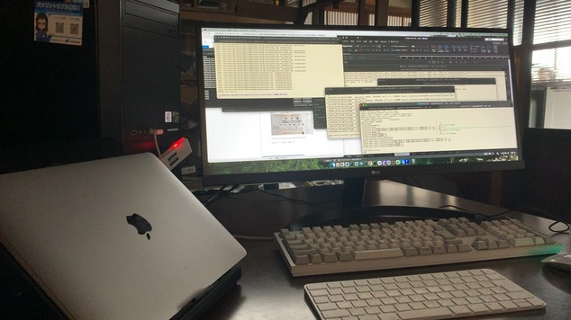

images/2023-06-15_164809＿2階から持ってきた机に、パソコンを置いた部屋の模様替え.JPG

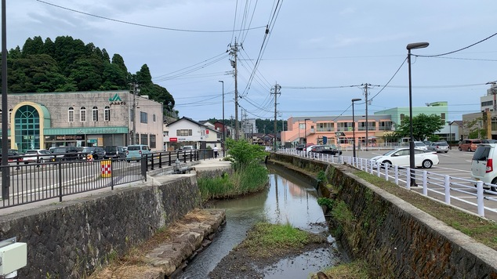

images/2023-06-15_172741＿能登町役場の横から新村方面の梶川.JPG

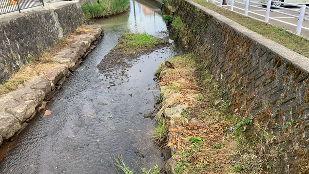

images/2023-06-15_172753＿梶川のネコ.JPG

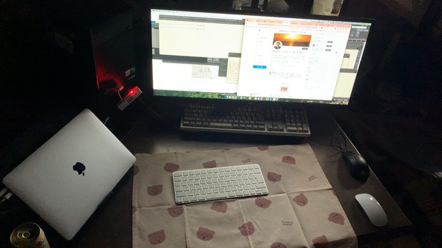

images/2023-06-15_193411＿2階から持ってきた机に、パソコンを置いた部屋の模様替え.JPG

images/2023-06-15_202829＿とり野菜みそ.JPG

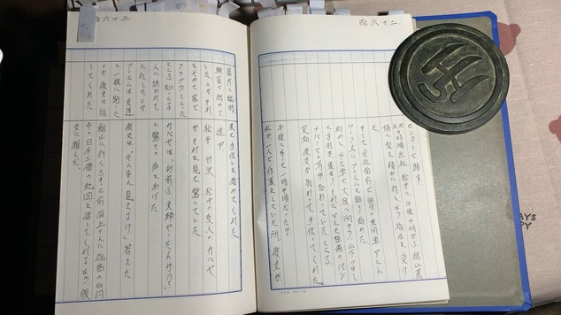

images/2023-06-16_110111＿平成5年11月28日付の手書きの書面　162裏面・163表面.JPG

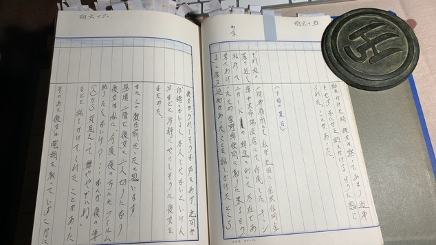

images/2023-06-16_110641＿平成5年11月28日付の手書きの書面　165裏面・166表面.JPG

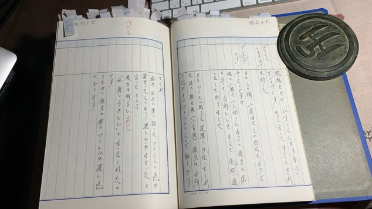

images/2023-06-16_110748＿平成5年11月28日付の手書きの書面　166裏面・167表面.JPG

 

〈〈〈  MacBook-Air VSCode： 2023-06-16 11:41:33〈〈〈

### 平成5年11月28日付の手書きの書面　165裏面・166表面の記載

 

〉〉〉 MacBook-Air VSCode： 2023-06-16 11:41:51 〉〉〉

 

　数日前に見つけて、まだ10日は経っていないように思うのですが、発見時に撮影した写真は見当たりませんでした。6月に入ってからの写真を一通り確認しました。

　さきほどの写真撮影の時、金沢南郵便局ではなく泉野郵便局となっているのが少し気になりました。場所は確かに金沢市泉野になります。

　前が「泉が丘大通り」と呼ばれていたのか、市内配達のときにラジオでよく聞いていた交通情報でも毎回決まって情報が出る金沢市内の主要道です。

　仕事でも余り行くような場所ではなかったですが、交差点の近くに大きな郵便局があることは知っていて、それが金沢南郵便局といういかにも大きそうな名前に合っていると思ったのですが、それも不在通知があって知った郵便局の名前だったように思います。

images/2023-06-16_110641＿平成5年11月28日付の手書きの書面　165裏面・166表面.JPG

　「下旬の某日」となっているのも気になるのですが、最近になって特定ができた被害者安藤文さんのフィルム貼りの手伝いが9月12日で、それから一週間以上は後のことになりそうです。

　余り時期が特定できなかったので、某日としているのだとは思いますが、前回と前々回、同じカ所を読んだときより、間があったのだと思いました。

　つい最近まで8月20日から下旬の某日と思っていた事実関係なので、ちょうど一月ほど思い違いがあったようです。

 

〈〈〈  MacBook-Air VSCode： 2023-06-16 11:57:01〈〈〈

### 被害者安藤文さんのフィルム貼りの手伝いを挟んだ8月と9月の違いの大きさ

 

〉〉〉 MacBook-Air VSCode： 2023-06-16 11:58:57 〉〉〉

 

　これもずっと長い間、9月の半ばから20日頃の間と思い込みがあった被害者安藤文さんのフィルム貼りの手伝いですが、数日前に9月12日と特定が出来ました。

　なぜ特定できたのか、よく思い出せなくなっていますが、前作の059で取り上げたように思います。

　Kindle電子辞書、gitのKindleのディレクトリーを検索しても見つからないのですが、9月12日ではなく9月11日でした。水曜日ということがはっきりしています。

❯ grep 9月11日 **/*.md     
060/さらば弁護士鉄道060／長く誤認していた、金沢南郵便局と被害者安藤文さんの件.md:　Kindle電子辞書、gitのKindleのディレクトリーを検索しても見つからないのですが、9月12日ではなく9月11日でした。水曜日ということがはっきりしています。

~/git/kk2023_06/Kindle main*
❯ grep 9月12日 **/*.md
060/さらば弁護士鉄道060／長く誤認していた、金沢南郵便局と被害者安藤文さんの件.md:　「下旬の某日」となっているのも気になるのですが、最近になって特定ができた被害者安藤文さんのフィルム貼りの手伝いが9月12日で、それから一週間以上は後のことになりそうです。
060/さらば弁護士鉄道060／長く誤認していた、金沢南郵便局と被害者安藤文さんの件.md:　これもずっと長い間、9月の半ばから20日頃の間と思い込みがあった被害者安藤文さんのフィルム貼りの手伝いですが、数日前に9月12日と特定が出来ました。
060/さらば弁護士鉄道060／長く誤認していた、金沢南郵便局と被害者安藤文さんの件.md:　Kindle電子辞書、gitのKindleのディレクトリーを検索しても見つからないのですが、9月12日ではなく9月11日でした。水曜日ということがはっきりしています。

~/git/kk2023_06/Kindle main*
❯ 

　平成3年9月半ばの水曜日は、11日と18日です。どこまで事実なのかあてには出来ない市場急配センターの業務日報ですが、18日は群馬県吉井町で兵器を荷下ろしし、当日に古河の山三青果から富山、高岡の北陸便を積み込んだことになっています。

　11日の方は、前日に東京で積んできたバナナを金沢で朝に荷下ろししているので、これが記憶に合致する行動です。夕方の4時ぐらいと聞いた記憶ですが、金沢市の外れになる舘山からリンゴの荷物を積んで金沢中央卸売市場に運ぶという仕事を被告発人松平日出男に指示されました。

- 舘山町 - Google マップ https://www.google.com/maps/place/%E3%80%92920-0956+%E7%9F%B3%E5%B7%9D%E7%9C%8C%E9%87%91%E6%B2%A2%E5%B8%82%E8%88%98%E5%B1%B1%E7%94%BA/@36.5215555,136.6877616,15.51z/data=!4m6!3m5!1s0x5ff836ea042cb635:0x90faab9909972260!8m2!3d36.5226944!4d136.6942562!16s%2Fg%2F121gprcs?entry=ttu

概要
館山町は、かつて千葉県安房郡に存在した町。 館山城の城下町として築かれ、港町として発展した館山を中心とする町で、現在の館山市の中部に位置する。1933年に北条町と合併し、新たに館山北条町が設立されたことにより廃止された。ウィキペディア

- 舘山町 - Google マップ https://www.google.com/maps/place/%E3%80%92920-0956+%E7%9F%B3%E5%B7%9D%E7%9C%8C%E9%87%91%E6%B2%A2%E5%B8%82%E8%88%98%E5%B1%B1%E7%94%BA/@36.5215826,136.687664,15.5z/data=!4m6!3m5!1s0x5ff836ea042cb635:0x90faab9909972260!8m2!3d36.5226944!4d136.6942562!16s%2Fg%2F121gprcs?entry=ttu

　「〒920-0956 石川県金沢市」となっていますが、千葉県の情報が出ているようです。

　同じGoogleマップの金沢市で、住所が、西念町と西念の違いがよくわからなかったのですが、館山町の隣に見えるのは舘町のようです。

　少し離れた場所に湖南学院がみえますが、これは昭和56年当時、少年院として聞いていた名称のようです。少し離れた場所に城南という地区がありますが、近くに湖などなさそうなのに、なぜ湖南になっているのか気になります。

北陸三県で唯一の少年院「湖南学院」（金沢市）が、院の取り組みを広く知ってもらおうと、昨年八月から広報誌を発行している。更生に向け歩む少年の姿など、普段はなかなか目にすることのない院内の世界をほのぼのと紹介。新型コロナウイルスの影響で施設見学といった地域と関わる機会が失われる中、少年らの社会復帰を見据えて結び付きを強めようとしている。（高橋雪花）

- 少年院の世界 ほのぼの紹介　金沢・湖南学院が広報誌：北陸中日新聞Web https://www.chunichi.co.jp/article/371578

　検索で出てきた2021年11月25日の記事ですが、平成になってから湖南学院を聞くことはなかったと思います。昭和の時代に友人の間で話を聞いていた湖南学院ですが、金沢市にあるとはしらなかったように思います。

　記事の下に、なるほどと思う説明がありました。

湖南学院　１９４９（昭和２４）年１月、金沢市東蚊爪町で発足。その後、同市上中町に移転した。北陸や東海の６県から、義務教育を終えたおおむね１５〜１９歳の男子を受け入れており、２４日時点で１３人が生活している。全国の少年院と同様、窃盗や傷害・暴行などの非行で入院するケースが多い。およそ１１カ月にわたり生活面や学習面などの指導を受ける。発足時は河北潟の南部にあったことが名前の由来になっている。

- 少年院の世界 ほのぼの紹介　金沢・湖南学院が広報誌：北陸中日新聞Web https://www.chunichi.co.jp/article/371578

　金沢市東蚊爪というのは、昭和59年か60年に運転免許センターが移転したことで一躍知られることになった住所ですが、昭和24年からあったというのは意外です。確かに河北潟の南部になるような場所なので、なっとくですが、平成4年当時でも古い建物はほとんどなく、比較的近年に開発された場所と思っていました。

　住所は違っていたように思いますが、北陸ハイミールがこの近くになります。工場や会社ばかりで住宅というのもほとんどなさそうな場所でした。

　感化院ではなく養護院として聞いていた記憶ですが、河北郡内灘町に、非行少年の施設があるとか、施設があったという話は聞いていました。昭和60年代になります。

　昭和56年には、愛知県の瀬戸少年院、愛知少年院、奈良少年刑務所の話を聞いていましたが、石川県で少年院というのは聞いていなかったような気がします。

　北陸三県唯一の少年院で、13人の収容というのもずいぶん人数が少なく感じました。

年表［編集］
1952年（昭和27年）4月 - 女子高の金沢女子短期大学高等学校として金沢市出羽町に開校。
1981年（昭和56年）3月 - 金沢市出羽町から同市末町へ総合移転、跡地には石川県立美術館が移設。
1987年（昭和62年）4月 - 金沢女子短期大学高等学校を金沢女子大学附属高等学校に名称変更。
1993年（平成5年）4月 - 男女共学とし金沢女子大学附属高等学校を金沢女子大学附属金沢東高等学校に名称変更。

- 金沢学院大学附属高等学校 - Wikipedia https://ja.wikipedia.org/wiki/%E9%87%91%E6%B2%A2%E5%AD%A6%E9%99%A2%E5%A4%A7%E5%AD%A6%E9%99%84%E5%B1%9E%E9%AB%98%E7%AD%89%E5%AD%A6%E6%A0%A1

　思い出すことがあって調べたのですが、金沢短期大学が金沢学院大学になっていたことは忘れていました。1，2年前、何かの検索で出てきて知りました。

　話を聞いたのは、短期大学附属高校で、被告発人多田敏明などは「たんこう」と呼んでいました。学校の建物を見たことはなかったように思いますが、金沢市の外れと聞く末町にあると聞いていました。

ｰ 石川県金沢市舘山町 から 金沢学院大学 - Google マップ https://www.google.com/maps/dir/%E7%9F%B3%E5%B7%9D%E7%9C%8C%E9%87%91%E6%B2%A2%E5%B8%82%E8%88%98%E5%B1%B1%E7%94%BA/%E3%80%92920-1392+%E7%9F%B3%E5%B7%9D%E7%9C%8C%E9%87%91%E6%B2%A2%E5%B8%82%E6%9C%AB%E7%94%BA10+%E9%87%91%E6%B2%A2%E5%AD%A6%E9%99%A2%E5%A4%A7%E5%AD%A6/@36.5170113,136.6931294,2071m/data=!3m2!1e3!4b1!4m14!4m13!1m5!1m1!1s0x5ff836ea042cb635:0x90faab9909972260!2m2!1d136.6942562!2d36.5226944!1m5!1m1!1s0x5ff836e67e9b3e0b:0xbffcb9f57ac4b327!2m2!1d136.6950787!2d36.5175048!3e0?entry=ttu 

　ずいぶん迂回したルートで2.6キロとなっていますが、安田りんご園と金沢学院大学の建物はすぐ近くに見えます。

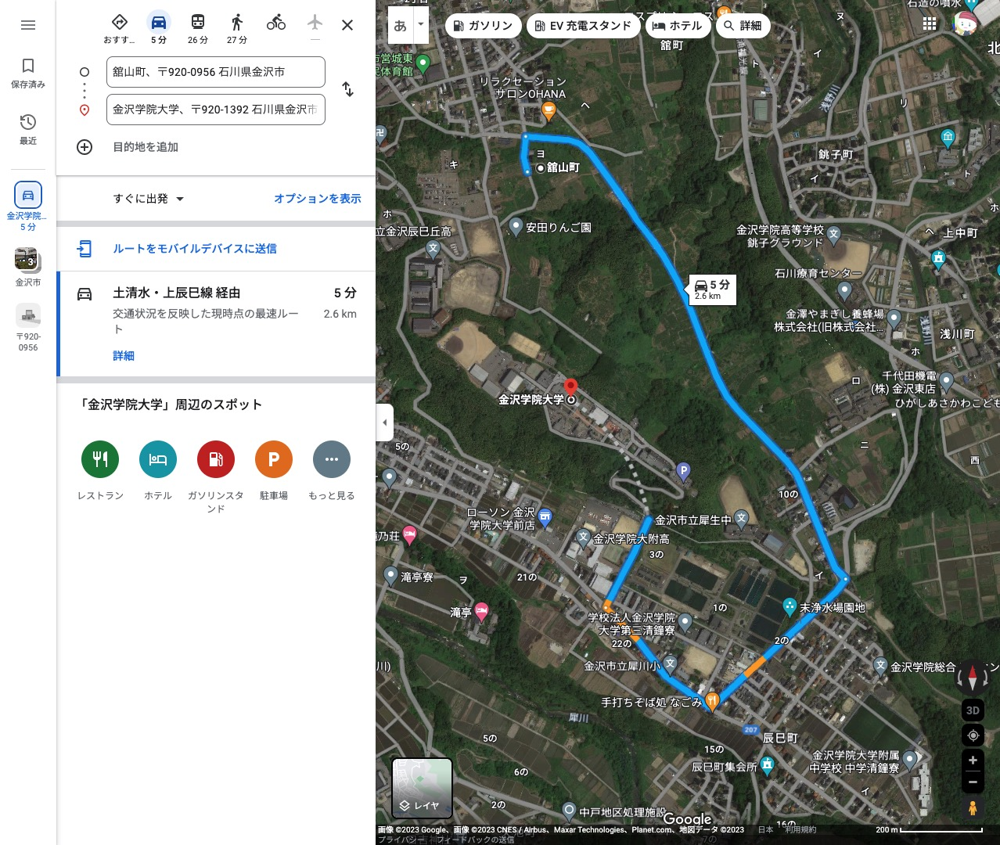

images/2023-06-16_150824_石川県金沢市舘山町　から　金沢学院大学　-　Google　マップ　https：／／www。google。com／maps／dir／％.jpg

　被害者安藤文さんについては、市場急配センターで市内配達の仕事をするようになってから最初の方に、県庁で仕事をしていたと聞いたのですが、ほぼ同時に金沢短期大学附属高校の卒業とも聞いていました。

　県庁にいたという話は、フィルム貼りの手伝いの当日に、被害者安藤文さん本人から話を聞いていたのですが、同じ日に近くの舘山町にリンゴを摘みに行っていたというのは、少し気になる縁のようなものを感じました。

　市内配達の仕事では、たまに末町に配達があって、涌波の方から来て、小立野の方に向かっていました。

　涌波のウェルマートが配達の荷物も多かったのですが、近くの花里に被告発人安田敏が住んでいました。

　このウェルマートですが、金沢市内での店舗数が少なかったものの、玉鉾と保古に店舗があって、保古の方は東力のアパートから近く、たまに買い物に行くことがありました。長男と次男がお菓子を買っていました。

　次男も大きくなっていたので、平成3年の市内配達のときになりそうです。次男は昭和63年1月生まれなので、昭和61年の市内配達のときはまだ生まれていません。

　ウェルマートはけっこう人気店のようでしたが、全部閉店したような話を聞きました。平成4年4月1日より前のことになりそうです。

- ウェルマート 金沢 - Google 検索 https://www.google.com/search?q=%E3%82%A6%E3%82%A7%E3%83%AB%E3%83%9E%E3%83%BC%E3%83%88+%E9%87%91%E6%B2%A2&rlz=1C5CHFA_enJP993JP993&sxsrf=APwXEdfaGJioh7o6So3QBGf3JhOfVPzK9Q:1686896978878&ei=UgGMZKKgNZXV-Qb3zonIAw&start=30&sa=N&ved=2ahUKEwiikcv5lMf_AhWVat4KHXdnAjk4FBDw0wN6BAgjEBc&biw=1278&bih=1080&dpr=1

　ウェルマートを金沢で検索すると、マックスバリュの情報ばかり出てきますが、ジャスコ若宮店もマックスバリュになっていたかと思います。

　店舗の前は歩いて行ったのですが、店内には入らなかったと思います。羽咋市に住んでいる頃は、一度店舗内にも入ることがあったかもしれません。

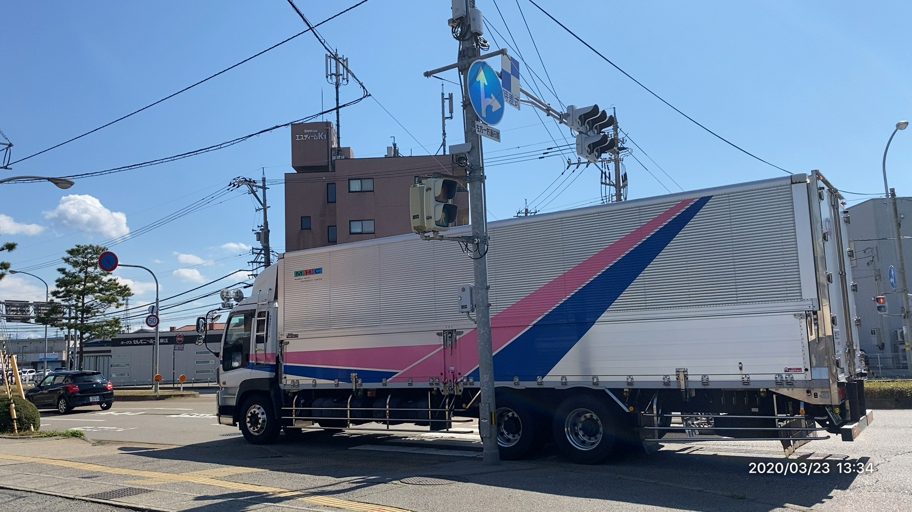

images/2020-03-23_133422＿金沢市に行ってきた写真・市場急配センターの大型ウィング車.jpg

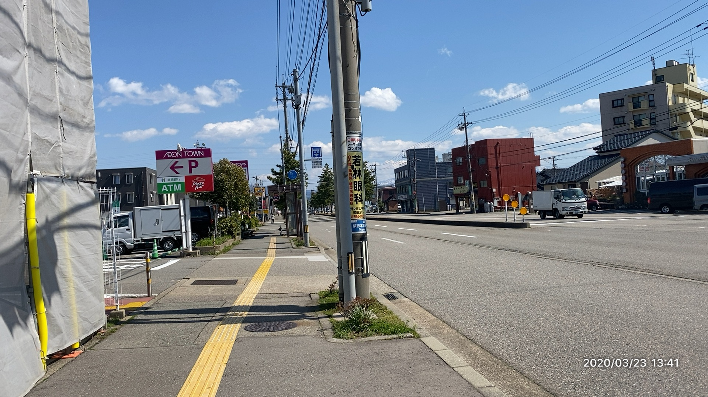

images/2020-03-23_134112＿金沢市に行ってきた写真・旧ジャスコ若宮店前の金石街道.jpg

images/2020-03-23_134134＿金沢市に行ってきた写真・平成4年当時、ジャスコ若宮店とレストラン十字があった場所.jpg

　Amazon Photosで写真を探しダウンロードしました。藤江陸橋の交差点付近で市場急配センターの大型ウィング車を見かけたのですが、その撮影時刻が13時34分22秒で、次の旧ジャスコ若宮店の手前の金石街道の写真は1時41分12秒になっています。

　歩いて5分以上掛かっているようですが、半分ぐらいの時間かと思っていました。

　2020年3月23日ですが、平成4年の1992年からは28年というのに、市場急配センターの大型ウィング車は、記憶とほとんど違いがないように見えます。

　キャビンと呼ばれたトラックの運転席ですが、平成3年に入ってからフルモデルチェンジをした日産ディーゼルの大型車のデザインに似て見えます。

ジャスコグリーンシティ金沢店
2002/08/18付北國新聞朝刊
２００３年２月にも閉店する見通しとなったジャスコグリーンシティ金沢店＝金沢市若宮町

- 北國新聞社データサービス | 空撮写真館 | 詳細説明 https://www.hokkokushimbun.com/aerophoto/photo_detail.php?ph_id=1096&sc_id=1&p_page=57&p_link=list

　平成14年8月18日付北國新聞朝刊とあります。2003年2月にも閉店する見通し、とあるので、私が平成14年11月25日頃に羽咋市での生活を始めた頃は、まだ建物がそのまま残されていたようです。

　小さい写真でわかりづらいですが、前の駐車場がずいぶん広いので、レストラン十字の建物はすでになく駐車場の一部になっていたようです。

　印象が強ければ、それだけ記憶に残りやすいという考えでいたのですが、被害者安藤文さんのフィルム貼りの後日に、金沢南郵便局のことがあったとすると、その認識を変える必要があるとも思えてきました。

　被害者安藤文さんが、後ろにも貼りたくないけ、後ろから丸見えっていややぞいね、とフィルム貼りの手伝いの数日後にいったことや、マジックペンのことは時間の流れとして記憶にあったのですが、離婚したことで保険証のことが郵便局の用事として強く結びつき、8月後半の出来事として記憶が変容していたようです。

❯ h3-mysql-regexp-html.py -s "パッソル"
Darwin
/Users/a66/mac-bin/h3-mysql-regexp-html.py -s "パッソル"

SELECT * FROM tw_hirono WHERE tweet REGEXP 'パッソル' ORDER BY date ASC;

2023-06-16_161828の実行記録

- （1／1／669647：検索：パッソル）ツイート：@kk_hirono（）2021-03-09 18:05:05
> 昭和57年の1月から3月頃になるのか，金沢市浅野本町のアパートに住んでいた頃は，パッソルというスクーターで，東山の銭湯に行っていたのですが，けっこう遠くて寒い思いをした記憶があります。だいたいの場所しかわからず，調べて確認をしておきたいと思います。 
ツイートのURL： https://twitter.com/kk_hirono/status/1369212820672278533

~/git/kk2023_06/Kindle/060/images main* 6s

　パッソルの検索結果は1件だけでしたが、目的とは違い内容です。これは10月に入ってからという記憶ですが、市場急配センターの事務所の前にパッソルのバイクが止めてあり、それにまたがっていたところ、2階から降りてきた被害者安藤文さんが、私に「どっか行くが？　どっか行くんやったら送ってあげるか？」と声を掛け、それと同時に2階の窓から被告発人池田宏美が顔出し、「だめよ、広野さん、乗ったら、どっか行くんやったら私の車使いまし」などとその場を遮るように横やりを入れたのです。

　タイミングが合いすぎたので、二階の窓から被告発人池田宏美が顔を出したのは偶然とも思えなかったのですが、実際に、自分の車の鍵を渡しに投げつけたかどうかは、現在はっきり思い出せません。少なくとも鍵を投げようとする素振りはありました。

❯ h3-mysql-regexp-html.py -s "私の車使いなさい"
Darwin
/Users/a66/mac-bin/h3-mysql-regexp-html.py -s "私の車使いなさい"

SELECT * FROM tw_hirono WHERE tweet REGEXP '私の車使いなさい' ORDER BY date ASC;

2023-06-16_162557の実行記録

- （1／3／669647：検索：私の車使いなさい）ツイート：@hirono_hideki（）2010-05-02 15:37:37
> 「どっか行くが、送っていってあげるか？」＝彼女 「ダメよ広野さん、乗ったらダメよ、どっか行きたいんやったら私の車使いなさい。」＝IHK 
ツイートのURL： https://twitter.com/hirono_hideki/status/13232651602

- （2／3／669647：検索：私の車使いなさい）ツイート：@kk_hirono（）2016-06-29 11:35:35
> するとすぐに二階の窓から被告訴人池田宏美の声が掛かり、「だめ。広野さん乗ったらだめよ。どっか行くんやったら、私の車使いなさい。」と車の鍵を投げつけようとしたのです。 
ツイートのURL： https://twitter.com/kk_hirono/status/747981729894268928

- （3／3／669647：検索：私の車使いなさい）ツイート：@kk_hirono（）2021-10-07 14:17:24
> 言葉
> 「どっか行くが、送っていってあげるか？」＝彼女
> 「ダメよ広野さん、乗ったらダメよ、どっか行きたいんやったら私の車使いなさい。」＝池田
ツイートのURL： https://twitter.com/kk_hirono/status/1445981565654167557

~/git/kk2023_06/Kindle/060/images main*

　コマンドの実行直後に、文字列を見て、正規表現を使う必要があるかと思ったのですが、意外に3件の該当がありました。思い出したのですが、パッソルではなく、ロードパルだったと思います。

❯ h3-mysql-regexp-html.py -s "ロードパル"      
Darwin
/Users/a66/mac-bin/h3-mysql-regexp-html.py -s "ロードパル"

SELECT * FROM tw_hirono WHERE tweet REGEXP 'ロードパル' ORDER BY date ASC;

2023-06-16_162912の実行記録

- （1／3／669647：検索：ロードパル）ツイート：@kk_hirono（）2015-07-27 15:18:18
> YMは七尾市の七尾工業高校に行っていたと思います。七尾市の高校であったことは間違いありません。毎週土曜日の夜になると宇出津に帰ってきていて、夜中にぶらぶらしていると、彼がロードパルのソフトバイクで走っていて、一緒になることがよくありました。 
ツイートのURL： https://twitter.com/kk_hirono/status/625550781907767296

- （2／3／669647：検索：ロードパル）ツイート：@kk_hirono（）2016-06-29 11:31:31
> その浅野さんがロードパルという昭和50年代の前半ころに流行した古いバイクに乗ってきていて、それを階段の前あたりにとめていました。 
ツイートのURL： https://twitter.com/kk_hirono/status/747980906506256384

- （3／3／669647：検索：ロードパル）ツイート：@kk_hirono（）2016-06-29 11:33:33
> 午前中だったように思いますが、私がそのロードパルにまたがっていると、2階の階段から降りてきた被害者AAさんが、「広野さん、どっか行くが？　どっか行くんやったら送ってあげるか？」と声を掛けてくれたのです。 
ツイートのURL： https://twitter.com/kk_hirono/status/747981316440788993

~/git/kk2023_06/Kindle/060/images main*
❯ 

　2016年6月29日のツイートには、浅野さんとしていますが、朝野だったのかもしれず、漢字がわからないことは、以前たびたび指摘をしてきた記憶があります。

　平成3年10月あるいは11月に入ってからという時期で、被害者安藤文さんの退社の時間に、外が暗くなっていたような記憶もあるので、あるいは12月以降という可能性もあるのですが、車でどこかに送ってくれと言った朝野さんに対し、被害者安藤文さんが激昂したように断ったことがありました。

　「なんで送らんなん」という言葉があったのか、現在の記憶は今ひとつはっきりしませんが、詰め寄るような迫力がありました。市場急配センターの2階事務所の階段付近でのことです。

 

〈〈〈  MacBook-Air VSCode： 2023-06-16 16:58:51〈〈〈

