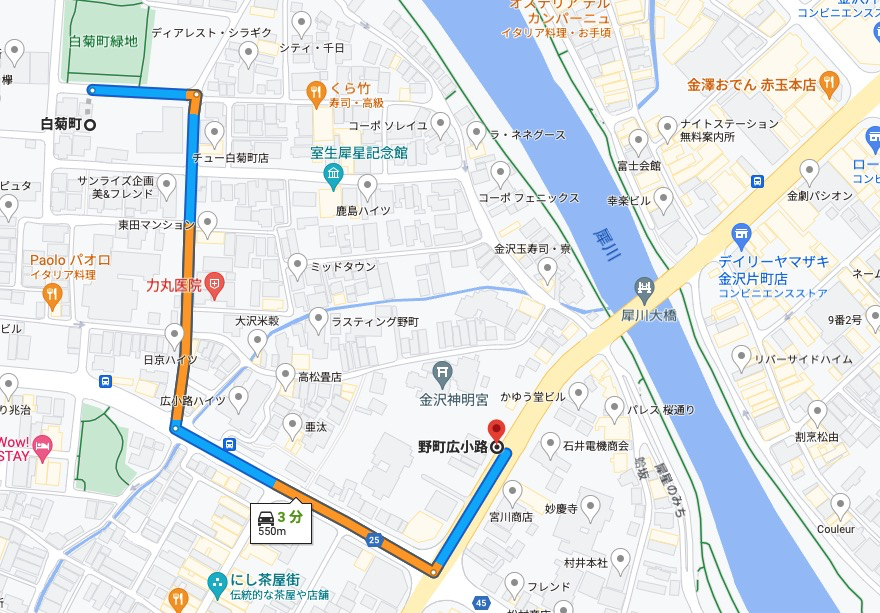
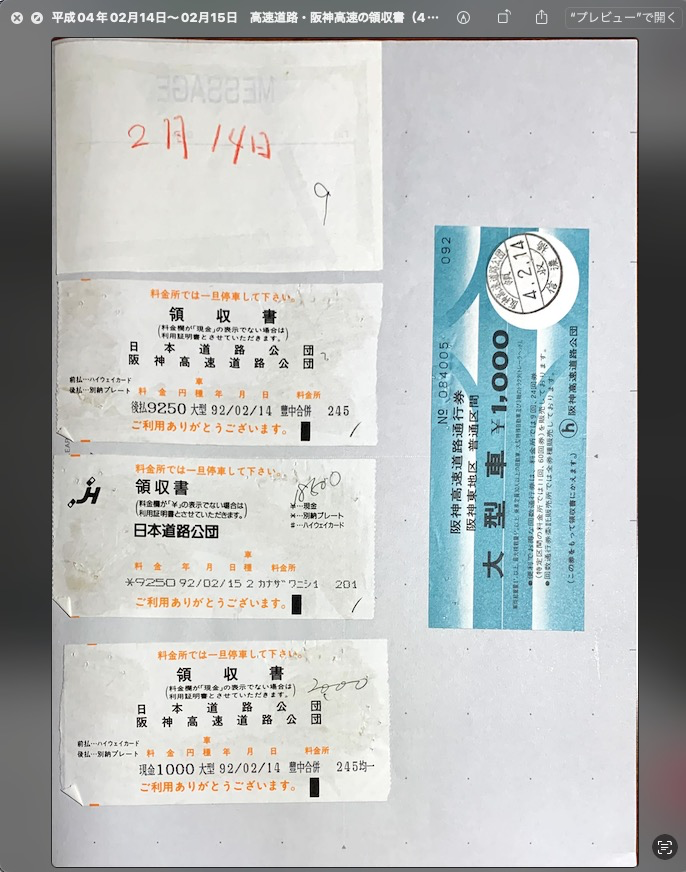
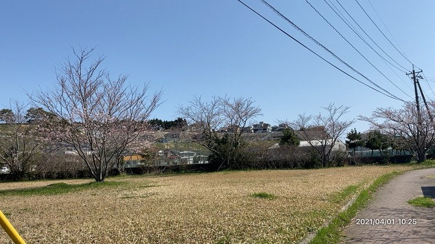

<div style="font-size:20pt; font-weight:bold">
<center>告発状</center>
</div>
<div style="font-size:12pt; margin-top:25px;">
〒920-0912金沢市大手町6番15号　　　金沢地方検察庁御中
</div>

<div style="font-size:10pt; margin-left: 280px; margin-top: 15px">
被告発人 金沢弁護士会所属    木梨松嗣弁護士<br />
被告発人 金沢弁護士会所属    岡田進弁護士<br />
被告発人 金沢弁護士会所属    長谷川紘之弁護士<br />
被告発人 金沢弁護士会所属    若杉幸平弁護士<br />
被告発人 元名古屋高裁金沢支部裁判長  小島裕史<br />
被告発人 元金沢地方裁判所裁判官    古川龍一<br />
被告発人 松平日出男<br />
被告発人 池田宏美<br />
被告発人 梅野博之<br />
被告発人 安田繁克<br />
被告発人 安田敏<br />
被告発人 東渡好信<br />
被告発人 多田敏明<br />
被告発人 浜口卓也<br />
被告発人 大網健二<br />
</div>
 
<div style="margin-top: 20px; font-size:10pt;">
 　被告発人らの所為は､市場急配ｾﾝﾀｰ（所在地: 〒920-0025 石川県金沢市駅西本町5丁目10−20）における殺人未遂の共謀共同正犯として法的評価すべきもの,また,弁護士､裁判官らの立場と職権で隠ぺいした幇助犯であると思料するので､犯情甚だ悪質につき､無期懲役刑として処罰することを求め､ここに告発に及びます｡
</div>
 
<div style="font-size:10pt; margin-left: 250px; margin-top: 20px">
被害者
</div>
<div style="font-size:10pt; margin-left: 280px; margin-top: 6px">
〒921-8035 石川県金沢市泉が丘二丁目一番三三号
</div>
<div style="font-size:10pt; margin-left: 490px; margin-top: 6px;">
安藤文
</div>
<div style="font-size:10pt; margin-left: 250px; margin-top: 1px">
告発人
</div>
<div style="font-size:10pt; margin-left: 280px; margin-top: 6px">
〒927-0431 石川県鳳珠郡能登町宇出津山分10-3
</div>
<div style="font-size:10pt; margin-left: 490px; margin-top: 6px;">
廣野秀樹
</div>
 
<div style="font-size:10pt; margin-left: 33px; margin-top: 30px">
令和2年○月○日
</div>
<div style="font-size:10pt;margin-top: 45px">
<center>記</center>

</div>
<div style="page-break-before:always"></div>

- [告発に至る経緯](#告発に至る経緯)
	- [これから始める告発状の作成及びnoteを使った記事としての部分公開](#これから始める告発状の作成及びnoteを使った記事としての部分公開)
		- [公開の方針を決めた6月17日、神戸のバス会社のネット記事](#公開の方針を決めた6月17日神戸のバス会社のネット記事)
		- [6月18日に見つけた軽井沢バス事故の郷原信郎弁護士と安部誠治関西大学名誉教授のYouTube動画](#6月18日に見つけた軽井沢バス事故の郷原信郎弁護士と安部誠治関西大学名誉教授のyoutube動画)
		- [6月19日の北陸中日新聞、総合1面の「同乗者の「共謀」どう判断」という記事と、社会1面の東海北陸道のトラック衝突2人死亡の記事](#6月19日の北陸中日新聞総合1面の同乗者の共謀どう判断という記事と社会1面の東海北陸道のトラック衝突2人死亡の記事)
- [告発の事実](#告発の事実)
	- [市場急配センターの業務日報・運行指示票・領収書の公開資料](#市場急配センターの業務日報運行指示票領収書の公開資料)
		- [057から060の項目一覧](#057から060の項目一覧)
		- [057から060のKindle電子辞書とペーパーバック本の販売](#057から060のkindle電子辞書とペーパーバック本の販売)
	- [被告発人の弁護士・裁判官らが作出した確定判決の破滅的効果](#被告発人の弁護士裁判官らが作出した確定判決の破滅的効果)
		- [078\_平成12年06月06日付　山口治夫弁護士　上告趣意書](#078_平成12年06月06日付山口治夫弁護士上告趣意書)
	- [2023年06月24日の朝に知った11年間岡田進法律事務所に勤務したという中西祐一弁護士、昨日、増泉の危険運転致死事件の弁護人と知る](#2023年06月24日の朝に知った11年間岡田進法律事務所に勤務したという中西祐一弁護士昨日増泉の危険運転致死事件の弁護人と知る)
		- [石川テレビのYouTubeニュース動画](#石川テレビのyoutubeニュース動画)
		- [10，807文字という北國新聞の判決要旨](#10807文字という北國新聞の判決要旨)
		- [昨日、2023年6月23日16時17分頃に北國新聞で知った金沢・増泉の危険運転致死の男性側弁護人、中西祐一弁護士](#昨日2023年6月23日16時17分頃に北國新聞で知った金沢増泉の危険運転致死の男性側弁護人中西祐一弁護士)
		- [内田清隆法律事務所の永來宏隆と珠洲市市立図書館](#内田清隆法律事務所の永來宏隆と珠洲市市立図書館)
		- [ネットで探しても見当たらない中西祐一弁護士が弁護人という北國新聞の記事](#ネットで探しても見当たらない中西祐一弁護士が弁護人という北國新聞の記事)
	- [被告発人岡田進弁護士の刑事責任との共通点を感じる金沢・増泉の危険運転致死事件](#被告発人岡田進弁護士の刑事責任との共通点を感じる金沢増泉の危険運転致死事件)
		- [平成4年の国選刑事弁護人](#平成4年の国選刑事弁護人)
		- [金沢・増泉の危険運転致死事件に共通する共謀というテーマ](#金沢増泉の危険運転致死事件に共通する共謀というテーマ)
		- [30年以上放置した金沢弁護士会の責任という位置づけ](#30年以上放置した金沢弁護士会の責任という位置づけ)
	- [市場急配センターにおける、被害者安藤文さんに対する殺人未遂の事実（01）](#市場急配センターにおける被害者安藤文さんに対する殺人未遂の事実01)
		- [平成4年2月14日の被告発人安田敏の言動](#平成4年2月14日の被告発人安田敏の言動)
- [再審請求と刑事告発の日々](#再審請求と刑事告発の日々)
	- [2023年6月21日（水曜日）](#2023年6月21日水曜日)
		- [カルロス・ゴーン氏が名誉毀損で10億ドル超の訴訟を起こしたというニュース](#カルロスゴーン氏が名誉毀損で10億ドル超の訴訟を起こしたというニュース)
		- [アルトサックスが出てくる晩餐会のような郷原信郎弁護士のYouTube動画、『歪んだ法に壊される日本』『「単純化」という病』出版記念](#アルトサックスが出てくる晩餐会のような郷原信郎弁護士のyoutube動画歪んだ法に壊される日本単純化という病出版記念)
		- [「踊り字」の発見で思い出す「ヒメオドリコソウ」という花の近年の発見](#踊り字の発見で思い出すヒメオドリコソウという花の近年の発見)
		- [本日2023年6月21日の15時00分、裁判員裁判、金沢地裁の判決](#本日2023年6月21日の15時00分裁判員裁判金沢地裁の判決)
	- [2016年6月22日（木曜日）](#2016年6月22日木曜日)
		- [「第一に、刑事被告人も障害者も、自分たちとは別の珍しい存在ですお。」という深澤諭史弁護士の長文でマジリプ](#第一に刑事被告人も障害者も自分たちとは別の珍しい存在ですおという深澤諭史弁護士の長文でマジリプ)
		- [「運転していなくても、一体となって危険運転行為をした」と共謀が成立するとした。」という読売新聞の記事](#運転していなくても一体となって危険運転行為をしたと共謀が成立するとしたという読売新聞の記事)
- [参考資料](#参考資料)
	- [弁護士やジャーナリストの反応が全く確認されない金沢地裁の危険運転致死で共謀共同正犯の成立を認めた6月21日の判決（裁判員裁判）](#弁護士やジャーナリストの反応が全く確認されない金沢地裁の危険運転致死で共謀共同正犯の成立を認めた6月21日の判決裁判員裁判)
		- [Twitterタイムライン](#twitterタイムライン)
		- [「赤信号　共謀」でのTwitter検索](#赤信号共謀でのtwitter検索)
		- [「赤信号　共謀」のGoogleニュースの検索](#赤信号共謀のgoogleニュースの検索)

<div style="page-break-before:always"></div>

# 告発に至る経緯
## これから始める告発状の作成及びnoteを使った記事としての部分公開
### 公開の方針を決めた6月17日、神戸のバス会社のネット記事

<div style="font-size:9pt; color:crimson;">
〉〉〉 MacBook Emacs： 2023/06/20 08:28:03 〉〉〉
</div>
<br />


<div class="img_name">
images/01/2023-06-17_171955＿.JPG

</div>


<div class="img_name">
images/01/2023-06-17_172331＿.JPG

</div>


<div class="img_name">
images/01/2023-06-17_175210＿.JPG

</div>


<div class="img_name">
images/01/2023-06-17_180246＿.JPG

</div>


<div class="img_name">
images/01/2023-06-17_180251＿.JPG

</div>


<div class="img_name">
images/01/2023-06-17_185953＿.JPG

</div>


<div class="img_name">
images/01/2023-06-17_193732＿.JPG

</div>

　写真の日付で確認すると6月17日でした。今日は20日の火曜日ですが17日が土曜日だったことも思い出しました。

　この日はけっこう暑かったのですが、土日なので17時で図書館が閉館となり、18時まで開いている図書館の前のテーブルのある集合スペースは風が入らず、外に出てバス停の裏にある長椅子に移動しました。

　風通しがよく心地よかったのですが、ネットで大崎事件の最近の報道など調べていたところ、ニュースサイトの記事の一覧に気になる見出しの記事がありました。

　次に、Twilogから当日6月17日のツイートをいくつか引用掲載でご紹介します。今後の方向性を決めるような発見がありました。

<div style="font-size:9pt; color:crimson;">
〈〈〈 2023/06/20 08:49:15 MacBook Emacs： 〈〈〈 
<br /><br />
</div><div style="page-break-before:always"></div>

<div style="font-size:9pt; color:crimson;">
〉〉〉 MacBook-Air VSCode： 2023-06-20 08:57:57 〉〉〉
</div>
<br />

<div class="d2">
刑事告発・非常上告＼金沢地方検察庁御中さんはTwitterを使っています： 「取り調べ同席の「立ち会い弁護士」を経済的に支援…福岡県弁護士会、冤罪防止へ制度検討（読売新聞オンライン） - Yahoo!ニュース https：//t.co/tZOEcp1K6q 日弁連の「取調べ立会い実現委員会」委員長らを招いた研修会を福岡市で開き、九州の弁護士約45人が出席して議論を深めた。PTの野田幸言弁護士」 / Twitter https://twitter.com/hirono_hideki/status/1669898804466958336
</div>
<br />

<div class="d2">
刑事告発・非常上告＼金沢地方検察庁御中さんはTwitterを使っています： 「RT @kamo629782： 日弁連の定期総会において、たった今、再審法改正を求める決議が圧倒的多数で可決されました❗」 / Twitter https://twitter.com/hirono_hideki/status/1669899340402556928
</div>

<br />
<div class="d2">
刑事告発・非常上告＼金沢地方検察庁御中さんはTwitterを使っています： 「記録の廃棄「率直に反省」　最高裁長官、全国会議で ｜ 共同通信 https：//t.co/xqyJ2T6999 2023/06/14 あいさつする最高裁の戸倉三郎長官＝14日午前、最高裁」 / Twitter https://twitter.com/hirono_hideki/status/1669903516863967232
</div>

<br />
<div class="d2">
刑事告発・非常上告＼金沢地方検察庁御中さんはTwitterを使っています： 「ポッター - Wikipedia https：//t.co/TyxukI8eJD ポッター、ポター（Potter）は、英語圏の姓。陶工（英： potter）に由来する。」 / Twitter https://twitter.com/hirono_hideki/status/1669914451901050881
</div>

<br />
<div class="d2">
刑事告発・非常上告＼金沢地方検察庁御中さんはTwitterを使っています： 「https：//t.co/Z63EwYnsoJ： 池袋母子死亡事故　「約束」から３年を観る | Prime Video https：//t.co/VjhE3WJrQ0」 / Twitter https://twitter.com/hirono_hideki/status/1669923351178153985
</div>

<br />
<div class="d2">
刑事告発・非常上告＼金沢地方検察庁御中さんはTwitterを使っています： 「不同意性交等（旧強制性交・強制わいせつ）罪改正をふまえた男女交際における実践的心がけ | 福岡で弁護士相談なら「向原総合法律事務所」（知的財産、事業再生、M&amp;A、借金・債務整理など） https：//t.co/9mdom0BQyo」 / Twitter https://twitter.com/hirono_hideki/status/1669934064126824449
</div>

<br />
<div class="d2">
刑事告発・非常上告＼金沢地方検察庁御中さんはTwitterを使っています： 「JSONを使いこなすためにおすすめなViewer・Editor厳選6選!! | 侍エンジニアブログ https：//t.co/apHqcGm80e」 / Twitter https://twitter.com/hirono_hideki/status/1669947166041972737
</div>

<br />
<div class="d2">
刑事告発・非常上告＼金沢地方検察庁御中さんはTwitterを使っています： 「RT @masaki_kito： 精神病理学者でもある野田正彰さん（79）の言葉は重い＞高知市の平和資料館・草の家で統一教会の洗脳の手口をテーマに講演「1980年代前半ごろに信者の治療を担当したがここまで人を操ることができるのかと驚いた。統一教会は戦術を立てて人を落としている」…」 / Twitter https://twitter.com/hirono_hideki/status/1669947271776206849
</div>

<div class="d2">
刑事告発・非常上告＼金沢地方検察庁御中さんはTwitterを使っています： 「第二城都橋 - Google 検索 https：//t.co/CbsiTshgJy」 / Twitter https://twitter.com/hirono_hideki/status/1669958419745488899
</div>

<br />
<div class="d2">
刑事告発・非常上告＼金沢地方検察庁御中さんはTwitterを使っています： 「RT @asahicom： 強制性交罪と準強制性交罪は統合され、名称が「不同意性交罪」に。 被害者の抵抗が「著しく困難」でなければ成立しないとされる現行法が見直され 「暴行・脅迫」に加えて「アルコール・薬物の影響」「恐怖・驚愕」「地位利用」など8項目が成立要件として例示されまし…」 / Twitter https://twitter.com/hirono_hideki/status/1669980456807464960
</div>

<br />
<div class="d2">
刑事告発・非常上告＼金沢地方検察庁御中さんはTwitterを使っています： 「RT @harukoi2020： 本日、刑法・性犯罪法改正法律案が参議院本会議で可決成立しました。 公式HPにて、「刑法・性犯罪法改正法律案成立を受けてのSpring見解」を発表しました。 ともに声をあげてきた性暴力被害当事者のみなさま、支援をしていただいたみなさまに、深く…」 / Twitter https://twitter.com/hirono_hideki/status/1669980655160262656
</div>

<br />
<div class="d2">
刑事告発・非常上告＼金沢地方検察庁御中さんはTwitterを使っています： 「大崎事件　再審制度の改正は急務だ｜熊本日日新聞社 https：//t.co/qMkTPq94gz 熊本日日新聞 | 2023年6月6日 05：00」 / Twitter https://twitter.com/hirono_hideki/status/1669982500305915904
</div>

<br />
<div class="d2">
刑事告発・非常上告＼金沢地方検察庁御中さんはTwitterを使っています： 「日本弁護士連合会：「大崎事件」再審請求即時抗告棄却決定に関する会長声明 https：//t.co/Tbgj7KhLTU ２０２３年（令和５年）６月５日 日本弁護士連合会 会長　小林　元治」 / Twitter https://twitter.com/hirono_hideki/status/1669983412881620993
</div>

<br />
<div class="d2">
刑事告発・非常上告＼金沢地方検察庁御中さんはTwitterを使っています： 「運転手の95%に事故歴、パワハラ横行…神戸市バスに巣くう闇 - 産経ニュース https：//t.co/Za9DpcrXd9 2023/6/17 09：00弓場 珠希福井 亜加梨 地方 近畿 兵庫 産経WEST できごと 社会 事故・火災」 / Twitter https://twitter.com/hirono_hideki/status/1669989717478379520
</div>

<br />
　TwitterAPIとは違いツイートの日時を取得できないのが不便ですが、神戸市バスの記事のツイートは、6月17日午後5時45分となっています。

- 刑事告発・非常上告＼金沢地方検察庁御中(@hirono_hideki)/「池袋母子死亡事故 「約束」から３年を観る」の検索結果 - Twilog https://twilog.togetter.com/hirono_hideki/search?word=%E6%B1%A0%E8%A2%8B%E6%AF%8D%E5%AD%90%E6%AD%BB%E4%BA%A1%E4%BA%8B%E6%95%85+%E3%80%8C%E7%B4%84%E6%9D%9F%E3%80%8D%E3%81%8B%E3%82%89%EF%BC%93%E5%B9%B4%E3%82%92%E8%A6%B3%E3%82%8B&ao=a&order=allasc

　検索で確認したのですが、6月17日の13時22分07秒が最初のツイートで、翌18日に21時21分11秒と22時59分42秒の2つのツイートがあって、2つ目が視聴終了とあります。

　午前中に視聴を終えたという記憶だったのですが、それというのも前の夜に視聴をしながら寝てしまい、起きてから続きの視聴をしたのですが、どこまで視聴していたのかわからなくなっていました。

　結局、寝る前に視聴していたと確認出来たのは、飯塚受刑者が一度だけだったというインタビューを受けた場面でした。

　今、動画を再生して確認すると36分05秒で、飯塚受刑者のインタビューから次の場面に切り替わっています。画面に2019年11月12日という日付が出ています。「0:41:14」で41分14秒が再生時間のようですが、プログレスバーの進捗が45％ぐらいになっています。

　映画は滅多に見ないので、日時を後日確認出来るようにパソコンの画面をスマホで撮影することが多いのですが、それらしい写真は見当たりませんでした。

/Users/a66/photos/2023/2023-06/2023-06-18_135602＿郷原信郎弁護士と安部誠治関西大学名誉教授のYouTube動画.JPG

　どちらが先だったのかわからなくなっていたのですが、あるいは同時進行で中断しながら視聴していたのが上記の郷原信郎弁護士のYouTube動画のパソコンの画面の撮影写真になります。

　17日は、不同意性交罪の成立という新聞各社の報道を確認する目的で図書館に行きました。各社、報道が小さく感じられましたが、北國新聞と北陸中日新聞は、総合1面、社会1面、社会2面に、それらしい記事は見当たりませんでした。

<br />
<div style="font-size:9pt; color:crimson;">
〈〈〈  MacBook-Air VSCode： 2023-06-20 10:03:26〈〈〈
</div>
<div style="page-break-before:always"></div>

### 6月18日に見つけた軽井沢バス事故の郷原信郎弁護士と安部誠治関西大学名誉教授のYouTube動画

<br />
<div style="font-size:9pt; color:crimson;">
〉〉〉 MacBook-Air VSCode： 2023-06-20 10:16:52 〉〉〉
</div>
<br />

- 令和5年6月の告発状：公開の方針を決めた6月17日、神戸のバス会社のネット記事｜市場急配センターの金沢弁護士会事件＼金沢地方検察庁御中 https://note.com/hirono2020kk/n/n506d535f127d

　初めての試みになりますが、この作成中の告発状の一部を記事としてnoteに投稿しました。それも有料記事になります。これは後ほど別にご説明をさせていただきます。

- 刑事告発・非常上告＼金沢地方検察庁御中(@hirono_hideki)/「郷原信郎」の検索結果 - Twilog https://twilog.togetter.com/hirono_hideki/search?word=%E9%83%B7%E5%8E%9F%E4%BF%A1%E9%83%8E&ao=a

　Twilogの検索ですが、軽井沢バス事故のYouTube動画として最初に出てきたのが、次の6月18日13時01分21秒のツイートになります。

<div class="d2">
刑事告発・非常上告＼金沢地方検察庁御中さんはTwitterを使っています： 「【安部教授と語る「軽井沢バス事故一審判決」何を教訓とすべきなのか】郷原信郎の「日本の権力を斬る！」＃250 - YouTube https：//t.co/kuXREDRm0q 3,757 回視聴 2023/06/13 元特捜検事の郷原信郎が、日本の権力を斬って、斬って、斬りまくります！ 郷原信郎の「日本の権力を斬る！」第２５０回」 / Twitter https://twitter.com/hirono_hideki/status/1670280514161491969
</div>

- 刑事告発・非常上告＼金沢地方検察庁御中(@hirono_hideki)/「安部教授と語る「軽井沢バス事故一審判決」何を教訓とすべきなのか」の検索結果 - Twilog https://twilog.togetter.com/hirono_hideki/search?word=%E5%AE%89%E9%83%A8%E6%95%99%E6%8E%88%E3%81%A8%E8%AA%9E%E3%82%8B%E3%80%8C%E8%BB%BD%E4%BA%95%E6%B2%A2%E3%83%90%E3%82%B9%E4%BA%8B%E6%95%85%E4%B8%80%E5%AF%A9%E5%88%A4%E6%B1%BA%E3%80%8D%E4%BD%95%E3%82%92%E6%95%99%E8%A8%93%E3%81%A8%E3%81%99%E3%81%B9%E3%81%8D%E3%81%AA%E3%81%AE%E3%81%8B&ao=a

　特定しやすいキーワードでTwilogの検索をやり直しましたが、一番新しいのが6月18日20時16分45秒のツイートで、「再生時間53分17秒の視聴終了。何度も中断。」とあります。

　どうもYouTube動画を見つけた当日のうちに視聴を終えていたようです。

　この動画の内容についても、「告発の事実」のなかで、取り上げる予定です。

　この安部誠治関西大学名誉教授も図書館の新聞がきっかけでお名前を知ったのですが、郷原信郎弁護士のYouTube動画でみるとは、全く予想外でした。

　次は、Gitのリポジトリ内での検索になりますが、添付の写真でデータサイズが大きくなりすぎたので、新規にリポジトリを作成しています。

```bash
~/git/kk2023_06/Kindle main* ⇣
❯ grep 安部誠治 **/*.md   
061/さらば弁護士鉄道061／令和5年6月の告発状.md:/Users/a66/photos/2023/2023-06/2023-06-18_135602＿郷原信郎弁護士と安部誠治関西大学名誉教授のYouTube動画.JPG
061/さらば弁護士鉄道061／令和5年6月の告発状.md:### 6月18日に見つけた軽井沢バス事故の郷原信郎弁護士と安部誠治関西大学名誉教授のYouTube動画
061/さらば弁護士鉄道061／令和5年6月の告発状.md:　この安部誠治関西大学名誉教授も図書館の新聞がきっかけでお名前を知ったのですが、郷原信郎弁護士のYouTube動画でみるとは、全く予想外でした。

~/git/kk2023_06/Kindle main* ⇣
❯ cd ../../kk2023_05

~/git/kk2023_05 main*
❯ grep 安部誠治 **/*.md
Kindle/058/さらば弁護士鉄道058／改竄の痕跡が多数ある市場急配センターの業務日報（01）.md:    - [関西大学のホームページにある安部誠治教授の教員紹介、公益事業論とも](#関西大学のホームページにある安部誠治教授の教員紹介公益事業論とも)
Kindle/058/さらば弁護士鉄道058／改竄の痕跡が多数ある市場急配センターの業務日報（01）.md:- 軽井沢スキーバス事故　安部誠治 - Google 検索 https://www.google.com/search?q=%E8%BB%BD%E4%BA%95%E6%B2%A2%E3%82%B9%E3%82%AD%E3%83%BC%E3%83%90%E3%82%B9%E4%BA%8B%E6%95%85%E3%80%80%E5%AE%89%E9%83%A8%E8%AA%A0%E6%B2%BB&rlz=1C5CHFA_enJP993JP993&biw=1278&bih=1080&tbm=nws&sxsrf=APwXEdeBsCDQ3-VEw8F75vyoQCnR37n-vg%3A1686368070002&ei=Re-DZLXgPITihwO00auADA&ved=0ahUKEwj1lpfO4rf_AhUE8WEKHbToCsAQ4dUDCA0&uact=5&oq=%E8%BB%BD%E4%BA%95%E6%B2%A2%E3%82%B9%E3%82%AD%E3%83%BC%E3%83%90%E3%82%B9%E4%BA%8B%E6%95%85%E3%80%80%E5%AE%89%E9%83%A8%E8%AA%A0%E6%B2%BB&gs_lcp=Cgxnd3Mtd2l6LW5ld3MQAzoFCAAQogRQww5Yg0tg_FRoAXAAeACAAZ0BiAHkCJIBAzEuOJgBAKABAcABAQ&sclient=gws-wiz-news
Kindle/058/さらば弁護士鉄道058／改竄の痕跡が多数ある市場急配センターの業務日報（01）.md:関西大の安部誠治名誉教授（交通政策論）は「事業者の実態把握は難しく、まだ悪質業者が見逃されている疑いがある」と指摘。コロナ禍以降、貸し切りバス需要の回復などが見込まれることを踏まえ、「原点に立ち返り、仕切り直すつもりで対策に取り組むことが重要だ」と話した。　
Kindle/058/さらば弁護士鉄道058／改竄の痕跡が多数ある市場急配センターの業務日報（01）.md:- 軽井沢スキーバス事故　安部誠治 - Google 検索 https://www.google.com/search?q=%E8%BB%BD%E4%BA%95%E6%B2%A2%E3%82%B9%E3%82%AD%E3%83%BC%E3%83%90%E3%82%B9%E4%BA%8B%E6%95%85%E3%80%80%E5%AE%89%E9%83%A8%E8%AA%A0%E6%B2%BB&rlz=1C5CHFA_enJP993JP993&sxsrf=APwXEdfZQZQ2FFE6UTu1nlPDQKFz9jx4Kg:1686368115106&source=lnms&sa=X&ved=2ahUKEwiomtjj4rf_AhVXQt4KHaIUBr4Q0pQJegQIBhAC&biw=1278&bih=1080&dpr=1
Kindle/058/さらば弁護士鉄道058／改竄の痕跡が多数ある市場急配センターの業務日報（01）.md:　国土交通省のPDFファイルには、数えて14人の名前があり、筆頭ともいえる最初にある名前が、「安部誠治　関西大学社会安全学部教授」とあります。
Kindle/058/さらば弁護士鉄道058／改竄の痕跡が多数ある市場急配センターの業務日報（01）.md:　記事の公開部分には見当たらないですが、Googleで「軽井沢スキーバス事故　安部誠治」の検索結果の4番目になります。
Kindle/058/さらば弁護士鉄道058／改竄の痕跡が多数ある市場急配センターの業務日報（01）.md:### 関西大学のホームページにある安部誠治教授の教員紹介、公益事業論とも
Kindle/058/さらば弁護士鉄道058／改竄の痕跡が多数ある市場急配センターの業務日報（01）.md:　安部誠治教授の略歴は最初が昭和51年3月で、「大阪外国語大学フランス語学科　卒業（文学士）」となっていますが、自分はその年の4月に宇出津小学校の6年生に進級しています。
Kindle/058/さらば弁護士鉄道058／改竄の痕跡が多数ある市場急配センターの業務日報（01）.md:- 安部誠治さんに聞く(あべ・せいじ 関西大学教授) 鉄道の役割と安全を考える | CiNii Research https://cir.nii.ac.jp/crid/1523669555608440704

~/git/kk2023_05 main*
❯ 

```

　確認するとkk2023_05のリポジトリはデータサイズが1．3Gになっていました。

　kk2023_05のリポジトリは今のところ37Mですが、次のコマンドで写真や画像のファイルサイズを縮小するようにしています。

```bash
mogrify -resize 33% ./*
```

- 刑事告発・非常上告＼金沢地方検察庁御中(@hirono_hideki)/「バス」の検索結果 - Twilog https://twilog.togetter.com/hirono_hideki/search?word=%E3%83%90%E3%82%B9&ao=a

　日付が変わっておらず同じ6月20日で01時28分27秒というツイートですが、衝撃の映像を見たニュース記事になります。URLがYouTubeですが、サムネイルの画像にプライムオンラインとあり、多数の豚が道路上に立ち止まっているらしいと気がつきました。

　その1つ前のツイートが、6月18日20時28分35秒で、「組織罰を実現する会」とあります。

<div class="d2">
刑事告発・非常上告＼金沢地方検察庁御中さんはTwitterを使っています： 「(2) 大事故の瞬間映像....トラックがバスに突き刺さる 5人死亡 12人重軽傷　北海道・八雲町 - YouTube https：//t.co/TFJXTYutDr」 / Twitter https://twitter.com/hirono_hideki/status/1670830917215199232
</div>

<br />
<div class="d2">
刑事告発・非常上告＼金沢地方検察庁御中さんはTwitterを使っています： 「軽井沢スキーバス転落事故の判決に寄せて – 組織罰を実現する会 https：//t.co/GHOcfhpyk9 さらに、実刑に処する量刑の判断の中で「安全管理を改めようとせず、利益を優先して輸送の安全確保を軽視し続けた」ことを指摘し、 組織責任の問題であることを重視しました。」 / Twitter https://twitter.com/hirono_hideki/status/1670393064236666880
</div>

<br />

　プライムオンラインの動画ニュースは、Googleニュースで見かけたものですが、事故の発生から間もない時間に、Twitterのトレンドでニュースはみていました。「少なくとも2人が心肺停止」ということでしたが、そのあとは関連ニュースを見かけず、Googleのニュースの見出しで5人死亡と知ったことになります。

　郷原信郎弁護士のTwitterタイムラインを見たところ、今のところ北海道のバス事故については、ツイートが見当たりませんでしたが、次のツイートの内容がプチな発見です。受け取り方次第ではかなり大きいかもしれないです。

<div class="d2">
郷原信郎【長いものには巻かれない・権力と戦う弁護士】さんはTwitterを使っています： 「こういうことを言う人には、是非私の新著【単純化という病　安倍政治が日本に残したもの】を読んでもらいたい。」 / Twitter https://twitter.com/nobuogohara/status/1670961735866667008
</div>

- トラックが回避行動せず、はみ出しか　北海道・5人死亡バス事故 | 毎日新聞 https://mainichi.jp/articles/20230619/k00/00m/040/216000c?inb=ys

　昨日のニュースでは、養豚のトラックの会社が青森県の住所になっていましたが、上記の記事に「道南事業所（八雲町）」とあります。昨日は謝罪する会社の代表者の映像を見ていましたが、今のところ会社の運行管理は問題にされていなような様子です。

　弁護士が動いているのかもしれないですが、この違いが気になるところです。

　昨日のニュースでは、トラックの運転手の居眠りと、体調不良で突然意識を失った可能性が指摘されていました。情報は見ていないですが、事前にふらつくような様子があれば、居眠り運転の可能性が高まるのかもしれません。

　過去には持病が問題にされた事故がありました。1つは大型クレーン車で、1つは京都市内の呉服店の若い男性の事故でした。どちらも厳しい責任追及をされていましたが、京都の呉服店の方は、女性社長の責任が問われ、倒産したようなニュースを見た記憶があります。

<div class="d3">

和装市場低迷の影響を受けて業績は大きく後退していた中、2012年4月に京都・祇園で、同社従業員運転の営業車が歩行者らをはねて通行人7名が死亡、12名が重軽傷を負った事故が発生した。

2013年には中西良子社長の管理責任が問われ、書類送検されたなど信用面が大きく後退。その後は小売業から撤退しスリム化を図っていたが、2015年1月期の売上高は約2億3000万円までに落ち込んだ。資金繰りが逼迫し事業継続を断念し、今回の措置となった。


19名死傷の祇園暴走事故、運転手勤務の藍染販売会社が自己破産申請へ | レスポンス（Response.jp） https://response.jp/article/2016/01/14/267723.html

</div>

　京都の祇園の事故というのは記憶になかったですが、通行人7人の死亡というのも多く感じました。余り鮮明な映像ではなかったですが、路地を暴走し衝突するまでの映像をテレビでみた記憶があります。

<div class="d3">

平成２３年４月１８日午前７時４５分ごろ、栃木県鹿沼市の国道で、１２トンのクレーン車が小学生の集団登校の列に突っ込んだ。９～１１歳の小学生６人が死亡した。

翌月、当時２６歳だった運転手の男が起訴された。罪名は法定刑の上限が懲役７年の自動車運転過失致死罪。「人の命がそんなに軽く扱われてしまうのか」。


【再考・犯罪被害者】小学生６人死亡で懲役７年　病気隠し運転、法律の想定外 - 産経ニュース https://www.sankei.com/article/20230128-L5LQGOWIDFLBZKGJ3G4QTRE62Q/

</div>

　こちらも死亡した被害者が6人と多いですが、京都の祇園の事故と同じく、不思議なほど被害者の数の多さは記憶になく、昨夜、北海道のバス事故の死者が5人というニュース記事を見て、ずいぶん多く感じたのですが、それよりさらに多い数でした。

　栃木県鹿沼市は昭和60年頃、スタイロフォームを岡山県笠岡市から運んだ記憶がありますが、その工場のような大きな建物しか記憶にありません。

- 栃木のクレーン車事故「てんかん薬飲み忘れ」　持病申告せず - 日本経済新聞 https://www.nikkei.com/article/DGXNASDG21033_R20C11A4CC1000/

<div class="d3">

京都祇園軽ワゴン車暴走事故（きょうとぎおん けいワゴンしゃぼうそうじこ）とは、2012年4月12日に京都府京都市東山区祇園で、軽ワゴン車（ホンダ・バモスホビオ［1］）を運転していた運転手の男性が、運転中に暴走事故を起こし、運転者を含む8名が死亡、12人が重軽傷を負った交通事故。

事故原因は最終的に運転手の持病のてんかん発作とされた［2］。

事故の概要［編集］
事故までの経緯［編集］
運転手は2003年にバイクで単独交通事故を起こし脳挫傷を受傷した。その後遺症としててんかん発作が起こるようになったが、病状を申告せずに運転免許を更新していた［3］［4］。運転手は2012年になって2度意識消失発作を起こしており、家族と医師は運転をしないように忠告していた。


京都祇園軽ワゴン車暴走事故 - Wikipedia https://ja.wikipedia.org/wiki/%E4%BA%AC%E9%83%BD%E7%A5%87%E5%9C%92%E8%BB%BD%E3%83%AF%E3%82%B4%E3%83%B3%E8%BB%8A%E6%9A%B4%E8%B5%B0%E4%BA%8B%E6%95%85

</div>

　栃木県鹿沼市の大型クレーン車の事故は、てんかんとはっきり記憶にあったのですが、この京都祇園の事故は、てんかんとは違う病名だったのか記憶がはっきりせずにいました。バイクの事故での脳挫傷でてんかんの発作が起きるようになったという部分は前に読んだ記憶があります。

<div class="d3">

事故原因［編集］
本件に関して、単純なてんかん発作による意識消失を原因とするには、最初のタクシーとの追突から電柱に衝突するまでは360mの距離があり［6］、道幅も非常に狭い上に通行中の車両（人力車を含め14台以上）には軽い接触をしたのみで走り抜けているなど、不可解な点が見られた。このため、警察当局も当初運転手がタクシーに追突した後に逃走を図った末の重大事故の可能性を疑っていた［7］。

しかし最終的に京都府警は、最初のタクシーとの衝突によって精神的に動転し、大和大路通を逃走中にてんかん発作が起き、暴走に至ったと判断し、運転手を容疑者死亡のまま検察へ書類送致した［8］。

なおこの事故の3日前に鹿沼市クレーン車暴走事故の遺族が危険運転致死傷罪の改正の署名を法務省に提出しており、その矢先に発生した事故であった。

刑事処理［編集］
2013年8月8日、京都地方検察庁は運転手を容疑者死亡により不起訴とし、運転手の勤務先の社長も運転手の持病を認識していなかったため不起訴処分とする方針を固めた［9］。


京都祇園軽ワゴン車暴走事故 - Wikipedia https://ja.wikipedia.org/wiki/%E4%BA%AC%E9%83%BD%E7%A5%87%E5%9C%92%E8%BB%BD%E3%83%AF%E3%82%B4%E3%83%B3%E8%BB%8A%E6%9A%B4%E8%B5%B0%E4%BA%8B%E6%95%85

</div>

　6月18日というのは一昨日ですが、郷原信郎弁護士と安部誠治関西大学名誉教授のYouTube動画を視聴しながら、この栃木県鹿沼市と京都祇園の死亡事故のことを思い出していました。

<br />
<div style="font-size:9pt; color:crimson;">
〈〈〈  MacBook-Air VSCode： 2023-06-20 12:17:23〈〈〈
</div>
<div style="page-break-before:always"></div>

### 6月19日の北陸中日新聞、総合1面の「同乗者の「共謀」どう判断」という記事と、社会1面の東海北陸道のトラック衝突2人死亡の記事

<br />
<div style="font-size:9pt; color:crimson;">
〉〉〉 MacBook-Air VSCode： 2023-06-20 15:56:34 〉〉〉
</div>
<br />

　13時頃に図書館に着いたかと思いますが、北海道の高速バス事故の記事の内容が続報のようだったので、前日の新聞を調べようとしました。

　北國新聞は、白山の神社の鳥居が左右一面のようになっていて、下にある北陸中日新聞の方を先に見たのですが、総合1面の左手に、「同乗者の「共謀」どう判断」、「増泉の信号無視21日判決」、「運転手より重い10年求刑　指示の有無　関係性に焦点」という見出しが並ぶ記事が目に入りました。

　社会1面を開くと、これも左手に、「トラック衝突2人死亡　南砺　東海北陸道　はみ出しか」という記事があり、その下に「北海道　高速バス事故5人死亡」の記事がありました。

　こういう大きな死亡事故のニュースが2つ並ぶのも珍しいと思ったのですが、個人的に気になったのは福光インターになります。

<div class="d2">
刑事告発・非常上告＼金沢地方検察庁御中さんはTwitterを使っています： 「「福井北インター（ 3950円）砺波インター」 —『さらば弁護士鉄道057／業務日報高速道路等領収書の写真資料編： 金沢弁護士会の30年VS金沢地方検察庁への刑事告発』廣野秀樹著 https：//t.co/cGygEOacMX」 / Twitter https://twitter.com/hirono_hideki/status/1671052882093948928
</div>

　全日本道路にある高速道路の料金表で、砺波・福井北が3950円、金沢東・砺波が1150円になっているのですが、このいずれかを料金表の見誤りで、福光インターと勘違いしていました。

　あとの確認で気がつき本分の修正を行ったのですが、そもそも福光インターがあったという記憶はなく、なぜ存在も知らないインターを利用していたのか、狐につままれたような気分でいました。

　この全日本道路は、1992年5月第10刷発行と確認しています。私の市場急配センターでの最後の長距離トラックの運行が同年4月1日なので、その翌月の発行になり、製作されたのは5月より前になりそうだという考えが合って、その前提で福光インターのことを考えていました。

- 061／令和5年6月の告発状 - Google フォト https://photos.google.com/share/AF1QipOjA9P4CJ3mi8YRkB2d8FertPqWHgj0HURYqE_KBi8nw_96ep98E319DoUEtx8SOw?key=cDJTVzhyM3Zjd09zc1d6MC04VkNEYjJfZGRDVURR

　手間を惜しまず、オリジナルサイズでGoogleフォトアルバムを作成し公開設定しました。


<div class="img_name">
images/02/2023-05-30_123054＿全日本道路.JPG

</div>


<div class="img_name">
images/02/2023-05-30_123115＿全日本道路　私本閲読許可証.JPG

</div>


<div class="img_name">
images/02/2023-05-30_123237＿全日本道路　高速道路通行料金表.JPG

</div>


<div class="img_name">
images/02/2023-06-06_105803＿福光インターがある全日本道路（1992年5月）の北陸自動車道の料金表.JPG

</div>


<div class="img_name">
images/02/2023-06-06_110152＿訂正前→金沢西インター（1150円）福光インター.JPG

</div>


<div class="img_name">
images/02/2023-06-06_110224＿訂正後→金沢東インター（1150円）砺波インター.JPG

</div>


<div class="img_name">
images/02/2023-06-20_164147＿全日本道路地図　1992年5月第10刷発行　株式会社昭文社.JPG

</div>

 33％に画像を縮小し記事の埋め込みにしました。無駄に画像サイズが大きいということもあったのですが、PDFで枠外にはみ出すこともあり、サイズを縮小するようになりました。

 　平成4年4月1日迄が対象の調べもので、平成4年5月に発行された全日本道路地図が手元にあるのもすごいことのように思えるのですが、福光インターの1点だけが記憶や体験との相違点で、調べたところ間近な開通時期となっていました。

 <div class="d3">
 1988年（昭和63年）
6月17日：福光IC - 小矢部砺波JCT間着工［23］。
9月22日 ： 白鳥IC - 荘川IC 施行命令。
1989年（平成元年）3月29日 ： 荘川IC - 福光IC 整備計画決定。
1990年（平成2年）12月28日 ： 五箇山IC - 福光IC 施行命令。
1991年（平成3年）3月28日 ： 荘川IC - 飛驒清見JCT 施行命令。
1992年（平成4年）3月28日 ： 福光IC - 小矢部砺波JCT開通（2車線）［2］。これにより、北陸自動車道と接続。

東海北陸自動車道 - Wikipedia https://ja.wikipedia.org/wiki/%E6%9D%B1%E6%B5%B7%E5%8C%97%E9%99%B8%E8%87%AA%E5%8B%95%E8%BB%8A%E9%81%93

 </div>
 
 　平成4年3月28日の開通となっています。そういえば、その付近で工事をやっているのを見ていたようなことは多い出すような気分にもなったのですが、記憶には残っていませんでした。

 　福光という地名の方が、割と印象的で下道でしたが、何度かアルミサッシを積込みに行ったことがあり、近くには似たような名前の福野もあって、そちらもアルミサッシの積込み先があったような記憶です。

 　平成4年当時、大型トラックと中型トラックの区別というのはなかったので、中型トラックのイメージはつかみにくいのですが、対面通行で正面衝突し、いずれの運転手も死亡したということです。

　富山県の朝日インターと新潟県の名立谷浜インターが繋がり、仕事は楽になったのですが、この間は長い対面通行になっていました。それでも正面衝突で双方の運転手が死亡するという事故は聞いたことがなかったように思います。

　記事に18日午前7時45分頃とありますが、北海道で5人が死亡した事故は11時55分頃の発生となっていました。まだ一月は経っていないように思いますが、東北自動車道でもバスの死亡事故のニュースがありました。

　バスの方が乗客の数も多いので、大きなニュースになりやすいという傾向はあるのかもしれないですが、長距離トラックの大きな死亡事故のニュースをみたのも久しぶりに思えました。

　タイヤ痕から中型トラックが車線をはみ出した可能性がある、とありますが、21歳の男性が持病で意識を失う可能性は低く、居眠り運転の可能性が高そうです。

<div class="d3">
警察によりますと植新さんの中型トラックが南から北方向へ、川合さんの大型トラックが北から南へ向かっていたところ、植新さん側が車線をはみ出し、正面衝突したのではないかということです。

トラック同士の衝突事故　２人死亡　南砺市の東海北陸自動車道｜富山のニュース｜KNB WEB｜北日本放送｜ラジオ・テレビ局発！富山の最新情報サイト https://www.knb.ne.jp/news/3188/

</div>

　他の記事は進行方向がわからなかったのですが、福島県の会社員の中型トラックが南から北方向、南砺市福光の会社員の大型トラックが北から南に向かっていたとあります。

　名古屋方面が南方面で、富山が北方面になるものと思います。荷下ろしが少ない日曜日の早朝という時間も気になるところです。

　記事に目的地の記載がないですが、翌日の月曜日の荷下ろしで、会社から家に帰って、当日の日曜日は会社から家に帰って、休みという運行だった可能性もありそうです。

<div class="d2">
郷原信郎【長いものには巻かれない・権力と戦う弁護士】さんはTwitterを使っています： 「《 郷原信郎の「日本の権力を斬る！」》【『歪んだ法に壊される日本』 『「単純化」という病』出版記念 ＋YouTubeゲストの会　2023年6月15日】をアップしました。https：//t.co/2CjjaZGSe9 佐野史郎氏、鈴木エイト氏など、多彩なゲストを集めて開催した会の模様のダイジェストです。是非、御視聴を！」 / Twitter https://twitter.com/nobuogohara/status/1671051511194079232
</div>

　郷原信郎弁護士のTwitterタイムラインに更新がありました。午後4時05分となっています。

　東海北陸道のトラック衝突2人死亡事故は、図書館で前日の北陸中日新聞を見ないと知ることはなかったと思います。Googleニュースには出ていなかったようです。図書館で前日の新聞を見ることは少ないのですが、それも北海道のバス事故がきっかけでした。

<br />
<div style="font-size:9pt; color:crimson;">
〈〈〈  MacBook-Air VSCode： 2023-06-20 17:44:06〈〈〈
</div>
<div style="page-break-before:always"></div>

# 告発の事実
## 市場急配センターの業務日報・運行指示票・領収書の公開資料
### 057から060の項目一覧

```bash
~/git/kk2023_05/Kindle main*
❯ id=057                                              

~/git/kk2023_05/Kindle main*
❯ cat ${id}/*${id}*.md|grep -E '^#+ .+'|sed -E 's/^# /1. /'|sed -E 's/^## /\t1. /'|sed -E 's/^### /\t\t1. /'
```

1. 高速道路・有料道路等領収書
	1. 8月
		1. 平成03年08月31日(土)
	1. 9月
		1. 平成03年09月01日(日)
		1. 平成03年09月02日(月)
		1. 平成03年09月03日(火)
		1. 平成03年09月04日(水)
		1. 平成03年09月05日(木)
		1. 平成03年09月06日(金)
		1. 平成03年09月07日(土)
		1. 平成03年09月08日(日)
		1. 平成03年09月09日(月)
		1. 平成03年09月10日(火)
		1. 平成03年09月11日(水)
		1. 平成03年09月12日(木)
		1. 平成03年09月13日(金)
		1. 平成03年09月14日(土)
		1. 平成03年09月15日(日)
		1. 平成03年09月16日(月)
		1. 平成03年09月17日(火)
		1. 平成03年09月18日(水)
		1. 平成03年09月19日(木)
		1. 平成03年09月20日(金)
		1. 平成03年09月21日(土)
		1. 平成03年09月22日(日)
		1. 平成03年09月23日(月)
		1. 平成03年09月24日(火)
		1. 平成03年09月25日(水)
		1. 平成03年09月26日(木)
		1. 平成03年09月27日(金)
		1. 平成03年09月28日(土)
		1. 平成03年09月29日(日)
		1. 平成03年09月30日(月)
	1. 10月
		1. 平成03年10月01日(火)
		1. 平成03年10月02日(水)
		1. 平成03年10月03日(木)
		1. 平成03年10月04日(金)
		1. 平成03年10月05日(土)
		1. 平成03年10月06日(日)
		1. 平成03年10月07日(月)
		1. 平成03年10月08日(火)
		1. 平成03年10月09日(水)
		1. 平成03年10月10日(木)
		1. 平成03年10月11日(金)
		1. 平成03年10月12日(土)
		1. 平成03年10月13日(日)
		1. 平成03年10月14日(月)
		1. 平成03年10月15日(火)
		1. 平成03年10月16日(水)
		1. 平成03年10月17日(木)
		1. 平成03年10月18日(金)
		1. 平成03年10月19日(土)
		1. 平成03年10月20日(日)
		1. 平成03年10月21日(月)
		1. 平成03年10月22日(火)
		1. 平成03年10月23日(水)
		1. 平成03年10月24日(木)
		1. 平成03年10月25日(金)
		1. 平成03年10月26日(土)
		1. 平成03年10月27日(日)
		1. 平成03年10月28日(月)
		1. 平成03年10月29日(火)
		1. 平成03年10月30日(水)
		1. 平成03年10月31日(木)
	1. 11月
		1. 平成03年11月01日(金)
		1. 平成03年11月02日(土)
		1. 平成03年11月03日(日)
		1. 平成03年11月04日(月)
		1. 平成03年11月05日(火)
		1. 平成03年11月06日(水)
		1. 平成03年11月07日(木)
		1. 平成03年11月08日(金)
		1. 平成03年11月09日(土)
		1. 平成03年11月10日(日)
		1. 平成03年11月11日(月)
		1. 平成03年11月12日(火)
		1. 平成03年11月13日(水)
		1. 平成03年11月14日(木)
		1. 平成03年11月15日(金)
		1. 平成03年11月16日(土)
		1. 平成03年11月17日(日)
		1. 平成03年11月18日(月)
		1. 平成03年11月19日(火)
		1. 平成03年11月20日(水)
		1. 平成03年11月21日(木)
		1. 平成03年11月22日(金)
		1. 平成03年11月23日(土)
		1. 平成03年11月24日(日)
		1. 平成03年11月25日(月)
		1. 平成03年11月26日(火)
		1. 平成03年11月27日(水)
		1. 平成03年11月28日(木)
		1. 平成03年11月29日(金)
		1. 平成03年11月30日(土)
	1. 12月
		1. 平成03年12月01日(日)
		1. 平成03年12月02日(月)
		1. 平成03年12月03日(火)
		1. 平成03年12月04日(水)
		1. 平成03年12月05日(木)
		1. 平成03年12月06日(金)
		1. 平成03年12月07日(土)
		1. 平成03年12月08日(日)
		1. 平成03年12月09日(月)
		1. 平成03年12月10日(火)
		1. 平成03年12月11日(水)
		1. 平成03年12月12日(木)
		1. 平成03年12月13日(金)
		1. 平成03年12月14日(土)
		1. 平成03年12月15日(日)
		1. 平成03年12月16日(月)
		1. 平成03年12月17日(火)
		1. 平成03年12月18日(水)
		1. 平成03年12月19日(木)
		1. 平成03年12月20日(金)
		1. 平成03年12月21日(土)
		1. 平成03年12月22日(日)
		1. 平成03年12月23日(月)
		1. 平成03年12月24日(火)
		1. 平成03年12月25日(水)
		1. 平成03年12月26日(木)
		1. 平成03年12月27日(金)
		1. 平成03年12月28日(土)
		1. 平成03年12月29日(日)
		1. 平成03年12月30日(月)
		1. 平成03年12月31日(火)
	1. 1月
		1. 平成04年01月01日(水)
		1. 平成04年01月02日(木)
		1. 平成04年01月03日(金)
		1. 平成04年01月04日(土)
		1. 平成04年01月05日(日)
		1. 平成04年01月06日(月)
		1. 平成04年01月07日(火)
		1. 平成04年01月08日(水)
		1. 平成04年01月09日(木)
		1. 平成04年01月10日(金)
		1. 平成04年01月11日(土)
		1. 平成04年01月12日(日)
		1. 平成04年01月13日(月)
		1. 平成04年01月14日(火)
		1. 平成04年01月15日(水)
		1. 平成04年01月16日(木)
		1. 平成04年01月17日(金)
		1. 平成04年01月18日(土)
		1. 平成04年01月19日(日)
		1. 平成04年01月20日(月)
		1. 平成04年01月21日(火)
		1. 平成04年01月22日(水)
		1. 平成04年01月23日(木)
		1. 平成04年01月24日(金)
		1. 平成04年01月25日(土)
		1. 平成04年01月26日(日)
		1. 平成04年01月27日(月)
		1. 平成04年01月28日(火)
		1. 平成04年01月29日(水)
		1. 平成04年01月30日(木)
		1. 平成04年01月31日(金)
	1. 2月
		1. 平成04年02月01日(土)
		1. 平成04年02月02日(日)
		1. 平成04年02月03日(月)
		1. 平成04年02月04日(火)
		1. 平成04年02月05日(水)
		1. 平成04年02月06日(木)
		1. 平成04年02月07日(金)
		1. 平成04年02月08日(土)
		1. 平成04年02月09日(日)
		1. 平成04年02月10日(月)
		1. 平成04年02月11日(火)
		1. 平成04年02月12日(水)
		1. 平成04年02月13日(木)
		1. 平成04年02月14日(金)
		1. 平成04年02月15日(土)
		1. 平成04年02月16日(日)
		1. 平成04年02月17日(月)
		1. 平成04年02月18日(火)
		1. 平成04年02月19日(水)
		1. 平成04年02月20日(木)
		1. 平成04年02月21日(金)
		1. 平成04年02月22日(土)
		1. 平成04年02月23日(日)
		1. 平成04年02月24日(月)
		1. 平成04年02月25日(火)
		1. 平成04年02月26日(水)
		1. 平成04年02月27日(木)
		1. 平成04年02月28日(金)
		1. 平成04年02月29日(土)
	1. 3月
		1. 平成04年03月01日(日)

```bash
~/git/kk2023_05/Kindle main*
❯ id=058

~/git/kk2023_05/Kindle main*
❯ cat ${id}/*${id}*.md|grep -E '^#+ .+'|sed -E 's/^# /1. /'|sed -E 's/^## /\t1. /'|sed -E 's/^### /\t\t1. /'|sed -E 's/^#### /\ \t\t\t1. /'
```

1. 市場急配センターの業務日報
	1. 高速道路・有料道路の領収書の問題点
		1. 12月24日クリスマスイブの夜のあり得ない福井北インターの領収書
	 			1. 行き荷となっている丸一運輸の材木
	 			1. 業務日報に「東京」となっている行先場所、記憶にあるのは木場と東大和市だけ
	 			1. 平成3年12月21日から年内の間にあったと記憶にある東大和市への運行、荷物もベニヤ
	 			1. クリスマスイブの夜の被告発人多田敏明の記録
	 			1. 何よりおかしくあり得ない福井北インターで14150円という領収書の存在
	 			1. 古河の山三青果の定期便ではあり得なかった福井の市場の一発おろし
		1. 208件の該当と意外に少なかった「クリスマス」をキーワードに含むツイートのまとめ記事
	 			1. 12月24日と25日の領収書がある足利市のガソリンスタンドの疑問、特に25日の給油量の多さが疑問
	 			1. 12月24日のうちに福井の市場で荷下ろしをして、その日のうちに丸岡インターから金沢西インターで降りたことになっている領収書
		1. 最近になって記憶が蘇るように思い出した、平成3年の春頃にベンツで女性を一人連れて古河の市場に来た被告発人松平日出男社長
1. 弁護士の風景
	1. 高橋裕樹弁護士（アトム市川法律事務所）
		1. 0時30分頃から東谷さんに関する簡単な進捗報告、というツイート
		1. 【速報】大学生ら15人死亡　軽井沢町スキーバス事故　運行会社の社長に禁錮3年、当時の運行管理者に禁錮4年の実刑判決（NBS長野放送）
	1. 深澤諭史弁護士（第二東京弁護士会）
		1. 深澤諭史弁護士のTwitterタイムラインで見かけた「小田中聰樹先生」と、原点のような冤罪の本
		1. 法曹のリカレント教育というツイート
		1. 司法修習はせめて1年4ヶ月にして前期修習復活させるべき・・・・。
		1. 「法科大学院制度に批判的な声を上げている弁護士とは、経済的にうまくいっているか、安定している人がほとんどだと思います。」という引用ツイート
		1. 深澤諭史弁護士のタイムラインから遡った最終ツイートのプロフィールに出てきたロゴス
1. 事件・事故・裁判
	1. 軽井沢スキーバス事故で運行管理者の実刑判決
		1. Twitter
		1. 紀藤正樹弁護士のツイート
		1. 弁護士が社会において事実上の祈祷師に近いように思えてきた、紀藤正樹弁護士のツイート
		1. 朝日新聞の問題を指摘するジャーナリストの江川紹子氏のツイート
		1. 6月9日の夕方見た、図書館の新聞6紙の報道
		1. - 軽井沢スキーバス事故　運行会社社長ら2人に実刑判決　長野地裁 | 毎日新聞
		1. 軽井沢スキーバス事故対策検討委員会
		1. 関西大学のホームページにある安部誠治教授の教員紹介、公益事業論とも
1. 再審請求と刑事告発の日々
	1. 2023年6月10日（土）
		1. 家の中で見つけた「パソコンを鍛える」、「最高裁判所」、「冤罪はこうして作られる」の3冊
		1. 私本閲読許可書の貼り付けがなかった「冤罪はこうして作られる」

```bash
~/git/kk2023_06/Kindle main* ⇣
❯ ~/git/kk2023_06/Kindle main* ⇣
❯ id=059

~/git/kk2023_06/Kindle main* ⇣
❯ cat ${id}/*${id}*.md|grep -E '^#+ .+'|sed -E 's/^# /1. /'|sed -E 's/^## /\t1. /'|sed -E 's/^### /\t\t1. /'|sed -E 's/^#### /\t\t\t\t1. /' 
```

1. 市場急配センターの業務日報の疑問点
	1. 平成4年2月3日出発、福岡まで24トンのミールを運んだ運行
		1. 高速道路・有料道路・給油・フェリーの領収書
				1. 平成4年2月3日付　運行指示票
				2. 業務日報　平成4年2月3日〜5日
				3. 平成4年2月3日から5日の高速道路の領収書
				4. 平成4年2月3日と4日の有料道路の領収書
				5. 平成4年2月4日鳥栖給油領収書・フェリー神戸ー新門司領収書
				6. Excelで作成した運行表
		2. 空車で九州から金沢西まで全線高速で帰ったことになっている金沢西インターの領収書
	2. 平成3年10月17日、神戸からバナナを群馬県高崎市まで運んだという運行の検証
		1. Excelで縦書きで領収書を書き込んだ時系列の表を作成
		2. 業務日報に同じく神戸からバナナと積んだ11月15日の運行
		3. 高崎の青果市場に行った記憶と午前6時15分となっている間々田給油所での領収書
		4. 夜に高崎の青果市場で荷下ろしをしたとは考えにくいバナナという荷物の特性
		5. 高岡を高崎、11月を10月とご記載したと思われる神戸港島のエルヨン
		6. 平成5年11月28日付の手書きの書面の5のキングジムファイル
		7. ≪運行名≫9月23日大阪から東京有明への運行・写真資料編
	3. 平成3年12月3日0時44分という、R8-カナザワSSであり得ない時間になっている給油の領収書
2. 市場急配センターの業務日報の確認点
	4. 平成3年10月17日、神戸からバナナを群馬県高崎市まで運んだという運行
		1. Excelで作成した平成3年10月の運行表
		2. Googleでマイマップの作成
		3. 発見となったh3-mysql-regexp-html.pyの神戸と高崎の組み合わせ検索
		4. まだ検証できていない、この運行の疑問点
3. 再審請求と刑事告発の日々
	5. 2023年06月13日
		1. 昨日6月12日に久しぶりに立ち上げたUbuntu23．04

```bash
~/git/kk2023_06/Kindle main* ⇣
❯ id=060                                                                                                  
~/git/kk2023_06/Kindle main* ⇣
❯ cat ${id}/*${id}*.md|grep -E '^#+ .+'|sed -E 's/^# /1. /'|sed -E 's/^## /\t1. /'|sed -E 's/^### /\t\t1. /'|sed -E 's/^#### /\t\t\t\t1. /'
```

1. 告発の事実
	1. 金沢南郵便局の再発見
		1. Bloggerのまとめ記事
		1. Twilogから2016年6月27日のツイートを引用転載
		1. 銀行で繋がった被害者安藤文さんが30万円と3万円を別々に振り込んだという話
		1. 公開用Googleフォトアルバムの作成
		1. 平成5年11月28日付の手書きの書面　165裏面・166表面の記載
		1. 被害者安藤文さんのフィルム貼りの手伝いを挟んだ8月と9月の違いの大きさ

<div style="page-break-before:always"></div>

### 057から060のKindle電子辞書とペーパーバック本の販売

- Amazon.co.jp： さらば弁護士鉄道057／業務日報高速道路等領収書の写真資料編： 金沢弁護士会の30年VS金沢地方検察庁への刑事告発 eBook ： 廣野秀樹： 本 https://www.amazon.co.jp/dp/B0C7G9RLZX

- Amazon.co.jp： さらば弁護士鉄道057／業務日報高速道路等領収書の写真資料編： 金沢弁護士会の30年VS金沢地方検察庁への刑事告発 ： 廣野秀樹： 本 https://www.amazon.co.jp/%E3%81%95%E3%82%89%E3%81%B0%E5%BC%81%E8%AD%B7%E5%A3%AB%E9%89%84%E9%81%93057%EF%BC%8F%E6%A5%AD%E5%8B%99%E6%97%A5%E5%A0%B1%E9%AB%98%E9%80%9F%E9%81%93%E8%B7%AF%E7%AD%89%E9%A0%98%E5%8F%8E%E6%9B%B8%E3%81%AE%E5%86%99%E7%9C%9F%E8%B3%87%E6%96%99%E7%B7%A8-%E9%87%91%E6%B2%A2%E5%BC%81%E8%AD%B7%E5%A3%AB%E4%BC%9A%E3%81%AE30%E5%B9%B4VS%E9%87%91%E6%B2%A2%E5%9C%B0%E6%96%B9%E6%A4%9C%E5%AF%9F%E5%BA%81%E3%81%B8%E3%81%AE%E5%88%91%E4%BA%8B%E5%91%8A%E7%99%BA-%E5%BB%A3%E9%87%8E%E7%A7%80%E6%A8%B9/dp/B0C7JFHN3Z/ref=tmm_pap_swatch_0?_encoding=UTF8&qid=&sr=

<div class="d1">
ペーパーバック – 2023/6/8<br />
￥1,320

登録情報
ASIN ‏ ： ‎ B0C7G9RLZX
発売日 ‏ ： ‎ 2023/6/7
言語 ‏ ： ‎ 日本語
ファイルサイズ ‏ ： ‎ 20184 KB
同時に利用できる端末数 ‏ ： ‎ 無制限
Text-to-Speech（テキスト読み上げ機能） ‏ ： ‎ 有効
X-Ray ‏ ： ‎ 有効にされていません
Word Wise ‏ ： ‎ 有効にされていません
付箋メモ ‏ ： ‎ Kindle Scribeで
Amazon 売れ筋ランキング： - 343,999位Kindleストア (Kindleストアの売れ筋ランキングを見る)
- 2,808位法律 (Kindleストア)
- 8,361位法律入門
</div>

- Amazon.co.jp： さらば弁護士鉄道058／改竄の痕跡が多数ある市場急配センターの業務日報（01）： 金沢弁護士会の30年VS金沢地方検察庁への刑事告発 eBook ： 廣野秀樹： 本 https://www.amazon.co.jp/dp/B0C7NGCYLS

- Amazon.co.jp： さらば弁護士鉄道058／改竄の痕跡が多数ある市場急配センターの業務日報（01）： 金沢弁護士会の30年VS金沢地方検察庁への刑事告発 ： 廣野秀樹： 本 https://www.amazon.co.jp/%E3%81%95%E3%82%89%E3%81%B0%E5%BC%81%E8%AD%B7%E5%A3%AB%E9%89%84%E9%81%93058%EF%BC%8F%E6%94%B9%E7%AB%84%E3%81%AE%E7%97%95%E8%B7%A1%E3%81%8C%E5%A4%9A%E6%95%B0%E3%81%82%E3%82%8B%E5%B8%82%E5%A0%B4%E6%80%A5%E9%85%8D%E3%82%BB%E3%83%B3%E3%82%BF%E3%83%BC%E3%81%AE%E6%A5%AD%E5%8B%99%E6%97%A5%E5%A0%B1%EF%BC%8801%EF%BC%89-%E9%87%91%E6%B2%A2%E5%BC%81%E8%AD%B7%E5%A3%AB%E4%BC%9A%E3%81%AE30%E5%B9%B4VS%E9%87%91%E6%B2%A2%E5%9C%B0%E6%96%B9%E6%A4%9C%E5%AF%9F%E5%BA%81%E3%81%B8%E3%81%AE%E5%88%91%E4%BA%8B%E5%91%8A%E7%99%BA-%E5%BB%A3%E9%87%8E%E7%A7%80%E6%A8%B9/dp/B0C7JJ9P6G/ref=tmm_pap_swatch_0?_encoding=UTF8&qid=&sr=

<div class="d1">
ペーパーバック – 2023/6/11<br />
￥1,227

登録情報
ASIN ‏ : ‎ B0C7JJ9P6G
出版社 ‏ : ‎ Independently published (2023/6/11)
発売日 ‏ : ‎ 2023/6/11
言語 ‏ : ‎ 日本語
ペーパーバック ‏ : ‎ 107ページ
ISBN-13 ‏ : ‎ 979-8397912228
寸法 ‏ : ‎ 21.01 x 0.64 x 29.69 cm
</div>

- Amazon.co.jp： さらば弁護士鉄道059／改竄の痕跡が多数ある市場急配センターの業務日報（02）： 金沢弁護士会の30年VS金沢地方検察庁への刑事告発 eBook ： 廣野秀樹： 本 https://www.amazon.co.jp/dp/B0C84WDYHV

- Amazon.co.jp： さらば弁護士鉄道059／改竄の痕跡が多数ある市場急配センターの業務日報（02）： 金沢弁護士会の30年VS金沢地方検察庁への刑事告発 ： 廣野秀樹： 本 https://www.amazon.co.jp/%E3%81%95%E3%82%89%E3%81%B0%E5%BC%81%E8%AD%B7%E5%A3%AB%E9%89%84%E9%81%93059%EF%BC%8F%E6%94%B9%E7%AB%84%E3%81%AE%E7%97%95%E8%B7%A1%E3%81%8C%E5%A4%9A%E6%95%B0%E3%81%82%E3%82%8B%E5%B8%82%E5%A0%B4%E6%80%A5%E9%85%8D%E3%82%BB%E3%83%B3%E3%82%BF%E3%83%BC%E3%81%AE%E6%A5%AD%E5%8B%99%E6%97%A5%E5%A0%B1%EF%BC%8802%EF%BC%89-%E9%87%91%E6%B2%A2%E5%BC%81%E8%AD%B7%E5%A3%AB%E4%BC%9A%E3%81%AE30%E5%B9%B4VS%E9%87%91%E6%B2%A2%E5%9C%B0%E6%96%B9%E6%A4%9C%E5%AF%9F%E5%BA%81%E3%81%B8%E3%81%AE%E5%88%91%E4%BA%8B%E5%91%8A%E7%99%BA-%E5%BB%A3%E9%87%8E%E7%A7%80%E6%A8%B9/dp/B0C7T1MLKM/ref=tmm_pap_swatch_0?_encoding=UTF8&qid=&sr=

<div class="d1">
ペーパーバック – 2023/6/14<br />
￥1,388

登録情報
ASIN ‏ : ‎ B0C7T1MLKM
出版社 ‏ : ‎ Independently published (2023/6/14)
発売日 ‏ : ‎ 2023/6/14
言語 ‏ : ‎ 日本語
ペーパーバック ‏ : ‎ 50ページ
ISBN-13 ‏ : ‎ 979-8398333657
寸法 ‏ : ‎ 21.01 x 0.3 x 29.69 cm

</div>

- Amazon.co.jp： さらば弁護士鉄道060／長く誤認していた、金沢南郵便局と被害者安藤文さんの件： 金沢弁護士会の30年VS金沢地方検察庁への刑事告発 eBook ： 廣野秀樹： 本 https://www.amazon.co.jp/dp/B0C8HDZJNR

- Amazon.co.jp： さらば弁護士鉄道060／長く誤認していた、金沢南郵便局と被害者安藤文さんの件： 金沢弁護士会の30年VS金沢地方検察庁への刑事告発 ： 廣野秀樹： 本 https://www.amazon.co.jp/dp/B0C87W9HWX/ref=tmm_pap_swatch_0?_encoding=UTF8&qid=&sr=

<div class="d1">
ペーパーバック – 2023/6/19<br />
現在在庫切れです。
この商品の再入荷予定は立っておりません。

登録情報
ASIN ‏ : ‎ B0C87W9HWX
出版社 ‏ : ‎ Independently published (2023/6/19)
発売日 ‏ : ‎ 2023/6/19
言語 ‏ : ‎ 日本語
ペーパーバック ‏ : ‎ 34ページ
ISBN-13 ‏ : ‎ 979-8398884722
寸法 ‏ : ‎ 21.01 x 0.2 x 29.69 cm
</div>
<div style="page-break-before:always"></div>

## 被告発人の弁護士・裁判官らが作出した確定判決の破滅的効果
### 078_平成12年06月06日付　山口治夫弁護士　上告趣意書

<br />
<div style="font-size:9pt; color:crimson;">
〉〉〉 MacBook-Air VSCode： 2023-06-20 20:12:14 〉〉〉
</div>
<br />

- 078_平成12年06月06日付　山口治夫弁護士　上告趣意書｜市場急配センターの金沢弁護士会事件＼金沢地方検察庁御中 https://note.com/hirono2020kk/n/nbbe498933647

　noteの記事は6月15日10時24分となっています。たぶん記事の最終更新時刻になるのではと考えていますが、投稿後に再編集をして更新することはなかったように思います。

　スクロールしながら数えて6枚、最後の1枚は文字がなく白紙のようになっていますが、書面の、これはたぶんスキャンの画像になるかと思います。それを下にファイル名のフルパス付をキャンプションにしただけの記事です。資料として用意しました。

　noteに記事とした6月15日10時24分の前後、一通り書面の内容に目を通しましたが、初めて読む内容に感じていました。

　この上告審の国選弁護人だった山口治夫弁護士については、他に手書きの手紙の方もずいぶん前からネットで公開していますが、他と同じく全くの無反応となっています。きっちりまとめておく必要は感じていたのですが、余りの無反応ぶりに作業に取り掛かる動きにはなりませんでした。

```bash
~/git/kk2023_06/Kindle main* ⇣ 6s
❯ d|grep 山口治夫            
- 2021年03月29日02時33分の登録： 「山口治夫弁護士」を@hirono_hideki　@kk_hirono　@s_hironoで検索　57件の該当　2021-03-29_02:33の記録 https://kk2020-09.blogspot.com/2021/03/hironohidekikkhironoshirono572021-03.html
- 2021年07月16日10時57分の登録： 「山口治夫弁護士」を@hirono_hideki　@kk_hirono　@s_hironoで検索　151件の該当　2021-07-16_10:57の記録 https://kk2020-09.blogspot.com/2021/07/hironohidekikkhironoshirono1512021-07.html
- 2021年12月02日12時58分の登録： twitter_log_search_”山口治夫”_（該当件数：237/データベース登録数：501,052) _2021-12-02_125847の記録 https://kk2020-09.blogspot.com/2021/12/twitterlogsearch237501052-2021-12.html

~/git/kk2023_06/Kindle main* ⇣
❯ 
```
<br />

```bash
~/git/kk2023_06/Kindle main* ⇣
❯ h3-mysql-regexp-html.py -s "山口治夫.*郷原信郎"
Darwin
/Users/a66/mac-bin/h3-mysql-regexp-html.py -s "山口治夫.*郷原信郎"

SELECT * FROM tw_hirono WHERE tweet REGEXP '山口治夫.*郷原信郎' ORDER BY date ASC;

2023-06-20_203042の実行記録


~/git/kk2023_06/Kindle main* ⇣
❯ h3-mysql-regexp-html.py -s "山口治夫.*江川紹子"
Darwin
/Users/a66/mac-bin/h3-mysql-regexp-html.py -s "山口治夫.*江川紹子"

SELECT * FROM tw_hirono WHERE tweet REGEXP '山口治夫.*江川紹子' ORDER BY date ASC;

2023-06-20_203104の実行記録


~/git/kk2023_06/Kindle main*
```

　どうもh3-mysql-regexp-html.py -s ""の正規表現で、思ったような検索結果が得られないことに気がつきました。正規表現を使わないと数が多すぎて、絞り込みが困難になります。

　忘れていたのですが、郷原信郎弁護士とジャーナリストの江川紹子氏に向けたツイートが沢山出ていました。

　次は端末の出力で、途中からの引用掲載になります。

```bash
- （1001／1068／669647：検索：山口治夫）ツイート：@hirono_hideki（刑事告発・非常上告＼金沢地方検察庁御中）2022-08-31 20:53:30
> ./078_平成12年06月06日付　山口治夫弁護士　上告趣意書-4.jpg
> 
> タグ： #非常上告 #証拠資料 #刑事告発
> 
> 江川紹子@amneris84 郷原信郎弁護士@nobuogohara 東京大学@UTokyo_New https://t.co/gBQjBv0yIr
ツイートのURL： https://twitter.com/hirono_hideki/status/1564944464438652928

- （1002／1068／669647：検索：山口治夫）ツイート：@hirono_hideki（刑事告発・非常上告＼金沢地方検察庁御中）2022-08-31 20:53:38
> ./078_平成12年06月06日付　山口治夫弁護士　上告趣意書-5.jpg
> 
> タグ： #非常上告 #証拠資料 #刑事告発
> 
> 江川紹子@amneris84 郷原信郎弁護士@nobuogohara 東京大学@UTokyo_New https://t.co/ka7dszaELH
ツイートのURL： https://twitter.com/hirono_hideki/status/1564944498848722944

- （1003／1068／669647：検索：山口治夫）ツイート：@hirono_hideki（刑事告発・非常上告＼金沢地方検察庁御中）2022-08-31 20:53:42
> ./078_平成12年06月06日付　山口治夫弁護士　上告趣意書-6.jpg
> 
> タグ： #非常上告 #証拠資料 #刑事告発
> 
> 江川紹子@amneris84 郷原信郎弁護士@nobuogohara 東京大学@UTokyo_New https://t.co/T6ZJkraae3
ツイートのURL： https://twitter.com/hirono_hideki/status/1564944516809097216

- （1004／1068／669647：検索：山口治夫）ツイート：@hirono_hideki（刑事告発・非常上告＼金沢地方検察庁御中）2022-08-31 21:00:49
> ./2000-05-16_平成12年05月16日付　上告趣意書差出最終日及び弁護人選任通知書　選任　山口治夫弁護士　最高裁判所第二小法廷.jpg
> 
> タグ： #非常上告 #証拠資料 #刑事告発
> 
> 江川紹子@amneris84 郷原信… https://t.co/GAmOuNmyFC
ツイートのURL： https://twitter.com/hirono_hideki/status/1564946305352617984

- （1005／1068／669647：検索：山口治夫）ツイート：@hirono_hideki（刑事告発・非常上告＼金沢地方検察庁御中）2022-08-31 21:00:52
> ./2000-05-22_平成12年05月22日付　手紙　上告審国選弁護人　山口治夫弁護士　封筒表裏　文面3枚_封筒表.jpg
> 
> タグ： #非常上告 #証拠資料 #刑事告発
> 
> 江川紹子@amneris84 郷原信郎弁護士… https://t.co/xjBXgAZvwD
ツイートのURL： https://twitter.com/hirono_hideki/status/1564946320430751744

- （1006／1068／669647：検索：山口治夫）ツイート：@hirono_hideki（刑事告発・非常上告＼金沢地方検察庁御中）2022-08-31 21:01:01
> ./2000-05-22_平成12年05月22日付　手紙　上告審国選弁護人　山口治夫弁護士　封筒表裏　文面3枚_封筒裏.jpg
> 
> タグ： #非常上告 #証拠資料 #刑事告発
> 
> 江川紹子@amneris84 郷原信郎弁護士… https://t.co/dgvPRI9Av9
ツイートのURL： https://twitter.com/hirono_hideki/status/1564946356124647424

- （1007／1068／669647：検索：山口治夫）ツイート：@hirono_hideki（刑事告発・非常上告＼金沢地方検察庁御中）2022-08-31 21:01:03
> ./2000-05-22_平成12年05月22日付　手紙　上告審国選弁護人　山口治夫弁護士　封筒表裏　文面3枚_文面1.jpg
> 
> タグ： #非常上告 #証拠資料 #刑事告発
> 
> 江川紹子@amneris84 郷原信郎弁護士… https://t.co/qHPYA1uIT3
ツイートのURL： https://twitter.com/hirono_hideki/status/1564946365058232321

- （1008／1068／669647：検索：山口治夫）ツイート：@hirono_hideki（刑事告発・非常上告＼金沢地方検察庁御中）2022-08-31 21:01:07
> ./2000-05-22_平成12年05月22日付　手紙　上告審国選弁護人　山口治夫弁護士　封筒表裏　文面3枚_文面2.jpg
> 
> タグ： #非常上告 #証拠資料 #刑事告発
> 
> 江川紹子@amneris84 郷原信郎弁護士… https://t.co/gApTmOGo3Y
ツイートのURL： https://twitter.com/hirono_hideki/status/1564946380745224194

- （1009／1068／669647：検索：山口治夫）ツイート：@hirono_hideki（刑事告発・非常上告＼金沢地方検察庁御中）2022-08-31 21:01:16
> ./2000-05-22_平成12年05月22日付　手紙　上告審国選弁護人　山口治夫弁護士　封筒表裏　文面3枚_文面3.jpg
> 
> タグ： #非常上告 #証拠資料 #刑事告発
> 
> 江川紹子@amneris84 郷原信郎弁護士… https://t.co/JthgTTtEkm
ツイートのURL： https://twitter.com/hirono_hideki/status/1564946420221652992

- （1010／1068／669647：検索：山口治夫）ツイート：@hirono_hideki（刑事告発・非常上告＼金沢地方検察庁御中）2022-08-31 21:01:24
> ./2000-06-06_平成12年06月06日付　上告審国選弁護人　山口治夫弁護士からの手書きの手紙　1枚_封筒表.jpg
> 
> タグ： #非常上告 #証拠資料 #刑事告発
> 
> 江川紹子@amneris84 郷原信郎弁護士… https://t.co/Z7AX7EGBzo
ツイートのURL： https://twitter.com/hirono_hideki/status/1564946452778225664

- （1011／1068／669647：検索：山口治夫）ツイート：@hirono_hideki（刑事告発・非常上告＼金沢地方検察庁御中）2022-08-31 21:01:30
> ./2000-06-06_平成12年06月06日付　上告審国選弁護人　山口治夫弁護士からの手書きの手紙　1枚_封筒裏.jpg
> 
> タグ： #非常上告 #証拠資料 #刑事告発
> 
> 江川紹子@amneris84 郷原信郎弁護士… https://t.co/BSdyrAgyHP
ツイートのURL： https://twitter.com/hirono_hideki/status/1564946477310308352

- （1012／1068／669647：検索：山口治夫）ツイート：@hirono_hideki（刑事告発・非常上告＼金沢地方検察庁御中）2022-08-31 21:01:34
> ./2000-06-06_平成12年06月06日付　上告審国選弁護人　山口治夫弁護士からの手書きの手紙　1枚_文面１.jpg
> 
> タグ： #非常上告 #証拠資料 #刑事告発
> 
> 江川紹子@amneris84 郷原信郎弁護士… https://t.co/nMJbg0TIgr
ツイートのURL： https://twitter.com/hirono_hideki/status/1564946496138596352

- （1013／1068／669647：検索：山口治夫）ツイート：@hirono_hideki（刑事告発・非常上告＼金沢地方検察庁御中）2022-08-31 21:01:37
> ./2000-06-21_平成12年06月21日　ご連絡　上告審国選弁護人　山口治夫弁護士　封筒表裏　文面1枚_封筒表.jpg
> 
> タグ： #非常上告 #証拠資料 #刑事告発
> 
> 江川紹子@amneris84 郷原信郎弁護士… https://t.co/NRDlzMR67R
ツイートのURL： https://twitter.com/hirono_hideki/status/1564946507790688257

- （1014／1068／669647：検索：山口治夫）ツイート：@hirono_hideki（刑事告発・非常上告＼金沢地方検察庁御中）2022-08-31 21:01:44
> ./2000-06-21_平成12年06月21日　ご連絡　上告審国選弁護人　山口治夫弁護士　封筒表裏　文面1枚_封筒裏.jpg
> 
> タグ： #非常上告 #証拠資料 #刑事告発
> 
> 江川紹子@amneris84 郷原信郎弁護士… https://t.co/7offHSJ5GC
ツイートのURL： https://twitter.com/hirono_hideki/status/1564946539277357057

- （1015／1068／669647：検索：山口治夫）ツイート：@hirono_hideki（刑事告発・非常上告＼金沢地方検察庁御中）2022-08-31 21:01:49
> ./2000-06-21_平成12年06月21日　ご連絡　上告審国選弁護人　山口治夫弁護士　封筒表裏　文面1枚_文面１.jpg
> 
> タグ： #非常上告 #証拠資料 #刑事告発
> 
> 江川紹子@amneris84 郷原信郎弁護士… https://t.co/SL5s6eQYbe
ツイートのURL： https://twitter.com/hirono_hideki/status/1564946558717546496

- （1016／1068／669647：検索：山口治夫）ツイート：@hirono_hideki（刑事告発・非常上告＼金沢地方検察庁御中）2022-08-31 21:01:52
> ./2000-07-31_平成12年07月31日付　手紙　上告審国選弁護人　山口治夫弁護士　封筒表裏　文面2枚_封筒表.jpg
> 
> タグ： #非常上告 #証拠資料 #刑事告発
> 
> 江川紹子@amneris84 郷原信郎弁護士… https://t.co/roKImN40y4
ツイートのURL： https://twitter.com/hirono_hideki/status/1564946569849638912

- （1017／1068／669647：検索：山口治夫）ツイート：@hirono_hideki（刑事告発・非常上告＼金沢地方検察庁御中）2022-08-31 21:01:55
> ./2000-07-31_平成12年07月31日付　手紙　上告審国選弁護人　山口治夫弁護士　封筒表裏　文面2枚_封筒裏.jpg
> 
> タグ： #非常上告 #証拠資料 #刑事告発
> 
> 江川紹子@amneris84 郷原信郎弁護士… https://t.co/puH8cuzicC
ツイートのURL： https://twitter.com/hirono_hideki/status/1564946584441593858

- （1018／1068／669647：検索：山口治夫）ツイート：@hirono_hideki（刑事告発・非常上告＼金沢地方検察庁御中）2022-08-31 21:02:03
> ./2000-07-31_平成12年07月31日付　手紙　上告審国選弁護人　山口治夫弁護士　封筒表裏　文面2枚_文面１.jpg
> 
> タグ： #非常上告 #証拠資料 #刑事告発
> 
> 江川紹子@amneris84 郷原信郎弁護士… https://t.co/8WabG5c5yt
ツイートのURL： https://twitter.com/hirono_hideki/status/1564946618335391744

- （1019／1068／669647：検索：山口治夫）ツイート：@hirono_hideki（刑事告発・非常上告＼金沢地方検察庁御中）2022-08-31 21:02:09
> ./2000-07-31_平成12年07月31日付　手紙　上告審国選弁護人　山口治夫弁護士　封筒表裏　文面2枚_文面２.jpg
> 
> タグ： #非常上告 #証拠資料 #刑事告発
> 
> 江川紹子@amneris84 郷原信郎弁護士… https://t.co/NGsBXUnRmY
ツイートのURL： https://twitter.com/hirono_hideki/status/1564946640871751680

- （1020／1068／669647：検索：山口治夫）ツイート：@hirono_hideki（刑事告発・非常上告＼金沢地方検察庁御中）2022-08-31 21:02:10
> ./2000-09-01_平成12年09月01日付　上告審国選弁護人　山口治夫弁護士からの手書きの手紙　2枚_封筒表.jpg
> 
> タグ： #非常上告 #証拠資料 #刑事告発
> 
> 江川紹子@amneris84 郷原信郎弁護士… https://t.co/DWsDrIqKRy
ツイートのURL： https://twitter.com/hirono_hideki/status/1564946648588898305

- （1021／1068／669647：検索：山口治夫）ツイート：@hirono_hideki（刑事告発・非常上告＼金沢地方検察庁御中）2022-08-31 21:02:14
> ./2000-09-01_平成12年09月01日付　上告審国選弁護人　山口治夫弁護士からの手書きの手紙　2枚_封筒裏.jpg
> 
> タグ： #非常上告 #証拠資料 #刑事告発
> 
> 江川紹子@amneris84 郷原信郎弁護士… https://t.co/xERZh8lcG7
ツイートのURL： https://twitter.com/hirono_hideki/status/1564946663633874945

- （1022／1068／669647：検索：山口治夫）ツイート：@hirono_hideki（刑事告発・非常上告＼金沢地方検察庁御中）2022-08-31 21:02:18
> ./2000-09-01_平成12年09月01日付　上告審国選弁護人　山口治夫弁護士からの手書きの手紙　2枚_文面１.jpg
> 
> タグ： #非常上告 #証拠資料 #刑事告発
> 
> 江川紹子@amneris84 郷原信郎弁護士… https://t.co/9RskgA5Bkg
ツイートのURL： https://twitter.com/hirono_hideki/status/1564946680977707008

- （1023／1068／669647：検索：山口治夫）ツイート：@hirono_hideki（刑事告発・非常上告＼金沢地方検察庁御中）2022-08-31 21:02:28
> ./2000-09-01_平成12年09月01日付　上告審国選弁護人　山口治夫弁護士からの手書きの手紙　2枚_文面２.jpg
> 
> タグ： #非常上告 #証拠資料 #刑事告発
> 
> 江川紹子@amneris84 郷原信郎弁護士… https://t.co/aKfjSbTmbN
ツイートのURL： https://twitter.com/hirono_hideki/status/1564946721138176000

- （1024／1068／669647：検索：山口治夫）ツイート：@hirono_hideki（刑事告発・非常上告＼金沢地方検察庁御中）2022-08-31 21:03:15
> ./平成12年05月16日付　上告趣意書差出最終日及び弁護人選任通知書　選任　山口治夫弁護士　最高裁判所第二小法廷-1.jpg
> 
> タグ： #非常上告 #証拠資料 #刑事告発
> 
> 江川紹子@amneris84 郷原信郎弁護士… https://t.co/OysS0475hh
ツイートのURL： https://twitter.com/hirono_hideki/status/1564946918677291008

- （1025／1068／669647：検索：山口治夫）ツイート：@hirono_hideki（刑事告発・非常上告＼金沢地方検察庁御中）2022-08-31 21:03:21
> ./平成12年05月22日付　手紙　上告審国選弁護人　山口治夫弁護士　封筒表裏　文面3枚-1.jpg
> 
> タグ： #非常上告 #証拠資料 #刑事告発
> 
> 江川紹子@amneris84 郷原信郎弁護士@nobuogohara 東京大学… https://t.co/5CtarFwMZL
ツイートのURL： https://twitter.com/hirono_hideki/status/1564946944644251648

- （1026／1068／669647：検索：山口治夫）ツイート：@hirono_hideki（刑事告発・非常上告＼金沢地方検察庁御中）2022-08-31 21:03:22
> ./平成12年05月22日付　手紙　上告審国選弁護人　山口治夫弁護士　封筒表裏　文面3枚-2.jpg
> 
> タグ： #非常上告 #証拠資料 #刑事告発
> 
> 江川紹子@amneris84 郷原信郎弁護士@nobuogohara 東京大学… https://t.co/1WIjuGKE5Z
ツイートのURL： https://twitter.com/hirono_hideki/status/1564946949777735681

- （1027／1068／669647：検索：山口治夫）ツイート：@hirono_hideki（刑事告発・非常上告＼金沢地方検察庁御中）2022-08-31 21:03:29
> ./平成12年05月22日付　手紙　上告審国選弁護人　山口治夫弁護士　封筒表裏　文面3枚-3.jpg
> 
> タグ： #非常上告 #証拠資料 #刑事告発
> 
> 江川紹子@amneris84 郷原信郎弁護士@nobuogohara 東京大学… https://t.co/ful7ZgNNOQ
ツイートのURL： https://twitter.com/hirono_hideki/status/1564946976223150085

- （1028／1068／669647：検索：山口治夫）ツイート：@hirono_hideki（刑事告発・非常上告＼金沢地方検察庁御中）2022-08-31 21:03:34
> ./平成12年05月22日付　手紙　上告審国選弁護人　山口治夫弁護士　封筒表裏　文面3枚-4.jpg
> 
> タグ： #非常上告 #証拠資料 #刑事告発
> 
> 江川紹子@amneris84 郷原信郎弁護士@nobuogohara 東京大学… https://t.co/zKPLhCc186
ツイートのURL： https://twitter.com/hirono_hideki/status/1564946998905647107

- （1029／1068／669647：検索：山口治夫）ツイート：@hirono_hideki（刑事告発・非常上告＼金沢地方検察庁御中）2022-08-31 21:03:41
> ./平成12年05月22日付　手紙　上告審国選弁護人　山口治夫弁護士　封筒表裏　文面3枚-5.jpg
> 
> タグ： #非常上告 #証拠資料 #刑事告発
> 
> 江川紹子@amneris84 郷原信郎弁護士@nobuogohara 東京大学… https://t.co/CVtQYflAeW
ツイートのURL： https://twitter.com/hirono_hideki/status/1564947030048645121

- （1030／1068／669647：検索：山口治夫）ツイート：@hirono_hideki（刑事告発・非常上告＼金沢地方検察庁御中）2022-08-31 21:03:48
> ./平成12年06月06日付　上告審国選弁護人　山口治夫弁護士からの手書きの手紙　1枚-1.jpg
> 
> タグ： #非常上告 #証拠資料 #刑事告発
> 
> 江川紹子@amneris84 郷原信郎弁護士@nobuogohara 東京大学… https://t.co/JJlRZYx5uU
ツイートのURL： https://twitter.com/hirono_hideki/status/1564947056199753729

- （1031／1068／669647：検索：山口治夫）ツイート：@hirono_hideki（刑事告発・非常上告＼金沢地方検察庁御中）2022-08-31 21:03:56
> ./平成12年06月06日付　上告審国選弁護人　山口治夫弁護士からの手書きの手紙　1枚-2.jpg
> 
> タグ： #非常上告 #証拠資料 #刑事告発
> 
> 江川紹子@amneris84 郷原信郎弁護士@nobuogohara 東京大学… https://t.co/myDDC8ABHl
ツイートのURL： https://twitter.com/hirono_hideki/status/1564947090438225921

- （1032／1068／669647：検索：山口治夫）ツイート：@hirono_hideki（刑事告発・非常上告＼金沢地方検察庁御中）2022-08-31 21:03:57
> ./平成12年06月06日付　上告審国選弁護人　山口治夫弁護士からの手書きの手紙　1枚-3.jpg
> 
> タグ： #非常上告 #証拠資料 #刑事告発
> 
> 江川紹子@amneris84 郷原信郎弁護士@nobuogohara 東京大学… https://t.co/U347eloLle
ツイートのURL： https://twitter.com/hirono_hideki/status/1564947096599347201

- （1033／1068／669647：検索：山口治夫）ツイート：@hirono_hideki（刑事告発・非常上告＼金沢地方検察庁御中）2022-08-31 21:04:05
> ./平成12年06月21日　ご連絡　上告審国選弁護人　山口治夫弁護士　封筒表裏　文面1枚-1.jpg
> 
> タグ： #非常上告 #証拠資料 #刑事告発
> 
> 江川紹子@amneris84 郷原信郎弁護士@nobuogohara 東京大学… https://t.co/BGQDQ2AX2n
ツイートのURL： https://twitter.com/hirono_hideki/status/1564947127025160192

- （1034／1068／669647：検索：山口治夫）ツイート：@hirono_hideki（刑事告発・非常上告＼金沢地方検察庁御中）2022-08-31 21:04:08
> ./平成12年06月21日　ご連絡　上告審国選弁護人　山口治夫弁護士　封筒表裏　文面1枚-2.jpg
> 
> タグ： #非常上告 #証拠資料 #刑事告発
> 
> 江川紹子@amneris84 郷原信郎弁護士@nobuogohara 東京大学… https://t.co/ZZIcCfcVGo
ツイートのURL： https://twitter.com/hirono_hideki/status/1564947140358864899

- （1035／1068／669647：検索：山口治夫）ツイート：@hirono_hideki（刑事告発・非常上告＼金沢地方検察庁御中）2022-08-31 21:04:14
> ./平成12年06月21日　ご連絡　上告審国選弁護人　山口治夫弁護士　封筒表裏　文面1枚-3.jpg
> 
> タグ： #非常上告 #証拠資料 #刑事告発
> 
> 江川紹子@amneris84 郷原信郎弁護士@nobuogohara 東京大学… https://t.co/OxZnUdwBEG
ツイートのURL： https://twitter.com/hirono_hideki/status/1564947167026237440

- （1036／1068／669647：検索：山口治夫）ツイート：@hirono_hideki（刑事告発・非常上告＼金沢地方検察庁御中）2022-08-31 21:04:20
> ./平成12年07月31日付　手紙　上告審国選弁護人　山口治夫弁護士　封筒表裏　文面2枚-1.jpg
> 
> タグ： #非常上告 #証拠資料 #刑事告発
> 
> 江川紹子@amneris84 郷原信郎弁護士@nobuogohara 東京大学… https://t.co/bs12NuJjHE
ツイートのURL： https://twitter.com/hirono_hideki/status/1564947189909966848

- （1037／1068／669647：検索：山口治夫）ツイート：@hirono_hideki（刑事告発・非常上告＼金沢地方検察庁御中）2022-08-31 21:04:22
> ./平成12年07月31日付　手紙　上告審国選弁護人　山口治夫弁護士　封筒表裏　文面2枚-2.jpg
> 
> タグ： #非常上告 #証拠資料 #刑事告発
> 
> 江川紹子@amneris84 郷原信郎弁護士@nobuogohara 東京大学… https://t.co/bv3yEVMddK
ツイートのURL： https://twitter.com/hirono_hideki/status/1564947200333213697

- （1038／1068／669647：検索：山口治夫）ツイート：@hirono_hideki（刑事告発・非常上告＼金沢地方検察庁御中）2022-08-31 21:04:28
> ./平成12年07月31日付　手紙　上告審国選弁護人　山口治夫弁護士　封筒表裏　文面2枚-3.jpg
> 
> タグ： #非常上告 #証拠資料 #刑事告発
> 
> 江川紹子@amneris84 郷原信郎弁護士@nobuogohara 東京大学… https://t.co/wW4XBlJykG
ツイートのURL： https://twitter.com/hirono_hideki/status/1564947223430852608

- （1039／1068／669647：検索：山口治夫）ツイート：@hirono_hideki（刑事告発・非常上告＼金沢地方検察庁御中）2022-08-31 21:04:31
> ./平成12年07月31日付　手紙　上告審国選弁護人　山口治夫弁護士　封筒表裏　文面2枚-4.jpg
> 
> タグ： #非常上告 #証拠資料 #刑事告発
> 
> 江川紹子@amneris84 郷原信郎弁護士@nobuogohara 東京大学… https://t.co/okde4ddPTS
ツイートのURL： https://twitter.com/hirono_hideki/status/1564947237721243650

- （1040／1068／669647：検索：山口治夫）ツイート：@hirono_hideki（刑事告発・非常上告＼金沢地方検察庁御中）2022-08-31 21:04:35
> ./平成12年09月01日付　上告審国選弁護人　山口治夫弁護士からの手書きの手紙　2枚-1.jpg
> 
> タグ： #非常上告 #証拠資料 #刑事告発
> 
> 江川紹子@amneris84 郷原信郎弁護士@nobuogohara 東京大学… https://t.co/gzftISGEk0
ツイートのURL： https://twitter.com/hirono_hideki/status/1564947255680847872

- （1041／1068／669647：検索：山口治夫）ツイート：@hirono_hideki（刑事告発・非常上告＼金沢地方検察庁御中）2022-08-31 21:04:44
> ./平成12年09月01日付　上告審国選弁護人　山口治夫弁護士からの手書きの手紙　2枚-2.jpg
> 
> タグ： #非常上告 #証拠資料 #刑事告発
> 
> 江川紹子@amneris84 郷原信郎弁護士@nobuogohara 東京大学… https://t.co/z8P6BBkApf
ツイートのURL： https://twitter.com/hirono_hideki/status/1564947290397491201

- （1042／1068／669647：検索：山口治夫）ツイート：@hirono_hideki（刑事告発・非常上告＼金沢地方検察庁御中）2022-08-31 21:04:52
> ./平成12年09月01日付　上告審国選弁護人　山口治夫弁護士からの手書きの手紙　2枚-3.jpg
> 
> タグ： #非常上告 #証拠資料 #刑事告発
> 
> 江川紹子@amneris84 郷原信郎弁護士@nobuogohara 東京大学… https://t.co/6uwCyHDcxR
ツイートのURL： https://twitter.com/hirono_hideki/status/1564947325516394496

- （1043／1068／669647：検索：山口治夫）ツイート：@hirono_hideki（刑事告発・非常上告＼金沢地方検察庁御中）2022-08-31 21:04:58
> ./平成12年09月01日付　上告審国選弁護人　山口治夫弁護士からの手書きの手紙　2枚-4.jpg
> 
> タグ： #非常上告 #証拠資料 #刑事告発
> 
> 江川紹子@amneris84 郷原信郎弁護士@nobuogohara 東京大学… https://t.co/v7ufSE19v9
ツイートのURL： https://twitter.com/hirono_hideki/status/1564947352431239168

- （1044／1068／669647：検索：山口治夫）ツイート：@hirono_hideki（刑事告発・非常上告＼金沢地方検察庁御中）2022-08-31 23:44:35
> ./078_平成12年06月06日付　山口治夫弁護士　上告趣意書-1.jpg
> 
> タグ： #非常上告 #証拠資料 #刑事告発 #刑裁サイ太
> 
> 東京大学@UTokyo_New ひろゆき@hirox246 サイ太@uwaaaa https://t.co/QZd8juMjI6
ツイートのURL： https://twitter.com/hirono_hideki/status/1564987519497674754

- （1045／1068／669647：検索：山口治夫）ツイート：@hirono_hideki（刑事告発・非常上告＼金沢地方検察庁御中）2022-08-31 23:44:41
> ./078_平成12年06月06日付　山口治夫弁護士　上告趣意書-2.jpg
> 
> タグ： #非常上告 #証拠資料 #刑事告発 #刑裁サイ太
> 
> 東京大学@UTokyo_New ひろゆき@hirox246 サイ太@uwaaaa https://t.co/QgZVS5yqWt
ツイートのURL： https://twitter.com/hirono_hideki/status/1564987546039250946

- （1046／1068／669647：検索：山口治夫）ツイート：@hirono_hideki（刑事告発・非常上告＼金沢地方検察庁御中）2022-08-31 23:44:45
> ./078_平成12年06月06日付　山口治夫弁護士　上告趣意書-3.jpg
> 
> タグ： #非常上告 #証拠資料 #刑事告発 #刑裁サイ太
> 
> 東京大学@UTokyo_New ひろゆき@hirox246 サイ太@uwaaaa https://t.co/6XwIafHF0z
ツイートのURL： https://twitter.com/hirono_hideki/status/1564987560249634819

- （1047／1068／669647：検索：山口治夫）ツイート：@hirono_hideki（刑事告発・非常上告＼金沢地方検察庁御中）2022-08-31 23:44:53
> ./078_平成12年06月06日付　山口治夫弁護士　上告趣意書-4.jpg
> 
> タグ： #非常上告 #証拠資料 #刑事告発 #刑裁サイ太
> 
> 東京大学@UTokyo_New ひろゆき@hirox246 サイ太@uwaaaa https://t.co/jEgXJYFbrn
ツイートのURL： https://twitter.com/hirono_hideki/status/1564987594881900544

- （1048／1068／669647：検索：山口治夫）ツイート：@hirono_hideki（刑事告発・非常上告＼金沢地方検察庁御中）2022-08-31 23:44:56
> ./078_平成12年06月06日付　山口治夫弁護士　上告趣意書-5.jpg
> 
> タグ： #非常上告 #証拠資料 #刑事告発 #刑裁サイ太
> 
> 東京大学@UTokyo_New ひろゆき@hirox246 サイ太@uwaaaa https://t.co/bSldLwZaVy
ツイートのURL： https://twitter.com/hirono_hideki/status/1564987608177917952

- （1049／1068／669647：検索：山口治夫）ツイート：@hirono_hideki（刑事告発・非常上告＼金沢地方検察庁御中）2022-08-31 23:45:04
> ./078_平成12年06月06日付　山口治夫弁護士　上告趣意書-6.jpg
> 
> タグ： #非常上告 #証拠資料 #刑事告発 #刑裁サイ太
> 
> 東京大学@UTokyo_New ひろゆき@hirox246 サイ太@uwaaaa https://t.co/F8TQthRl83
ツイートのURL： https://twitter.com/hirono_hideki/status/1564987642868969475

- （1050／1068／669647：検索：山口治夫）ツイート：@hirono_hideki（刑事告発・非常上告＼金沢地方検察庁御中）2022-09-01 11:24:04
> ./078_平成12年06月06日付　山口治夫弁護士　上告趣意書-1.jpg
> 
> タグ： #非常上告 #証拠資料 #刑事告発
> 
> 河野太郎@konotarogomame 江川紹子@amneris84 郷原信郎弁護士… https://t.co/TZrn7yALte
ツイートのURL： https://twitter.com/hirono_hideki/status/1565163551467372545

- （1051／1068／669647：検索：山口治夫）ツイート：@hirono_hideki（刑事告発・非常上告＼金沢地方検察庁御中）2022-09-01 11:24:10
> ./078_平成12年06月06日付　山口治夫弁護士　上告趣意書-2.jpg
> 
> タグ： #非常上告 #証拠資料 #刑事告発
> 
> 河野太郎@konotarogomame 江川紹子@amneris84 郷原信郎弁護士… https://t.co/FROJJHlLfo
ツイートのURL： https://twitter.com/hirono_hideki/status/1565163574556643328

- （1052／1068／669647：検索：山口治夫）ツイート：@hirono_hideki（刑事告発・非常上告＼金沢地方検察庁御中）2022-09-01 11:24:17
> ./078_平成12年06月06日付　山口治夫弁護士　上告趣意書-3.jpg
> 
> タグ： #非常上告 #証拠資料 #刑事告発
> 
> 河野太郎@konotarogomame 江川紹子@amneris84 郷原信郎弁護士… https://t.co/d3T4MLAhWG
ツイートのURL： https://twitter.com/hirono_hideki/status/1565163606005583872

- （1053／1068／669647：検索：山口治夫）ツイート：@hirono_hideki（刑事告発・非常上告＼金沢地方検察庁御中）2022-09-01 11:24:23
> ./078_平成12年06月06日付　山口治夫弁護士　上告趣意書-4.jpg
> 
> タグ： #非常上告 #証拠資料 #刑事告発
> 
> 河野太郎@konotarogomame 江川紹子@amneris84 郷原信郎弁護士… https://t.co/n9tmKPZeOq
ツイートのURL： https://twitter.com/hirono_hideki/status/1565163628437045248

- （1054／1068／669647：検索：山口治夫）ツイート：@hirono_hideki（刑事告発・非常上告＼金沢地方検察庁御中）2022-09-01 11:24:29
> ./078_平成12年06月06日付　山口治夫弁護士　上告趣意書-5.jpg
> 
> タグ： #非常上告 #証拠資料 #刑事告発
> 
> 河野太郎@konotarogomame 江川紹子@amneris84 郷原信郎弁護士… https://t.co/71geMKO9Rj
ツイートのURL： https://twitter.com/hirono_hideki/status/1565163655200927745

- （1055／1068／669647：検索：山口治夫）ツイート：@hirono_hideki（刑事告発・非常上告＼金沢地方検察庁御中）2022-09-01 11:24:32
> ./078_平成12年06月06日付　山口治夫弁護士　上告趣意書-6.jpg
> 
> タグ： #非常上告 #証拠資料 #刑事告発
> 
> 河野太郎@konotarogomame 江川紹子@amneris84 郷原信郎弁護士… https://t.co/fY3fsxN8wE
ツイートのURL： https://twitter.com/hirono_hideki/status/1565163669020848128

- （1056／1068／669647：検索：山口治夫）ツイート：@hirono_hideki（刑事告発・非常上告＼金沢地方検察庁御中）2022-09-01 23:13:50
> ./078_平成12年06月06日付　山口治夫弁護士　上告趣意書-1.jpg
> 
> タグ： #非常上告 #憲法第37条 #刑事告発
> 
> 警察庁@NPA_KOHO 江川紹子@amneris84 郷原信郎弁護士@nobuogohara https://t.co/EA94Gp8Fm6
ツイートのURL： https://twitter.com/hirono_hideki/status/1565342167970693126

- （1057／1068／669647：検索：山口治夫）ツイート：@hirono_hideki（刑事告発・非常上告＼金沢地方検察庁御中）2022-09-01 23:13:51
> ./078_平成12年06月06日付　山口治夫弁護士　上告趣意書-2.jpg
> 
> タグ： #非常上告 #憲法第37条 #刑事告発
> 
> 警察庁@NPA_KOHO 江川紹子@amneris84 郷原信郎弁護士@nobuogohara https://t.co/2uVZmqxWP8
ツイートのURL： https://twitter.com/hirono_hideki/status/1565342173213921288

- （1058／1068／669647：検索：山口治夫）ツイート：@hirono_hideki（刑事告発・非常上告＼金沢地方検察庁御中）2022-09-01 23:13:58
> ./078_平成12年06月06日付　山口治夫弁護士　上告趣意書-3.jpg
> 
> タグ： #非常上告 #憲法第37条 #刑事告発
> 
> 警察庁@NPA_KOHO 江川紹子@amneris84 郷原信郎弁護士@nobuogohara https://t.co/vIbCkwS81f
ツイートのURL： https://twitter.com/hirono_hideki/status/1565342204977041408

- （1059／1068／669647：検索：山口治夫）ツイート：@hirono_hideki（刑事告発・非常上告＼金沢地方検察庁御中）2022-09-01 23:14:03
> ./078_平成12年06月06日付　山口治夫弁護士　上告趣意書-4.jpg
> 
> タグ： #非常上告 #憲法第37条 #刑事告発
> 
> 警察庁@NPA_KOHO 江川紹子@amneris84 郷原信郎弁護士@nobuogohara https://t.co/2GX25DlwJG
ツイートのURL： https://twitter.com/hirono_hideki/status/1565342223486832643

- （1060／1068／669647：検索：山口治夫）ツイート：@hirono_hideki（刑事告発・非常上告＼金沢地方検察庁御中）2022-09-01 23:14:10
> ./078_平成12年06月06日付　山口治夫弁護士　上告趣意書-5.jpg
> 
> タグ： #非常上告 #憲法第37条 #刑事告発
> 
> 警察庁@NPA_KOHO 江川紹子@amneris84 郷原信郎弁護士@nobuogohara https://t.co/FFymzc213S
ツイートのURL： https://twitter.com/hirono_hideki/status/1565342254578814977

- （1061／1068／669647：検索：山口治夫）ツイート：@hirono_hideki（刑事告発・非常上告＼金沢地方検察庁御中）2022-09-01 23:14:16
> ./078_平成12年06月06日付　山口治夫弁護士　上告趣意書-6.jpg
> 
> タグ： #非常上告 #憲法第37条 #刑事告発
> 
> 警察庁@NPA_KOHO 江川紹子@amneris84 郷原信郎弁護士@nobuogohara https://t.co/H1rHmLi4v8
ツイートのURL： https://twitter.com/hirono_hideki/status/1565342277077086208

- （1062／1068／669647：検索：山口治夫）ツイート：@hirono_hideki（刑事告発・非常上告＼金沢地方検察庁御中）2022-09-01 23:29:07
> ./2000-05-16_平成12年05月16日付　上告趣意書差出最終日及び弁護人選任通知書　選任　山口治夫弁護士　最高裁判所第二小法廷.jpg
> 
> タグ： #非常上告 #憲法第37条 #刑事告発
> 
> 警察庁@NPA_KOHO 江川紹… https://t.co/jkLeIOHfAv
ツイートのURL： https://twitter.com/hirono_hideki/status/1565346017171894272

- （1063／1068／669647：検索：山口治夫）ツイート：@hirono_hideki（刑事告発・非常上告＼金沢地方検察庁御中）2022-09-01 23:29:19
> ./2000-05-22_平成12年05月22日付　手紙　上告審国選弁護人　山口治夫弁護士　封筒表裏　文面3枚_封筒裏.jpg
> 
> タグ： #非常上告 #憲法第37条 #刑事告発
> 
> 警察庁@NPA_KOHO 江川紹子… https://t.co/2ofuECGhVZ
ツイートのURL： https://twitter.com/hirono_hideki/status/1565346066144575500

- （1064／1068／669647：検索：山口治夫）ツイート：@kk_hirono（刑事告発・非常上告＿金沢地方検察庁御中）2022-09-13 08:55:30
> │   ├── 078_平成12年06月06日付　山口治夫弁護士　上告趣意書.pdf
ツイートのURL： https://twitter.com/kk_hirono/status/1569474819003154432

- （1065／1068／669647：検索：山口治夫）ツイート：@kk_hirono（刑事告発・非常上告＿金沢地方検察庁御中）2022-09-23 09:13:08
> 平成12年05月16日付　上告趣意書差出最終日及び弁護人選任通知書　選任　山口治夫弁護士　最高裁判所第二小法廷.pdf
ツイートのURL： https://twitter.com/kk_hirono/status/1573103133902807040

- （1066／1068／669647：検索：山口治夫）ツイート：@kk_hirono（刑事告発・非常上告＿金沢地方検察庁御中）2022-09-23 09:13:10
> 平成12年05月16日付　上告趣意書差出最終日及び弁護人選任通知書　選任　山口治夫弁護士　最高裁判所第二小法廷.pdf.trashinfo
ツイートのURL： https://twitter.com/kk_hirono/status/1573103143188983808

- （1067／1068／669647：検索：山口治夫）ツイート：@s_hirono（非常上告-最高検察庁御中_ツイッター）2023-01-25 18:56:01
> 078_平成12年06月06日付　山口治夫弁護士　上告趣意書 https://t.co/OKEKmAUlCL #金沢弁護士会 @kanazawabengosi #日本弁護士連合会
ツイートのURL： https://twitter.com/s_hirono/status/1618185916551663616

- （1068／1068／669647：検索：山口治夫）ツイート：@s_hirono（非常上告-最高検察庁御中_ツイッター）2023-03-09 01:51:26
> In [47]: pg4 = doc.add_paragraph('
> /Users/a66/mac-bin/kk2023jpg/078_平成12年06月06日付　山口治夫弁護士　上告趣意書/078_平成12年06月06日付　山口… https://t.co/ea1GRYNMmF
ツイートのURL： https://twitter.com/s_hirono/status/1633510750399639552


~/git/kk2023_06/Kindle main* ⇣
❯ 

```

　これなどもプログラムを使った処理のほんの一例ですが、作成した私本人が忘れていたこともあり、ご紹介をしておきます。

　個々に問題点を取り上げる必要に、紙面を割き時間を費やす優先度はないという判断なのですが、この告発状の事実関係全体で、参考にしていただければと思います。

　ネットで検索すると、大学関係の同窓会のような情報を含めいろいろと情報が出てきた山口治夫弁護士ですが、かなりご高齢に様子でした。すでに他界されている可能性もありますが、認知能力の衰えという可能性もあって、もっと早くに問題の所在を伝えることが出来、反応をもらえることが出来ていれば、安藤健次郎さん、安藤紀世さん夫妻のはなむけになったかもしれないという憾みはあります。

　これは法曹界、法律家に対する歴史的な課題とメッセージであり、この点は極めて重大するぎるものがあるとご承知置きくださればと思います。

　完全に無視し放置する法曹界の法律家が多い中、手書きの書面までくれたのは、人間性の良心のかけらとも思える山口治夫弁護士ですが、これが弁護士かということを思い知らせてくれた意外に、社会的有益性を認めることは到底出来ず、まったくもって、有害無実と言うほかはありません。

　事例が特殊で複雑すぎたのかもしれないですが、別の国選弁護人だったらどうだったのかという想像もつかず、ネット上の反応では、ほとんどの弁護士が無反応で、まったく問題にしていないということは、TwitterAPIを使って歴史的な記録化できたように考えています。

<br />
<div style="font-size:9pt; color:crimson;">
〈〈〈  MacBook-Air VSCode： 2023-06-20 20:57:43〈〈〈
</div>
<div style="page-break-before:always"></div>

## 2023年06月24日の朝に知った11年間岡田進法律事務所に勤務したという中西祐一弁護士、昨日、増泉の危険運転致死事件の弁護人と知る

### 石川テレビのYouTubeニュース動画

/Users/a66/photos/2023/2023-06/2023-06-23_150148＿間島.JPG


<br />

- 【判決】信号無視の車にはねられ男性が死亡した事件　運転手の女と助手席の男に『懲役6年』の実刑判決 - YouTube https://www.youtube.com/watch?v=jLe7Egr9KEk
<br />

- 刑事告発・非常上告＼金沢地方検察庁御中(@hirono_hideki)/「YouTube」の検索結果 - Twilog https://twilog.togetter.com/hirono_hideki/search?word=YouTube&ao=a
<br />

- 刑事告発・非常上告＿金沢地方検察庁御中(@kk_hirono)/「YouTube」の検索結果 - Twilog https://twilog.togetter.com/kk_hirono/search?word=YouTube&ao=a
<br />

- 非常上告-最高検察庁御中_ツイッター(@s_hirono)/「YouTube」の検索結果 - Twilog https://twilog.togetter.com/s_hirono/search?word=YouTube&ao=a
<br />

　YouTubeの動画ニュースのツイートをしていなかったようです。視聴後少ししてから見つけた判決前のYouTube動画はツイートがありました。

<div class="d2">
(2) 刑事告発・非常上告＼金沢地方検察庁御中さんはTwitterを使っています： 「“2人の危険運転致死罪”認められるか…男性が信号無視の車にはねられ死亡した事件 21日判決へ - YouTube https：//t.co/92r2MFk0YU 847 回視聴 2023/06/21 #危険運転 #信号無視 #栽培 危険運転が認められるのかどうか注目の判決が21日言い渡されます。」 / Twitter https://twitter.com/hirono_hideki/status/1671831748269998080
</div>

　6月22日午後7時45分という時間のツイートです。Twilogで前後のツイートを確認したいと思います。

- 刑事告発・非常上告＼金沢地方検察庁御中(@hirono_hideki)/2023年06月22日 - Twilog https://twilog.togetter.com/hirono_hideki/date-230622/asc

<div class="d2">
(2) 刑事告発・非常上告＼金沢地方検察庁御中さんはTwitterを使っています： 「判決要旨　金沢・増泉の危険運転致死事件｜社会｜石川のニュース｜北國新聞 https：//t.co/zzzoj7NT5T 2023/6/22 02：00」 / Twitter https://twitter.com/hirono_hideki/status/1671760699255836672
</div>
<br />

<div class="d2">
(2) 刑事告発・非常上告＼金沢地方検察庁御中さんはTwitterを使っています： 「〈イラストでわかる〉 狂気と犯罪の深層心理 | 小田 晋 |本 | 通販 | Amazon https：//t.co/iuI9th3EG3」 / Twitter https://twitter.com/hirono_hideki/status/1671798018524479489
</div>
<br />

<div class="d2">
(2) 刑事告発・非常上告＼金沢地方検察庁御中さんはTwitterを使っています： 「他人がＳＮＳ中傷を「捏造」、木村花さんの母は気づかず提訴…真偽見極め困難：写真 ： 読売新聞 https：//t.co/vFd4h1Uogm」 / Twitter https://twitter.com/hirono_hideki/status/1671829690678661121
</div>
<br />


<br />

　1938分24秒のリツイートで、FNNプライムオンラインのツイートのリツイートがあり、石川テレビのハッシュタグがあります。リンクの記事を開いたところ、ニュース動画に出てくる場面の画像がいくつかありましたが、動画の埋め込みは見当たりませんでした。

　確認したところ石川テレビのニュース動画は3分53秒でした。次のツイートでの別の動画は、そのツイートの時刻が19時45分24秒となっているので、やはり視聴後に続けてみた可能性が高そうです。

　前回もYouTubeの右側に並んでいるサムネイルで他の石川テレビのニュース動画に気がついたと思うのですが、今日も上から2番目に気になる動画を見つけて視聴しました。次の動画になります。

- 【あおり運転】容疑者死亡で書類送検の謎…自宅周辺＆親族独自取材「黄色い車は知人からレンタル」 - YouTube https://www.youtube.com/watch?v=kItYk_XLbrY

　動画の中で繰り返し黄色い車と出てきますが、大きく感じる報道をほぼリアルタイムでみていました。ABEMAニュースというアカウントですが、再生回数が440万回となっています。10ヶ月前という表示です。

　表示された部分をクリックすると、4,406,598回、2022/07/28と表示が変わりました。

　石川テレビのニュース動画の実刑判決は、953回視聴となっています。ずいぶん少なく感じられる再生回数になります。

　3日前と表示されている6月21日の「21日判決へ」というYouTubeのニュース動画は1,493回という視聴回数です。

　さきほど953回視聴となっていた6月22日の動画は969回視聴で少し増えていますが、事故発生当時はけっこう大きな報道になっていて、話題にもなっていました。

　女性の被告人は横顔が少しですが、マスクはしているものの男性被告人の方は、まともに撮影されています。最初のうちは誰なのか理解が出来なかったのですが、しばらくあとで字幕があることに気がつきました。

　字幕には「裁判所の前に立つ寺崎被告」とありますが、今確認したところで「先月29日」とあることに初めて気がつきました。

<div class="d3">

期日等	開廷時刻	公判回数等	開廷場所	備考
令和5年5月17日	9：30	第1回	205号法廷	 
令和5年5月18日	9：30	第2回	205号法廷	 
令和5年5月24日	13：15	第3回	205号法廷	 
令和5年5月25日	10：00	第4回	205号法廷	 
令和5年5月29日	10：00	第5回	205号法廷	 
令和5年5月31日	10：00	第6回	205号法廷	 
令和5年6月1日	9：30	第7回	205号法廷	 
令和5年6月21日	15：00	判決	205号法廷	 

裁判員裁判開廷期日情報 | 裁判所 https://www.courts.go.jp/kanazawa/saibanin/kaiteikijitsu/index.html

</div>

　すべての公判が終わっているので、削除されている可能性を考えたのですが、そのまま掲載されていました。5月29日は第5回公判とあります。公判は7回で判決が別になっています。

　この6月22日の石川テレビのニュース動画も驚きの発見でしたが、同じ日の数時間前には、北國新聞のネット記事で判決要旨を見つけていました。あるブログ記事で掲載されていると知ったのですが、あの記事がなければ、今でも知らずにいた可能性が高いと考えています。

　Googleの検索には見ていませんでした。

<br />
<div style="font-size:9pt; color:crimson;">
〈〈〈  MacBook-Air VSCode： 2023-06-24 16:17:00〈〈〈
</div>
<div style="page-break-before:always"></div>

### 10，807文字という北國新聞の判決要旨

<br />
<div style="font-size:9pt; color:crimson;">
〉〉〉 MacBook-Air VSCode： 2023-06-24 16:22:45 〉〉〉
</div>
<br />


　前回は、noteの編集画面にテキストを一時的に貼り付けたのですが、その時は10,950文字となっていたような記憶です。記事の保存の確認など面倒なので、今回はWordにテキストを貼り付けて計算しました。

　判決文を掲載したニュース記事というのは、これまでに見かけていましたが、文字の多さがまるで違うと感じていました。そして読み終えてから見出しのような部分を見て、判決要旨とあることに気がついたのです。

　判決主文のあとに「（事実認定の補足説明）」から始まっています。その前にも事実認定があったとが前提になります。また、他の判決文でも「（罪となるべき事実）」は見かけなくなっています。

　判決主文には女性被告人が230日、男性被告人が240日という未決勾留の算入があります。

　個人的に前からその可能性は考えにあったのですが、この判決主文の未決通算を見る前から、保釈されていたらしいことを知っていたように思います。可能性として考えられるのは、6月22日の石川テレビのニュース動画だけですが、Twilogのツイートでは、判決要旨を先に読んでいたことになります。

　逆に、判決要旨の未決勾留の算入を見たときの感想が、予想より長い勾留で、長い勾留が続いた後に保釈になったということでした。

　初公判が5月17日ですが、事故の発生が昨年の6月11日なので、まだ一年は経っていないことになります。不思議と弁護士が話題にするのも見かけない未決通算になりますが、1年ほどの勾留でも240日の算入というのは、過去に見かけた相場に近く、少し多いぐらいに思えました。

　Googleで検索してみると、情報がありました。以前は、検索で見ることがなかったような内容です。

<div class="d3">
裁定算入
実務上、裁定算入される未決勾留日数は、起訴された後の勾留期間のうち裁判準備のために通常必要とされる日数を超える日数とされています。

裁判準備のために通常必要とされる日数は、自白事件の場合、起訴されてから初公判までが「30日」、2回目以降の公判は、前回の公判から「10日」とされています。

そうすると、判決で言い渡される未決勾留日数は次の計算式で算出することができます。

未決勾留日数＝起訴後の勾留日数－（30日＋（10日×公判の回数－1））
たとえば、起訴後の勾留日数が120日で、公判が第4回まで開かれたとすると、未決勾留日数は、

60日＝120日－（30日＋（10日×3））
となります。

未決勾留とは？刑の期間に算入される日数の計算方法を徹底解説 https://wakailaw.com/keiji/9289

</div>

　判決要旨では、次の部分がもっとも印象的でした。

<div class="d3">
３　被告人長谷川は本件信号機の赤色表示を確定的、継続的に認識していたこと
　（１）本件事故発生時及びその前後の状況
　ア　長谷川供述の要旨
　この点に関する被告人長谷川の供述は、概要、次のとおりである。被告人長谷川は、野町広小路交差点を右折した後、野町西交差点の信号機が青色を表示していること及び本件交差点の信号機が赤色を表示しているのを認め、野町西交差点の辺りから減速を開始した。ブレーキを３回踏んだが、１回目に踏んだ後、３回目にブレーキを踏むまでの間に、被告人寺崎から「止まらんでいいから」と言われた。今までこのような指示はなかったので、びっくりして、心臓がどきどきした。被告人長谷川は、「無理無理無理」と返答したが、被告人寺崎は、「早く、急いで、時間ないから」などと言ってきたので、混乱した。被告人長谷川は、それに対し、何らかの返答をしたが、被告人寺崎は、「ここから来んから、ここから」と言ってきた。その意味が理解できないまま左方を向くと、そこに細い道路と川が見えた。その後、前方を向いたところ、バンという衝撃を感じたことで、事故を起こしたことが分かり、誰かひいたのかと思って、すぐに本件車両を停車させた。救急車を呼ぶために携帯電話を持って本件車両から外に出て、被害者の下に駆け付け、その手を握り謝罪するなどした。

判決要旨　金沢・増泉の危険運転致死事件｜社会｜石川のニュース｜北國新聞 https://www.hokkoku.co.jp/articles/-/1104163

</div>

　同じ映像が使われているのか不明ですが、6月21日の判決前後の報道では、事故現場の映像で、路面の血痕がわからなくなっていました。事故のあと報道が繰り返されていましたが、その映像で気になっていたのが、錆のような路面の血痕です。

　まったく錆のように見えていたのですが、拡がり方が融雪装置の錆とは違って見えました。被害者の妻の話として、搬送された病院に向かう途中、事故現場を通りかかり、路面に拡がる血を見て、これは助からないと思ったという記事がありました。

　不思議なほど自転車の損傷が目立たなかったことも印象にあります。そういえば、自分も中学校1年生か2年生のときに、自転車で車に跳ね飛ばされたことがありました。すごい勢いで空を飛んだような感じでした。入院は2，3週間という記憶ですが、嫌になって自分で家に帰りました。

　どこからの出血だったのか不明ですが、被害者は即死だった可能性が高そうです。この判決要旨以外に記事は見ていないので、他の死亡事故のことはわかりませんが、運転手が車から飛び出して被害者の手を握り謝罪をしたという話は、ドラマや漫画でも見たことがなく、想像したこともありませんでした。

　しかし、皮肉なことに赤信号を継続的に認識していたという有罪の決め手のようになっています。

　「（事実認定の補足説明）」とあることをはっきり認識したのは先ほどですが、公判の記事に出てきた信号待ちの車のことが、判決要旨には見当たらず気になっていました。

　補足説明以外の事実認定には記載があるのかもしれないですが、赤信号で停車中の車の横をすり抜ける、というのは、それだけでとても危険な行為に思えます。

- 白菊交差点 - Google マップ https://www.google.com/maps/search/%E7%99%BD%E8%8F%8A%E4%BA%A4%E5%B7%AE%E7%82%B9/@36.5577141,136.6469786,73m/data=!3m1!1e3?entry=ttu

　Googleマップで確認しましたが、事故現場の白菊交差点は片側2車線になっています。左右の歩道が広い道路でもありますが、昭和56年当時と道幅は変わっていないように思います。

　「被告人寺崎は、「ここから来んから、ここから」と言ってきた。その意味が理解できないまま左方を向くと、そこに細い道路と川が見えた。その後、前方を向いたところ、バンという衝撃を感じたことで、事故を起こしたことが分かり、誰かひいたのかと思って、すぐに本件車両を停車させた。」とあります。

　この細い道路と川のことは、個人的に強く記憶に残っているのですが、Googleマップのストリートビューで確認したところ、手前に「インターネットショッピング　24ｈ　OPEN」という看板のガレージのような倉庫があって、川が見えづらくなっています。


　斜め上空から見えるようにしましたが、白菊交差点は横断歩道が川幅に近く暗渠となっているようです。近くには「増泉1丁目緑地」という広場のようなものもありますが、昭和56年当時の記憶の風景とはずいぶん違って感じられました。

　昨年の4月にバイクで金沢に行ったとき、この近くの「にしの茶屋街」に行こうか迷ったのですが、行かずに帰りました。川となっていますが、用水路と考える人が多そうな川幅です。

　増泉1丁目が石坂と呼ばれる遊郭跡地と知っていれば、歴史的な風情から川とみる人も多いのかもしれません。

　中橋の宿泊先のホテルから歩いて、玉川の金沢市立図書かに行ったのですが、途中、大きな用水路のような川があり、少し驚くような勢いで沢山の水が流れていました。

- 宗構橋 - Google マップ https://www.google.com/maps/place/%E5%AE%97%E6%A7%8B%E6%A9%8B/@36.5713635,136.6485247,60a,35y,180h,49.87t/data=!3m1!1e3!4m6!3m5!1s0x5ff833ab17301a3b:0x127ea3fa08801602!8m2!3d36.570791!4d136.6485007!16s%2Fg%2F11j4hfrqf8?entry=ttu

　川の名前は見当たりませんが、住所が金沢市芳斉1丁目10−25となっていえます。


　記憶とは、金沢市内の場所が違うのですが、Amazon Photosで写真を探していると、これは記憶よりずいぶんひどい道路の赤錆だと思う写真が出てきました。交差点の信号機に「県庁北口」とあります。

　この場所の赤錆は記憶になかったのですが、数カ所、赤錆が目立つ道路があって、能登の方では見かけないので気になっていました。


<br />


<br />


<br />

　金沢市内をバイクで走行中、気になっていた道路の赤錆ですが、一番ひどく思えたのが羽咋郡の宝達志水町で、旧地名の押水町から志雄町になります。

　記憶にはなかったですが、羽咋工業高校前というバス停の前の写真も赤錆が目立つと思いましたが、右手の前方に見える緑色のような建物が、平成14年11月25日頃から平成21年3月15日まで住んでいたアパートになります。建物は残っていますが人は住んでいない様子でした。

　ずっと融雪装置が原因の赤錆と思っていたのですが、写真を見ていると他に原因があるようにも思えてきました。

- 雪国の道路が赤くなっているのは何故？ - 無雪期に道路の舗装がYahoo!知恵袋 https://detail.chiebukuro.yahoo.co.jp/qa/question_detail/q1218382732

　石川県では融雪装置と呼んでいると思いますが、消雪パイプとあります。地下水の鉄分の酸化とありますが、水質で地域差があるようです。以前は気にせずにいただけかもしれないですが、奥能登の方ではほとんど見かけていなかったので、違いが大きく感じられました。

<br />
<div style="font-size:9pt; color:crimson;">
〈〈〈  MacBook-Air VSCode： 2023-06-24 18:50:10〈〈〈
</div>
<div style="page-break-before:always"></div>

### 昨日、2023年6月23日16時17分頃に北國新聞で知った金沢・増泉の危険運転致死の男性側弁護人、中西祐一弁護士

<br />
<div style="font-size:9pt; color:crimson;">
〉〉〉 MacBook-Air VSCode： 2023-06-24 18:56:46 〉〉〉
</div>
<br />


<br />

　ファイル名がスマホでの撮影時刻ですが、2023年6月23日16時17分07秒となっています。記事を読み終えてからの撮影になると思いますが、新聞を開いてから長くて2分ぐらいの時間はあったかもしれません。

　1つ前に撮影した写真が16時04分24秒で、宇出津新港のショッピングタウン・アルプに入る前の写真で、遠くに見える崎山の灯台を撮影しています。


　今回の告発状の提出後に、Kindleの「さらば弁護士鉄道」のシリーズとして取り上げたいと考えていますが、このアルプに入る前も、運命的に特別と思えることが多い一日となっていました。他の出来事とのつながりもあります。


　Macbookで画像をビューアで開いたスクリーンショットになります。前に調べたときMacbookでスクリーンショットをJPEGで保存する方法が見つからなかったので、PNGからJPEGに変換しています。

　何をどうしたのか、よく憶えていないのですが、iphoneのスクリーンショットでの撮影時刻になるのかファイルの作成時刻が、そのままファイル名の一部として使えています。通常、スクリーンショットはJPEGの画像でもスマホやデジカメで撮影した写真とは違って、撮影時刻の情報を持たないはずです。

```bash
6060  2023-06-23 16:55:04  h3-mysql-regexp-html.py -s "中西祐一"
6062  2023-06-24 08:42:46  cd apps/
```

　コマンド履歴は昨日の16時55分04秒となっています。少しおかしいように思ったのですが、どんたく宇出津店で買い物をして、一度家に戻ってから、またバイクで図書館に行ったことを思い出しました。

　次のコマンド履歴が今朝の8時42分46秒となっていますが、昨夜のことは余り憶えていません。どんたく宇出津店で半額になっていた焼き肉用の牛肉で、久しぶりに電気のグリルを使い焼き肉を食べたことは憶えています。

- 刑事告発・非常上告＼金沢地方検察庁御中(@hirono_hideki)/2023年06月23日 - Twilog https://twilog.togetter.com/hirono_hideki/date-230623

　Twilogで確認すると22時34分02秒が昨日最後のツイートでした。YouTubeの動画を観ていたことを思い出しましたが、途中で眠くなり、そのまま寝ていたようです。

- 刑事告発・非常上告＼金沢地方検察庁御中(@hirono_hideki)/2023年06月24日 - Twilog https://twilog.togetter.com/hirono_hideki/date-230624/asc

　今日の最初のツイートが06時55分18秒となっていました。思い出したのですが、パソコンの時計を見るとちょうど7時00分で、今日は風向きで音楽が聞こえないのかと思ったところ、5秒から10秒ほどして音楽が聞こえてきました。どちらかの時刻が違っているらしいと思いましたが、そのまま忘れていました。

```bash
❯ !6060
h3-mysql-regexp-html.py -s "中西祐一"
Darwin
/Users/a66/mac-bin/h3-mysql-regexp-html.py -s "中西祐一"

SELECT * FROM tw_hirono WHERE tweet REGEXP '中西祐一' ORDER BY date ASC;

2023-06-24_193409の実行記録


- （1／6／669647：検索：中西祐一）リツイート：@hirono_hideki（）：@（） 2021-05-09 07:34:34：
> RT @hanji_hanjiro: 【時事】取り調べの録音・録画（可視化）の義務化などについて2019年6月1日を施行日とする閣議決定がされました。『可視化法の法理と「取調べ観」の転換（主に弁護人立会について）』…小坂井久弁護士・中西祐一弁護士の論攷は（上）：No.2396に、（下）：No.2397（平成31年4月21日号）に掲載です。 
リツイートのURL／元のツイートのURL： https://twitter.com/hirono_hideki/status/1391159486585266177 ／ 

- （2／6／669647：検索：中西祐一）ツイート：@hirono_hideki（奉納＼さらば弁護士鉄道・泥棒神社の物語）2022-04-04 16:00:13
> » 中西祐一法律事務所 https://t.co/XaFF4BUNw3 
> 当事務所は，弁護士中西祐一が，平成２６年１月に開設した法律事務所です。
> 中西は，弁護士登録以来１１年間勤務してきました岡田進法律事務所を退職し，当事務所を開設致しました。
ツイートのURL： https://twitter.com/hirono_hideki/status/1510874867339784194

- （3／6／669647：検索：中西祐一）ツイート：@hirono_hideki（奉納＼さらば弁護士鉄道・泥棒神社の物語）2022-04-04 16:39:56
> » 沿革・概要｜金沢弁護士会 https://t.co/AkkvdoSIxD 
> 役　員
> 会　長二木克明
> 副会長
> 中西祐一、堀江重尊、藤野智詔、
> 春野しおり、（画像での文字表示、岡峰聡一
> 
> 画像になっている→　廣瀬直樹
ツイートのURL： https://twitter.com/hirono_hideki/status/1510884861070155777

- （4／6／669647：検索：中西祐一）ツイート：@s_hirono（非常上告-最高検察庁御中_ツイッター）2022-04-04 19:02:01
> 2022-04-04_155824_会　長二木克明　副会長　中西祐一、堀江重尊、藤野智詔、　春野しおり、naoki_hirose。png、岡峰聡一　.jpg https://t.co/6fbTOJdUi4
ツイートのURL： https://twitter.com/s_hirono/status/1510920616882622464

- （5／6／669647：検索：中西祐一）ツイート：@s_hirono（非常上告-最高検察庁御中_ツイッター）2022-04-04 19:02:14
> 2022-04-04_160338_平成２９年１２月中西祐一法律事務所入所.jpg https://t.co/Di4h3iz4i1
ツイートのURL： https://twitter.com/s_hirono/status/1510920673933537287

- （6／6／669647：検索：中西祐一）ツイート：@kk_hirono（刑事告発・非常上告＿金沢地方検察庁御中）2022-06-28 09:38:41
> - 2022年04月04日19時55分59秒の記録＿金沢弁護士会会長、二木克明、副会長、中西祐一、堀江重尊、藤野智詔、廣瀬直樹、岡峰聡一,https://t.co/NTJcrBS7pg
ツイートのURL： https://twitter.com/kk_hirono/status/1541581817827889153


~ 6s
❯ 

```

　コマンド履歴の番号を使って、昨日と同じコマンドを実行しました。TwitterAPIが使えなくなって、データベースの更新は長くしていないのですが、来月には取得済みのTwitterのバックアップファイルを使って、大きな更新をする予定でいます。

　昨日の検索コマンドの実行で、前年度の金沢弁護士会の副会長の一人だったことは思い出していたのですが、被告発人岡田進弁護士の名前は見えません。今日になって気がついたことですが、名前の漢字が1つ違っていて、ネットの検索ではその違った漢字での検索結果が普通に表示されていました。

```bash
❯ h3-mysql-regexp-html.py -s "中西祐一"      
Darwin
/Users/a66/mac-bin/h3-mysql-regexp-html.py -s "中西祐一"

SELECT * FROM tw_hirono WHERE tweet REGEXP '中西祐一' ORDER BY date ASC;

2023-06-24_194015の実行記録


~ 6s
❯ 
```

　意外なことにTwitterのデータベースに検索結果がなかったですが、金沢弁護士会の会長、副会長の名前をGoogleで一人ずつ調べたとき、そういえば岡田進弁護士の法律事務所にいて、独立した弁護士がいるらしいということは、スマホで中西祐一弁護士の法律事務所のホームページを見てすぐに思い出していました。

```bash
❯ h3-mysql-regexp-html.py -s "岡田進.*中西"             
Darwin
/Users/a66/mac-bin/h3-mysql-regexp-html.py -s "岡田進.*中西"

SELECT * FROM tw_hirono WHERE tweet REGEXP '岡田進.*中西' ORDER BY date ASC;

2023-06-24_194433の実行記録


~
❯ h3-mysql-regexp-html.py -s "中西.*岡田"        
Darwin
/Users/a66/mac-bin/h3-mysql-regexp-html.py -s "中西.*岡田"

SELECT * FROM tw_hirono WHERE tweet REGEXP '中西.*岡田' ORDER BY date ASC;

2023-06-24_194502の実行記録


- （1／2／669647：検索：中西.*岡田）ツイート：@hirono_hideki（奉納＼さらば弁護士鉄道・泥棒神社の物語）2022-04-04 16:00:13
> » 中西祐一法律事務所 https://t.co/XaFF4BUNw3 
> 当事務所は，弁護士中西祐一が，平成２６年１月に開設した法律事務所です。
> 中西は，弁護士登録以来１１年間勤務してきました岡田進法律事務所を退職し，当事務所を開設致しました。
ツイートのURL： https://twitter.com/hirono_hideki/status/1510874867339784194

- （2／2／669647：検索：中西.*岡田）ツイート：@s_hirono（非常上告-最高検察庁御中_ツイッター）2022-04-04 19:02:06
> 2022-04-04_160029_中西は，弁護士登録以来１１年間勤務してきました岡田進法律事務所を退職し，当事務所を開設致しました。.jpg https://t.co/trnVgBAXpN
ツイートのURL： https://twitter.com/s_hirono/status/1510920637216280579


~
❯ 

```

　２件ですが、記憶通りの内容のツイートがあることを確認しました。２件とも昨年2022年4月4日で、16時00分13秒のツイートと、2件目は19時02分06秒のツイートですが、これはスクリーンショットのようです。

<div class="d2">
非常上告-最高検察庁御中_ツイッターさんはTwitterを使っています： 「2022-04-04_160029_中西は，弁護士登録以来１１年間勤務してきました岡田進法律事務所を退職し，当事務所を開設致しました。.jpg https：//t.co/trnVgBAXpN」 / Twitter https://twitter.com/s_hirono/status/1510920637216280579/photo/1
</div>

　スクリーンショットの記録が16時00分29秒となっていました。

　ヘッダ画像のような部分に、事務所の写真が見えますが、今朝に開いたページでは、記憶にない写真になります。

- 中西祐一法律事務所 https://www.nakanishi-law.net/

　同じと思われる法律事務所の玄関の写真が掲載されていることを確認しました。「岡田法律事務所」の方に意識が集中しすぎて気がつかずにいたようです。

　コンクリートの太い柱に四角いガラスのブロックの使われ方が印象的ですが、この形状のガラスのブロックというのは、平成5年9月7日に金沢刑務所で保護房に収容され、明け方に見た景色として強く印象にあるものです。

　昨年の12月になるかと思いますが、同じような四角いガラスのブロックが、宇出津新港の職業安定所にあることに気がつき、記録として書いていると思います。

　ストリートビューは使わなかったのですが、ホームページにある地図を見たところ、金沢地方検察庁横の路地にあるような場所でした。


- 中西祐一法律事務所 - Google マップ https://www.google.co.jp/maps/place/%E4%B8%AD%E8%A5%BF%E7%A5%90%E4%B8%80%E6%B3%95%E5%BE%8B%E4%BA%8B%E5%8B%99%E6%89%80/@36.5677909,136.6626081,18.76z/data=!4m6!3m5!1s0x5ff83377cfe88d4b:0x33501795ad9e9d7b!8m2!3d36.5675775!4d136.6635989!16s%2Fg%2F1ptvtxtwr?entry=ttu

　初めての発見になると思いますが、金沢地方裁判所の前の広い主要道が国道249号線になっています。2，3ヶ月前に見たときは国道157号線とかになっていた記憶です。これはかほく市の辺りでも同じ発見でした。

　バイパスのような新しく広い道路が出来て、国道が変わることは津幡町や小松市の方で見てきましたが、同じ道路の国道名が変わったのは、初めて目にする発見と思います。

　もう一つ大きく思える新発見があって、中西祐一弁護士の中西祐一法律事務所の横には、内田清隆弁護士の法律事務所があります。この内田清隆弁護士の方が、強く印象にも残っていたのですが、野田政仁弁護士の法律事務所から独立した法律事務所となっていました。

　金沢地方検察庁と新発見となった国道249号線の間には、2本の路地があるとわかりました。横に1本の路地があるようなことは認識していたのですが、その路地に弁護士の法律事務所があるとも考えにありませんでした。


　内田清隆弁護士については、前にけっこう手間を掛けて調べたことがあったのですが、最近出来た建物なのか、ストリートビューにある法律事務所の建物は初めてみたもので、住居を兼ねた建物に見えますし、2階と3階の間と思われる部分が古い町家をデザインしたような格子となっています。

　最近の金沢でありがちな飲食店のデザインのようですが、建物の大きさの割に玄関が狭く見えるのが、微妙に気になるところです。


　隣になる中西祐一弁護士の法律事務所の方は、大きな集合住宅の1階テナントにも見えますが、ずいぶんと広く数の多い四角いガラスのブロックになっているのだとわかりました。

　ホームページの写真と見え方がここまで違うというのは、けっこう大きな発見に思えます。被告発人岡田進弁護士と野田政仁弁護士がここまで繋がるとは、予想外でした。

　隣人であれば仲がよいとは限らないと思いますが、なにか凄い縁のパワーのようなものを感じます。


　内田清隆弁護士の法律事務所のホームページにある理念の方は、記憶にある内容で、サムライ魂が強調されていますが、その下にある「守闘鍛」の方は記憶にありません。

　それぞれ下に「顧問弁護士のご案内」、「複雑困難な紛争処理」、「講演・セミナーのご案内」とあります。

　大きな一文字がリンクになっていました。

<div class="d3">
病院に行ったときにはすでに手遅れ…とならないように，健康を維持していくためには，病気の予防や早期発見が重要です。
同じように，法務リスク・紛争リスクについても，問題が深刻化してからでは，手遅れになることがあります。
もちろん，リスクを避けているだけでは，積極的な経営はできません。しかし，勇気と無謀は異なります。積極的な経営のためには，紛争が起こる前から，そのリスクをきちんと管理しておくことが重要です。
当事務所と顧問契約を締結いただくことで，所属弁護士が一丸となって法律面の参謀となり，紛争が起こる前に，あるいは早い段階で，継続的に的確な法的サービスを提供し，リスクをきちんと管理することができます。

守～defend | 内田清隆法律事務所 | 内田清隆法律事務所 http://www.uchida-houritsu.com/field/defend/

</div>

　「法律面の参謀」というのは、初めて目にする斬新な言葉です。個人的に参謀という言葉で真っ先に思い出すのは、石原莞爾になるかと思います。

<div class="d3">
１９３１年９月１８日、満州の奉天郊外の南満州鉄道が爆破され、関東軍はそれを張学良軍の犯行として軍事行動を起こした。しかし戦後、これは関東軍が自ら仕組んだ謀略であることが明らかになった。

　柳条湖は中国の東北地方の中心都市奉天（現在の瀋陽）の北にある地。南満州鉄道が通っており、この地で１９３１年９月１８日、日本の関東軍が鉄道を爆破するという柳条湖事件が起こった。関東軍はそれを中国側の張学良軍が起こしたとして鉄道防衛を理由に中国軍と交戦を開始した。南満州鉄道爆破事件ともいう。当時、日本ではこの地は柳条溝と伝えられたので「柳条溝事件」と言われ、戦後もしばらくそれが通称といたが、現在は正しくは柳条湖であることが判明し、「柳条湖事件」と訂正されている。
満洲事変に進展

　これを機に関東軍は軍事行動を拡張して、次々と満鉄の拠点を抑え、ほぼ満州を制圧した。この日本軍と中国軍の衝突は、偶発事を装って実質的な戦争に持ち込んだものであるが、日本では満州事変と称し、戦争ではなく自衛のための行為だと表明した。南満州鉄道の安全確保は関東軍の任務とされていたからである。なおこの地は張学良の父親で満州軍閥であった張作霖が爆殺された事件のあった地点から６キロしか離れていない。関東軍の軍事行動に対し、中央の日本政府は当初は不拡大方針をとったが、続く上海事変など関東軍が既成事実を作っていく中で追認し、翌年１９３２年３月には満州国を建国、１９３７年日中間は十五年戦争に突入していった。

柳条湖事件／南満州鉄道爆破事件 https://www.y-history.net/appendix/wh1504-038.html

</div>
<br />

<div class="d3">
1931年（昭和6）9月18日の謀略的満鉄線路爆破事件。満州事変の引き金となった。従来、柳条溝事件と通称されていたが、1980年の中国における学会報告で、事件現場の地名などから柳条湖事件と改称すべきであると提起された。31年3月、宇垣一成(うがきかずしげ)内閣を企図する軍事クーデターが発覚した（三月事件）。関東軍高級参謀板垣征四郎(いたがきせいしろう)大佐や同作戦主任参謀石原莞爾(かんじ)中佐らはすでに満蒙(まんもう)領有計画を作成していたが、三月事件後に石原は「満蒙問題私見」などを執筆、満州で軍事行動を起こし、それを機に国内の軍事的改革を断行する計画を作成した。柳条湖事件はこれらの計画を具体化する謀略であった。

柳条湖事件(りゅうじょうこじけん)とは？ 意味や使い方 - コトバンク https://kotobank.jp/word/%E6%9F%B3%E6%9D%A1%E6%B9%96%E4%BA%8B%E4%BB%B6-149668

</div>

<div class="d3">
「新幹線の原型とされる『あじあ号』の蒸気機関車（SL）が中国・遼寧省大連の車庫に眠っているという記事を十数年前に西日本新聞で読んだ。今、どうなっているか知りたい」。本紙の海外特派員が読者の調査依頼に応える「あなたの特派員」に相談が寄せられた。あじあ号は現在の中国東北部の旧満州国（1932～45年）で日本の国策会社、南満州鉄道（満鉄）が運行した超特急豪華列車。JR九州の九州新幹線と「ななつ星in九州」を足して二で割ったような花形機関車の行方を追った。（遼寧省瀋陽で坂本信博）...

この記事は有料会員限定です。　残り2246文字
無料トライアルで西日本新聞meの全ての記事をお読みいただけます。

【動画】幻の超特急「あじあ号」今はどこに？　旧満州走った流線形SL｜【西日本新聞me】 https://www.nishinippon.co.jp/item/n/733743/

</div>

　新幹線の原型というのは初めて見たように思いますが、昭和の終わりから平成の初めの頃、週刊誌のような角の丸い漫画で知ったのが、この南満州鉄道の「あじあ号」になります。よく見聞きしてきた満鉄の正式名称が南満州鉄道というのは、2，3年ほど前にしりました。

<div class="d3">
近年まで中華人民共和国の鉄道関係者に限定されての公開だったが［6］、2019年5月から一般公開された［7］。「あじあ」用の客車は戦後、北京 - 満洲里間の「和平」に使用された。

展望車のテンイ8形は最終的に公務車 GW95000となったが、 黒河車両段に放置され荒廃していた。しかし、近年修復され哈爾濱鉄路局紅色教育基地（一面坡鐵道博物館）に展示されている。


一面坡鐵道博物館 露天展示エリア「あじあ」展望車
二等座席車のロ8形は近年になって杭州で荒廃した姿が発見され、修復後に安徽省蚌埠市固鎮県の津浦鉄路遺址公園で展示されているが、 「あじあ」時代でもなく、「和平」時代でもない、杜撰な考証での復元のようで、ファンの評判はよくない。


あじあ (列車) - Wikipedia https://ja.wikipedia.org/wiki/%E3%81%82%E3%81%98%E3%81%82_(%E5%88%97%E8%BB%8A)

</div>

<br />
- あじあ号　漫画 - Google ショッピング https://www.google.co.jp/search?sxsrf=APwXEdevmHsq5mHkPYMUf4L9aXHMPcy8mQ:1687607676608&q=%E3%81%82%E3%81%98%E3%81%82%E5%8F%B7%E3%80%80%E6%BC%AB%E7%94%BB&tbm=shop&sa=X&ved=2ahUKEwja7NXA7Nv_AhW1gFYBHbntBnw4ChDSlAl6BAgHEAE&biw=2072&bih=886&dpr=1

　漫画は連載ではなかったような記憶で、それらしい情報は見つからないですが、同じ頃に同じような角の丸い週刊誌の漫画で読んで、強く印象に残っている新撰組と清川八郎の漫画も、以前探したとき見つかりませんでした。

　山形県の最上川沿いの鶴岡市の近くで清川八郎の資料館のような看板を見たのが強く印象に残っているのですが、その鶴岡市の出身として印象にあるのが前出の石原莞爾になります。

- 清河八郎記念館～回天の魁士 清河八郎～ https://hachiro.navishonai.jp/kinenkan/

- 石原莞爾関係文書（ＭＦ：鶴岡市立図書館蔵）｜憲政資料（憲政資料室）｜リサーチ・ナビ｜国立国会図書館 https://rnavi.ndl.go.jp/kensei/jp/ishiharakannji2.html

- 遊佐町 - Google マップ https://www.google.co.jp/maps/place/%E5%B1%B1%E5%BD%A2%E7%9C%8C%E9%A3%BD%E6%B5%B7%E9%83%A1%E9%81%8A%E4%BD%90%E7%94%BA/@38.9122264,139.8668252,10.85z/data=!4m6!3m5!1s0x5f8e91e4631c5c55:0x94861871de191948!8m2!3d39.0145659!4d139.9074169!16zL20vMDNsbmQ4?entry=ttu

　地名は、長距離トラックの仕事で記憶にあった遊佐町ですが、酒田市より秋田県側で、秋田県との県境になっていました。石原莞爾が晩年移住したとありました。

<div class="d3">
全ての事件は，当事務所にとって常に「挑戦」です。
当事務所は常に最上の結果を得るために，臆することなく，また労を厭うことなく挑み闘い続けてきました。
当事務所の事件処理への姿勢が強く表れたいくつかの事件類型をご紹介します。

会社更生事件
民事再生などと同様，会社の再建型債務整理手続の一つです。
当事務所が行った案件では，経営陣の交替を求める債権者の声を代弁して申立を行いました。
仲裁事件
仲裁は，裁判とは異なる法的手続で，日本全国でも年間に数例しかない事件類型です。仲裁の判断対象となり得るか（仲裁適格の問題），裁判では取り扱われないような案件をいかにして，わかりやすく仲裁人に伝えるかなど悩ましい点が多々ありました。
労働審判
労働審判は，労働関係紛争を迅速に解決できる点で非常に有用な手続です。今でこそ頻繁に利用される手続となっていますが，実は県内で最初に労働審判を申立てたのは当事務所です。
労働審判は，基本的に３回の期日での解決を目指しており，周到な準備を行わないと自分達の言いたいことを十分に伝えることができません。
建築ＡＤＲ
建築関係事件は，法律的にも契約内容も非常に複雑かつ専門的であり，訴訟の場合，長期化することが多い事件類型です。そこで専門家に間に入ってもらうことで意見調整を重ね合意を目指す手続が建築ＡＤＲです。これもあまり利用されることのない手続で，先だって申立てた案件では，数年ぶりであるという話をされました。
執行関係事件
建物明渡しや債権の差押え，判決結果を現実化するのが強制執行手続です。基本的には，一度裁判を経た話なので，争うことが非常に難しいです。それでも，仮に争いになった場合には，過去の事件処理の中で見落とされていた真実を探し出していく作業も行います。当事務所では，執行異議事件や配当異議事件といった執行関係訴訟の経験もあります。
裁判員裁判事件
刑事の重大事件は裁判員裁判となる場合があります。奇しくも県内最初の裁判員裁判事件は，当事務所の弁護士が担当しました。裁判員の方々にとって，裁判手続きは非日常の話です。自分達が，人に主張を伝えることを生業にしていると実感できる事件です。
保全事件
訴訟は一般に解決まで期間を要する手続です。その間に目的物を他に売却される，財産を費消されると訴訟をしている目的自体が失われます。そうさせないために裁判所に保全命令を発令してもらうのが保全手続です。
当事務所では，通常であれば何年もかかる損害賠償事件であっても，保全事件を利用し早期に解決してきました。
特定調停
新しい債務整理の方法として近年注目されています。あくまで調停，すなわち話合いですので，債権者の同意を得るための手続が整理されておらず，運用に不透明な部分が多いのですが，経営者保証ガイドラインとの併用など整理を行う上で有用な面が多々あるので，積極的にチャレンジしていきたい分野です。
入管の口頭審理
日本に暮らす外国人にとって，在留資格の問題は，日常生活の基盤にかかわる深刻な問題です。時に在留資格を得るための口頭審理に立ち会うために名古屋の入国管理局に出頭することもあります。
また，日本での家族関係を法的に安心できる状態にするために，家庭裁判所の手続と関連する問題でもあります。その際には，普段使わないような家事関係の知識・経験も必要となります。
2ちゃんねるの書き込み削除
仮処分手続きを利用しての書き込みの削除も行いました。
外国にあるサイト運営会社の情報を集め，ミラーサイト等拡散の仕組みを分析し，最終的には，大量の書込みの中から権利を侵害するものを抽出する地道な作業ですが，依頼者の満足を目に見える形で実現できるやりがいのある事件です。
複雑な権利関係の不動産を整理する事件
名義変更が適切になされていない不動産，所有者の所在が不明となった不動産が数多く残され，大きな問題となっています。各不動産の所有者を探し出す，見つからない場合には不在者財産管理人，特別代理人を付す，時には取得時効を援用するなど，各不動産毎の事情を丹念に読み解き,それぞれの法的手続を研究し，地道に手続を重ねていきます。
所有者不明土地問題
当事務所は，登記上の名義人と連絡が取れないような土地を取得するため，様々な方法を考慮したうえで最適な方法をご提案します。全国的に珍しい案件ですが，不活動の宗教法人名義の土地について，宗教法人の解散を申し立てたうえで，選任された清算人から買い取ることに成功しました。
税務調査対応事件
税務署から税務調査を受ける会社，個人が増えています。昨今の税務調査は，複雑さを増しており，また，追徴税額も高額化の傾向があります。
当事務所は，税務案件を一つの専門分野としています。
税務署から追加で数千万円単位の税金を納めるように指導された事案において，税務署が指摘する根拠の薄弱さを示すことにより，当方の見解が全て認容されたという事案がありました。

闘～struggle | 内田清隆法律事務所 | 内田清隆法律事務所 http://www.uchida-houritsu.com/field/struggle/

</div>

　裁判員裁判とある部分は目を通しました。県内最初の裁判員裁判を当事務所の弁護士が担当しました、とあります。石川県の最初の裁判員裁判として大きくニュースにもなっていたと思いますが、どんな事件だったのかは思い出せません。

　今日も公開されている金沢地方裁判所の裁判員裁判のホームページを見ましたが、その直近で最新の裁判員裁判の弁護人の一人が中西祐一弁護士になるという奇妙な縁も少なからず感じるところです。

<div class="d3">
当事務所では，講演・セミナーの依頼を承っています。ご希望の方は，ぜひご連絡ください。

これから行う講演・セミナー
現在，開催予定のセミナーはございません。

これまでに行った講演・セミナー
内田清隆　Uchida Kiyotaka

2009年8月	石川県教育委員会「教育現場におけるネット社会の諸問題」
2009年12月	中小企業庁主催・地域巡回セミナー講演「下請代金法の概要・法令解釈，運用状況」
2010年11月	石川県銀行協会主催「暴力団員との交渉方法『逃げず・恐れず・侮らず』」
2011年8月	金沢市主催・ベンチャー教育プログラム「クラウドと著作権～戦略的法務の時代を考える」
2014年9月	JETRO金沢「法律家から見た海外ビジネスの留意点」
2015年7月	(一社)白山・石川建設業協会「工事現場におけるクレーマー対策」
2017年8月	石川県社会保険労務士会「社労士が知っておくべき会社法」
渡辺数磨　Watanabe Kazuma

2014年～	暴追センター不当要求防止責任者講習会
2015年12月	ISICO経営支援セミナー（事業承継）
2016年～	消費生活センター「かしこい消費者塾」
2017年9月	金沢弁護士会「今憲法がかしましい」
2017年10月	シオタニ株式会社セミナー「相続への心組み」
高齢者虐待対応現任者標準研修
上田晃一朗　Ueda Koichiro

2013年9月	情報処理学会主催「番号法の納税実務への影響」
2013年10月	北陸税理士会高岡支部「不服申立制度の利用について」
2013年11月	北陸税理士会富山支部「不服申立制度の利用について」
2013年12月	北陸税理士会金沢支部「不服申立制度の利用について」
2013年12月	北陸税理士会福井支部「不服申立制度の利用について」
2013年12月	北陸税理士会武生支部「不服申立制度の利用について」
2014年1月	北陸税理士会砺波支部「不服申立制度の利用について」
2014年8月	富山弁護士会「国税不服審判所の現状と課題」
2014年11月	北陸税理士会松任支部「国税不服審判所の現状と課題」
2014年11月	福井弁護士会「国税不服審判所の現状と課題」
2016年6月	株式会社KACHIEL「不服申立て実例解説とその実際とは」
2018年6月	TKC金沢「弁護士による税賠事例の実例解説」
2018年8月	TKC北陸会「弁護士による税賠事例の実例解説」
2019年7月	株式会社KACHIEL「税賠事例の実態と対策のヒント」
永來宏隆　Eirai Hirotaka

2019年1月	公金の債権回収業務に関する研修　講師
2019年7月	公金の債権回収業務に関する研修　講師


鍛～train | 内田清隆法律事務所 | 内田清隆法律事務所 http://www.uchida-houritsu.com/field/train/

</div>

　思い出さずにいた永來宏隆弁護士の名前が出てきました。

### 内田清隆法律事務所の永來宏隆と珠洲市市立図書館

```bash
❯ h3-mysql-regexp-html.py -s "永來宏隆"
Darwin
/Users/a66/mac-bin/h3-mysql-regexp-html.py -s "永來宏隆"

SELECT * FROM tw_hirono WHERE tweet REGEXP '永來宏隆' ORDER BY date ASC;

2023-06-24_212043の実行記録


- （1／13／669647：検索：永來宏隆）ツイート：@kk_hirono（）2019-07-26 14:25:25
> 上記に当該箇所を引用しましたが、見たこともない名前で、なんと読むのかわかりかねます。永來宏隆という名前ですが、読みのわからない二文字目は、鳥取県米子市に隣接した島根県の市町村名にあったような気がします。なにか民謡のような踊りの名前にもなったいたかと思います。 
ツイートのURL： https://twitter.com/kk_hirono/status/1154623701825888257

- （2／13／669647：検索：永來宏隆）ツイート：@kk_hirono（）2019-07-26 14:29:29
> 金沢弁護士会のホームページで永來宏隆弁護士と、弁護士であることを確認しましたが、それにしては事務員なのかと間際らしいプロフィールでした。「えいらい」と読むようです。あるいは来の旧字体なのかもしれないですが、余り見かけることのない漢字だと思います。 
ツイートのURL： https://twitter.com/kk_hirono/status/1154624771759304704

- （3／13／669647：検索：永來宏隆）リツイート：@kk_hirono（）：@（） 2020-06-19 13:42:42：
> RT @kk_hirono: 金沢弁護士会のホームページで永來宏隆弁護士と、弁護士であることを確認しましたが、それにしては事務員なのかと間際らしいプロフィールでした。「えいらい」と読むようです。あるいは来の旧字体なのかもしれないですが、余り見かけることのない漢字だと思います。 
リツイートのURL／元のツイートのURL： https://twitter.com/kk_hirono/status/1273838419722907648 ／ 

- （4／13／669647：検索：永來宏隆）ツイート：@kk_hirono（）2020-06-19 13:45:45
> どうも内田清隆法律事務所を安藤俊文弁護士の敦賀法律事務所と取り違えて記憶していたようです。今見ると，永來宏隆弁護士の名前で島根県安来市を連想することはないのですが，そのときはインスピレーションのようなものがあったと記憶にあります。 
ツイートのURL： https://twitter.com/kk_hirono/status/1273839326758006784

- （5／13／669647：検索：永來宏隆）ツイート：@s_hirono（）2021-03-25 12:54:54
> 2021-03-25-111700_永來宏隆Eirai　Hirotaka.jpg http://pic.twitter.com/c1jjmRv9FI 
ツイートのURL： https://twitter.com/s_hirono/status/1374932674511470593

- （6／13／669647：検索：永來宏隆）ツイート：@kk_hirono（）2021-03-25 13:01:01
> > 2021-03-25-111700_永來宏隆Eirai　Hirotaka.jpg http://pic.twitter.com/dsEyAHtQAJ 
ツイートのURL： https://twitter.com/kk_hirono/status/1374934502565277697

- （7／13／669647：検索：永來宏隆）ツイート：@kk_hirono（）2021-03-26 11:21:21
> 自分の頭では昨日のことと一昨日のことの区別もままならないのですが，永來宏隆弁護士を検索すると金沢次世代士業団が出てきました。敦賀法律事務所と勘違いしていた内田清隆法律事務所のホームページで見た名前で，国道9号線沿い島根県安来市の奇石がきっかけで，翌日，恋路まで行きました。 
ツイートのURL： https://twitter.com/kk_hirono/status/1375271559225479173

- （8／13／669647：検索：永來宏隆）ツイート：@kk_hirono（）2021-06-03 09:50:50
> さきほどGoogleの検索で見つけた記事ですが、すっかり忘れていた見出しの記事になります。内容を読み進めていくと終わりの方になって気がついたのですが、その2019年の7月26日に永來宏隆弁護士の記述がありました。 
ツイートのURL： https://twitter.com/kk_hirono/status/1400253507047813120

- （9／13／669647：検索：永來宏隆）ツイート：@kk_hirono（）2021-06-03 09:53:53
> 始めのうちは軽く飛ばし読み気味だったのでよくわかっていないところもあるのですが、全体の流れとして、内田清隆弁護士が出て、その内田清隆弁護士の経歴に野田政仁弁護士の法律事務所での勤務があり、内田清隆弁護士の法律事務所の所属が永來宏隆弁護士でした。 
ツイートのURL： https://twitter.com/kk_hirono/status/1400254169940828162

- （10／13／669647：検索：永來宏隆）ツイート：@s_hirono（非常上告-最高検察庁御中_ツイッター）2022-02-03 06:42:00
> 2022-01-30_184035＿弁護士　｜　内田清隆法律事務所　｜　内田清隆法律事務所　永來宏隆Eirai　Hirotaka.jpg https://t.co/5M5KCxaxrh
ツイートのURL： https://twitter.com/s_hirono/status/1488991115336241154

- （11／13／669647：検索：永來宏隆）ツイート：@kk_hirono（刑事告発・非常上告＿金沢地方検察庁御中）2022-04-30 09:14:44
> 奉納＼さらば弁護士鉄道・泥棒神社の物語(@hirono_hideki)/「永來宏隆」の検索結果 - Twilog https://t.co/TrvEAFDorR ツイートが見つかりませんでした
ツイートのURL： https://twitter.com/kk_hirono/status/1520194908824694784

- （12／13／669647：検索：永來宏隆）ツイート：@kk_hirono（刑事告発・非常上告＿金沢地方検察庁御中）2022-04-30 09:15:38
> 刑事告発・非常上告＿金沢地方検察庁御中(@kk_hirono)/「永來宏隆」の検索結果 - Twilog https://t.co/trPZPnKL5n
ツイートのURL： https://twitter.com/kk_hirono/status/1520195136072085504

- （13／13／669647：検索：永來宏隆）リツイート：@kk_hirono（刑事告発・非常上告＿金沢地方検察庁御中）：@kk_hirono（刑事告発・非常上告＿金沢地方検察庁御中） 2022-04-30 09:16:06：2019-07-26 14:25:17
> RT @kk_hirono: 上記に当該箇所を引用しましたが、見たこともない名前で、なんと読むのかわかりかねます。永來宏隆という名前ですが、読みのわからない二文字目は、鳥取県米子市に隣接した島根県の市町村名にあったような気がします。なにか民謡のような踊りの名前にもなったいたかと…
リツイートのURL／元のツイートのURL： https://twitter.com/kk_hirono/status/1520195253541961728 ／ https://twitter.com/kk_hirono/status/1154623701825888257


~ 6s
❯ 

```

　検索結果の最後のツイートが2019年7月26日になっていました。


　この名前がきっかけでしたが、翌日の2019年7月27日に恋路海岸に行き、そこから初めて知った珠洲市の市立図書館にも行っています。これは大きな転機にもありました。

- Amazon Photos https://www.amazon.co.jp/photos/share/isEcHRT7vHOb0nasfkzYsX1ehnDW0Wbxj0prQmdI2Jn

　共有リンクになっているものと思っていたアルバムですが、Googleフォトとの勘違いだったのかもしれません。共有リンクを作成しましたがアルバム名が取得されていないようです。

　記憶にない意外なアルバム名に思いましたが、「珠洲（2019年07月27日）」となっています。

　翌年になるのかと思いますが、この新しい珠洲市市立図書館は、強風で屋根が吹き飛び、億を超える被害が出たとニュースになっていました。

<div class="d3">
毎日新聞 2019/9/25　地方版 有料記事 355文字
　台風１７号に伴う暴風が吹き荒れた２３日、珠洲市民図書館（同市野々江町）の屋根がめくれる被害があった。図書館は今年３月にオープンしたばかり。市は２４日から休館としたが、再開のめどは立っていない。

　市や奥能登広域圏事務組合消防本部によると、２３日午後１時半ごろに消防への通報で被害を把握。トタンの屋根が…


台風１７号　暴風、各地で被害　新設図書館、屋根めくれる　珠洲　／石川 | 毎日新聞 https://mainichi.jp/articles/20190925/ddl/k17/040/250000c

</div>

　同じ2019年で9月23日でした。台風が温帯低気圧になったというニュースの後での被害発生だったとも記憶にあります。珠洲市ではこの強風で2件の被害があったようですが、一般の住宅での被害はなかったようです。

<br />
<div style="font-size:9pt; color:crimson;">
〈〈〈  MacBook-Air VSCode： 2023-06-24 21:41:58〈〈〈
</div>
<div style="page-break-before:always"></div>

### ネットで探しても見当たらない中西祐一弁護士が弁護人という北國新聞の記事

<br />
<div style="font-size:9pt; color:crimson;">
〉〉〉 MacBook-Air VSCode： 2023-06-24 22:20:28 〉〉〉
</div>
<br />


- 北國新聞　増泉 - Google 検索 https://www.google.co.jp/search?q=%E5%8C%97%E5%9C%8B%E6%96%B0%E8%81%9E%E3%80%80%E5%A2%97%E6%B3%89&sxsrf=APwXEdftzWYJjpUB6B7fK3pAKhE4qWmO2g%3A1687612853504&source=hp&ei=te2WZITxHIOtoAT04bHwDw&iflsig=AOEireoAAAAAZJb7xe24j89hYDlhcNtcBqoGcoLbssl-&ved=0ahUKEwjEn5nl_9v_AhWDFogKHfRwDP4Q4dUDCAs&uact=5&oq=%E5%8C%97%E5%9C%8B%E6%96%B0%E8%81%9E%E3%80%80%E5%A2%97%E6%B3%89&gs_lcp=Cgdnd3Mtd2l6EAMyCAgAEIkFEKIEMgUIABCiBDIICAAQiQUQogQ6BwgjEIoFECc6DQgAEAQQgAQQsQMQgwE6BggAEAMQBDoLCAAQgAQQsQMQgwE6BwgAEAQQgAQ6CggAEAQQgAQQsQM6BwgAEIoFEEM6BQgAEIAEOgYIABAEEB46CAgAEAQQHhAPOgUIIRCgAVAAWMUzYJ06aABwAHgAgAF7iAGZFZIBBTE0LjEzmAEAoAEB&sclient=gws-wiz

- 助手席の男も控訴　金沢・増泉の危険運転致死｜社会｜石川のニュース｜北國新聞 https://www.hokkoku.co.jp/articles/-/1105768

　思いついたキーワードの組み合わせで、それらしい見出しの記事は出てきましたが、完全な有料記事でした。ネットでは有料記事の購読でないと中西祐一弁護士が弁護人ということは知り得ないようですが、北國新聞の購読者は石川県では多そうです。それでもほとんど注目されていない様子です。


- 中西祐一 弁護士 - Google 検索 https://www.google.co.jp/search?sxsrf=APwXEddRHVUGtD6KBMFhpfhwgEiPXNqO4Q:1687613191296&q=%E4%B8%AD%E8%A5%BF%E7%A5%90%E4%B8%80+%E5%BC%81%E8%AD%B7%E5%A3%AB&tbm=nws&sa=X&ved=2ahUKEwjo8aOGgdz_AhVFQPUHHdkYASkQ0pQJegQIChAB&biw=2072&bih=886&dpr=1

<br />
<div class="d3">
おととし6月、県警察本部が作成した内部資料。捜査上の留意点が書かれたもので、任意の取り調べでは弁護士の立ち会いを認めないよう、警察官に指示していました。これに対し、警察庁はおととし5月、「捜査への影響などを勘案しつつ、慎重に検討する必要があり、組織的に対応する」と各都道府県警に指示していて、一律に許可しないとした県警の方針と食い違っています。

金沢弁護士会は、県警の方針は被疑者が弁護士を依頼する権利を侵害し、黙秘権の観点からも問題があるとして、今月13日付で県警に抗議しました。

金沢弁護士会・中西祐一副会長
「リアルタイムの取り調べで不適切な言動があった場合には対応できないということで、立ち会いは原則として許可しないという基本方針は速やかに撤回してほしい」

県警は、誤解を招く表現があったとして、今後、資料を修正したうえで、警察庁の方針に沿って取り調べを行うということです。

（画像：県警察本部が作成した内部資料）

弁護士立ち会い「原則許可しない」任意取り調べでの指摘受け石川県警が修正へ（MRO北陸放送） - Yahoo!ニュース https://news.yahoo.co.jp/articles/62151a829bd7a25b24ee55a6263cf9f2514a0a60

</div>

　前に見たことのあるような内容の記事が検索結果から出てきましたが、3月16日（木）19時26分が配信の記事で、金沢弁護士会の副会長として中西祐一弁護士が出てきました。

　刑事弁護に対する意気込みの強さと金沢弁護士会における影響力の大きさが推認される発見です。

<br />
<div style="font-size:9pt; color:crimson;">
〈〈〈  MacBook-Air VSCode： 2023-06-24 22:31:35〈〈〈
</div>
<div style="page-break-before:always"></div>

## 被告発人岡田進弁護士の刑事責任との共通点を感じる金沢・増泉の危険運転致死事件
### 平成4年の国選刑事弁護人

<br />
<div style="font-size:9pt; color:crimson;">
〉〉〉 MacBook-Air VSCode： 2023-06-25 08:20:43 〉〉〉
</div>
<br />

- 062_第1審事件記録1／3　平成04年06月29日？（第二回公判調書と一体になるものである。）　証人尋問調書　廣野己代子　年齢　六三歳　職業　仲居　裁判所書記官印　稲葉　9頁 https://note.com/hirono2020kk/n/n08dd9bba2f0b
- 063_第1審事件記録1／3　平成04年06月29日？（第二回公判調書と一体になるものである。）　被告人廣野秀樹供述調書　裁判所書記官印　稲葉　16頁 https://note.com/hirono2020kk/n/nb174ee1bde31

　画像の掲載がやりやすいnoteの記事を2つ作成しました。多少手間が掛かりましたが、小見出しをつけてページなリンクになる目次の作成も行っています。

　必要なのは弁護人となっている被告発人岡田進弁護士の質問部分だけですが、公判の全体的な流れも参考になると思い裁判調書全部の掲載としました。

　正直な話、活字で読むほどには威圧的で畳みかけるような質問が被告発人岡田進弁護士からあったとは記憶にないのですが、大網武久商会のことなど記憶との相違点もあります。

　具体的な事実は私本人から一切きかず、金沢西警察署の供述調書にどこまで目を通したのかも疑問ですが、これが現実の弁護士による刑事裁判だったという点は、まさに歴史的資料とも思います。

　言葉を引き出すためうまい具合に操縦している職人芸を感じますが、裁判官に時間を掛けてまともに相手にするような被告人ではないとアピールするのが真の狙いとも思えるところです。

　とにかく事実というものを全く軽視しているので、とりつくしまもありません。

　この刑事弁護が刑事責任に値するとまでは考えないですが、30年以上放置を続けてきて、このあとどような態度をとるかで、寄与度と責任は決まるというのが、現在の私の基本的な考えになります。

　これは他の弁護士、裁判官の被告発人も同じです。全体的な事実を評価する必要があり、刑事告発する被告発人の今後の対応、振る舞いこそが司法制度の根幹に及ぶ問題と私は捉えています。

　事実の基礎となるのは、被告人として有罪判決が確定した私こと廣野秀樹と、被害者安藤文さんの関係です。これまであえて踏み込まなかったのも、被告発人らのための歴史的大舞台を準備するためのものでした。

　とはいっても、それほど綿密な計画性のようなものはなく、必要と思うことを積み重ねでやってきたつもりです。予想外にうまくいくこともあれば、簡単にできそうなことに振り回されるようなこともありました。

<br />
<div style="font-size:9pt; color:crimson;">
〈〈〈  MacBook-Air VSCode： 2023-06-25 09:57:26〈〈〈
</div>
<div style="page-break-before:always"></div>

### 金沢・増泉の危険運転致死事件に共通する共謀というテーマ

<br />
<div style="font-size:9pt; color:crimson;">
〉〉〉 MacBook-Air VSCode： 2023-06-25 09:58:27 〉〉〉
</div>
<br />

　平成9年より前になるかと思いますが、法律の勉強をしているとき、事実に対する評価、という説明がでてきて、自分なりにわかりやすく感じていました。

　これが金沢・増泉の危険運転致死事件の裁判員裁判では、共謀の認定という評価になったものと理解しています。

　信号無視に共謀が認定されたのは初めてという話も新聞記事等にありましたが、検索で調べていたところ、危険運転致死で共謀が認められた事例は過去にもあったと知りました。

　事故のことはテレビでみた記憶が微かに残る事件で、北海道ということは記憶にありましたが、砂川市とありました。これから少し調べて見ます。

<div class="d3">
砂川市一家5人死傷事故（すながわし いっかごにん ししょうじこ）とは、2015年6月6日に北海道砂川市で発生した交通死傷事故。一家の車に衝突し4人が死亡、1人が重体となった。

検察は2台の車が飲酒運転状態で暴走レース（シグナルグランプリ）を行いひき逃げをしたと主張し、被告側は衝突の重過失性、飲酒事実、ひき逃げ、共同危険行為の共謀などを争点として量刑不当・無実を主張していた。

概要［編集］
起訴状では、Aは友人のBと共謀し、2015年6月6日の22時半頃2台の車に分乗し、スピードを競うために砂川市の砂川西1北22の交差点に赤信号を無視して進入したとされる。直前にAのBMW・X5は最大で170kmのスピードを出していた。交差点内には歌志内市内に住む母親宅から子供を迎えた帰りの一家5人の乗る車が進入しており、Aの車は時速111km前後の猛スピードで軽ワゴン車（ダイハツ・ハイゼット）に衝突した［1］［2］。軽ワゴン車は約60m飛ばされ炎上、この時に夫と妻が即死、長女は車外に投げ出された上、車体の一部が突き刺さり即死したとみられている。さらに同様に車外に飛び出した長男は、時速100kmを超えるスピードで並走してきたBのシボレー・C-1500に轢かれ、車体下部に巻き込まれた［2］。生きた状態で1.5キロ引きずられ、窒息死したとみられている。また、被害者が引きずられた道路には蛇行した痕跡が残っており、被害者を振り落とそうとしたことが分かっている。唯一生存した次女も一時は重体となり、回復後も脳に重い障害を負った。

事故後の調べで飲酒運転が発覚した。このうちAは、事故との関与を認めるものの、人を轢いたとは思わなかったとひき逃げの容疑事実を否認している［3］［2］［4］。

札幌地検は「赤信号をことさらに無視し、かつ重大な交通の危険を生じさせる速度で運転」したと判断し、初公判では危険運転致死傷罪での共謀を適用し、A、B両者に懲役23年を求刑［5］。

札幌地裁（田尻克已裁判長）は、異例となる危険運転の共謀を認定し［6］、求刑通りA、B両者に懲役23年の判決を言い渡した［7］。

A、Bとも判決を不服として控訴したが［8］［9］、札幌高裁（高橋徹裁判長）はいずれも控訴を棄却［10］。

Aについては、被告・札幌高検双方が上訴権を放棄したことにより懲役23年の高裁判決が確定［11］［12］。一方、Bは判決を不服として上告［13］していたが、後に上告を棄却する決定がなされた［14］。

砂川市一家5人死傷事故 - Wikipedia https://ja.wikipedia.org/wiki/%E7%A0%82%E5%B7%9D%E5%B8%82%E4%B8%80%E5%AE%B65%E4%BA%BA%E6%AD%BB%E5%82%B7%E4%BA%8B%E6%95%85

</div>

　公判の回数は出ていないですが、2016年10月17日が裁判員裁判の初公判で、判決が11月10日とあります。数えて24日になるかと思います。

　これでもこれまでにみてきた裁判員裁判のニュース記事では、初公判から判決までが少し長いぐらいに感じますが、金沢・増泉の危険運転致死事件は一月を超えていました。

- 裁判員裁判開廷期日情報 | 裁判所 https://www.courts.go.jp/kanazawa/saibanin/kaiteikijitsu/index.html

　5月17日の初公判で6月21日の判決、日数を数えてみると35日でした。

　後藤貞人弁護士が刑事裁判の傍聴をしているという記事から、直接、金沢地方裁判所に問い合わせをして、知ったのがこの裁判員裁判の日程になります。

　本件の刑事告発が起訴されれば、殺人未遂は裁判員裁判になるので、より参考になりそうな裁判員裁判の日程について質問したところ、他の刑事裁判とは違いホームページに掲載があると教えてもらったのです。

　他の刑事裁判は公判の当日でないと公表されない、ということでした。電話でも教えてもらえると聞いたように思いますが、記憶が曖昧になっています。

　「砂川市一家5人死傷事故」ですが、調べて見ると過去に見たことのあるような被疑者の顔写真も出てきました。飲酒運転でカーチェイスをやっていたというのは、計画性も悪質性も高く、他の交通事故とは明らかに違うという印象です。

- 砂川市 - Google マップ https://www.google.co.jp/maps/place/%E5%8C%97%E6%B5%B7%E9%81%93%E7%A0%82%E5%B7%9D%E5%B8%82/@43.7236485,142.4418061,8.77z/data=!4m6!3m5!1s0x5f0ca194eb391f21:0xfa9fd29e0dd15976!8m2!3d43.4949797!4d141.9034416!16zL20vMDF3ZjNf?entry=ttu

　Googleマップで砂川市を調べると、事前の予想とはずいぶん違った場所で、滝川市のすぐ近くでした。事前に予想した場所の辺りをみると北見市がありました。

- 砂川事件 - Wikipedia https://ja.wikipedia.org/wiki/%E7%A0%82%E5%B7%9D%E4%BA%8B%E4%BB%B6

　法律の勉強でよく見かけていたと記憶にあった砂川事件を調べて見ましたが、北海道ではなく東京都北多摩郡砂川町（現・立川市）とあります。



- 白菊町 から 野町広小路 - Google マップ https://www.google.co.jp/maps/dir/%E7%99%BD%E8%8F%8A%E7%94%BA%E3%80%81%E3%80%92921-8024+%E7%9F%B3%E5%B7%9D%E7%9C%8C%E9%87%91%E6%B2%A2%E5%B8%82/%E3%80%92921-8031+%E7%9F%B3%E5%B7%9D%E7%9C%8C%E9%87%91%E6%B2%A2%E5%B8%82%E9%87%8E%E7%94%BA%EF%BC%92%E4%B8%81%E7%9B%AE%EF%BC%91+%E9%87%8E%E7%94%BA%E5%BA%83%E5%B0%8F%E8%B7%AF/@36.5583248,136.6466629,18z/data=!3m1!4b1!4m14!4m13!1m5!1m1!1s0x5ff83487580e2a03:0x3136f619d59f032c!2m2!1d136.6464592!2d36.5595152!1m5!1m1!1s0x5ff8347c46e4d057:0x93e5fdbe148dd2bb!2m2!1d136.6493778!2d36.5576556!3e0?entry=ttu 

　検索ボックスに「白菊交差点」と入力したのですが、「白菊町」になりました。一昨日辺りに調べたあたりですが、「日通白菊倉庫」を調べていました。

　目的だった野町広小路交差点から白菊交差点は、車で550ｍと表示されています。あり得ないと思うのですが「3分」という表示になっています。徒歩でも3分かかるのかと思ったぐらいです。

　平成14年から平成21年に羽咋市に住んでいる頃は、金沢に買い物に行くことも多かったのですが、野町広小路交差点や白菊交差点の辺りというのは、ほとんど行くことがなかったと思うので、最後に通った時期も不明です。

　確実に記憶にあるのが、平成11年の4月で、玉鉾の人材派遣会社から山科の現場に通っていたときになります。早朝に山科の現場に向かっていました。

- 061／令和5年6月の告発状 - Google マイマップ https://www.google.com/maps/d/edit?mid=1bfg5RmbC5FMAjoawd9j5Wu7xnr8vaSA&ll=36.547022741567346%2C136.64106675&z=14

<iframe src="https://www.google.com/maps/d/embed?mid=1bfg5RmbC5FMAjoawd9j5Wu7xnr8vaSA&ehbc=2E312F" width="640" height="480"></iframe>

　公開用のマイプレイスを作成しましたが、けっこう手間取りました。B地点が山科ですが、外側環状線で地図がわかりづらく、ルートを違った場所にしてしまい、修正も難しかったので、正しい場所の近くにマーカーを置きました。

　平成11年の2月から8月の逮捕までいた人材派遣会社は、玉鉾と諸江に会社がありました。玉鉾の方が大きく、諸江からの集合場所にもなっていたのですが、Googleマップでみると住所が玉鉾とは違い、本江町になっていました。

　住所が変わったのか不明ですが、誰もが玉鉾と呼んでいて、会社の看板も玉鉾支店となっていたかもしれません。

　玉鉾もGoogleマップで他に玉鉾町が出てきてややこしいのですが、山科も数年前にGoogleマップで調べたとき、近くに山科町があったような記憶です。

　途中にある金沢南郵便局にもマーカーをつけておきました。被害者安藤文さんの自宅の近くになります。当時は主要道路沿いから被害者安藤文さんの自宅の裏の方が見えていたと思います。


　マイプレイスの地図ではできなかったですが、Googleマップの右クリックメニューから距離の測定をすると、野町広小路交差点から白菊交差点が183．15ｍとあります。

　記憶では100メートルほどの距離ですが、この183メートルというのは正しそうです。

　金沢・増泉の危険運転致死事件の裁判員裁判が始まって、それから初めて知ったと思うのですが、金沢市の中心部で繁華街の片町から野町広小路交差点を右折と報道にありました。

　この男女の2人の被告人は、いずれも裁判員裁判になってから住所が違った報道となっているのですが、事件当時の住所とは逆方向で疑問には思っていましたが、片町からの朝帰りというのは考えが及びませんでした。

　事故現場の近くの増泉や白菊町の辺りは、昭和の時代から片町の飲み屋で働く女性や暴力団関係者が比較的多く住んでいる場所と聞いていて、片町とは徒歩圏内のような場所になります。

　片町から野町広小路交差点を右折するまで、事故現場の白菊交差点は見えず、危険運転致死の共謀の前提となるような事情はいっさい存在しなかったことが推認されます。

　仮にあったとすれば、小説の世界のような話で、事故を装った被害者の殺害目的ですが、狙って出来る事故の態様ではなさそうです。

　細かいことは憶えていないですが、判決要旨でも20数秒ぐらいの間に、共謀が成立したような認定になっていたかと思います。

　本件の刑事告発の共謀の事実ですが、被害者安藤文さんを巻き込むことになった計画は、被告発人安田敏が金沢市場輸送にいた私に接触を図った平成3年4月の時点で始まっていたことが推認され、それ以前の経過を検討すると、平成2年の9月かあるいは10月と記憶する、被告発人東渡好信の金沢市場輸送への入社が始まりになります。

<div class="d3">
エ　これに対し、被告人寺崎の弁護人は、被告人寺崎の発言はあくまで「徹夜明けの酔っ払い」の冗談であり、被告人寺崎に赤色信号を殊更に無視する意思はなかった旨主張する。しかしながら、被告人寺崎は、「止まらんでいいから」という指示の後に、拒否する被告人長谷川に対して「早く、急いで、時間ないから」、「ここから来んから、ここから」と述べ、赤色信号を無視すべき理由を伝えたり、赤色信号を無視して進行しても危険はない旨伝えたりするなど、その場その場の状況に応じた言葉遣いをしているし、本件信号機の停止線が迫りくる中で、これらの発言が一体となって、赤色信号を無視して進行することを強く促しており、到底冗談とは考えられない。被告人寺崎の本件事故発生直後の発言（「行こ行こ」、「やっちまったね」）についても、被告人寺崎に赤色信号を殊更に無視する意思があったこととは整合するが、被告人寺崎の弁護人の主張とは整合しない。
　したがって、被告人寺崎の発言が冗談にすぎないということはできず、被告人寺崎の弁護人の前記主張は採用できない。

判決要旨　金沢・増泉の危険運転致死事件｜社会｜石川のニュース｜北國新聞 https://www.hokkoku.co.jp/articles/-/1104163

</div>

　思い出して記事を探し、「冗談」でページ内検索しました。3件の該当ですが、同じエという項目に3つあります。上を遡って確認すると「第3、2，（1）、エ」という位置になります。

　事故直後の発言という「行こ行こ」も気になっていたのですが、この判決要旨だけで、他の記事やテレビの報道でも一切見ていません。

　テレビの報道は、YouTubeで石川テレビのニュース動画になりますが、判決のあった6月21日は、出掛ける少し前になって思い出し、いっぱいになったディスクのデータを削除してから、数本の録画予約を行っています。まだ再生はしていません。

　判決の翌日の22日は、図書館で6紙の新聞を確認しましたが、掲載があったのは地元紙の北國新聞と北陸中日新聞だけでした。

　北陸中日新聞の場合は、意図的にも思えたのですが、総合1面のトップとして扱いながら、社会面には記事がありませんでした。

- 裁判員裁判開廷期日情報 | 裁判所 https://www.courts.go.jp/tokyo/saibanin/kaiteikijitsu/index.html

　急な思いつきをすぐに実行して調べたのですが、東京地裁の裁判員裁判の日程になります。全部で何件あるのかまだ数えていませんが、金沢・増泉の危険運転致死事件と同じ7回の公判で判決が3件ありました。他に8回の公判で判決が後日指定というのがあります。

　強盗致傷等でも2回の公判で判決というのがありますが、6月5日と6日の公判で判決が12日となっています。

　数えると14件の裁判員裁判でした。共犯者の数や事案の複雑さにも違いがあると思いますが、7回の公判で判決が、特別に公判の数が多いというわけではなさそうです。

　期間も確認すると、1件目の強盗致傷等が6月6日の初公判で6月28日の判決となっています。2件目の傷害致死が6月13日の初公判で7月13日の判決、3件目の殺人未遂が6月23日の初公判で7月7日の判決です。

　起訴から初公判までの期間は不明ですが、公判前整理手続きがあるのでしょう。数年前の大きな刑事事件でもまだ初公判のニュースを見ていないものがあります。例えば京都アニメーションの放火殺人事件です。

<div class="d3">
裁判員裁判を前に、今月8日から裁判所と検察、それに弁護側の三者が集まり、争点や証拠を絞り込む「公判前整理手続き」が始まり、京都地方裁判所は12日、裁判の日程を発表しました。

それによりますと、初公判は、ことし9月5日に開かれ、来年1月25日に判決を言い渡すということです。

公判は32回開かれる予定です。

検察は、被告を起訴する前に精神鑑定を行い、刑事責任を問えると判断しましたが、その後、弁護側の請求を受けて2度目の精神鑑定が行われました。

裁判では、2度の鑑定結果を踏まえて、刑事責任能力について争点になるとみられ、動機が解明されるのかも注目されます。

平成以降の殺人事件として最も多くの犠牲者が出たこの事件は、ことし7月に発生から4年となり、ようやく裁判が始まることになりました。

「京アニ」放火殺人事件 初公判9月5日 判決は来年1月25日に | NHK | アニメ会社放火 https://www3.nhk.or.jp/news/html/20230512/k10014065921000.html

</div>

　調べるとニュース記事が出てきましたが、5月12日の記事です。少し見かけていたようなニュースにも思いましたが、公判が32回開かれるとあり、細かい記事の内容は知らなかったことになりそうです。

　検察が起訴前の精神鑑定を行っていたというのはニュースで見ていたように思いますが、弁護側の請求を受けて2度目の精神鑑定が行われた、というのは余り記憶にありません。

　この京都アニメーションの放火殺人事件も当初は長い期間の大きな報道となっていましたが、刑事裁判に対する関心というのは、話題もほとんど見かけてこなかったと思います。

　時刻は6月26日午前5時18分になります。いつの間にか横になって寝ていて、起きたのが3時半頃でした。

　本分のTwitterへの投稿をやっていないので中断の時刻がわからないですが、昨日の午後、告発状の記述を中断した後は、6月21日の判決のテレビ録画にざっと目を通していました。

　ケーブルの接触が悪かったのか、映像の乱れた録画が多かったのですが、6月21日の「いしかわニュース845」と「テレビ金沢ニュース」はきれいに録画されていました。

　録画予約の記憶がはっきりしなかったウミネコの番組は、ひどく映像が乱れていて、内容が気になったので、NHKオンデマンドで有料の視聴をしました。110円でしたが、この決済をするのにスマホでの設定変更など必要となり、けっこう手間が掛かりました。

<div class="d2">
刑事告発・非常上告＼金沢地方検察庁御中さんはTwitterを使っています： 「NHKオンデマンド | ドキュメント７２時間 青森・八戸　ウミネコが舞う神社で https：//t.co/LEjKC4WVUx 視聴期限：2023年6月28日 15時16分」 / Twitter https://twitter.com/hirono_hideki/status/1672859143491960838
</div>
<br />
　このツイートの時刻は午後3時47分です。視聴後のツイートです。

<br />
<br />
<div class="d2">
刑事告発・非常上告＼金沢地方検察庁御中さんはTwitterを使っています： 「時速160キロ死亡事故が「過失」に　宇都宮でも「危険運転」起訴の壁　あす遺族が署名を地検に提出（テレビ朝日系（ANN）） - Yahoo!ニュース https：//t.co/hAtRN2mF4z 6/25(日) 11：10配信」 / Twitter https://twitter.com/hirono_hideki/status/1672865808186478595
</div>
<br />
　このツイートの時刻は、午後4時14分です。これが大きな発見になりました。５ページに分かれた記事ですが、途中に出掛けて中断をしています。
<br />
<br />
<div class="d2">
刑事告発・非常上告＼金沢地方検察庁御中さんはTwitterを使っています： 「時速160キロ死亡事故が「過失」に　宇都宮でも「危険運転」起訴の壁　あす遺族が（テレビ朝日系（ANN）） - Yahoo!ニュース https：//t.co/RtXsQnZLND 24年前、東名高速道路上で、飲酒運転のトラックに追突され娘2人を失った、井上郁美さんの言葉だ。（この事故をきっかけに危険運転致死傷罪は作られた」 / Twitter https://twitter.com/hirono_hideki/status/1672907409063542786
</div>
<br />
　このツイートの時刻は午後6時59分になっています。出掛ける前に読んでいたと思っていたのですが、これが一番大きく感じた発見で、調べておきたいとも考えていました。
<br />
<br />
<div class="d2">
刑事告発・非常上告＼金沢地方検察庁御中さんはTwitterを使っています： 「知的障害の娘の人生に「恋愛は絶対必要」、男女交際で成長実感した母　でも出産には迷い…忘れられない義母の言葉「兄姉の人生台無しに」（47NEWS） - Yahoo!ニュース https：//t.co/Jr1FLdC9xx 6/25(日) 10：02配信」 / Twitter https://twitter.com/hirono_hideki/status/1672908671398060032
</div>

<br />
　このツイートの時刻は午後7時04分です。まだ外は明るい時間だったと思いますが、これも出掛ける前に読んでいたような感覚でした。ただ、中断していた記事を読み終えた後に、リンクを開いたことはよく憶えています。

　危険運転についてとても参考になる記事でしたが、その危険運転の共謀という概念は、今ひとつつかみにくさがあり、それが弁護人による無罪主張の柱ともなっていそうです。

　あと、ここ1，2年ほどの間に、よく見かけるようになったと思う弁護人の主張で、心神喪失や心神耗弱、それと知的障害になります。この知的障害は、供述弱者とも結びつけられています。

　弁護士の世界観として、危険運転と知的障害は、混ざり合ったような彩りを感じる風景です。

<br />
<div style="font-size:9pt; color:crimson;">
〈〈〈  MacBook-Air VSCode： 2023-06-26 05:46:35〈〈〈
</div>
<div style="page-break-before:always"></div>

### 30年以上放置した金沢弁護士会の責任という位置づけ

<br />
<div style="font-size:9pt; color:crimson;">
〉〉〉 MacBook-Air VSCode： 2023-06-26 05:48:44 〉〉〉
</div>
<br />

　現時点で、金沢弁護士会の弁護士に相手にされているという感覚はないので、霞がかかったように見通しの悪い風景となっています。この先も金沢地方検察庁が相手にせずに放置してくれるという期待感があるのか、それも推測の域を出ることはありません。

　noteの記事は有料部分を設けていますが、弁護士の反応を記録するのが主目的になります。


<br />
<div style="font-size:9pt; color:crimson;">
〈〈〈  MacBook-Air VSCode： 2023-06-26 05:55:27〈〈〈
</div>
<div style="page-break-before:always"></div>

## 市場急配センターにおける、被害者安藤文さんに対する殺人未遂の事実（01）
### 平成4年2月14日の被告発人安田敏の言動

<br />
<div style="font-size:9pt; color:crimson;">
〉〉〉 MacBook-Air VSCode： 2023-06-26 06:08:07 〉〉〉
</div>
<br />

　劣化した記憶のまま書くことになりますが、今回の令和5年6月30日付・告発状の提出後に、過去の手書きの資料などを読み込んで、事実関係の記録の整理などを予定しています。

　記憶にある場面は少ないですが、金沢中央卸売市場の裏門の前の通りで、被告発人安田敏の乗務する大型トラックとすれ違いました。

　どこに向かっていたのは記憶にないですが、私も大型トラックに乗務して、ウロコ運送の方向に向かっていました。

　すれ違いざまお互いにトラックを停車させて言葉を交わしたのですが、被告発人安田敏の口から驚く話が飛び出し、市場急配センターの会社に戻って1階の運転手の休憩室で話をしました。

　その場面だけは、休憩室の中に白いテーブルがあったような記憶なのですが、テーブルの上には被害者安藤文さんや被告発人池田宏美が買ったというチョコレートが置いてありました。

　被告発人安田敏は、そのチョコレートに手を出し、ほおばりながら話していましたが、その日の午前中に、愛知県の豊川インターで50個ほどの白菜を散乱させたといいます。

　豊川インターがどのようなインターチェンジだったのか、話を聞いた時点でも思い出せなかったような記憶ですが、2月から3月の前半に、一度は利用した記憶です。

　被告発人安田敏の話が2月14日のバレンタインデーということは、チョコレートのこともあってよく憶えているのですが、同じ白菜の仕事をしたのは、その後のことになりそうです。


　12月1日になっていたのを12月21日に訂正しました。

　「2月6日に福井へミール、小林運送で豊橋から金沢になっている運行」、「2月17日空車で渥美を訂正した豊橋から小林運送で小松・金沢という運行」という2つが確認されました。

　いずれも小林運送の仕事で、愛知県の豊橋市の周辺から金沢まで野菜を積んでくる仕事でした。2回か3回か記憶がはっきりしないのですが、はっきり記憶のある白菜の仕事はここにありません。

　3月の前半という可能性はあるのですが、小林運送での最後の仕事が、その白菜だったと思います。

　一月半か長くて2ヶ月の間だったと思いますが、私は昭和58年の18歳の時に、小林運送で長距離助手の仕事をしていました。前年の11月の誕生日で18歳にはなっていましたが、その前年の6月頃に自動二輪で1年間の免許取り消し処分を受け、普通免許の取得もできない状態でした。

　その長距離助手のときに、豊橋にはよく行っていたのですが、東名高速は豊川インターで乗り降りしていた記憶が、その昭和58年の春頃からあります。

- 豊川市 - Google マップ https://www.google.com/maps/place/%E6%84%9B%E7%9F%A5%E7%9C%8C%E8%B1%8A%E5%B7%9D%E5%B8%82/@34.834375,137.3182817,13z/data=!4m6!3m5!1s0x6004cbef8f4e3a19:0xc0c7086902a01c0!8m2!3d34.8267523!4d137.3757774!16zL20vMDF3bHIy?entry=ttu

　Googleマップで愛知県豊川市の場所と広さを確認しました。小林運送では豊川市から荷物を積んだ記憶がなく、豊橋市がほとんどでしたが、田原というところからイチゴを摘んだような記憶があります。

- 田原市 - Google マップ https://www.google.com/maps/place/%E6%84%9B%E7%9F%A5%E7%9C%8C%E7%94%B0%E5%8E%9F%E5%B8%82/@34.6518249,136.867135,11z/data=!3m1!4b1!4m15!1m8!3m7!1s0x6004cbef8f4e3a19:0xc0c7086902a01c0!2z5oSb55-l55yM6LGK5bed5biC!3b1!8m2!3d34.8267523!4d137.3757774!16zL20vMDF3bHIy!3m5!1s0x6004dce30b5af98b:0xa5d2d6d6cbd48d54!8m2!3d34.6686831!4d137.2642743!16zL20vMDF3bTNi?entry=ttu

　Wikipediaのページには「2003年（平成15年）8月20日には田原町が赤羽根町を編入、同時に市制施行して田原市が発足した[15]。」とあります。記憶も田原市ではなかったのですが、田原市の発足が2003年というのは意外です。

　現在は渥美半島の大部分が田原市とあります。イチゴを積み込んだ場所の記憶もあるのですが、田原という地名が印象的で記憶に残ったのは、当時、たのきんトリオがテレビで大活躍をしていたからです。

<div class="d3">
たのきんトリオは、日本のアイドルユニット。田原俊彦（トシちゃん）、野村義男（ヨッちゃん）、近藤真彦（マッチ）の3人のジャニーズ所属アイドルからなる。1980年代前半に短い期間のみ活動した（1983年8月28日に解散）。ただしトリオの名称を用いていた期間中も3人は、ソロ活動が中心だった。また正式なユニット名ではないものの、一時期、アイドル雑誌で、スーパースリーとの名称が用いられたこともある。3人はいずれも『3年B組金八先生』の第1シリーズに生徒役で出演した。

たのきんトリオ - Wikipedia https://ja.wikipedia.org/wiki/%E3%81%9F%E3%81%AE%E3%81%8D%E3%82%93%E3%83%88%E3%83%AA%E3%82%AA

</div>

　他の話題はけっこう見かけてきた金八先生ですが、たのきんトリオの3人が出演していたというのは知らなかった気がします。金八先生も大きな話題の社会現象のようになっていましたが、ほとんどみることがなかったです。

　市場急配センターの大型トラックで初めて豊橋に行ったときのことは、とても印象に強く記憶に残ります。それも不可解な指示を受けての運行でした。

　不思議に思える場所を指定され、そこで小林運送の運転手と待ち合わせになりました。周りに何もない火葬場のような場所だったと記憶にあり、731部隊の「悪魔の飽食」の場面とも重なりを感じました。

　やってきたのは、昭和58年当時すでに小林運送で大型トラックに乗務していたと記憶にある人です。昭和61年の秋には、金沢中央卸売市場で一緒に市内配達の仕事をしていました。

　この市内配達の仕事は、金沢市場輸送が中心でしたが、他に数社の運送会社が参入していて、小林運送もその1つでした。金沢市場輸送以外は一人の運転手で一台のトラックだったという記憶です。

　石川日通、鷺富運送があったような記憶です。他に1つか2つあったかもしれません。

　下の名前は聞いたことがなかったかもしれないですが、Yというよくある名前の人でした。真夜中に来て、とても愛想よく説明をしてすぐに立ち去ったのですが、荷物を積みに行く場所を教えてもらったのだと思います。

　これと同じ運行になるのか記憶がはっきりしないのですが、午後に渥美半島の先端付近でトマトなどを積み込んだことがありました。どこで乗せたのか記憶にないのですが、小林運送の助手のような若者を助手席に同乗させ、2，3カ所の集荷場をまわったような記憶です。

　その渥美半島の先端付近は、朝になるのか午前中に走っていた記憶になります。トマトなどの荷物を積んだのは、渥美半島の左側の角のような場所と記憶にあるのですが、最初に渥美半島にさしかかった場面の記憶は右側のまだ中間に近い場所という記憶です。海が見えたという記憶ですが、長崎県の松浦市の海岸線に似ていると感じたことを憶えています。


　豊橋から白菜を積んだのは1回だけでしたが、その仕事のことは話に聞いていました。これもかなり町外れに感じましたが、屋根の高い大きな建物の集荷場でした。今考えると青果市場だったのかもしれません。

　これがまた不思議に思える仕事だったのですが、午前中の11時ぐらいには荷物を積み終え出発しました。金沢市場輸送で野菜を積むことは多くなかったかもしれないですが、ミカンなどの果物でも午後からの積込みがほとんどだったと思います。

　山三青果の場合は、夕市がなければ、まだ午前中の昼前の出発になることもあったような記憶ですが、これは市場になります。

　2月11日という日付をよく憶えているのですが、被告発人浜口卓也のアパートから向かったのか、午後に金沢中央卸売市場の青果の売り場に、3人でいたところ、そこに被告発人安田敏が豊橋からの白菜を積んで入ってきました。

　3人というのは私と被告発人浜口卓也と、もう一人は被告発人浜口卓也が持ち込みでやっていた2トン車に乗務するようになったNという運転手です。

　もう一人の名前が今思い出せなくなっていますが、そのNといつも一緒にいたのが、よく額中の出身と聞いていたような運転手で、この二人は前から市内配達の仕事をしていたのですが、8月の終わりになって市場急配センターの社員になったような話で、東力の焼き肉店での歓迎会という名目の3人のうちの2人になります。

　もう一人がアサノという被告発人松平日出男の石川トヨタでの元同僚のような関係の人物になります。数日前にロードパルのことで触れていると思います。

　私は被告発人安田敏の白菜の荷下ろしを手伝ったのですが、そのあと夕方の外がすっかり暗くなった時間に、彼のおごりで食事をしています。事件当日の4月1日は、同じような時間に被害者安藤文さんと一緒にいたレストラン十字になります。

　10月5日は、被告発人松平日出男がミーティングと言っていたのか、よく憶えていませんが、昼に個室で食事をしながらの打ち合わせがレストラン十字でありました。

　被害者安藤文さんだけが会社で留守番のようになっていたのですが、私は途中でレストラン十字を抜け出し、公衆電話から会社に電話を掛け、今夜、自宅アパートに電話をかけてくれるように頼んだのです。

　豊川インターの記憶がとてもあいまいですが、夜に乗り降りすることはなかったと思います。夜に降りたと思われるのはインターの名前は割と最近まで記憶になかったのですが、業務日報の領収書に出てきた音羽蒲郡インターになると思います。

　高速を降りた後の広い国道、地図で国道1号線と確認しましたが、左右に建物が何もないような暗い道の遠くに、街明かりが見えていた場面の記憶があり、それが豊橋市内になりそうです。

　被告発人安田敏が豊川インターで白菜を散乱させたと話したとき、私はその場面を思う浮かべ想像していました。これはよく憶えています。

　インターによっては料金所の前にもあるのですが、本線に合流する前に急なカーブがあることが多いです。スロープと呼ぶのかと思っていて、確認のため調べるとスロープは傾斜という意味で、高速道路のインターチェンジとは関係がなさそうでした。


- 豊川インター - Google マップ https://www.google.com/maps/search/%E8%B1%8A%E5%B7%9D%E3%82%A4%E3%83%B3%E3%82%BF%E3%83%BC/@34.8390874,137.4071711,1027m/data=!3m1!1e3?hl=ja&entry=ttu

　Googleマップで豊川インターを調べました。東名高速は平成4年当時でもけっこう老朽化しているような感じだったので、平成4年当時と同じなのか多少疑問もあります。

　そういえば、昨日になるのか、昨年の4月に金沢に行ったときの写真を見ていて、金沢西インターの富山方面の乗り口の写真があったのですが、平成4年当時とほとんど変わりがないように思えていました。


　考えてみると、この金沢西インターの富山方面の乗り口は、ほとんど使うことがなかったと思います。片側2車線になっているのが国道8号線バイパスです。昭和57年頃にはバイパスと聞いていて、バイパスとだけ呼ぶことが多かったとも思います。

　バイパスというのは迂回路のことかと思っていましたが、旧道の国道8号線というのは聞いたことがなく、それらしい道路もなかったと思います。2022年4月10日の撮影ですが、平成4年4月の写真といわれれば、そのまま信じてしまうかもしれません。写りがよすぎるかもしれないですが、それも加工が出来そうです。

　富山方面から来て金沢西インターに降りることもほとんどなかったと思います。1月21日は、3068号に被害者安藤文さんを同乗させ、金沢東インターから北陸自動車道に乗って、次の金沢西インターで降りているのですが、たぶん松島の交差点でUターンをしたかたちとなり、写真にあるのと同じ場所を通過したことになるかと思います。


　ちょっと珍しい発見をしたように思ったのですが、北陸自動車道の本線を挟んで金沢西インターの出口と乗り口の料金所が並んでいました。


- 告訴事件と関連のある金沢市内の場所 - Google マイマップ https://www.google.com/maps/d/edit?mid=1CusK-399x1vpSXM3hHcMNZGBNEQ&ll=36.581702634204234%2C136.60296560374698&z=14

　何年前に作成したのか思い出せないマイプレイスです。宇宙人のようなアイコンが使われていると気がつきました。

　右手の中段付近にアイコンの集中のある辺りが、市場急配センターや金沢中央卸売市場の場所になります。

<div class="d3">
北安江で住んでいた借家
平成9年7月から平成11年8月までの間住んでいた借家。場所はおおよその場所。当時は木工所のような工場の隣だった。

告訴事件と関連のある金沢市内の場所 - Google マイマップ https://www.google.com/maps/d/edit?mid=1CusK-399x1vpSXM3hHcMNZGBNEQ&ll=36.589668148957884%2C136.6446805941318&z=19

</div>

　少し違った場所にマーカーをつけていたようですが、マーカーの集中は、市場急配センターや金沢中央卸売市場ではなく、この北安江の周辺でした。

　マーカーを正しい場所の近くに動かしましたが、近くにマーカーを一つ追加しました。次の「北安江の焼き肉店」になります。

<div class="d3">
北安江の焼き肉店

告訴事件と関連のある金沢市内の場所 - Google マイマップ https://www.google.com/maps/d/edit?mid=1CusK-399x1vpSXM3hHcMNZGBNEQ&ll=36.58923636313801%2C136.64433957895594&z=19

</div>


- 告訴事件と関連のある金沢市内の場所 - Google マイマップ https://www.google.com/maps/d/edit?mid=1CusK-399x1vpSXM3hHcMNZGBNEQ&ll=36.55971366788198%2C136.65057241916656&z=20

　昨日辺りに作成したマイプレイスにもマーカーを追加しました。

<div class="d3">
渥美半島でトマトを積んだ辺り

061／令和5年6月の告発状 - Google マイマップ https://www.google.com/maps/d/edit?mid=1bfg5RmbC5FMAjoawd9j5Wu7xnr8vaSA&ll=34.59833770047544%2C136.9852659191543&z=13

</div>

　「渥美半島でトマトを積んだ辺り」というマーカーから石川丸果までのルートを作成しました。作業が面倒になるのでやらないですが、このトマトを積んだ運行では小松市の市場に立ち寄り荷下ろしをした記憶があります。

　ルートを変更して小松市の市場に立ち寄るようにしました。加賀インターで北陸自動車道を降りて、小松市の市場から金沢は北陸自動車道を使わなかったと思います。

　小松インターは国道8号線から離れているので、余り乗り降りすることのないインターでした。

<div class="d3">
小松市の市場

061／令和5年6月の告発状 - Google マイマップ https://www.google.com/maps/d/edit?mid=1bfg5RmbC5FMAjoawd9j5Wu7xnr8vaSA&ll=36.38893390121859%2C136.43059738087874&z=14

</div>

　今回はけっこう簡単にルートの変更ができたのですが、高岡の市場から小杉インターのルートでは、めちゃくちゃになって時間がかかりました。経路の選択肢が少ないので簡単にできたのかもしれません。

　地図を見ていて気がついたのですが、小松市の本折町と向本折町は、かなり離れた場所になるようです。向本折町が小松空港の側に見えたのですが、住所は違ったものの、すぐ近くの航空自衛隊小松基地の住所は向本折町でした。

　被告発人安田敏からは白菜を50箱ほど産卵させたと聞いた記憶ですが、今考えると、白菜の箱は大きいのでずいぶんな量になりそうです。

　この話は半信半疑で聞いていたのですが、被告発人安田敏の話を聞きながらあり得ないと思ったのは、観光バスから人が降りてきて、白菜を持ち去ろうとしたという話でした。

- ウィング車 - Google 検索 https://www.google.com/search?rlz=1C5CHFA_enJP993JP993&sxsrf=APwXEddxpxveoO5ftCliArKq0m042qwTHw:1687741011899&q=%E3%82%A6%E3%82%A3%E3%83%B3%E3%82%B0%E8%BB%8A&tbm=isch&sa=X&ved=2ahUKEwiltvKb3d__AhUbrlYBHQbDB34Q0pQJegQIDxAB&biw=1753&bih=885&dpr=1

　画像検索なのでウィング車の写真や画像が沢山出ています。側面の下の方は平ボディ車とほぼ同じになるかと思いますが、運転手の間では「ばったり」と呼んでいた記憶です。

　側面の上の方が電動で開閉するウィングの羽根の部分ですが、ばったりと固定する留め金のようなフックが、側面に3つのものと5つのものがありました。

　ばったりは前後に2枚がほとんどですが、1枚の中間部分にフックがある場合は5つになります。3068号の場合は5つあったような気もするのですが、被告発人安田敏が乗務していた2315号は3つだったとはっきり憶えています。

　このフックをかけ忘れて走行することはほとんどないと思うのですが、バックミラーにとても目立つので、フックが外れているとすぐにわかるはずです。

　被告発人安田敏もフックは閉めていたと話していた記憶ですが、これが開いて白菜が飛び出すとは考えられないことであり、それでトラックが横転することもなく、荷物だけ飛び出すというのは、まったく考えられないことでした。

　フックが3つなので5つより外れやすいことはあったと思いますが、被告発人安田敏はスピードを落とさないままカーブを曲がったので、車体が傾いたとも話していました。


- 荷崩れ防止資材シリーズ | もりや産業株式会社 https://www.moriyas.co.jp/products/load_collapse_load_collapse/

　白菜の大きさ自体変わっていないので、白菜の箱の方も平成4年当時と変わっていないように思います。写真に、パレットに載せた白菜の箱がありますが、「ななごんばえ」で一段に7箱ずつ向きを変え交互に積み上げてあります。

　写真のパレットは3段積みになっていますが、これが7段で49箱になります。被告発人安田敏が正確に数を数えたというのもどうかと思うのですが、50箱と聞いた記憶がしっかり残っています。

　白菜の箱は柔らかいですが、荷台から崩れ落ちていれば、潰れた箱もあったと考えられます。

　今考えると、積み荷を確認していれば、痕跡を確認出来ていたと思うのですが、荷下ろしを終えたところで出会っていたのかもしれません。

　ただ、すれ違った場所は、金沢中央卸売市場の裏門の向こう側か、被告発人安田敏のトラックが裏門から出てくるところは見ていません。

　金沢中央卸売市場で荷下ろしを終えた後、裏門から出ること自体が、私の場合なかったと思います。表門から出入りするのが当たり前の習慣のようになっていました。


　写真が小さくなってわかりづらさがありますが、金沢中央卸売市場の赤いマーカーから左の方にややしたに下がったところに、「トマレ」という白線があって、それが裏門の出入り口を確認しました。

<div class="d3">
金沢中央卸売市場の裏門

061／令和5年6月の告発状 - Google マイマップ https://www.google.com/maps/d/edit?mid=1bfg5RmbC5FMAjoawd9j5Wu7xnr8vaSA&ll=36.584946690332046%2C136.630999469593&z=19

</div>

　マイプレイスにマーカーを追加しました。「金沢中央卸売市場の裏門」、「ウロコ運送」、「金沢中央卸売市場の表門」、「石川丸果で豊橋からの白菜をおろした場所」の4つになります。

　午後の売り場はがらがらの時間で、トラックを通路脇に横付けにしてフォークリフトを使いパレットに白菜をのせたという記憶です。

　「市場急配センターの会社（平成4年当時）」というマーカーも追加しました。

　マーカーを付けるほどでもなく、正確な場所が記憶にないのであえてマーカーをつけないのですが、先ほどのご説明の通り、金沢中央卸売市場の裏門よりは、ウロコ運送寄りの場所だったと思います。

　私は市場急配センターの前から出てきたはずですが、裏門との距離がすごく短いので、被告発人安田敏の大型トラックが裏門から出てくれば、それが視界に入り、すれ違った場所も市場急配センター寄りになります。

　被告発人安田敏が裏門の前の道路を走ってくるのも変に思いましたが、事故の報告のようなかたちで市場急配センターの会社に顔を出すのを先にしたとも理解はできます。

　先日の記述があると思いますが、私は金沢中央卸売市場の敷地内から北國銀行中央市場支店のATMに行っています。

　今、拡大したGoogleマップで気がついたのですが、北國銀行中央市場支店の場所が平成4年当時とは変わっているようです。

　横に長い同じ建物になるかと思いますが、金沢中央卸売市場の表門の守衛の部屋の横に、北國銀行中央市場支店が見えます。平成4年当時は、建物の反対側の方でした。

　一番端だったのか、記憶がはっきりしませんが、それらしい場所の真ん中寄りに「金沢中央信用組合　市場支店」とみえます。


　ストリートビューで見ると、建物の中央付近にある緑色の北國銀行の看板の辺りが店舗の出入り口となっているので、これは平成4年当時と変わっていない可能性が高そうです。


　金沢中央卸売市場の敷地内はストリートビューで見ることが出来ませんでした。北國銀行中央市場支店の店舗は、金沢中央卸売市場の敷地内になる裏側にも出入り口があったという記憶で、その出入り口の横にATMが設置されていたような記憶となっています。

　Googleマップの金沢中央卸売市場の敷地内の写真は、広い駐車場に車が沢山ありますが、午後になるとガラガラで、大型トラックでも余裕で駐車することが出来ました。

<div class="d3">
高瀬商店

061／令和5年6月の告発状 - Google マイマップ https://www.google.com/maps/d/edit?mid=1bfg5RmbC5FMAjoawd9j5Wu7xnr8vaSA&ll=36.58465714733757%2C136.63389409008738&z=21

</div>

　マーカーの追加をしました。高瀬商店になります。弁当や惣菜が売っている小さな店で、カップ麺にお湯を入れてくれるとも聞いていたように思います。大人の駄菓子屋のような雰囲気で老婆が店をやっていました。

　敷地内がストリートビューで見れないので、正確な場所が特定しづらいですが、少し離れて通路があり、そこにトイレがありました。だいたいそのトイレの前辺りで、福井中継をやっていたと思います。

　ちょうどその辺りに、割と大きな倉庫のような建物があることにさきほど気がつきましたが、平成4年当時はなかった建物です。

　高瀬商店があった前辺りも駐車場で白線が引かれていますが、平成4年当時は、石川丸果の売り場に行く、広い通路のようになっていました。


　市場急配センターの業務日報では、その2月14日、馬鈴薯を積んで大阪の市場に行ったことになっています。それも空車で帰っています。




　大阪の運行は、ほとんどが「豊中合併（9250円）」と「豊中合併（現金1000円）」の領収書があるのですが、2つの料金所がどの辺りにあったのかさっぱり思い出せずにいます。

　2月14日というのは日付が変わる前ですが、1000円の阪神高速の領収書は、判子に「信濃橋」とあります。これも気になっていたのですが、調べていませんでした。

- 阪神高速道路 信濃橋社屋 - Google マップ https://www.google.co.jp/maps/place/%E9%98%AA%E7%A5%9E%E9%AB%98%E9%80%9F%E9%81%93%E8%B7%AF+%E4%BF%A1%E6%BF%83%E6%A9%8B%E7%A4%BE%E5%B1%8B/@34.6795223,135.4911919,15.89z/data=!4m10!1m2!2m1!1z6Ziq56We6auY6YCf44CA5L-h5r-D5qmL!3m6!1s0x6000e77d102843ff:0x8fa7fb38947c07bb!8m2!3d34.6814722!4d135.4973565!15sChjpmKrnpZ7pq5jpgJ_jgIDkv6Hmv4PmqYuSARBjb3Jwb3JhdGVfb2ZmaWNl4AEA!16s%2Fg%2F11s75mxflc?entry=ttu

　阪神高速の信濃橋という料金所は、現在なくなっている様子です。側に阿波座という阪神高速の出入り口が見えますが、使ったことはないと思います。阪神高速で本町という看板は見たことがあるような気がしました。

- 大阪市中央卸売市場 本場 - Google マップ https://www.google.co.jp/maps/place/%E5%A4%A7%E9%98%AA%E5%B8%82%E4%B8%AD%E5%A4%AE%E5%8D%B8%E5%A3%B2%E5%B8%82%E5%A0%B4+%E6%9C%AC%E5%A0%B4/@34.6842358,135.4680097,16.02z/data=!3m1!5s0x6000e644e23c018f:0xedfefde5643000d!4m9!1m2!2m1!1z6Ziq56We6auY6YCf44CA5L-h5r-D5qmL!3m5!1s0x6000e65a58a2e2bf:0x55779b1148b24496!8m2!3d34.6842859!4d135.4777172!16s%2Fg%2F121k83rd?entry=ttu

　平成4年当時と場所は変わっていないと思う大阪の本場市場です。「ほんじょう」と呼んでいました。鮮魚の売り場にも青果の売り場にも行きましたが、かなり老朽化しているような古い建物でした。

　別の場所に移転している可能性も考えられるところではありますが、周辺の様子や〒553-0005 大阪府大阪市福島区野田１丁目１−８６という住所から変わってはいないと思います。

　大阪の本場市場で馬鈴薯をおろし、そのまま空車で金沢に帰ったことは記憶にありますが、10月から11月だったように思います。

　金沢中央卸売市場の裏門の前の通りで、被告発人安田敏の大型トラックとすれ違ったとき、どこに向かっていたのか思い出せないのですが、馬鈴薯の積込みではなかったと思います。

<div class="d3">
平成3年に馬鈴薯を積み込んでいただいたいの場所

061／令和5年6月の告発状 - Google マイマップ https://www.google.com/maps/d/edit?mid=1bfg5RmbC5FMAjoawd9j5Wu7xnr8vaSA&ll=36.58531045256794%2C136.63028741134625&z=20

</div>

　Googleマップでは大きな建物の名称が判然としなかったのですが、ストリートビューで建物を見ると、「丸果石川流通センター」という大きな看板が一文字ずつ外壁に取り付けられています。


　金沢中央卸売市場の裏門から見て、右隣に緑色の屋根で丸果バナナ加工センターが見えます。ずいぶん新しい建物にみえますが、平成3年の9月にバナナを荷下ろししたとき、出来たばかりの建物に見えていました。

　裏門の正面になる丸果石川流通センターの建物は、平成3年に存在出ず、広い敷地の奥に馬鈴薯の倉庫がありました。その手前には昭和59年当時によく行ったバナナセンターの建物があったのですが、建物がそのまま残っていたのか記憶にありません。

　路地をはさんだ左隣に民家や商店が並んでいますが、昭和の時代から存在した建物に見えます。

　後ろに金沢市立長田中学校がみえますが、これは存在に気がつかなかった中学校になるのか、金沢市内の長田という地名は、けっこう離れた場所になるはずので、少し驚きました。

金沢市立長田中学校 から 長田 - Google マップ https://www.google.co.jp/maps/dir/%E7%9F%B3%E5%B7%9D%E7%9C%8C%E9%87%91%E6%B2%A2%E5%B8%82%E4%BA%8C%E5%AE%AE%E7%94%BA%EF%BC%91+%E9%87%91%E6%B2%A2%E5%B8%82%E7%AB%8B%E9%95%B7%E7%94%B0%E4%B8%AD%E5%AD%A6%E6%A0%A1/%E3%80%92920-0043+%E7%9F%B3%E5%B7%9D%E7%9C%8C%E9%87%91%E6%B2%A2%E5%B8%82%E9%95%B7%E7%94%B0/@36.5802954,136.6290728,1696m/data=!3m2!1e3!4b1!4m14!4m13!1m5!1m1!1s0x5ff8334da59552e7:0x3d09c8fcd5f9d942!2m2!1d136.6291281!2d36.585147!1m5!1m1!1s0x5ff8335cdfc7946d:0xe54859a52d2f824f!2m2!1d136.6398763!2d36.5760269!3e0?entry=ttu 

　1.8キロ離れているようです。隣に長田本町がありますが、金沢市場輸送や市場急配センターで、東力のアパートからの通勤のルートにもなっているようです。電信柱の看板を見ていたのか、よく見かけていた地名とは思っていました。

<br />
<div style="font-size:9pt; color:crimson;">
〈〈〈  MacBook-Air VSCode： 2023-06-26 13:09:57〈〈〈
</div>
<div style="page-break-before:always"></div>

<blockquote class="twitter-tweet"><p lang="ja" dir="ltr">（・∀・）弁護士は、しばしば、弁護士自身とはなんら関係ないのに、他の弁護士と事件で依頼したり相手方になったり関わりのある（あった）人から、偏執的な害意を向けられます。<br>（＾ω＾）このメカニズムや理由、注意点については、近く、書籍で解説予定です！</p>&mdash; 深澤諭史 (@fukazawas) <a href="https://twitter.com/fukazawas/status/1673176116822175744?ref_src=twsrc%5Etfw">June 26, 2023</a></blockquote> <script async src="https://platform.twitter.com/widgets.js" charset="utf-8"></script>


# 再審請求と刑事告発の日々
## 2023年6月21日（水曜日）
<div style="page-break-before:always"></div>

### カルロス・ゴーン氏が名誉毀損で10億ドル超の訴訟を起こしたというニュース

<br />
<div style="font-size:9pt; color:crimson;">
〉〉〉 MacBook-Air VSCode： 2023-06-21 09:51:40 〉〉〉
</div>
<br />

<div class="d3">
会社法違反（特別背任）罪などで日本で起訴され、国外に逃れている日産自動車のカルロス・ゴーン元会長が先月、日産などを相手取り10億ドル（約1416億円）以上を求める訴訟をレバノンで起こした。20日、ロイター通信が訴訟の関連書類を確認したとして報じた。

　報道によると、元会長が訴えたのは、日産を含む3社と関係者12人。名誉毀損（きそん）や証拠の捏造（ねつぞう）を主張している。裁判は9月18日に開かれる予定だという。

ゴーン氏が日産などを提訴　名誉毀損などで10億ドル超、逃亡先から：朝日新聞デジタル https://www.asahi.com/articles/ASR6N6HTRR6NUHBI026.html

</div>

<div class="d3">
その後に同国で開いた会見で、事件が日産と検察の共謀によるものだと主張。「私にかけられた嫌疑には根拠がない。計画された謀略だ」と無罪を訴えていた。（新屋絵理、テヘラン=佐藤達弥）

有料会員になると会員限定の有料記事もお読みいただけます。

ゴーン氏が日産などを提訴　名誉毀損などで10億ドル超、逃亡先から：朝日新聞デジタル https://www.asahi.com/articles/ASR6N6HTRR6NUHBI026.html

</div>

　ここ最近、ジャーナリストの江川紹子氏に目立った動きや発言はないのですが、郷原信郎弁護士の注目度が上昇しています。厳しく個人の精勤を追求し指弾する傾向が強いと感じてきましたが、かなり極端な例外とも思えていた事例が2つあります。

　その1つが、このカルロス・ゴーン氏の事件で、もう1つが山口県阿武町の誤振り込み事件になります。

　ただ、「事件が日産と検察の共謀によるものだと主張。」という部分は、郷原信郎弁護士自身が「斬る」と表現する対象の事件や社会問題との強い結びつきを感じます。

　完全な別会社なのか、どこまで関連があるのか情報を見た覚えがないのですが、日産で思い出し、乗務した経験があるのが日産ディーゼル工業のトラックになります。

<div class="d3">
UDトラックス株式会社（ユーディートラックス）は、日本の自動車製造会社である［1］。埼玉県上尾市に本社を置く［3］。いすゞ自動車の完全子会社。トラックを専門としている［1］ほか、かつてはバスの製造も行っていた。

1935年に安達堅造によって日本デイゼル工業として設立された。鐘淵紡績（後のカネボウ）の傘下に入ると1942年に鐘淵デイゼル工業へ社名変更した。1946年に鐘淵紡績から分社化され民生産業に社名変更。1950年に民生産業の大型商用自動車製造部門が分社化され、民生デイゼル工業が発足。民生デイゼル工業は日産自動車の傘下に入ると1960年に日産ディーゼル工業へ社名変更。2007年に日産からボルボに売却され、2010年に日本ボルボを吸収合併するとUDトラックスに社名変更した。2020年にはボルボからいすゞ自動車が買収した。なお、日産自動車の傘下にあったことから、春光グループに属し、春光会の会員企業である。［5］

UDトラックス - Wikipedia https://ja.wikipedia.org/wiki/UD%E3%83%88%E3%83%A9%E3%83%83%E3%82%AF%E3%82%B9

</div>

　日本語変換のATOK Passportに変換候補として「日産ディーゼル工業」が出てくるので調べて見ました。Googleの検索の1番目に出てきたのが、このUDトラックスですが、そういえば昭和60年当時も、運転手の間ででは日産ディーゼルのトラックのことをUDと呼んでいたことを思い出しました。

　前に調べて読んだことのあるような情報がありますが、日産からボルボに売却され、いすゞ自動車が買収したなどとあります。

　カルロス・ゴーン氏の事件もヨーロッパの自動車会社が絡んでいましたが、多くの報道を見てきた中でも、どちらが正しいのかよくわからない部分がありました。そんな中で郷原信郎弁護士がカルロス・ゴーン氏に正当性があると評価していたことが印象的で、ここ数日も度々思い出していました。

　朝日新聞デジタルの記事の方を確認すると、「新屋絵理 テヘラン=佐藤達弥2023年6月20日 21時16分」という昨夜が配信時刻となっています。これも妙なタイミングで出てきたニュースになります。

　カルロス・ゴーン氏は、日本ではまともな刑事裁判を受けることが出来ないので、国外逃亡をしたような話になっていましたが、個人的に日本の弁護士に都合よく洗脳された部分があるのではと考えていました。

　カルロス・ゴーン氏の刑事事件で、大きな注目を集めた弁護士が、高野隆弁護士と弘中惇一郎弁護士ですが、高野隆弁護士はそれまで、神山啓史弁護士、後藤貞人弁護士と並んで「刑事弁護の神様」とも称されていました。

　弘中惇一郎弁護士の場合は、「無罪請負人」という異名もありましたが、高野隆弁護士も弘中惇一郎弁護士もカルロス・ゴーン氏の国外逃亡の報道が落ち着いた頃には、ネットでもほとんど名前を見かけなくなりました。

　もともとテレビでは、テレビ番組の出演はあっても、それほど大きな注目はなかったと思われる郷原信郎弁護士ですが、カルロス・ゴーン氏の国外逃亡の報道が落ち着いたあともマイペースで、社会に影響を与え続けている弁護士と私は考えています。

　検事としての経歴が大きいのも郷原信郎弁護士の特徴となるので、説得力があると感じる人も多そうで、それが検察実務に与える影響、それが自分自身に波及する可能性を念頭に、この刑事告発の手続を進めてきたことになります。

<br />
<div style="font-size:9pt; color:crimson;">
〈〈〈  MacBook-Air VSCode： 2023-06-21 10:34:25〈〈〈
</div>
<div style="page-break-before:always"></div>

### アルトサックスが出てくる晩餐会のような郷原信郎弁護士のYouTube動画、『歪んだ法に壊される日本』『「単純化」という病』出版記念

<br />
<div style="font-size:9pt; color:crimson;">
〉〉〉 MacBook-Air VSCode： 2023-06-21 10:46:06 〉〉〉
</div>
<br />

　サックスらしい楽器を演奏する郷原信郎弁護士の写真は、数日前に見かけていました。郷原信郎弁護士のTwitterタイムラインになると思います。

　今朝になって、Google Chromeのブラウザで開きすぎていたタブをまとめて削除したのですが、その中に一時停止させていた郷原信郎弁護士のYouTube動画がありました。

　履歴から再生をやり直して、位置を探したところ「4:48/1.11.01」となっていますが、「アルトサックスです」という字幕が出ています。昨夜はちょうどこの辺りで一時停止させました。

　サックスが歌詞に出てくる曲は1曲しかしれないですが、その曲が聴きたくなって、別にタブを開いたように思います。

- 東京ナイトクラブ 歌詞 - Google 検索 https://www.google.com/search?q=%E6%9D%B1%E4%BA%AC%E3%83%8A%E3%82%A4%E3%83%88%E3%82%AF%E3%83%A9%E3%83%96+%E6%AD%8C%E8%A9%9E&rlz=1C5CHFA_enJP993JP993&oq=%E6%9D%B1%E4%BA%AC%E3%83%8A%E3%82%A4%E3%83%88%E3%82%AF%E3%83%A9%E3%83%96%E3%80%80%E6%AD%8C%E8%A9%9E&aqs=chrome..69i57j0i512l2j0i15i30.166783135j1j15&sourceid=chrome&ie=UTF-8

　やはり曲名を間違っていた可能性がありそうです。サックスは見当たりません。

- 銀座の恋の物語 歌詞 - Google 検索 https://www.google.com/search?q=%E9%8A%80%E5%BA%A7%E3%81%AE%E6%81%8B%E3%81%AE%E7%89%A9%E8%AA%9E+%E6%AD%8C%E8%A9%9E&rlz=1C5CHFA_enJP993JP993&sxsrf=APwXEddmJ4rFphKA6z8JiPHRyWZtH6VjYA%3A1687312944872&ei=MFqSZITgNJy12roPzpKV8As&ved=0ahUKEwiEuNDFotP_AhWcmlYBHU5JBb4Q4dUDCA8&uact=5&oq=%E9%8A%80%E5%BA%A7%E3%81%AE%E6%81%8B%E3%81%AE%E7%89%A9%E8%AA%9E+%E6%AD%8C%E8%A9%9E&gs_lcp=Cgxnd3Mtd2l6LXNlcnAQAzIFCAAQgAQyBQgAEIAEMgUIABCABDIFCAAQgAQyBQgAEIAEMgQIABAeMgYIABAeEA86CAgAEAcQBBAeOgYIABAHEB46CggAEAcQBBAeEAo6CggAEAcQBBAeEA86CAgAEB4QDRAPOggIABAEEB4QDToJCAAQBBAlEIAEOgYIABAEEB46CAgAEAQQHhAPSgQIQRgAUABYjCNgsipoAHABeAGAAb0CiAHXF5IBCDYuMTUuMi4xmAEAoAEBwAEB&sclient=gws-wiz-serp

　こちらも東京ナイトクラブも歌詞が3つと知りましたが、「銀座の恋の物語」の3つ目の歌詞にサックスが出てきました。「なげき」という漢字が思い浮かべていたイメージとは違ったように感じました。

　この「銀座の恋の物語」の歌詞には「サックスの嘆きを　聴こうじゃないか」とあります。この「嘆き」」という漢字ですが、嘆息や悲嘆と同じのようです。

　この「嘆き」という漢字が歌詞に出てくる場面が、度々思い出される曲があります。

- 南下軍の歌ー啻に血を盛る http://yoshida.justhpbs.jp/4kotadani.html

　4つになっている歌詞の2つ目に、「健児髀肉を嘆ぜしが」とあります。4つ目の歌詞には「「痴人始めてよく説かん」とあるのですが、この2つの歌詞が混じり合って、思い浮かぶことが多いです。

　まだ3年は経たないのか12月に知った曲になりますが、金沢大学の前身という石川四高の応援歌のようです。ほぼ同時に被告発人木梨松嗣弁護士が金沢大学の出身であることをYouTube動画で知りました。小島裕史裁判長も金沢大学の卒業という情報をネットで見ています。

　曲に「しばし」という歌詞が出てくることは耳にしていましたが、「秒時の夢に憧るゝ」にある漢字は、初めて見たように思いました。ATOK Passportでは変換候補がないようです。「暫し」がそれらしい漢字に思え、これは見たことがありそうです。

- 踊り字 - Wikipedia https://ja.wikipedia.org/wiki/%E8%B8%8A%E3%82%8A%E5%AD%97

　パソコンでは、ほとんど見かけてこなかったような文字で、どうやって変換するのかと思いながら、一文字を範囲選択し右クリックメニューからGoogle検索しました。すると出てきたのが「踊り字」になりますが、これは「おどりじ」で「ゝ」の変換候補が出てきました。

<br />
<div style="font-size:9pt; color:crimson;">
〈〈〈  MacBook-Air VSCode： 2023-06-21 11:27:18〈〈〈
</div>
<div style="page-break-before:always"></div>

### 「踊り字」の発見で思い出す「ヒメオドリコソウ」という花の近年の発見

<br />
<div style="font-size:9pt; color:crimson;">
〉〉〉 MacBook-Air VSCode： 2023-06-21 11:28:56 〉〉〉
</div>
<br />

　今から写真を探し用意をしたいと思いますが、最初の発見は一昨年になるのか、告発状を金沢地方検察庁に、能都郵便局から郵送した日のことになると記憶します。場所は崎山の灯台です。

<br />
<div style="font-size:9pt; color:crimson;">
〈〈〈  MacBook-Air VSCode： 2023-06-21 15:57:51〈〈〈
</div>
<div style="page-break-before:always"></div>

<br />
<div style="font-size:9pt; color:crimson;">
〉〉〉 MacBook-Air VSCode： 2023-06-21 15:58:14 〉〉〉
</div>
<br />

　15時58分ですが、15時08分のバスに乗って上町から戻ってきました。行きは能登町役場前を13時50分のバスでしたが、出掛ける前に写真は用意してあります。

```bash
~/git/kk2023_06/Kindle/061/images/03 main* ⇣
❯ ls -l1h
total 17M
-rw-r--r-- 1 a66 staff 647K  6 21 11:39 2021-04-01_101844＿能登高校（旧石川県立水産高校）付近からみる崎山の灯台.jpg
-rw-r--r-- 1 a66 staff 835K  6 21 11:39 2021-04-01_102547＿能登高校（旧石川県立水産高校）の運動場前から見る崎山の灯台.jpg
-rw-r--r-- 1 a66 staff 904K  6 21 11:35 2021-04-01_125923＿崎山の灯台前のヒメオドリコソウの群生.jpg
-rw-r--r-- 1 a66 staff 637K  6 21 11:35 2021-04-01_125935＿崎山の灯台とヒメオドリコソウ.jpg
-rw-r--r-- 1 a66 staff 491K  6 21 11:37 2021-04-01_161618＿能都郵便局からの告発状779頁の発送・珠洲市の蛸島事件現地視察まで.jpg
-rw-r--r-- 1 a66 staff 1.5M  6 21 11:42 2022-04-05_143330＿宇出津の梅の木陸橋から見える立山連峰.jpeg
-rw-r--r-- 1 a66 staff 2.0M  6 21 11:45 2022-04-08_222938＿金沢中央卸売市場と市場急配センター.jpeg
-rw-r--r-- 1 a66 staff 507K  6 21 11:46 2022-04-09_132515＿金沢港.JPG
-rw------- 1 a66 staff 1.1M  4  2 12:23 2023-04-02_115443＿旧能登鉄道、線路踏切わきのヒメオドリコソウ.JPG
-rw------- 1 a66 staff 1.3M  4  2 12:23 2023-04-02_115527＿旧能登鉄道、しらさぎ保育所の桜と線路跡地のヒメオドリコソウ.JPG
-rw------- 1 a66 staff 1.2M  4  2 12:23 2023-04-02_115654＿旧能登鉄道、線路踏切わき（珠洲側）のヒメオドリコソウ.JPG
-rw-r--r-- 1 a66 staff 1.3M  6 21 11:52 2023-04-05_161118＿昭和の時代ゴミ処理場があった側の旧能登鉄道のトンネル付近に群生するヒメオドリコソウ.JPG
-rw-r--r-- 1 a66 staff 855K  6 21 11:52 2023-04-05_161255＿昭和の時代ゴミ処理場があった旧能登鉄道の線路沿いの桜.JPG
-rw------- 1 a66 staff 785K  4 15 10:02 2023-04-15_092816＿しらさぎ保育所の広場.JPG
-rw------- 1 a66 staff 996K  4 15 10:02 2023-04-15_092831＿ヒメオドリコソウの接写.JPG
-rw------- 1 a66 staff 1.3M  4 19 14:10 2023-04-19_135626＿旧能登鉄道、宇出津小棚木の踏切から珠洲方面のトンネル入り口.JPG
-rw------- 1 a66 staff 1.2M  4 19 14:10 2023-04-19_135651＿長く伸びていた旧能登鉄道線路脇のヒメオドリコソウ.JPG

~/git/kk2023_06/Kindle/061/images/03 main* ⇣
❯ du -h  
17M	.

~/git/kk2023_06/Kindle/061/images/03 main* ⇣
❯ mogrify -resize 33% ./*

~/git/kk2023_06/Kindle/061/images/03 main* ⇣
❯ du -h                  
2.6M	.

~/git/kk2023_06/Kindle/061/images/03 main* ⇣
❯ ls -l1h                
total 2.6M
-rw-r--r-- 1 a66 staff  89K  6 21 16:03 2021-04-01_101844＿能登高校（旧石川県立水産高校）付近からみる崎山の灯台.jpg
-rw-r--r-- 1 a66 staff 106K  6 21 16:03 2021-04-01_102547＿能登高校（旧石川県立水産高校）の運動場前から見る崎山の灯台.jpg
-rw-r--r-- 1 a66 staff 132K  6 21 16:03 2021-04-01_125923＿崎山の灯台前のヒメオドリコソウの群生.jpg
-rw-r--r-- 1 a66 staff  96K  6 21 16:03 2021-04-01_125935＿崎山の灯台とヒメオドリコソウ.jpg
-rw-r--r-- 1 a66 staff  78K  6 21 16:03 2021-04-01_161618＿能都郵便局からの告発状779頁の発送・珠洲市の蛸島事件現地視察まで.jpg
-rw-r--r-- 1 a66 staff 366K  6 21 16:03 2022-04-05_143330＿宇出津の梅の木陸橋から見える立山連峰.jpeg
-rw-r--r-- 1 a66 staff 296K  6 21 16:03 2022-04-08_222938＿金沢中央卸売市場と市場急配センター.jpeg
-rw-r--r-- 1 a66 staff  72K  6 21 16:03 2022-04-09_132515＿金沢港.JPG
-rw-r--r-- 1 a66 staff 138K  6 21 16:03 2023-04-02_115443＿旧能登鉄道、線路踏切わきのヒメオドリコソウ.JPG
-rw-r--r-- 1 a66 staff 152K  6 21 16:03 2023-04-02_115527＿旧能登鉄道、しらさぎ保育所の桜と線路跡地のヒメオドリコソウ.JPG
-rw-r--r-- 1 a66 staff 144K  6 21 16:03 2023-04-02_115654＿旧能登鉄道、線路踏切わき（珠洲側）のヒメオドリコソウ.JPG
-rw-r--r-- 1 a66 staff 161K  6 21 16:03 2023-04-05_161118＿昭和の時代ゴミ処理場があった側の旧能登鉄道のトンネル付近に群生するヒメオドリコソウ.JPG
-rw-r--r-- 1 a66 staff 117K  6 21 16:03 2023-04-05_161255＿昭和の時代ゴミ処理場があった旧能登鉄道の線路沿いの桜.JPG
-rw-r--r-- 1 a66 staff 109K  6 21 16:03 2023-04-15_092816＿しらさぎ保育所の広場.JPG
-rw-r--r-- 1 a66 staff 167K  6 21 16:03 2023-04-15_092831＿ヒメオドリコソウの接写.JPG
-rw-r--r-- 1 a66 staff 155K  6 21 16:03 2023-04-19_135626＿旧能登鉄道、宇出津小棚木の踏切から珠洲方面のトンネル入り口.JPG
-rw-r--r-- 1 a66 staff 163K  6 21 16:03 2023-04-19_135651＿長く伸びていた旧能登鉄道線路脇のヒメオドリコソウ.JPG

~/git/kk2023_06/Kindle/061/images/03 main* ⇣
❯ 

```

　今まで気がつかずにいたのですが、画像のサイズを変更するとファイルのタイムスタンプが変更されていました。17MBが2.6MBになっています。


<div class="img_name">
images/03/2021-04-01_101844＿能登高校（旧石川県立水産高校）付近からみる崎山の灯台.jpg

</div>


<div class="img_name">
images/03/2021-04-01_102547＿能登高校（旧石川県立水産高校）の運動場前から見る崎山の灯台.jpg

</div>


<div class="img_name">
images/03/2021-04-01_125923＿崎山の灯台前のヒメオドリコソウの群生.jpg

</div>


<div class="img_name">
images/03/2021-04-01_125935＿崎山の灯台とヒメオドリコソウ.jpg

</div>


<div class="img_name">
images/03/2021-04-01_161618＿能都郵便局からの告発状779頁の発送・珠洲市の蛸島事件現地視察まで.jpg

</div>


<div class="img_name">
images/03/2022-04-05_143330＿宇出津の梅の木陸橋から見える立山連峰.jpeg

</div>


<div class="img_name">
images/03/2022-04-08_222938＿金沢中央卸売市場と市場急配センター.jpeg

</div>


<div class="img_name">
images/03/2022-04-09_132515＿金沢港.JPG

</div>


<div class="img_name">
images/03/2023-04-02_115443＿旧能登鉄道、線路踏切わきのヒメオドリコソウ.JPG

</div>


<div class="img_name">
images/03/2023-04-02_115527＿旧能登鉄道、しらさぎ保育所の桜と線路跡地のヒメオドリコソウ.JPG

</div>


<div class="img_name">
images/03/2023-04-02_115654＿旧能登鉄道、線路踏切わき（珠洲側）のヒメオドリコソウ.JPG

</div>


<div class="img_name">
images/03/2023-04-05_161118＿昭和の時代ゴミ処理場があった側の旧能登鉄道のトンネル付近に群生するヒメオドリコソウ.JPG

</div>


<div class="img_name">
images/03/2023-04-05_161255＿昭和の時代ゴミ処理場があった旧能登鉄道の線路沿いの桜.JPG

</div>


<div class="img_name">
images/03/2023-04-15_092816＿しらさぎ保育所の広場.JPG

</div>


<div class="img_name">
images/03/2023-04-15_092831＿ヒメオドリコソウの接写.JPG

</div>


<div class="img_name">
images/03/2023-04-19_135626＿旧能登鉄道、宇出津小棚木の踏切から珠洲方面のトンネル入り口.JPG

</div>


<div class="img_name">
images/03/2023-04-19_135651＿長く伸びていた旧能登鉄道線路脇のヒメオドリコソウ.JPG

</div>

　昨年の2022年の4月にヒメオドリコソウは見ておらず、写真を撮影していなかったことに気がついたのですが、ざっと写真を確認したところ、昨年の4月はバイクで金沢に行き、写真の撮影もしていたことに気がつきました。

　ちょうど桜が満開に近い時期で、兼六園で夜桜を見ています。夜の金沢中警察署も撮影しました。

<br />
<div style="font-size:9pt; color:crimson;">
〈〈〈  MacBook-Air VSCode： 2023-06-21 16:15:32〈〈〈
</div>
<div style="page-break-before:always"></div>

### 本日2023年6月21日の15時00分、裁判員裁判、金沢地裁の判決

<br />
<div style="font-size:9pt; color:crimson;">
〉〉〉 MacBook-Air VSCode： 2023-06-21 16:23:59 〉〉〉
</div>
<br />

<div class="d3">
約 77 件 （0.33 秒） 
検索結果

Yahoo!ニュース
繰り返す万引「厳刑より治療」 金沢地裁、法定刑下回る判決次々（北國新聞社） - Yahoo!ニュース
90年前制定の常習累犯窃盗罪、窃盗症想定されず 万引を繰り返し常習累犯窃盗罪に問われた被告に対し、法定刑の下限（懲役3年）を下回る判決が3月...
.2週間前

産経ニュース
赤信号無視で男性死亡させる ２被告に求刑 金沢地裁
金沢市で昨年６月、赤信号を無視して車で交差点に進入し、男性をはねて死亡させたとして、自動車運転処罰法違反（危険運転致死）の罪に問われた建設...
.3週間前

北國新聞
殺意認定懲役８年判決 不倫で嫉妬「身勝手」、有松女性殺人未遂 金沢地裁裁判員裁判｜社会｜石川のニュース｜北國新聞
昨年４月、金沢市有松１丁目のアパートで就寝していた住人の３０…
.2023/02/16

NHKニュース
金沢地方裁判所・林新所長が就任会見「質高い迅速な裁判実現」｜NHK 石川県のニュース
【NHK】今月に就任した金沢地方裁判所の林俊之新所長が記者会見し、「質の高いスピーディーな裁判手続きを実現する」などとして、積極的にデジタル化...
.2023/01/30

中日新聞Web
野球部死亡 石川県に賠償命令 金沢地裁 監督ら「指導不十分」：北陸中日新聞Web
石川県立金沢西高の野球部一年だった松平航汰（こうた）さん＝当時（１５）＝が二〇一七年、練習試合のボール拾いで川に転落し死亡したのは安全...
.2022/12/10

埼玉新聞
３億円寄付無効と金沢医大を提訴｜埼玉新聞｜埼玉の最新ニュース・スポーツ・地域の話題
認知症の疑いがある患者に３億円の寄付をさせたのは公序良俗に反し無効だとして、患者の遺族３人が金沢医大（石川県内灘町）と主治医に、寄付金相当額...
.2023/04/26

朝日新聞デジタル
認知症なのに「3億円を寄付させた」 遺族が金沢医大病院側を提訴：朝日新聞デジタル
東証プライム上場の大手機械メーカー「渋谷工業」（本社・金沢市）の前社長、渋谷弘利さん=2021年に90歳で死去=が入院していた金沢医科大学病院が、...
.1か月前

MSN
「止まらんでいいから」死亡事故で信号無視指示したとされる上司に懲役１０年求刑…金沢地裁
金沢市増泉の県道交差点で昨年６月、赤信号を無視して乗用車で自転車の男性をはねて死なせたとして、自動車運転死傷行為処罰法違反（危険運転致死）に問われた被告２人...
.2週間前

週刊金曜日
イベント情報：みんなで傍聴 6月の原発裁判｜週刊金曜日公式サイト
６月１日（木）14：00 金沢地裁 志賀原発運転差止請求訴訟 第40回口頭弁論期日 弁論の更新、原告からの意見陳述。報告集会（金沢弁護士会館２階）。
.4週間前

山陽新聞デジタル｜さんデジ
３億円寄付無効と金沢医大を提訴 患者遺族「認知機能低下に便乗」：山陽新聞デジタル｜さんデジ
認知症の疑いがある患者に３億円の寄付をさせたのは公序良俗に反し無効だとして、患者の遺族３人が金沢医大（石川県内灘町）と主治医に、寄付金相当額...
.2023/04/26
ページの操作
1	
2
3
4
5
6
7
8
次へ


金沢地裁 - Google 検索 https://www.google.com/search?rlz=1C5CHFA_enJP993JP993&sxsrf=APwXEdemI_C75fXzTwHDGtTWwGINxR1Kfw:1687331794632&q=%E9%87%91%E6%B2%A2%E5%9C%B0%E8%A3%81&tbm=nws&sa=X&ved=2ahUKEwiyy_Lh6NP_AhUEmFYBHVH_ANsQ0pQJegQIDRAB&biw=1280&bih=611&dpr=2

</div>

　Googleのニュース検索です。それらしいニュースは見当たりません。

- 赤信号無視して横断歩道に突っ込み男性を死亡させる 運転手の女と助手席の男に懲役6年の実刑判決｜FNNプライムオンライン https://www.fnn.jp/articles/-/545732

　Googleのニュース検索を1時間以内にすると、上記のページが1つだけ該当しましたが、一時間ほど前の同じ検索とは違ったニュース記事のようです。

　時刻は16時56分です。図書館から歩いてコンビニに行き戻ったところですが、Google検索のページを更新すると、結果がないに変わりました。

<div class="d3">
ウェブ全体から検索
1 時間以内
関連度順
リセット
「金沢地裁」に一致するニュースは見つかりませんでした。 検索ツールをリセット


金沢地裁 - Google 検索 https://www.google.com/search?q=%E9%87%91%E6%B2%A2%E5%9C%B0%E8%A3%81&rlz=1C5CHFA_enJP993JP993&tbm=nws&sxsrf=APwXEdc0SLKRVvrQFjUnvXxT1fqzlij5xQ:1687331800211&source=lnt&tbs=qdr:h&sa=X&ved=2ahUKEwjjgcfk6NP_AhVYsFYBHWDEAOIQpwV6BAgEEAw&biw=1280&bih=611&dpr=2

</div>

<div class="d3">
2022年6月、金沢市の交差点で赤信号を無視し、自転車の男性をはねて死亡させたとして、危険運転致死罪に問われた47歳の女と31歳の男の裁判員裁判で、金沢地裁は21日、2人にそれぞれ懲役6年の判決を言い渡しました。

危険運転致死罪で、運転していない同乗者が運転手と同等の責任を問われた「共謀共同正犯」の事例は全国で初めてとみられます。


助手席の男が「赤信号無視」を指示し男性死亡 危険運転致死罪で男女2人に懲役6年 “共謀成立”全国初か | TBS NEWS DIG (1ページ) https://newsdig.tbs.co.jp/articles/-/555212?display=1

</div>

　配信時刻が本日6月21日の15時3分になっている記事です。Twitterで「共謀」を検索し、ツイートにリンクのある記事になります。

　最初に見た記事ですが、判決が15時00分で3分後の配信というのは記録的に早いと感じました。予定の時間より早く判決の言い渡しがあったとは考えられず、3分で言い渡しが終わるとも考えられないので、主文だけの速報のようですが、読んだときけっこう長い記事になっていました。

　もう一度記事に目を通すと、判決の理由には触れられていないようでした。「”共謀成立”全国初か」と記事の見出しにありますが、弁護士や法学者がほとんど問題にせず、意識的に目を背けてきたとも思えるぐらいで、その点も大きく注目した刑事裁判であり、裁判員裁判になります。

　裁判員裁判について改めて注目したのは、深澤諭史弁護士のタイムラインで見かけた深澤諭史弁護士のツイートになります。noteの記事として取り上げておくことも考えたのですが、金沢地方裁判所の判決にいささかでも影響があってはいけないと考え自重しました。

<div class="d2">
深澤諭史さんはTwitterを使っています： 「（；・∀・）本格的に東京地裁民事9部、大変そうだな。 （；；＾ω＾）FAXが話し中のこともあるし、期日も、すぐに入らなくなってきてしまっているお・・・。」 / Twitter https://twitter.com/fukazawas/status/1671419402074587137
</div>

　この前にリツイートが1つあるのですが、深澤諭史弁護士のTwitterタイムラインで見かけたところのツイートです。午後6時26分というツイートで446件の表示となっています。

<div class="d2">
深澤諭史さんはTwitterを使っています： 「（・∀・）弁護士業界的にはあるある。 （＾ω＾）出された薬を飲まずに、医療に詳しい友達から100万円で買った「スーパーバイオ粉末炭素水」を飲んで具合が悪くなったのも医師のせいにされるみたいなケースもあるあるですお。」 / Twitter https://twitter.com/fukazawas/status/1670955788708478976
</div>

　昨日の6月20日午前9時44分というツイートで、2851件の表示となっていますが、引用ツイートに大きな漫画のコマがありながらタイムラインで見落としていたのか、初めて見かけたツイートになります。

<div class="d2">
深澤諭史さんはTwitterを使っています： 「だから俺はいったよ、傍聴席はマニアの集会場じゃない。 法曹と関係者は、みんな仕事で来ているんだから、観客、お客様気分で勘違いをしないでくれって・・・。 #司法発見伝」 / Twitter https://twitter.com/fukazawas/status/1670217170184470528
</div>

<div class="d2">
深澤諭史さんはTwitterを使っています： 「（・∀・）確かに最高。肉体的経済的精神的自由が凄い。」 / Twitter https://twitter.com/fukazawas/status/1669918255165882369
</div>

<div class="d2">
白黒迷ってシマウマ弁🦓さんはTwitterを使っています： 「せっかく弁護士になったのに独立しないと損、損🤗 零細ボス弁が最高よ😛」 / Twitter https://twitter.com/pandabengoshi/status/1669917863673733120
</div>

　深澤諭史弁護士のタイムラインで見つけました。1つのキザアニアの方は忘れていました。

<div class="d2">
深澤諭史さんはTwitterを使っています： 「＊ヤバい裁判員裁判三傑＊ ①障害者は受け入れ先がないので長く閉じ込めよう。 ②事実認定は検察官の冒頭陳述で行いました。でも、無罪っぽいので量刑は軽くしました。 ③黙秘は卑怯だし、無罪なら無罪の証拠を出せ。」 / Twitter https://twitter.com/fukazawas/status/1669499390254534656
</div>

<div class="d2">
深澤諭史さんはTwitterを使っています： 「「黙秘」への嫌悪感～ある裁判員経験者等の意見交換会議事録より～ https：//t.co/2b1PggTCxk （；・∀・）裁判員裁判は、刑事裁判のキッザニア、っていいたくなったが、あまりにキッザニアと利用者の子どもに失礼な表現なので、躊躇ってしまう。」 / Twitter https://twitter.com/fukazawas/status/1669498741764792321
</div>
<br />
<div class="d3">
2023年6月15日(木)｜Category：刑事弁護
裁判員が露骨なまでに黙秘への嫌悪感を示した、公式議事録である。
https：//www.courts.go.jp/wakayama/vc-files/wakayama/file/SAI_H30_0131.pdf
（和歌山地裁、２０１８年１月３１日開催）
黙秘に対し、こうも嫌悪感を露わにされると、裁判の正当性が疑われる。

以下、書き抜いてみる。

「やはりよくなかったですね，完全に。弁護士さんのほうが指示をして，黙秘してくださいという感じでしたんで，やっぱり印象としてはよくなかったです。」（１４頁）
「この被告人，黙秘権を使い，逃げおおせかけたけども，逃げられなかったということは，もう逃げ得，黙秘権使い放題の，まあ言うたらひきょうやなと思ったことはありました。被告人が上の人だったのに，男らしさがないとか，そう思いました。言うことはやっぱり言って，ちゃんと裁判に立ち向かってほしかったなとは私は思いました。」（同）

ひどいものである。「逃げ得」「黙秘権使い放題・・ひきょう」。
憲法的に成り立たない裁判だったと言うことになる。

「黙秘」への嫌悪感～ある裁判員経験者等の意見交換会議事録より～|名古屋市中区の弁護士法人 金岡法律事務所 https://www.kanaoka-law.com/archives/1422

</div>

　深澤諭史弁護士のツイートにある金岡弁護士のブログ記事ですが、この深澤諭史弁護士のツイートをみる1，2日前に他の弁護士のツイートで見かけ、リンクを開いて読んでいたという記憶です。

　今回、深澤諭史弁護士のタイムラインでは、裁判員裁判に絡んでもう一つ発見がありました。具体性のある発見です。

<br />
<div style="font-size:9pt; color:crimson;">
〈〈〈  MacBook-Air VSCode： 2023-06-21 17:49:40〈〈〈
</div>
<div style="page-break-before:always"></div>

## 2016年6月22日（木曜日）
### 「第一に、刑事被告人も障害者も、自分たちとは別の珍しい存在ですお。」という深澤諭史弁護士の長文でマジリプ

<div class="d2">
深澤諭史さんはTwitterを使っています： 「@sonzaix （・∀・）ちょっと長文でマジリプしますと、ある意味で、市民は間違いなくそこにいたと思います。これは、間違いであると同時に極めて合理的な判断をしていると思います。…」 / Twitter https://twitter.com/fukazawas/status/1670947645068808195
</div>
<br />
<div class="d3">
（・∀・）ちょっと長文でマジリプしますと、ある意味で、市民は間違いなくそこにいたと思います。これは、間違いであると同時に極めて合理的な判断をしていると思います。
（＾ω＾）第一に、刑事被告人も障害者も、自分たちとは別の珍しい存在ですお。なので、不当に迫害しても、自分にそれが及ばないので安心なんですお。
（・∀・）第二に裁判員裁判は重罪だけが対象です。なので、大抵の場合は身柄が長期間拘束され、報道されています。となると、これに無罪を言い渡すと、それまでの拘束が誤りだったということになります。罪なき人が大変不自由と苦痛を味わうことは、公正世界仮説を著しく破壊するので、非常な心理的抵抗があります。迫害されている人が悪人に見えるという話と同じです。
（＾ω＾）第三に、冤罪被害と犯罪被害では、前者より後者のほうが自分が被害に遭う可能性が高いですお。だから、迷ったら有罪にしてしまうのが、間違いだけど損得勘定で合理的になってしまうのですお。
午前9：12 · 2023年6月20日
·
105
 件の表示

深澤諭史さんはTwitterを使っています： 「@sonzaix （・∀・）ちょっと長文でマジリプしますと、ある意味で、市民は間違いなくそこにいたと思います。これは、間違いであると同時に極めて合理的な判断をしていると思います。…」 / Twitter https://twitter.com/fukazawas/status/1670947645068808195

</div>
<br />


/Users/a66/a_screenshot/2023-06-22_082857_-　深澤諭史さんはTwitterを使っています：　「@sonzaix　（・∀・）ちょっと長文でマジリプしますと、ある意味で、市民は間.jpg

　昨日の夕方、図書館で見ていた深澤諭史弁護士のツイートと、右手にあるウィンドウの漫画のコマのツイートは、これも深澤諭史弁護士の別のツイートの引用ツイートとして見かけたものです。
<br />
<blockquote class="twitter-tweet"><p lang="ja" dir="ltr">＿人人人人人人人＿<br>＞　たまにある　＜<br>￣Y^Y^Y^Y^Y^Y￣ <a href="https://t.co/g6YMpfhDvb">pic.twitter.com/g6YMpfhDvb</a></p>&mdash; おると🦴整形外科医 (@Ortho_FL) <a href="https://twitter.com/Ortho_FL/status/1670926708474785793?ref_src=twsrc%5Etfw">June 19, 2023</a></blockquote> <script async src="https://platform.twitter.com/widgets.js" charset="utf-8"></script>
<br />

　「公正世界仮説」が出てきました。これは何度か見かけたことのある言葉です。

```bash
~/git/kk2023_06/Kindle/061 main* ⇣
❯ d|grep 公正世界仮説
- 2019年03月02日23時18分の登録： ＼深澤諭史　@fukazawas＼弁護士として膨大な紛争案件、ギリギリの状況での人の気持ちに触れる機会が多いと、本当に日本人って、「公正世界仮説」の虜なんだなって思う。\n http://hirono2014sk.blogspot.com/2019/03/fukazawas_0.html
- 2019年06月06日10時58分の登録： ＼深澤諭史　@fukazawas＼日本人の「公正世界仮説への強固な信仰心」と「手続的正義の軽視」という特性は、「支配される民衆」としては、最高に素晴らしい特質だと思う。\n http://hirono2014sk.blogspot.com/2019/06/fukazawas_70.html
- 2019年07月03日18時34分の登録： ＼深澤諭史　@fukazawas＼そして自分は絶対迫害されないという自信。\nいわゆる公正世界仮説ですね（・∀・；） http://hirono2014sk.blogspot.com/2019/07/fukazawas_3.html
- 2020年04月02日21時27分の登録： ＼深澤諭史　@fukazawas＼（；・∀・）「公正世界仮説」を壊されるのがたまらなく我慢できない人って、それなりにいます。\n私たち法曹は、そうでないと骨身に染みてわかっ http://hirono2014sk.blogspot.com/2020/04/fukazawas_20.html
- 2020年04月02日21時30分の登録： REGEXP：”公正世界仮説”／データベース登録済みツイート：2020年04月02日21時30分の記録：ユーザ・投稿：5／17件 http://hirono2014sk.blogspot.com/2020/04/regexp202004022130517.html
- 2020年04月04日23時21分の登録： ＼深澤諭史　@fukazawas＼公正世界仮説のせいだという独自説に1票。\n（・∀・）（＾ω＾） http://hirono2014sk.blogspot.com/2020/04/fukazawas1.html
- 2020年05月10日11時05分の登録： ＼深澤諭史　@fukazawas＼日本社会は、「公正世界仮説」に完全に囚われているのではないか、と言う仮説を立てています。 （・∀・；） http://hirono2014sk.blogspot.com/2020/05/fukazawas_84.html
- 2020年05月10日15時23分の登録： ＼深澤諭史　@fukazawas＼普段、得意げにニーメラーの警句を引用している様な人たちが、急に沈黙したりしているのを見ると、公正世界仮説に囚われているなぁ、と思ったり。 http://hirono2014sk.blogspot.com/2020/05/fukazawas_93.html
- 2020年07月07日19時58分の登録： ＼スドー?　@stdaux＼災害が起きると途端に攻撃的になる人がいるのは一種の公正世界仮説なんだろうなと思っている。「馬鹿がいるから酷いことが起きるんだ。俺は賢いから大丈 http://hirono2014sk.blogspot.com/2020/07/stdaux_7.html
- 2020年07月07日20時02分の登録： REGEXP：”公正世界仮説”／データベース登録済みツイート：2020年07月07日20時01分の記録：ユーザ・投稿：11／29件 http://hirono2014sk.blogspot.com/2020/07/regexp2020070720011129.html
- 2020年09月26日21時26分の登録： ＼深澤諭史　@fukazawas＼まさに公正世界仮説（・∀・） http://kk2020-09.blogspot.com/2020/09/fukazawas_41.html
- 2020年10月01日19時45分の登録： ＼ぽぽひと＠wordタケノコ粒あん党　@popohito＼公正世界仮説って現実には幻想なんだけど、フィクションの世界では基本的に守られていないと話が面白くないのよな。ちゃ http://kk2020-09.blogspot.com/2020/10/wordpopohito.html
- 2021年07月01日13時01分の登録： REGEXP：”公正世界仮説”／データベース登録済みツイートの検索：2015-11-08〜2021-07-01／2021年07月01日13時00分の記録：ユーザ・投稿：13／41件 https://kk2020-09.blogspot.com/2021/07/regexp2015-11-082021-07.html
- 2021年07月01日13時06分の登録： REGEXP：”公正世界仮説”／深澤諭史（@fukazawas）の検索（2016-04-13〜2021-02-12／2021年07月01日13時06分の記録22件） https://kk2020-09.blogspot.com/2021/07/regexpfukazawas2016-04-132021-02.html

~/git/kk2023_06/Kindle/061 main* ⇣
❯ 
```

<br />

<div class="d3">
「公正世界」であるこの世界においては、全ての正義は最終的には報われ、全ての罪は最終的には罰せられる、と考える。言い換えると、公正世界仮説を信じる者は、起こった出来事が、公正・不公正のバランスを復元しようとする大宇宙の力が働いた「結果」であると考え、またこれから起こることもそうであることを期待する傾向がある。この信念は一般的に大宇宙の正義、運命、摂理、因果、均衡、秩序、などが存在するという考えを暗に含む。公正世界信念の保持者は、「こんなことをすれば罰が当たる」「正義は勝つ」など公正世界仮説に基づいて未来が予測できる、あるいは「努力すれば（自分は）報われる」「信じる者（自分）は救われる」など未来を自らコントロールできると考え、未来に対してポジティブなイメージを持つ。一方、公正世界信念の保持者が「自らの公正世界信念に反して、一見何の罪もない人々が苦しむ」という不合理な現実に出会った場合、「現実は非情である」とは考えず、自らの公正世界信念に即して現実を合理的に解釈して「実は犠牲者本人に何らかの苦しむだけの理由があるのだ」という結論に達する非形式的誤謬をおこし、「暴漢に襲われたのは夜中に出歩いていた自分が悪い」「我欲に天罰が下った」「ハンセン病に罹患するのは宿業を負ったものが輪廻転生したからだ」「カーストが低いのは前世でカルマが悪かったからだ」など、加害者や天災よりも被害者や犠牲者の「罪」を非難する犠牲者非難をしがちである。例えば「自業自得」「因果応報」「人を呪わば穴二つ」「自分で蒔いた種」など、日本のことわざにもこの公正世界仮説が反映された言葉がある。

公正世界仮説 - Wikipedia https://ja.wikipedia.org/wiki/%E5%85%AC%E6%AD%A3%E4%B8%96%E7%95%8C%E4%BB%AE%E8%AA%AC

</div>

　前も少し調べていたと思うのですが、上記の引用部分を読んで、理解が進んだように思いました。

　漫画のコマの部分はテキストとして引用できないので、別に調べて見ます。一時期大きく話題になっていて、情報に接する機会もあったのですが、主治医の殺害というのは知らなかったように思います。

<div class="d3">
鬼舞辻無惨を鬼にした「善良な医者」の正体について考察してきましたがいかがでしたでしょうか。

まとめると

「善良な医者」は平安時代の医者で、無惨に献身的に治療をしていた
「善良な医者」は”青い彼岸花”を処方する治療で、意図的にではなく偶発的に鬼を作り出してしまった
無惨に頭を一突きされ絶命している様子から、「善良な医者」が鬼である可能性は低く、黒幕でもない
「善良な医者」の正体は、本当に「善良な医者」ではあったが、鬼の始祖を作り出した張本人だった
恐ろしい鬼の始祖が、献身的で善良な思いから生まれてしまったという事実に驚かされます。

病弱で、20歳まで生きられないと言われ育った無惨が健全な心を持てずに成長してしまったことには同情の余地があるとも言えますが…。

歪んだ精神を育んでしまったことから、善意で治療を施してくれていた医者を殺害する時点ですでに心には恐ろしい鬼の精神が育まれているようにも思います。

そして、「善良な医者」によって処方された”青い彼岸花”が結果的に無惨を鬼へと変えてしまいました。

「善良な医者」も自分の処方した薬が、このような結果を産む可能性のあるものだとは想像もしていなかったのではないでしょうか。

ここまでお読みいただきありがとうございました。


鬼舞辻無惨を鬼にした「善良な医者」の正体とは※ | 鬼滅なび https://kimetsu-yaiba.net/?p=30753

</div>
<br />


<br />
　深澤諭史弁護士のタイムラインでは見当たらなかったツイートですが、昨日のエントリーからツイートのURLをコピーし、ツイートをブラウザで開いてツイートの時刻を確認してから再度、深澤諭史弁護士のタイムラインを辿って見つけました。
<br />
<br />
<div class="d3">
（・∀・）弁護士業界的にはあるある。
（＾ω＾）出された薬を飲まずに、医療に詳しい友達から100万円で買った「スーパーバイオ粉末炭素水」を飲んで具合が悪くなったのも医師のせいにされるみたいなケースもあるあるですお。
引用ツイート

おると整形外科医
@Ortho_FL
·
6月20日
＿人人人人人人人＿
＞　たまにある　＜
￣Y^Y^Y^Y^Y^Y￣

午前9：44 · 2023年6月20日
·
2,884
 件の表示
12
 件のリツイート
21
 件のいいね

返信をツイートしましょう。


深澤諭史さんはTwitterを使っています： 「（・∀・）弁護士業界的にはあるある。 （＾ω＾）出された薬を飲まずに、医療に詳しい友達から100万円で買った「スーパーバイオ粉末炭素水」を飲んで具合が悪くなったのも医師のせいにされるみたいなケースもあるあるですお。」 / Twitter https://twitter.com/fukazawas/status/1670955788708478976

</div>

　まだ一昨日ですが、6月20日午前9時44分の深澤諭史弁護士のツイートになります。一日に数回、タイムラインで更新を確認しているのですが、漫画のコマの画像までついてずいぶん目立つのに、なぜ気がつかずにいたのかとても不思議でした。

　大きな社会現象ともなっていた「鬼滅の刃」ですが、わずかしか視聴していません。映画やドラマの視聴に時間を使いたくなかったというのが一番の理由ですが、実際に弁護士として活動する深澤諭史弁護士のツイートを見ていると、やはり参考資料としてのリアリティとクオリティの高さを感じます。

　これが社会に与える弁護士の影響であり、現実ということで、わかりやすさを感じることが多い深澤諭史弁護士であり、それが弁護士としての成功の秘訣なのかもしれません。

　弁護士が見せている社会というのも最近は意識するようになっています。弁護士が見ない、あるいは見せない社会というのもしかりです。

<br />
<div style="font-size:9pt; color:crimson;">
〈〈〈  MacBook-Air VSCode： 2023-06-22 10:21:28〈〈〈
</div>
<div style="page-break-before:always"></div>

### 「運転していなくても、一体となって危険運転行為をした」と共謀が成立するとした。」という読売新聞の記事

<br />
<div style="font-size:9pt; color:crimson;">
〉〉〉 MacBook-Air VSCode： 2023-06-22 10:28:15 〉〉〉
</div>
<br />

<div class="d3">
公判では、２人が赤信号を認識していたかが争点となった。野村裁判長は２人の会話は赤信号が前提だと指摘。長谷川被告側の「信号無視をさせる指示に混乱した」との主張については、「危険を理解していたからこそ、指示を拒絶したり混乱したりした」と否定した。交差点の手前で一度減速したことも踏まえ、赤信号を認識していたと判断した。

　寺崎被告についても「減速の理由を把握した上で指示を重ね、信号無視を強く促した」と認定した。

　２人に共謀共同正犯が成立するかも争われた。寺崎被告側の「指示自体をしていない」との主張について、野村裁判長は「（同被告は）『ほとんど覚えていない』と述べるのみだ」として指示があったことを認めた。

　指示の内容に関する長谷川被告の供述も「一貫しており、不自然な点は見当たらない」とし、「（寺崎被告は）運転していなくても、一体となって危険運転行為をした」と共謀が成立するとした。

　判決後、遺族は「判決が出ても亡くなった者は戻ってこない。ハンドルを握る責任の重さがより広く認識されることを願っている」とコメントした。

石川：金沢死亡事故　運転者ら２人懲役６年　地裁判決　赤信号無視、共謀認定：地域ニュース ： 読売新聞 https://www.yomiuri.co.jp/local/ishikawa/news/20230621-OYTNT50249/

</div>

　Googleニュース検索の「金沢地裁」で、24時間以内にすると出てきました。

　これは全国紙になるのかもしれないです。よく判決の内容がまとめられているとも感じました。

<br />
<div style="font-size:9pt; color:crimson;">
〈〈〈  MacBook-Air VSCode： 2023-06-22 13:18:23〈〈〈
</div>
<div style="page-break-before:always"></div>

# 参考資料
## 弁護士やジャーナリストの反応が全く確認されない金沢地裁の危険運転致死で共謀共同正犯の成立を認めた6月21日の判決（裁判員裁判）

### Twitterタイムライン

<br />
<div style="font-size:9pt; color:crimson;">
〉〉〉 MacBook-Air VSCode： 2023-06-23 10:16:59 〉〉〉
</div>
<br />

　このあと個別に取り上げたいと思いますが、確認を終えたところがジャーナリストの清水潔氏、その前の確認が、今年度の日本弁護士連合会の副会長でもある中村元弥弁護士、その前がフリーライター高橋ユキ氏になります。

　昨日は、えきなんロー@ekinan_lawyerのタイムラインを確認済みですが、凄い量のツイートでした。昨日は22日なので20日の本人のツイートが出てくるまでタイムラインを遡ったことになります。他のアカウントのタイムラインも同じです。

- 金沢地裁 - Twitter検索 / Twitter https://twitter.com/search?q=%E9%87%91%E6%B2%A2%E5%9C%B0%E8%A3%81&src=typed_query

　上記の検索結果から報道関係やあれば弁護士やジャーナリストのツイートをピックアップします。

- 読売新聞オンラインさんはTwitterを使っています： 「赤信号無視で死亡事故、運転者と指示した上司に懲役６年…金沢地裁が共謀認定 https：//t.co/EF8WO4o1sN #社会」 / Twitter https://twitter.com/Yomiuri_Online/status/1671841728536678400

- 弁護士西愛礼@元裁判官さんはTwitterを使っています： 「常習累犯窃盗罪は世界恐慌後の治安悪化の際、連続強盗に対応するため1930年に制定。1990年代に窃盗症(クレプトマニア)が国際疾病分類に挙げられ、重い法定刑とのギャップや治療等の対応が問題視されています 繰り返す万引「厳刑より治療」　 金沢地裁、法定刑下回る判決次々 https：//t.co/SEZE6Oc6AG」 / Twitter https://twitter.com/YoshiyukiNishi_/status/1668101307432050689

- 谷口渉さんはTwitterを使っています： 「依存症の場合、「どんなに強い覚悟を持ってしてもやってしまう」とのこと。 懲役刑では改善される見込みはない。 繰り返す万引「厳刑より治療」 金沢地裁、法定刑下回る判決次々 https：//t.co/xPAYnojUZZ」 / Twitter https://twitter.com/wataru_lawyer/status/1666259234156343296

- えきなんロー🕊さんはTwitterを使っています： 「山本先生、当時金沢弁護士会所属ということは、どこに行かれたんだろう。金沢お疲れ様でした… 繰り返す万引「厳刑より治療」　金沢地裁、法定刑下回る判決次々｜社会｜石川のニュース｜北國新聞 https：//t.co/jzTzug0AS4」 / Twitter https://twitter.com/ekinan_lawyer/status/1666227554381103104

- 弁護士 津金貴康さんはTwitterを使っています： 「瑣末な点ですが、弁護人を「代理人」と書く記事はなかなか見ない気がします。 「止まらんでいいから」死亡事故で信号無視指示したとされる上司に懲役１０年求刑…金沢地裁(読売新聞オンライン) #Yahooニュース https：//t.co/9kzmOHVLUl」 / Twitter https://twitter.com/tsuganetakayasu/status/1664978777116663808

- 読売新聞オンラインさんはTwitterを使っています： 「「止まらんでいいから」死亡事故で信号無視指示したとされる上司に懲役１０年求刑…金沢地裁 https：//t.co/VSsJpYL2ki #社会」 / Twitter https://twitter.com/Yomiuri_Online/status/1664649335181570048

- はむ弁護士さんはTwitterを使っています： 「@master_of_den 金沢地裁七尾支部の裁判例なので、能登半島の事件かな？というところまではあたりがつくかもしれません！」 / Twitter https://twitter.com/hamhambenben/status/1655428907045363712

- 産経ニュースさんはTwitterを使っています： 「【話題の記事】 父親の３億円寄付「異常で不当」　遺族が金沢医大を提訴 https：//t.co/V032nbvCOM 長女らは「認知症の疑いがあるのに家族に断りなく非常識な金額を寄付させた」と今月２６日に金沢地裁に提訴した。渋谷さんは３年１０月に９０歳で亡くなった」 / Twitter https://twitter.com/Sankei_news/status/1652538271107543040

- 共同通信公式さんはTwitterを使っています： 「提訴を報じた２６日の記事です。認知症の疑いがある患者に3億円の寄付をさせたのは公序良俗に反し無効だとして、患者の遺族3人が金沢医大と主治医に、寄付金相当額の損害賠償を求め金沢地裁に提訴したことが26日、原告側代理人への取材で分かりました。 https：//t.co/vevhVGmCyc」 / Twitter https://twitter.com/kyodo_official/status/1651401148761538560

- 太田 伸二さんはTwitterを使っています： 「生活保護基準引下訴訟では、さいたま地裁の訴訟で国の代理人だった人物が、金沢地裁で担当裁判官となったことについて忌避が認められたことがありました（金沢地決平成28年3月31日判時2299号143頁）。 全国的な訴訟ではこういうことが起こるおそれがあります。 https：//t.co/s9rC16Cq3z」 / Twitter https://twitter.com/shin2_ota/status/1650712498293841923

- 小久保　哲郎さんはTwitterを使っています： 「裁判官が国側訟務検事に出向して裁判官に戻るという判検交流問題では、埼玉地裁の国側訟務検事が裁判官に戻って金沢地裁の事件を担当していることが判明し、忌避が認められるという前代未聞の事件もありました。」 / Twitter https://twitter.com/tetsurokokubo/status/1647382272478416896

- 朝日新聞大阪司法担当さんはTwitterを使っています： 「ユッケ食中毒、「焼肉酒家えびす」の運営会社が破産　被害賠償半ば：朝日新聞デジタル https：//t.co/H9WUfMHTrw 2011年に富山、福井の両県で計5人が死亡した焼き肉チェーンの食中毒事件で、運営会社の「フーズ・フォーラス」（東京）が3月28日付で、金沢地裁から破産手続きの開始決定を受けた。」 / Twitter https://twitter.com/asahi_O_lawtax/status/1643438872788078592

- 🍙高橋ユキ🍙さんはTwitterを使っています： 「「うらやましかった」女が動機を説明、殺意は否認　有松殺人未遂・金沢地裁裁判員裁判｜社会｜石川のニュース｜北國新聞 https：//t.co/LKasDqzEuC」 / Twitter https://twitter.com/tk84yuki/status/1621297885894811648

- 【石川テレビ】石川さん Live News イット！🖥️🎤さんはTwitterを使っています： 「【#石川のニュース】#石川テレビ 金沢地裁・家裁の林俊之所長が着任会見「アクセスの良い、質の高い、スピーディーな裁判手続きを」｜FNNプライムオンライン https：//t.co/hIuWky4tFu」 / Twitter https://twitter.com/ishikawa_tvnews/status/1620008014630768642

- ハムストリングス(弁護士の悪魔)さんはTwitterを使っています： 「林俊之氏が金沢地裁所長に。行政上席調査官経験者なのでほぼ確実に高裁長官、最高裁判事への優先パスポートもある人だけど、金沢に回されるとは。 最高裁人事も、エリート裁判官に地方を経験させる方向へシフトしているのかもしれんね。」 / Twitter https://twitter.com/hamhamohamu/status/1617447968487124992

- Jはお前なんだよさんはTwitterを使っています： 「金沢地裁カッコいい！金沢城公園と兼六園のすぐそばにあります😊」 / Twitter https://twitter.com/tako_kora_/status/1602300230762115073

- 東京新聞（TOKYO Web）さんはTwitterを使っています： 「石川・金沢西高の野球部員死亡で県に2300万円の賠償命令　監督ら「適切な指導をしなかった」 金沢地裁 https：//t.co/B0YCGfAE2y」 / Twitter https://twitter.com/tokyo_shimbun/status/1601391255606337537

- 東京新聞編集局さんはTwitterを使っています： 「石川・金沢西高の野球部員死亡で県に2300万円の賠償命令　監督ら「適切な指導をしなかった」 金沢地裁 東京新聞 TOKYO Web https：//t.co/ZtLA2IYuWl」 / Twitter https://twitter.com/tokyonewsroom/status/1601388950475927554

- 弁護士櫻町直樹（東京都千代田区・内幸町国際総合法律事務所（2022.4～）　東京弁護士会）さんはTwitterを使っています： 「ＪＲ西日本の解雇無効　元社員に賃金支払い命じる　金沢地裁 https：//t.co/EXh1Kx21kA @Sankei_newsより」 / Twitter https://twitter.com/n_sakuramachi/status/1585999276215218176

- 毎日新聞ニュースさんはTwitterを使っています： 「不起訴男性の解雇は無効　金沢地裁、JR西に未払い賃金支払い命令 https：//t.co/aX0tKwDgdg」 / Twitter https://twitter.com/mainichijpnews/status/1585924105034792960

- 産経ニュースＷＥＳＴさんはTwitterを使っています： 「ＪＲ西日本の解雇無効　元社員に賃金支払い命じる　金沢地裁 https：//t.co/bPK36nMTl6」 / Twitter https://twitter.com/SankeiNews_WEST/status/1585919351043067904

- 弁護士　山中理司さんはTwitterを使っています： 「４１期の吉村真幸裁判官が令和２年３月１６日に金沢地家裁所長として就任記者会見をした当時の顔写真が載っています。 石川）「社会変化に対応」金沢地裁の吉村新所長が抱負：朝日新聞デジタル https：//t.co/iAJFDFJpwj」 / Twitter https://twitter.com/yamanaka_osaka/status/1540543170878242817

- ライブドアニュースさんはTwitterを使っています： 「【金沢地裁】家賃滞納で退去求められた男、発覚恐れ妻を包丁で3回刺す https：//t.co/SvpDOgeW7J 弁護側は、被告が妻を刺した後、我に返り、119番し、心臓マッサージなどの応急処置をしたことに言及。「自分の意思で犯行を中断しており、単なる未遂事件より刑を軽くするべきだ」と述べた。 https：//t.co/JI3GT0NLID」 / Twitter https://twitter.com/livedoornews/status/1539789587542851586

　打ち止めにする最後のツイートは、2022年6月23日午前10時57分ですが、2，3日前からちょくちょくと見かけていたニュースです。

- 家賃滞納で退去求められた男、発覚恐れ妻を包丁で３回刺す…起訴事実認める https://headtopics.com/jp/234783603528382806583-27459988

　図書館にある新聞で少し見かけていたような事件とは思っていましたが、殺人未遂での裁判員裁判とあります。「当時住んでいた金沢市平和町の自宅アパート」というのも気になる点ですが、この平和町は規模の大きな県営の団地と聞いていた記憶です。

　供述調書にある被告発人梅野博之の住所にもなっていましたが、平和町の県営住宅に住んでいるような話は前から聞いていました。

- 「帰宅したら妻が刺され、首を絞められた痕ある」と通報あったが…逮捕されたのは夫 ： 読売新聞 https://www.yomiuri.co.jp/national/20211017-OYT1T50062/

- アパートの“家賃滞納”言えず…妻を殺害しようとした男に保護観察付きの懲役3年・執行猶予5年の判決 - YouTube https://www.youtube.com/watch?v=NMaIvcskkvE

　投稿日を確認すると昨年2022年7月4日でした。金沢地裁の法廷の映像があって、裁判長は21日の判決と同じようですが、向かって右手に女性の裁判官の姿があります。21日の判決では左手の方が女性の裁判官でした。

　左陪席や右陪席と呼ばれていますが、1年経たない間に裁判長以外が入れ替わったのかもしれません。発見が珍しく感じました。

<br />
<div style="font-size:9pt; color:crimson;">
〈〈〈  MacBook-Air VSCode： 2023-06-23 11:12:30〈〈〈
</div>
<div style="page-break-before:always"></div>

### 「赤信号　共謀」でのTwitter検索

<br />
<div style="font-size:9pt; color:crimson;">
〉〉〉 MacBook-Air VSCode： 2023-06-23 11:15:48 〉〉〉
</div>
<br />

- 赤信号　共謀 - Twitter検索 / Twitter https://twitter.com/search?q=%E8%B5%A4%E4%BF%A1%E5%8F%B7%E3%80%80%E5%85%B1%E8%AC%80&src=typed_query&f=live

　以下に検索結果をピックアップします。弁護士と報道関係です。

- 読売新聞オンラインさんはTwitterを使っています： 「赤信号無視で死亡事故、運転者と指示した上司に懲役６年…金沢地裁が共謀認定 https：//t.co/EF8WO4o1sN #社会」 / Twitter https://twitter.com/Yomiuri_Online/status/1671841728536678400

- 産経ニュースさんはTwitterを使っています： 「５人死傷暴走、懲役２３年確定へ　最高裁、危険運転の共謀認定 最高裁決定は、古味被告と谷越受刑者が赤信号を無視し、重大な危険を生じさせる速度で車を運転する意思を暗黙に通じたと指摘。危険運転の共謀が成立すると職権で判断した。 https：//t.co/TVyTANqXy6」 / Twitter https://twitter.com/Sankei_news/status/1055389499658661888

- 裁判員制度はいらないインコさんはTwitterを使っています： 「共謀って簡単なことなんだよ。 車2台でドライブしていて、先頭車両が赤信号に変わる直前に交差点に突っ込み事故、引き続いて2台目も交差点に入ったら、「共謀して危険運転をした」って話になっている。どこでどうやって赤信号で突っ込むぞなんて共謀したのかはわからなくても（事実はなくても）」 / Twitter https://twitter.com/nosaibaninko/status/853801994984673280

- 弁護士ドットコムニュースさんはTwitterを使っています： 「赤信号を無視してお互いの車の速度を競い合い、時速100キロ超で市内の交差点に進入したことで起きた砂川一家5人死傷の悲劇。先日、運転手2人に懲役23年の判決が言い渡されました。「共謀」が認められる異例の事態となりましたが、その理由は？https：//t.co/ANLzCW0rdV https：//t.co/58qLPvV42w」 / Twitter https://twitter.com/bengo4topics/status/802668884562018304

- 弁護士　中島清治＠大阪さんはTwitterを使っています： 「危険運転２被告に懲役２３年　北海道５人死傷： https：//t.co/icUYV179bm 判決は、２人が互いの走行状況を意識しながら車の速度を競うように高速走行していたことは明らかで、赤信号に従わずに交差点に進入する意思を通じていたとして、危険運転の共謀が成立すると判断した。」 / Twitter https://twitter.com/mizukisogo/status/796642411858497536

- 北海道新聞🖋️さんはTwitterを使っています： 「【速報】２被告、共謀による赤信号無視を否認　砂川の５人死傷事故初公判 https：//t.co/vjrJZ397sM」 / Twitter https://twitter.com/doshinweb/status/787840223333916672

- 清水 潔さんはTwitterを使っています： 「砂川5人死傷、共謀と判断　古味容疑者「赤信号見た」／2台でレースまがいの暴走（北海道新聞） - Yahoo!ニュース http：//t.co/ME5UIZQlLQ」 / Twitter https://twitter.com/NOSUKE0607/status/616071295512391681

- 北海道新聞🖋️さんはTwitterを使っています： 「砂川５人死傷、共謀と判断　古味容疑者「赤信号見た」／２台でレースまがいの暴走 http：//t.co/NTYQpTmXOC」 / Twitter https://twitter.com/doshinweb/status/616005905105076224

　検索結果のタイムラインの最後は、2011年1月10日のツイートになっています。

<br />
<div style="font-size:9pt; color:crimson;">
〈〈〈  MacBook-Air VSCode： 2023-06-23 12:18:32〈〈〈
</div>
<div style="page-break-before:always"></div>

### 「赤信号　共謀」のGoogleニュースの検索

<br />
<div style="font-size:9pt; color:crimson;">
〉〉〉 MacBook-Air VSCode： 2023-06-23 13:50:59 〉〉〉
</div>
<br />

　検索結果は3ページです。

- 赤信号無視で死亡事故、運転者と指示した上司に懲役６年…金沢地裁が共謀認定　:　読売新聞 https://www.yomiuri.co.jp/national/20230621-OYT1T50259/
<br />

- 助手席の男が「赤信号無視」を指示し男性死亡　危険運転致死罪で男女2人に懲役6年　“共謀成立”全国初か（MRO北陸放送）　-　Yahoo!ニュース https://news.yahoo.co.jp/articles/81fe835c0dbfedf03bffd958b8a75f949634f43d
<br />

- 【石川】増泉の信号無視　21日判決　同乗者の「共謀」どう判断　：北陸中日新聞Web https://www.chunichi.co.jp/article/712366
<br />

- 助手席の男が「赤信号無視」を指示し男性死亡　危険運転致死罪で男女2人に懲役6年　“共謀成立”全国初か　|　TBS　NEWS　DIG https://newsdig.tbs.co.jp/articles/-/555212
<br />

- 「急いで、時間ない」信号無視を指示し死亡事故　助手席の上司に実刑：朝日新聞デジタル https://www.asahi.com/articles/ASR6P5G34R6PPISC00C.html
<br />

- 助手席の男が「赤信号無視」を指示し男性死亡　危険運転致死罪で男女2人に懲役6年　“共謀成立”全国初か　-　ライブドアニュース https://news.livedoor.com/article/detail/24467589/
<br />

- 赤信号無視で男性死亡させる　２被告に求刑　金沢地裁　-　産経ニュース https://www.sankei.com/article/20230601-QIO3RFIMIZMW7NYYJBFXRD5KLM/
<br />

- 赤信号無視で男性はねる「悪質とまではいえない」危険運転致死罪で男女2人に懲役6年（MRO北陸放送）　-　Yahoo!ニュース https://news.yahoo.co.jp/articles/61a26fb5a8b0f892d437e677da5e368493a3a1ae
<br />

- “2人の危険運転致死罪”認められるか…男性が信号無視の車にはねられ死亡した事件　21日判決へ（石川テレビ）　-　Yahoo!ニュース https://news.yahoo.co.jp/articles/a2b9dd426998b5692fad5c12fcffee63ead22d82
<br />

- 「事故の原因作った」　危険運転致死、助手席の男に懲役１０年求刑　信号無視を指示　-　産経ニュース https://www.sankei.com/article/20230601-K3BW4EEBEBJVHOPGT2XGISL5ZM/
<br />

- 【石川】信号無視死亡事故　初公判　２被告が無罪主張：北陸中日新聞Web https://www.chunichi.co.jp/article/692059
<br />

- 「事故の発生原因は助手席の男」信号無視を指示したか　交差点で男性はねられ死亡した事件　検察側は懲役10年求刑　弁護側は無罪主張（MRO北陸放送）　-　Yahoo!ニュース https://news.yahoo.co.jp/articles/87deabb1a13a490040bc911278e6c8af9c42e629
<br />

- 赤信号無視で死亡事故、運転者と指示した上司に懲役６年…金沢地裁が共謀認定　=　社会　-　写真　-　goo　ニュース https://news.goo.ne.jp/picture/nation/20230621-567-OYT1T50259.html
<br />

- 「赤信号とわからなかった」信号無視で男性はね死亡させたか 被告の男女は無罪主張　遺族の思いは（MRO北陸放送）　-　Yahoo!ニュース https://news.yahoo.co.jp/articles/eb96b0fa124339e0980addccec85a4837373b6c1
<br />

- 信号無視し事故　指示の上司実刑　-　goo　ニュース https://news.goo.ne.jp/topstories/nation/goo/ef84637e8e642f83e07674157b3e011a.html
<br />

- 「明確で執拗な指示が事故の原因」助手席の男に懲役10年求刑　赤信号無視で男性はねられ死亡（MRO北陸放送）　-　Yahoo!ニュース https://news.yahoo.co.jp/articles/0125ee125a2892e0b6469cdef71d2b5aa964cf60
<br />

- ニセの金塊を質入れ　約10万円だまし取った暴力団組員（20）を逮捕　広島（RCC中国放送）　-　Yahoo!ニュース https://news.yahoo.co.jp/articles/a7acdd21dde7adf20ab7f826c8175b9d7895f1c6
<br />

- 韓国　けさのニュース（４月２０日）　|　聯合ニュース https://jp.yna.co.kr/view/AJP20230420001100882
<br />

- 石川　:　読売新聞 https://www.yomiuri.co.jp/local/ishikawa/
<br />

- ５人死傷暴走、懲役２３年確定へ　最高裁、危険運転の共謀認定　-　産経ニュース https://www.sankei.com/article/20181025-WLEX2S7RTFOQVODWLDZ5AXIRPA/
<br />

- 砂川一家5人死傷、互いの車が速度を競い合った末の悲劇…罪のキーワードは「共謀」　-　弁護士ドットコム https://www.bengo4.com/c_2/n_5395/
<br />

- ニュース　:　読売新聞 https://www.yomiuri.co.jp/local/ishikawa/news/
<br />

- 北海道の暴走車「一家5人死傷事故」　起訴された「危険運転致死傷罪」ってどんな罪？　-　弁護士ドットコム https://www.bengo4.com/c_1009/n_3383/
<br />

<br />
<div style="font-size:9pt; color:crimson;">
〈〈〈  MacBook-Air VSCode： 2023-06-23 13:52:44〈〈〈
</div>
<div style="page-break-before:always"></div>

